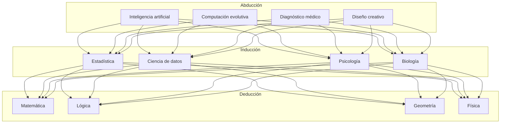
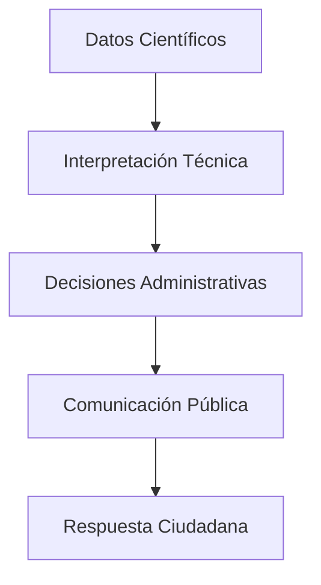
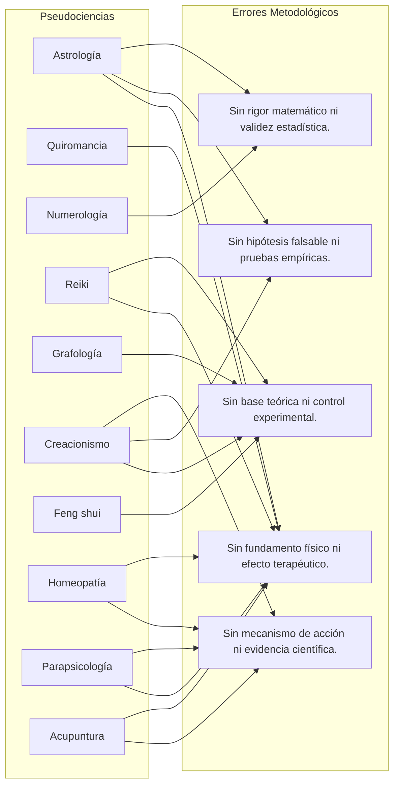
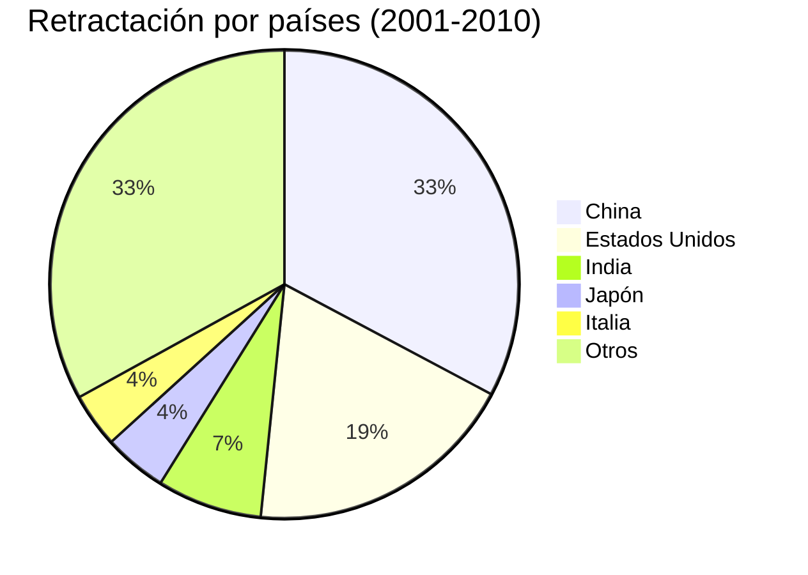

[](https://app.netlify.com/sites/bes25/deploys)

# Filosofía y conocimiento

Miguel Moreno Muñoz
<a id="cy-effective-orcid-url"
    class="underline"
     href="https://orcid.org/0000-0002-0746-9587"
     target="orcid.widget"
     rel="me noopener noreferrer"
     style="vertical-align: bottom">
     </a> </br>
Monografía técnica 26311M9, v.3 - 2024

<p></p>
<p xmlns:cc="http://creativecommons.org/ns#" xmlns:dct="http://purl.org/dc/terms/">
<span property="dct:title">Licencia: <a href="http://creativecommons.org/licenses/by-nc-sa/4.0/?ref=chooser-v1" target="_blank" rel="license noopener noreferrer" style="display:inline-block;">CC BY-NC-SA 4.0</a></br>
<a href="https://doi.org/10.5281/zenodo.13921474"></a> 
</p>

<div style='page-break-after: always'></div>

---

# Introducción

Esta monografía tiene por objeto proporcionar una aproximación actualizada a problemas y casos interesantes para un curso de epistemología aplicada. Su orientación es más práctica que teórica, lo que explica que se dedique menos espacio a teorizar en abstracto sobre las fortalezas o debilidades de diversas metodologías de investigación científica que a identificar las ventajas e inconvenientes de su aplicación práctica en distintos dominios disciplinares, incluyendo los diferentes protocolos con los que trabajan profesionales e investigadores en áreas de conocimiento diferenciadas.

Los elementos teóricos proporcionados deberían ser suficientes para acotar el contexto amplio en el que ciertos problemas se originan y desarrollan; pero son los casos seleccionados y las referencias a debates en curso lo que se espera indagar en esta programación, para incentivar una dinámica de actualización y concreción constante.  

Los primeros recursos utilizados para desarrollar el programa de la asignatura “Filosofía y conocimiento”, optativa del último curso del grado en Filosofía en la Universidad de Granada, consistían en una reducida selección de artículos, capítulos de libros y algunos enlaces recomendados para cada apartado del programa.
 
Con el tiempo, la cantidad de artículos extraídos de bases de datos de publicaciones electrónicas y piezas informativas de diversos medios que resultaban interesantes para articular talleres, exposiciones y sesiones centradas en estudio de casos fue creciendo hasta nutrir un listado muy prolijo y difícil de manejar.
 
Igualmente extensa se hizo la sección de bibliografía complementaria, dado que para ciertos problemas, casos o cuestiones específicas no era suficiente con aludir a uno o dos enfoques del asunto —y cada uno ligado a una fuente particular—, cuando diversas herramientas de búsqueda y consulta automatizada devolvían grupos diferenciados de enlaces y referencias, por lo general más orientativos sobre la diversidad de puntos de vista al respecto.
 
Los listados en ocasiones extensos de enlaces, referencias y notas de ciertos apartados se han agrupado en bloques expandibles de texto plano, intentado que cada referencia ocupe una sola línea numerada, fácilmente identificable. Se evita así desplazar al final de cada capítulo el listado de notas y referencias, como suele hacerse en textos académicos impresos. El formato elegido aquí permite copiar de un solo clic cada bloque de enlaces o referencias —un componente de funcionalidad común en los manuales o documentación técnica con fragmentos de código— y facilitar la comprobación por separado de las fuentes externas relacionadas con el contenido de cada apartado o sección.  
 
A diferencia de los procesadores de texto más populares, herramientas como [dillinger](https://dillinger.io/), [stackedit](https://stackedit.io/), [zettlr](https://www.zettlr.com/), [editormarkdown](https://editormarkdown.com/), <a href="https://typora.io/" target="_blank">typora</a> o <a href="https://www.marktext.cc/" target="_blank">marktext</a> proporcionan una vista previa con enlaces activos al pegar el contenido de cada bloque de referencias, simplificando el manejo de fuentes y su incorporación en aplicaciones de notas y bases de conocimiento como [notion](https://www.notion.so/), [obsidian](https://obsidian.md/), <a href="https://joplinapp.org/" target="_blank">joplin</a> o [logseq](https://logseq.com/).
  
En [versiones anteriores](https://www.ugr.es/~mm3/fcon/24/fcebook/section.html) de este material se había optado por el formato *[bookdown](https://bookdown.org/)* (uno de los paquetes disponibles para [R Studio](https://rmarkdown.rstudio.com/)) por tratarse de una herramienta bien conocida entre quienes tienen la necesidad de elaborar documentos técnicos, en el ámbito académico o empresarial. El resultado era un bloque de ficheros HTML interrelacionados que podía visualizarse en cualquier navegador, con un menú lateral para recorrer las distintas secciones. Las ventajas de accesibilidad y personalización que permitía *bookdown* (elección de tipo y tamaño de letra; fondo blanco, sepia u oscuro) las incorporan ya casi todos los navegadores con funciones como *Vista lectura*, *Modo envolvente* o mediante extensiones como *<a href="https://justread.link/" target="_blank">Just Read</a>*, <a href="https://chromewebstore.google.com/detail/Reader%20View/ecabifbgmdmgdllomnfinbmaellmclnh" target="_blank">Reader View</a> o similares. Por lo tanto, la simplicidad de navegación y legilibilidad en dispositivos con pantallas de diverso tamaño queda mejor resuelta como se hace en esta versión de fichero HTML5 único, con tabla de contenido al comienzo.

La documentación e indicaciones para los estudios de caso aparecen como un bloque plegado que se expande al clicar, utilizando una combinación de las etiquetas `<details>` y `<summary>` para facilitar una lectura fluida y sin distracciones del texto principal. En algunos apartados se introducen enlaces activos dentro del cuerpo de texto principal, que permiten una consulta rápida abriendo una nueva ventana o pestaña del navegador. El índice incluye un listado específico de temas para los estudios de caso y un glosario notablemente ampliado con respecto a versiones previas.

En octubre de 2024 se incorporaron algunos asistentes de razonamiento y cuestionarios que pueden ser útiles para revisar los conceptos e ideas centrales de diversos apartados. En su elaboración resultaron de especial utilidad herramientas como Claude.ai (Anthropic), GPT-4o1 (OpenAI) y Gemini 1.5 Pro (Google) con las cuales se generó y depuró el código y los scripts necesarios, además de introducir diversas mejoras en la interfaz de usuario. Otra herramienta fundamental ha sido RStudio, con la que se han procesado algunas tablas y esquemas conceptuales. Como alternativas a los buscadores más populares se han utilizado Ask.ai, Perplexity, Elicit, Copilot, GPT-4o y Claude 3.5 Sonnet, cuyos *outputs* han sido revisados y contrastados para detectar imprecisiones o alucinaciones en enlaces y referencias. El uso de estas herramientas ha sido útil para estructurar y resumir los aspectos relevantes en algunos estudios de caso y dar forma al extenso material en apartados saturados de contribuciones en la literatura. Es preciso reconocer que muchos recursos bibliográficos valiosos —sobre todo libros y monografías especializadas— habrían quedado fuera del radar de haber utilizado solo las herramientas convencionales de búsqueda en Scopus, Science Direct y Web of Science.


# Agradecimientos

Una parte de los enlaces y recursos seleccionados procede de búsquedas y consultas para contribuir al debate informado en clase, suscitado al hilo de las exposiciones desarrolladas por los estudiantes en el aula o en respuesta a preguntas y planteamientos que ampliaban la discusión a otros temas no recogidos en la programación. Es obligado agradecer a quienes, en distintas promociones, participaron activamente en los debates o talleres, y con su actitud crítica contribuyeron a enriquecer las ideas, opiniones y elementos de información aportados en la sesión.

Dada la naturaleza interdisciplinar de muchos de los temas y cuestiones que se tratan en las asignaturas del último curso del grado en filosofía, agradezco a Francisco Lara, Antonio Diéguez, Enrique Iáñez, Jon Rueda, Joan Llorca y demás colaboradores u organizadores de los seminarios Tecnex las oportunidades de diálogo y debate con colegas de distintas facultades invitados para tratar temas de Ética y Filosofía Aplicada. Es imposible recordar cuántos elementos de aprendizaje e intercambio directo en estas sesiones terminan reorientando o enriqueciendo los demás apartados de la programación en un curso de epistemología aplicada.

En Granada, a 23 de octubre de 2024

---


# Capítulo 1. Génesis y condiciones de posibilidad del conocimiento

## 1.1. Tipos de conocimiento y metodologías asociadas 

En un sentido amplio, el conocimiento es la capacidad de <a href="https://sites.google.com/go.ugr.es/fcon/t1?pli=1&authuser=1#h.j5kn6wwlw20p" target="_blank">comprender e interpretar la realidad</a> a partir de información  obtenida por diversos medios. Existen diferentes tipos de conocimiento según su origen, su naturaleza, su validez y su aplicación. 

Los dominios disciplinares que sirven de referencia se caracterizan por su capacidad para obtener resultados rigurosos, metódicos, verificables, sistemáticos y sometidos a crítica: 

- **Conocimiento <mark>empírico</mark>**: se basa en la experiencia directa y la observación de los hechos. No requiere de una explicación teórica ni de una comprobación sistemática. Es el conocimiento propio del sentido común y de las prácticas cotidianas.
- <a href="FC-subdiscipl-cient.html" target="_blank">**Conocimiento <mark>científico</mark>**</a>: se obtiene mediante el uso del método científico, que consiste en plantear hipótesis, diseñar experimentos, recoger datos, analizar resultados y elaborar teorías. Es un conocimiento objetivo, racional, verificable y falible.
- **Conocimiento <mark>matemático</mark>**: se basa en el uso de principios lógicos y simbólicos para resolver problemas abstractos y cuantitativos. Es un conocimiento deductivo, exacto, universal y necesario.

Pero existen otros tipos consolidados o caracterizados por el uso que parecen responder a criterios menos estrictos, lo que puede inducir comprensiones simplificadoras, estereotipadas o sesgadas de su complejidad:

- **Conocimiento filosófico**: se origina en la reflexión crítica y racional sobre los problemas fundamentales de la existencia, el conocimiento, la moral, la política, el arte, etc. No se limita a los hechos empíricos ni a las teorías científicas, sino que busca elementos ligados al sentido y la comprensión de la experiencia individual, en conexión con la realidad social y la naturaleza. Sus manifestaciones pueden ser muy heterogéneas, incluyendo tanto discursos y estilos de razonamiento muy dependientes de los resultados de disciplinas bien consolidadas (biología, física, matemática) como de *otras formas de expresión más interpretativas* (sociología, antropología, historia) o centradas en la creación y expresión subjetiva (literatura, producción artística).

> :warning: Esta caracterización abarca un espectro demasiado amplio de manifestaciones, que incluirían tanto las más cercanas a disciplinas científicas y sus métodos de trabajo como las que imitan formas de expresión artística y literaria. Incluir aspectos como la "comprensión de la experiencia individual" complica bastante la distinción entre reflexión filosófica y mera opinión.  
> El saber y la práctica filosófica pueden tener una función complementaria del conocimiento científico, aportando componentes antropológicos y éticos a la comprensión de la realidad. Pero no puede sustituir al conocimiento científico, ni tampoco ser sometido a sus criterios de validación en todos los aspectos relevantes. La reflexión filosófica "dependiente de disciplinas científicas consolidadas" no origina una *versión alternativa* (divulgativa o devaluada) de dichas disciplinas.   
> La alusión a "formas de expresión más interpretativas" introduce una cobertura demasiado amplia para discursos de naturaleza informal, ensayística o casual, sin compromiso con la evidencia o los fundamentos.

- **Conocimiento artístico**: es el conjunto de saberes relacionados con la expresión estética, la creatividad y la sensibilidad. No es objetivable ni verificable, sino que depende de la interpretación y el gusto de cada individuo. El conocimiento artístico no busca explicar la realidad, sino representarla o transformarla según la visión del artista.

> Su dependencia del componente subjetivo hace esta caracterización problemática. Al afirmar que "no es objetivable ni verificable", se niega la posibilidad de criterios compartidos en la apreciación artística, ignorando en la práctica  la existencia de escuelas artísticas con criterios estéticos compartidos y verificables en su contexto de referencia.  
> "Negar la intención explicativa" resulta igualmente problemático, puesto que dejaría fuera de la caracterización a ciertas corrientes artísticas con intenciones críticas o explicativas —y el valor internacionalmente reconocido a obras como el "Guernica" de Picasso, que busca representar y explicar una realidad histórica—.  
> La dependencia exclusiva del "gusto de cada individuo" supone en la práctica ignorar el contexto cultural y social del arte, determinante del valor asociado con las obras o manifestaciones artísticas.

- **Conocimiento intuitivo**: se adquiere por una percepción inmediata e irracional de la realidad, sin necesidad de razonamiento ni evidencia. Es un conocimiento subjetivo, espontáneo e inspirado.

> Si se ignoran los procesos cognitivos subyacentes a la intuición experta, se complica bastante el manejo de *criterios de validación* (y la posibilidad de distinguir entre intuiciones acertadas y erróneas). 
> Otro elemento problemático en esta caracterización: prescinde de los elementos asociados con aquellas intuiciones basadas en la experiencia y el conocimiento previo, cuyo papel es ampliamente reconocido en los diagnósticos realizados por profesionales experimentados de la medicina al diagnosticar una enfermedad, a partir de elementos adquiridos durante años de estudio y práctica en contextos relevantes.  
> Dejaría fuera contextos como el de la investigación matemática, donde la intuición puede llevar a descubrimientos verificables posteriormente.

- **Conocimiento afectivo**: se relaciona con las emociones y los sentimientos que experimentamos ante la realidad. Es un conocimiento subjetivo, personal e intransferible.  No es objetivable ni verificable. No busca explicar la realidad, sino vivirla o sentirla según el estado emocional del sujeto.

> Definirlo como "subjetivo, personal e intransferible" cercena la posibilidad de comprensión empática y comunicación en el registro emocional adecuado al contexto.  
> La interacción entre emociones y procesos cognitivos que ha motivado múltiples estudios en psicología y neurociencia no debería obviarse, como tampoco el hecho de que las emociones están influenciadas y moldeadas por el contexto social y cultural.  
> Fenómenos como la sincronización emocional en grupos o la transmisión de estados emocionales en espectáculos artísticos quedarían fuera del radar si se barajan caracterizaciones demasiado simplistas o sesgadas, ajenas igualmente al hecho de que las emociones pueden ser objeto de estudio científico —investigaciones sobre la expresión facial de emociones o la neurobiología del afecto, p. ej.—.

Otros tipos de conocimiento deben su estatus a la **popularidad o usos tradicionales**, pero no a su compatibilidad con los criterios del método científico:

- **Conocimiento religioso**: es el conjunto de saberes relacionados con la fe, la revelación y los códigos morales vinculados a las distintas tradiciones religiosas. El conocimiento religioso no se apoya en la razón ni en la observación, sino en la autoridad divina o eclesiástica. El conocimiento religioso no admite la duda ni el cuestionamiento en algún sentido equiparable al escepticismo metodológico de la actitud científica, por lo que el núcleo de creencias básico deriva de dogmas y preceptos consolidados en cada tradición. En un sentido amplio, incluye la reflexión especializada sobre los orígenes, evolución y fenomenología de las instituciones religiosas, incluyendo el estudio de sus dinámicas de poder y la producción cultural asociada. Pero en este aspecto se aleja de la caracterización inicial, en la medida que adopta métodos y técnicas de investigación propios de las ciencias sociales.

- **Conocimiento chamánico**: es el conjunto de "saberes" (y, sobre todo, *prácticas*) relacionados con la comunicación con el mundo espiritual, la sanación y la magia. El conocimiento chamánico no se basa en evidencias empíricas, sino en creencias y rituales. El conocimiento chamánico no se somete a la crítica ni a la contrastación, sino que se transmite de forma oral y secreta por los iniciados.

- **Conocimiento ancestral**: es el conjunto de saberes transmitidos de generación en generación por una cultura o una comunidad. El conocimiento ancestral puede tener elementos válidos y útiles, pero también puede contener errores, mitos y prejuicios. El conocimiento ancestral no se actualiza ni se corrige, sino que se conserva como parte de la identidad y la tradición.

- **Sabiduría esotérica**: es el conjunto de saberes ocultos o secretos que pretenden acceder a realidades superiores o trascendentes. La sabiduría esotérica no se fundamenta en argumentos lógicos ni en pruebas experimentales, sino en intuiciones y experiencias místicas. La sabiduría esotérica no se comparte ni se divulga, sino que se reserva para los elegidos o los iniciados.

En el dominio amplio de la investigación científica, cada ámbito disciplinar de conocimiento se asocia con una metodología diferente para su producción y transmisión, en constante evolución. Entre otros, estas metodologías incluyen:

- **Observación**: consiste en atender a los fenómenos que ocurren en nuestro entorno, registrando sus características y propiedades. Es una metodología propia del conocimiento empírico y científico.
- **Experimentación**: consiste en manipular las variables que intervienen en un fenómeno para comprobar sus efectos y establecer relaciones causales. Es una metodología propia del conocimiento científico.
- **Deducción**: consiste en inferir conclusiones necesarias a partir de premisas verdaderas. Es una metodología propia del conocimiento matemático y filosófico, pero bastante común en la interpretación y discusión de resultados experimentales.
- **Inducción**: consiste en inferir conclusiones probables a partir de casos particulares observados. Es una metodología propia del conocimiento científico y empírico.
- **Abducción**: consiste en inferir la hipótesis más plausible a partir de unos hechos observados. Es una metodología propia del conocimiento científico y filosófico.
- **Introspección**: consiste en examinar nuestros propios pensamientos, sentimientos y motivaciones. Es una metodología propia del conocimiento afectivo e intuitivo, como vía para comprender y procesar aspectos relevantes de la experiencia personal de difícil articulación mediante un razonamiento lógico explícito. Puede resultar útil en psicología clínica, psicoterapia y diagnóstico temprano de dificultades en psicología educativa.<sup>1</sup>
- **Diálogo**: consiste en intercambiar ideas y argumentos con otras personas para contrastar puntos de vista y llegar a acuerdos o desacuerdos razonados. Es una metodología propia del conocimiento filosófico.  </br>

**Tabla 1: Metodologías comúnmente utilizadas en diversas disciplinas y campos de actividad profesional**<sup>(2-10)</sup>

| Abducción | Inducción | Deducción |
| :--- | :--- | :--- |
| Inteligencia artificial | Estadística | Matemática |
| Computación evolutiva | Ciencia de datos | Lógica |
| Diagnóstico médico | Psicología | Geometría |
| Diseño creativo | Biología | Física teórica|
| Lingüística | Sociología | Filosofía |
| Criminología | Antropología | Química |
| Arqueología | Economía | Astronomía |
| Educación | Ecología | Informática |
| Arte | Etnografía | Álgebra |
| Periodismo | Historia | Derecho |

 </br>

<details>
  <summary>Enfoques y estilos de trabajo en investigación</summary>

<blockquote style="margin: 25px; background-color: #1e1e1e; border-left: 5px solid #e69500; border-top-left-radius: 5px; border-bottom-left-radius: 5px; font-family: 'Montserrat', sans-serif; color: #e0e0e0;">

**El recurso a la abducción, inducción y deducción en investigación**

**1. Definiciones**:

1. **Abducción**: Proceso de formar una hipótesis explicativa. Es la operación lógica por la que surgen hipótesis novedosas.  
2. **Inducción**: Razonamiento que va de lo particular a lo general. Se basa en la generalización a partir de casos específicos.  
3. **Deducción**: Razonamiento que va de lo general a lo particular. Parte de premisas generales para llegar a una conclusión específica.  

**2. Aplicación**:  

a. **Aplicados como métodos de razonamiento lógico**:
   - Son formas fundamentales de realizar inferencias lógicas.
   - Cada uno representa una estructura distinta de argumento.

b. **Como estilos de pensamiento en investigación**:
   - Reflejan diferentes enfoques para abordar problemas y generar conocimiento.
   - Influyen en cómo los investigadores formulan hipótesis y diseñan estudios.

c. **Como etapas en el proceso de investigación científica**:
   - Abducción: Generación de hipótesis
   - Deducción: Derivación de consecuencias observables
   - Inducción: Verificación empírica

d. **Como herramientas metodológicas**:
   - Sirven como instrumentos para el diseño y análisis en investigación.
   - Guían la selección de técnicas específicas de recolección y análisis de datos.

**3. Comparativa de uso posible en un contexto de investigación**:


| Aspecto | Abducción | Inducción | Deducción |
|---------|-----------|-----------|-----------|
| Dirección del razonamiento | De los datos a la hipótesis explicativa | De lo particular a lo general | De lo general a lo particular |
| Fase típica en investigación | Generación de hipótesis | Generalización de resultados | Prueba de hipótesis |
| Certeza de las conclusiones | Plausibles | Probables | Necesarias (si las premisas son verdaderas) |
| Papel en la innovación | Alto (genera nuevas ideas) | Medio (expande conocimiento existente) | Bajo (aplica conocimiento existente) |

**4. Observaciones**

- Estos conceptos no son mutuamente excluyentes en la práctica de la investigación.
- A menudo se utilizan en combinación a lo largo del proceso de investigación.
- Su aplicación puede variar según la disciplina y el paradigma de investigación.
- En la ciencia moderna, se reconoce cada vez más la importancia de la abducción en la generación de nuevas teorías.  

**5. Referencias**:  
<small>
1. Douven, I. (2021). Abduction. In E. N. Zalta (Ed.), *The Stanford Encyclopedia of Philosophy* (Summer 2021 ed.). Stanford University. https://plato.stanford.edu/archives/sum2021/entries/abduction/  
2. Flach, P. A., & Kakas, A. C. (2000). *Abduction and Induction: Essays on their Relation and Integration*. Springer Netherlands. https://doi.org/10.1007/978-94-017-0606-3.  
3. Magnani, L. (2017). *The Abductive Structure of Scientific Creativity: An Essay on the Ecology of Cognition*. Springer International Publishing. https://doi.org/10.1007/978-3-319-59256-5.  
4. Musgrave, A. (2021). The logic of scientific discovery without induction. *Metascience*, *30*(1), 129-133. https://doi.org/10.1007/s11016-020-00586-0.  
5. Nickles, T. (2014). Heuristic Appraisal at the Frontier of Research. En Studies in applied philosophy, epistemology and rational ethics (pp. 57-87). https://doi.org/10.1007/978-3-319-09159-4_4.    
6. Project, P. E. (1998). The Essential Peirce, Volume 2 (1893–1913): Selected Philosophical Writings. Indiana University Press.  
7. Popper, K. (2002). *The Logic of Scientific Discovery* (2nd ed.). Routledge. (Original work published 1959).
8. Reichertz, J. (2019). Abduction: The logic of discovery of grounded theory - An updated review. In A. Bryant & K. Charmaz (Eds.), *The SAGE Handbook of Current Developments in Grounded Theory* (pp. 259-281). SAGE Publications Ltd. https://dx.doi.org/10.4135/9781526436061.n15.   
9. Schurz, G. (2008). Patterns of abduction. *Synthese*, *164*(2), 201-234. https://doi.org/10.1007/s11229-007-9223-4.   
10. Walton, D. (2014). *Abductive Reasoning*. University of Alabama Press.  </small>

</blockquote>

</details>


<details>

  <summary>Interrelaciones (diagrama Mermaid)</summary>



</details>


<details>

  <summary>Desglose de metodologías específicas por ámbito disciplinar</summary>

<blockquote style="margin: 25px; background-color: #f5f5f5; border-left: 5px solid #9400D3; font-family: 'Lato', sans-serif; color: #333;">

**Commonly Used Methodologies in 30 Disciplines** (<a href="https://iask.ai/?mode=academic&q=Commonly+used+methodologies+in+30+disciplines+representing+well-established+fields+of+professional+activity%3F" target="_blank">Ask.AI</a>, 9/09/2024)

1. Medicine  
Evidence-Based Medicine (EBM): This methodology integrates clinical expertise, patient values, and the best research evidence into the decision-making process for patient care.

2. Psychology  
Cognitive Behavioral Therapy (CBT): A structured, goal-oriented psychotherapy that focuses on changing patterns of thinking or behavior that contribute to a person’s problems.<sup>(*)</sup>

3. Education  
Constructivist Teaching Methods: These methods emphasize active learning where students construct their own understanding and knowledge through experiences and reflecting on those experiences.

4. Engineering  
Systems Engineering: An interdisciplinary approach that focuses on how complex engineering projects should be designed and managed over their life cycles.

5. Business Management  
Lean Management: A methodology that focuses on minimizing waste within manufacturing systems while simultaneously maximizing productivity.

6. Information Technology  
Agile Development: A project management methodology that promotes continuous iteration of development and testing throughout the software development lifecycle.

7. Environmental Science  
Ecosystem-Based Management (EBM): A holistic approach to managing natural resources that considers entire ecosystems, including humans.

8. Sociology  
Qualitative Research Methods: These methods focus on understanding social phenomena from the perspective of those involved, often using interviews and observations.

9. Marketing  
Content Marketing Strategy: A strategic approach focused on creating valuable content to attract and engage a target audience effectively.

10. Economics  
Econometric Analysis: The use of statistical methods to test hypotheses and forecast future trends in economic data.

11. Political Science  
Comparative Politics Methodology: This involves comparing political systems or behaviors across different countries to understand political phenomena better.

12. Anthropology  
Ethnographic Fieldwork: A qualitative research method where researchers immerse themselves in a community to observe and interact with participants in their natural environment.

13. Architecture  
Design Thinking: An iterative process involving five phases—empathize, define, ideate, prototype, and test—to solve complex problems creatively.

14. Chemistry  
Experimental Design Methodology: This involves planning experiments systematically to ensure valid results can be obtained from chemical investigations.

15. Physics  
Theoretical Modeling and Simulation Techniques: These methodologies involve creating abstract models to predict physical phenomena based on theoretical principles.

16. History  
Historical Methodology: This involves critical examination of sources, contextualization, and interpretation of past events through various lenses such as social or economic history.

17. Law  
Case Law Analysis Methodology: This involves studying previous judicial decisions to understand legal precedents and apply them to current cases.

18. Agriculture  
Sustainable Farming Practices (SFP): These methodologies aim at meeting current food needs without compromising future generations’ ability to produce food by maintaining ecological balance.

19. Neuroscience  
Neuroimaging Techniques (e.g., fMRI): These methodologies are used for visualizing brain activity by detecting changes associated with blood flow in the brain during cognitive tasks.

20. Data Science  
Machine Learning Algorithms (e.g., supervised learning): These methodologies involve training algorithms on data sets so they can make predictions or classifications based on new data inputs.

21. Public Health  
Epidemiological Studies (e.g., cohort studies): These methodologies investigate the distribution and determinants of health-related states in specified populations to control health problems.

22. Linguistics  
Corpus Linguistics Methodology: This involves analyzing large collections of written or spoken texts (corpora) to study language use patterns quantitatively and qualitatively.

23. Philosophy  
Analytic Philosophy Methodology: This emphasizes clarity of expression and logical argumentation in philosophical inquiry, often breaking down complex ideas into simpler components for analysis.

24. Theology  
Historical-Critical Method: This is used for interpreting religious texts by considering historical context, authorship, and textual variations over time for deeper understanding of doctrines.

25. Sports Science  
Biomechanical Analysis: This methodology uses principles of mechanics to analyze human movement during sports activities for performance enhancement or injury prevention purposes.

26. Fashion Design  
Trend Forecasting: This methodology involves predicting future fashion trends based on consumer behavior analysis, cultural influences, and market research data collection techniques.

27. Urban Planning  
Participatory Planning: Involves engaging stakeholders in the planning process through workshops or public meetings to gather input for urban development projects effectively.

28. Robotics  
Control Systems Theory: This methodology applies mathematical concepts to design systems that manage dynamic processes in robotics for automation purposes effectively.

29. Veterinary Science  
Clinical Pathology Methods: These are diagnostic techniques used by veterinarians involving laboratory tests on animal samples (blood, urine) for disease diagnosis or health monitoring purposes.

30. Telecommunications  
Network Design Methodologies: These involve systematic approaches for designing telecommunications networks ensuring reliability, efficiency, scalability, and security.


**Sources**:

- American Psychological Association (APA) - Provides comprehensive guidelines on psychological practices including evidence-based therapies.  

- Project Management Institute (PMI) - Offers standards for project management methodologies including Agile frameworks widely adopted across industries.  

- National Institutes of Health (NIH) - Supplies extensive research findings related to medical practices including evidence-based medicine approaches.

---

<sup>*</sup> **Observaciones sobre la CBT**:

En relación con la metodología de la Terapia Cognitivo-Conductual (*CBT*, por sus siglas en inglés) se considera una de las formas de psicoterapia bien estudiadas y sustentada en evidencia empírica, cuya estandarización y vigencia se ajusta a criterios relevantes: 

1. Estructura y enfoque en objetivos: La CBT es una terapia estructurada y orientada a objetivos, lo cual es una característica fundamental y estandarizada de este enfoque[1].

2. Duración limitada: Típicamente se extiende durante 10 a 20 sesiones semanales, dependiendo de la gravedad de la condición del paciente[3].

3. Amplia aplicabilidad: La CBT ha demostrado ser eficaz para una variedad de trastornos psiquiátricos, incluyendo ansiedad, depresión, trastornos alimentarios, TEPT, entre otros[3].

4. Evidencia a largo plazo: Estudios meta-analíticos han demostrado que la CBT tiene efectos positivos que se mantienen hasta 12 meses o más después de completar el tratamiento para ciertos trastornos[1].

5. Componentes estandarizados: La CBT típicamente incluye elementos como la educación del paciente, la colaboración terapéutica, y tareas para el hogar, que son aspectos estandarizados de esta metodología[3].

6. Reconocimiento profesional: La CBT es ampliamente reconocida tanto en psiquiatría como en psicología, y aparece en la mayoría de las guías de tratamientos psicológicos efectivos[5].

7. Evolución continua: Aunque mantiene sus principios fundamentales, la CBT ha evolucionado para incorporar nuevos conocimientos y técnicas, lo que demuestra su vigencia y adaptabilidad[5].

Si bien la CBT es altamente efectiva y estandarizada, también existen debates sobre sus mecanismos exactos de acción y su eficacia comparativa con otras terapias en ciertos contextos[5]. Sin embargo, en general, la descripción proporcionada refleja una metodología que sigue siendo considerada estándar y vigente en el campo de la psicoterapia.

**Consulta y enlaces asociados: <a href="https://www.perplexity.ai/search/diferencia-entre-mutacion-adap-wUJ7YbBSSHC1MaT0V7YsJw#4" target="_blank">Perplexity</a>, 9/09/2024**  

[1] https://pubmed.ncbi.nlm.nih.gov/31758858/  
[2] https://www.amazon.es/Cognitive-Behavior-Therapy-Second-Basics/dp/1609185048  
[3] https://umiamihealth.org/es/tratamientos-y-servicios/psiquiatr%C3%ADa/cognitive-behavioral-therapy-cbt  
[4] https://www.elsevier.es/es-revista-spanish-journal-psychiatry-mental-health-286-articulo-validacion-version-espanola-escala-funcionamiento-S1888989111000024  
[5] https://scielo.isciii.es/scielo.php?pid=S0214-78232022000300004&script=sci_arttext  
[6] https://www.rcpsych.ac.uk/mental-health/translations/spanish/cognitive-behavioural-therapy  
[7] https://www.aacademica.org/gabriela.irrazabal/50.pdf  
[8] https://es.wikipedia.org/wiki/M%C3%A9todo_cient%C3%ADfico   

---

</blockquote>

</details>


<details>
  <summary>Mostrar enlaces y referencias del aptdo.</summary>

```markdown
Referencias
1. Beretervide, V. (2019). Conocimiento, afectividad y verdad: Un camino de integración. https://www.aacademica.org/000-111/159.  

Enlaces (Tabla 1)
2. Deducción, inducción, abducción: razonando y argumentando. https://humanistasenlared.com/filosofia/deduccion-induccion-abduccion-razonar-argumentar/.
3. Diferencia entre inducción y deducción: sus métodos y ejemplos. https://www.diferenciador.com/induccion-y-deduccion/.
4. La Inteligencia Artificial en la Educación - UNESCO. https://es.unesco.org/themes/tic-educacion/inteligencia-artificial.
5. Ramas de la Inteligencia Artificial: Técnicas y aplicaciones | APD. https://www.apd.es/tecnicas-de-la-inteligencia-artificial-cuales-son-y-para-que-se-utilizan/.
6. Desarrollo y retos de la Inteligencia Artificial - UNESCO. https://es.unesco.org/sites/default/files/l1_desarrollo_y_retos_de_la_ia.pdf.
7. Induction, Deduction, and Abduction | SpringerLink. https://link.springer.com/referenceworkentry/10.1007/978-3-030-26050-7_159-1.
8. Deduction, Induction, and Abduction - Communication - iResearchNet. https://communication.iresearchnet.com/communication-theory-and-philosophy/deduction-induction-and-abduction/.
9. Inductive vs. Deductive vs. Abductive Reasoning | Merriam-Webster. https://www.merriam-webster.com/grammar/deduction-vs-induction-vs-abduction.  
10. Razonamiento abductivo. https://es.wikipedia.org/wiki/Razonamiento_abductivo.  
```
</details>


---

## 1.2. Nociones básicas de epistemología

La epistemología es la rama de la filosofía que estudia el conocimiento científico: su origen, su naturaleza, sus límites, sus criterios y sus problemas. Su nombre proviene del griego episteme (conocimiento) y logos (estudio). Su objeto de estudio exige familiarizarse con una serie de <a href="https://sites.google.com/go.ugr.es/fcon/t1?pli=1&authuser=1#h.id1c1bg7zzi3" target="_blank">conceptos básicos </a>(verdad, evidencia, justificación, etc.) y criterios de calidad metodológica (coherencia, falsación, verificación, etc.).

La epistemología se ocupa de cuestiones como:

- ¿Qué es el conocimiento científico y cómo se diferencia de otros tipos de conocimiento?
- ¿Qué fuentes, métodos y herramientas utiliza la ciencia para producir conocimiento?
- ¿Qué conceptos, teorías y leyes forman el contenido del conocimiento científico?
- ¿Qué criterios se emplean para evaluar la verdad, la validez, la objetividad y la racionalidad del conocimiento científico?
- ¿Qué límites y dificultades encuentra la ciencia para conocer la realidad?
- ¿Qué tipos, ramas y disciplinas conforman el conjunto de las ciencias?
- ¿Cómo se relacionan las ciencias entre sí y con otras formas de saber?
- ¿Cómo evoluciona, cambia y progresa el conocimiento científico a lo largo de la historia?
- ¿Qué implicaciones sociales, éticas y culturales tiene el desarrollo de la ciencia?

La epistemología se puede dividir en dos grandes enfoques:

- **Epistemología general**: se ocupa de los aspectos comunes a todas las ciencias, como la definición, la clasificación, la metodología y la lógica del conocimiento científico.
- **Epistemología particular**: se ocupa de los aspectos específicos de cada ciencia, como sus conceptos, sus principios, sus problemas y sus resultados.

La epistemología tiene una estrecha relación con otras disciplinas filosóficas, como la <mark>ontología</mark> (que estudia el ser y la realidad), la <mark>gnoseología</mark> (que estudia el conocimiento en general), la <mark>lógica</mark> (que estudia las formas válidas del razonamiento) y la <mark>ética</mark> (que estudia los valores y las normas morales).

---

## 1.3. Versiones del escepticismo

El escepticismo es una corriente filosófica que pone en duda o niega la posibilidad de alcanzar un conocimiento verdadero y seguro de la realidad. Su nombre proviene del griego skeptomai (examinar, indagar).

El escepticismo surgió en la antigua Grecia con el pensamiento de Pirrón de Elis (siglo IV a.C.), quien sostenía que no podemos afirmar nada con certeza, sino solo opinar, pues todo es relativo al sujeto que conoce. Los escépticos proponían suspender todo juicio (epojé) y mantener una actitud de indiferencia (ataraxia) ante las apariencias.

El escepticismo se desarrolló en distintas escuelas y épocas, adoptando diferentes formas y grados. Algunas versiones del escepticismo son:

- **Escepticismo radical**: niega totalmente la posibilidad de conocer la verdad. Afirma que todo es incierto, dudoso e indemostrable. Es una postura extrema e incoherente, pues se contradice a sí misma al afirmar algo que no puede saber.
- **Escepticismo moderado**: duda parcialmente de la posibilidad de conocer la verdad. Afirma que hay algunas cosas que podemos conocer con certeza (como las matemáticas o la lógica), pero otras que no podemos conocer (como la metafísica o la religión). Es una postura más razonable y prudente, pues reconoce los límites del conocimiento humano.
- **Escepticismo metódico**: duda provisionalmente de todo lo que no sea evidente para encontrar un fundamento seguro del conocimiento. Afirma que hay que someter a examen crítico todas nuestras creencias para descartar las falsas y conservar las verdaderas. Es una postura instrumental y transitoria, pues busca superar la duda mediante la razón.

---

## 1.4. Heterodoxia científica, protociencia y anticiencia

La **heterodoxia científica** es el conjunto de *teorías, hipótesis o afirmaciones que se apartan o contradicen el consenso establecido por la comunidad científica* sobre un determinado campo o tema de investigación. La heterodoxia científica puede tener diferentes grados y motivos, desde una simple discrepancia hasta una ruptura radical.

> La heterodoxia científica puede ser vista como una amenaza o un desafío para el conocimiento científico vigente, pero también como una oportunidad o un estímulo para su revisión y progreso.<sup>5</sup> Algunos ejemplos históricos de heterodoxia científica son:
> - La <mark>teoría de la relatividad</mark> de Einstein, que cuestionó los principios de la física newtoniana y abrió nuevos horizontes para la cosmología y la física cuántica.
> - La <mark>teoría de la evolución</mark> de Darwin, que desafió las concepciones religiosas y metafísicas sobre el origen y la naturaleza de las especies y sentó las bases de la biología moderna.
> - La <mark>teoría heliocéntrica</mark> de Copérnico, que contradijo el modelo geocéntrico defendido por la Iglesia y la tradición aristotélica y revolucionó la astronomía y la visión del mundo.<sup>4</sup>

La heterodoxia científica puede dar lugar a dos fenómenos distintos: la protociencia y la anticiencia.

- La **protociencia** es el conjunto de *ideas, hipótesis o teorías que aún no han sido aceptadas ni refutadas por la comunidad científica, pero que tienen potencial para convertirse en ciencia* si se someten al método científico y se contrastan con los hechos. La protociencia es una forma de exploración e innovación científica, que puede conducir al descubrimiento de nuevos fenómenos o al desarrollo de nuevas disciplinas.<sup>1</sup> Algunos ejemplos históricos de protociencia son:

    - La <mark>alquimia</mark>, que fue el precursor de la química moderna y que buscaba transformar los metales en oro, encontrar el elixir de la vida o la piedra filosofal.
    - La <mark>astrología</mark>, que fue el antecedente de la astronomía y que pretendía predecir el destino de las personas a partir de la posición de los astros.
    - La <mark>frenología</mark>, que fue el origen de la neurociencia y que pretendía determinar el carácter y las capacidades de las personas a partir de la forma del cráneo.

- La **<a href="https://sites.google.com/go.ugr.es/tcon/casos?authuser=0#h.1az2bwg41zsr" target="_blank">anticiencia</a>** es el conjunto de ideas, hipótesis o teorías que se oponen o rechazan el conocimiento científico establecido, sin ofrecer evidencias ni argumentos válidos para sustentar sus afirmaciones. La anticiencia es una forma de negación o distorsión de la ciencia, que puede tener fines ideológicos, religiosos, económicos o políticos.<sup>4,5</sup> La anticiencia puede causar daños sociales, ambientales o sanitarios al difundir falsedades o engaños.<sup>2</sup> Algunos ejemplos actuales de anticiencia son:

    - El <mark>creacionismo</mark>, que niega la teoría de la evolución y defiende que el origen y la diversidad de la vida se deben a un acto divino.
    - El <mark>negacionismo</mark> del cambio climático, que rechaza las evidencias y los consensos científicos sobre el calentamiento global y sus causas antropogénicas.
    - El <mark>movimiento</mark> <mark>antivacunas</mark>, que desconfía o rechaza las vacunas como método preventivo de enfermedades infecciosas, basándose en mitos o falsedades.<sup>3</sup>

<details>
  <summary>Enlaces y referencias</summary>

```markdown 
Enlaces
1. Protociencia. https://es.wikipedia.org/wiki/Protociencia.  
2. Método científico: qué es, características, pasos, ejemplos. https://www.lifeder.com/pasos-metodo-cientifico/.  
3. Ciencia, pseudociencia y protociencia: Conceptos y diferencias clave.   https://www.menteyciencia.com/ciencia-pseudociencia-y-protociencia-conceptos-y-diferencias-clave/.  

Referencias
1. Kuhn, Thomas S. (1996). The Structure of Scientific Revolutions. 3rd ed. Chicago: University of Chicago Press (orig.: 1962).  
2. Feyerabend, P. (2010). Against Method. 4th ed. London: Verso, 2010. 
```

</details>

---

## 1.5. Teorías de la verdad y criterios de certeza 

La verdad es una propiedad que se atribuye a las afirmaciones o proposiciones que se corresponden con la realidad. Pese al intenso debate filosófico sobre la noción de verdad, su naturaleza y criterios de determinación, parece improbable que la vedad deje de figurar entre los objetivos principales del conocimiento humano.

Existen diferentes teorías filosóficas sobre el concepto de verdad y los criterios de certeza asociados. Algunas de las más importantes son:

- **Teoría de la correspondencia**: sostiene que una proposición es verdadera si se corresponde con los hechos o con la evidencia empírica. Es una teoría realista, objetiva y verificacionista. Es propia del conocimiento científico y empírico. Esta teoría se asocia con Aristóteles y Bertrand Russell, entre otros autores. Presupone un marco epistémico realista y objetivista, fundamental en el conocimiento científico y en la investigación experimental. Sin embargo, ha sido criticada por la dificultad de definir precisamente qué constituye una "correspondencia" con la realidad.<sup>1, 2, 3</sup>
- **Teoría de la coherencia**: sostiene que una proposición es verdadera si es coherente con un sistema lógico —consistencia interna— o con un conjunto de creencias —interconexión lógica de las proposiciones—. Es una teoría idealista, subjetiva y racionalista, propia del conocimiento matemático y clave en el razonamiento filosófico. No obstante, la coherencia por sí sola puede no garantizar la verdad, como argumenta Nicholas Rescher. Se suele subestimar la dificultad para definir qué constituye un sistema coherente y el problema de cómo manejar sistemas coherentes pero incompatibles<sup>4, 5, 6, 7</sup>
- **Teoría pragmática**: propuesta por Charles Sanders Peirce y William James, sostiene que una proposición es verdadera si es útil o tiene consecuencias positivas para quien la sostiene. Es una teoría relativista, pragmática e instrumentalista, referencia habitual en ética aplicada y en el análisis de problemas morales. Sus críticos sostienen que tiende a relativizar los criterios de verdad y de valor moral, entre otras razones por la dificultad para eludir la circularidad en cualquier definición de "utilidad".<sup>8, 9</sup>
- **Teoría consensual**: asociada a autores como Jürgen Habermas, esta teoría propone que la verdad emerge del consenso en una comunidad ideal de investigadores. Sus partidarios reconocen la dimensión social del conocimiento; pero no salen airosos en el debate sobre la posibilidad de alcanzar un consenso genuino y sobre cómo manejar el desacuerdo persistente, en particular cuando las posiciones están respaldadas por actores de autoridad reconocida. Es una teoría convencionalista, social e histórica, a la que se recurre con frecuencia en el debate antropológico o religioso y en los estudios culturales.<sup>10, 11, 12</sup>
- **Teoría deflacionaria**: una perspectiva más reciente, defendida por Paul Horwich, entre otros autores. Argumenta que el concepto de verdad no tiene una naturaleza sustantiva y que su función es principalmente lógica o expresiva. Pese al interés de este enfoque minimalista, la propuesta ha sido cuestionada por sus limitaciones para capturar todos los usos del concepto de verdad. En ciertos debates, los actores negacionistas reciben de buen grado las interpretaciones minimalistas de conceptos como verdad o evidencia.<sup>13, 14</sup>

Cada teoría de la verdad implica un <a href="https://sites.google.com/go.ugr.es/fcon/t1#h.t3l2fhr9ib15" target="_blank">criterio de certeza</a>, es decir, un método o una prueba para establecer o justificar la verdad de una proposición.<sup>5</sup> Algunos criterios de certeza son:

- **La evidencia**: consiste en apelar a los datos empíricos, los hechos observados o los resultados experimentales que confirman o refutan una proposición. Es el criterio propio de la teoría de la correspondencia, por más que en ocasiones resulte problemática la interpretación de la evidencia.<sup>12</sup>
- **La deducción**: consiste en inferir conclusiones necesarias a partir de premisas verdaderas, usando las reglas de la lógica. Es el criterio propio de la teoría de la coherencia.
- **La utilidad**: consiste en evaluar las consecuencias prácticas, morales o emocionales que se derivan de aceptar o rechazar una proposición. Es el criterio propio de la teoría pragmática.
- **El consenso**: consiste en apoyarse en la opinión mayoritaria, el acuerdo social o la autoridad reconocida que avalan o rechazan una proposición. Es el criterio propio de la teoría consensual, aunque sus implicaciones para el análisis de la objetividad científica deberían evaluarse con cautela (por el riesgo de distorsión que pueden introducir factores no epistémicos).<sup>15</sup>
- **Simplicidad y economía conceptual**: se trata de un criterio aplicable a varias teorías, no solo a la deflacionaria. Evocando la navaja de Ockham, conviene tener presente que la simplicidad puede entrar en conflicto con otros valores epistémicos, como señala Richard Boyd.<sup>16</sup>

Muchos filósofos contemporáneos consideran que estas teorías y criterios no son mutuamente excluyentes, por lo que en la práctica manejan enfoques pluralistas que reconocen la complejidad del concepto de verdad y la diversidad de contextos epistémicos donde poner a prueba su alcance.<sup>17</sup>  

<details>
  <summary>Mostrar referencias del aptdo.</summary>

```markdown
1. Russell, B. (1912). Problems of Philosophy. London: Oxford University Press.  
2. David, M. (2022). "The Correspondence Theory of Truth", The Stanford Encyclopedia of Philosophy, Edward N. Zalta (ed.), https://plato.stanford.edu/entries/truth-correspondence.  
3. Künne, W. (2003). Conceptions of Truth. En Oxford University Press eBooks. https://doi.org/10.1093/0199241317.001.0001.  
4. Blanshard, B. (1939). The Nature of Thought. London: Allen & Unwin. 
5. Rescher, N. (1973). Coherence Theory of Truth. Londres, Inglaterra: Oxford University Press.  
6. Walker, R. C. S. (2018). "The Coherence Theory of Truth". In M. Glanzberg (Ed.), The Oxford Handbook of Truth,  (ch. 8: 219-236). Oxford University Press.  
7. Damnjanovic, N., Candlish, S. (2013). The Myth of the Coherence Theory of Truth. In: Textor, M. (eds) Judgement and Truth in Early Analytic Philosophy and Phenomenology. History of Analytic Philosophy. Palgrave Macmillan, London. https://doi.org/10.1057/9781137286338_8.  
8. James, W. (1907). Pragmatism. New York: Longmans, Green, and Co.   
9. Haack, S. (1976). The Pragmatist Theory of Truth. The British Journal For The Philosophy Of Science, 27(3), 231-249. https://doi.org/10.1093/bjps/27.3.231.  
10. Habermas, J. (1984). The Theory of Communicative Action: Reason and the rationalization of society. Boston : Beacon Press. 
11. Rehg, William. 2009. Cogent science in context: The science wars, argumentation theory, and Habermas. Mit Press.  
12. Kuhn, Thomas S. (1962, 1996). The Structure of Scientific Revolutions. 3rd ed. Chicago: University of Chicago Press. 
13. Horwich, P. (1998). Truth, Ch. 1, 3. Oxford University Press.  
14. Kunne, W. (2003). Conceptions of Truth. Oxford, Inglaterra: Clarendon Press.  
15. Longino, H. E. (1990). Science as Social Knowledge: Values and Objectivity in Scientific Inquiry. Princeton University Press.  
16. Boyd, R. (1990). Realism, approximate truth, and philosophical method. In C. Wade Savage (Ed.), Scientific Theories, pp. 355-391. University of Minnesota Press.  
17. Lynch, M. P. (2009). Truth as One and Many. Oxford University Press.
```

</details>

---

## 1.6. Paradigmas de racionalidad y conocimiento aplicado

Un paradigma es un modelo o un patrón que orienta el pensamiento y la acción en un determinado ámbito o disciplina. Un paradigma establece los principios, los métodos, los conceptos y los problemas que se consideran válidos y relevantes para el desarrollo del conocimiento.<sup>1</sup>

> Un <a href="https://sites.google.com/go.ugr.es/fcon/t1#h.nyeeub2w73gs" target="_blank">paradigma de racionalidad</a> es un conjunto de normas, valores y criterios que definen lo que se considera racional o irracional en un contexto histórico y cultural determinado. Un paradigma de racionalidad determina lo que se acepta como verdadero, falso, lógico, ilógico, coherente, incoherente, etc.

Un paradigma de <a href="https://plato.stanford.edu/entries/rationality-instrumental/" target="_blank">conocimiento aplicado</a> es un conjunto de teorías, técnicas y prácticas que se utilizan para resolver problemas concretos y satisfacer necesidades específicas en un ámbito profesional o social determinado. Un paradigma de conocimiento aplicado implica el uso de conocimientos científicos, tecnológicos, artísticos, etc.<sup>3</sup>

Los paradigmas de racionalidad y conocimiento aplicado pueden variar según las épocas, las culturas y las disciplinas.<sup>2</sup> Algunos ejemplos históricos de paradigmas son:

- El paradigma clásico: se basa en la racionalidad griega y latina, que busca la armonía, la proporción y la belleza en el conocimiento. Se aplica a las artes, las matemáticas y la filosofía.
- El paradigma medieval: se basa en la racionalidad cristiana, que busca la fe, la revelación y la salvación en el conocimiento. Se aplica a la teología, la escolástica y el derecho canónico.
- El paradigma moderno: se basa en la racionalidad científica, que busca la observación, la experimentación y la explicación en el conocimiento. Se aplica a las ciencias naturales, sociales y humanas.
- El paradigma posmoderno: se basa en la racionalidad crítica, que busca la diversidad, la complejidad y la interpretación en el conocimiento. Se aplica a las ciencias sociales, humanas y culturales.


<details>
  <summary>Caso 1: Disfunciones que agravaron el desastre en la DANA de Valencia (29/10/2024)</summary>

<blockquote style="margin: 25px; background-color: #3B3A39; border-left: 5px solid #4caf50; font-family: 'Roboto', sans-serif; font-size: smaller; color: #e0e0e0;">

#### Epistemología del riesgo y gestión de desastres - Las inundaciones de Valencia 2024

**1. Introducción al Marco Analítico**

Este caso examina un evento catastrófico que ilustra la complejidad de los sistemas socio-técnicos en la gestión de riesgos naturales. Las inundaciones de Valencia en 2024 sirven de escenario ideal para analizar la intersección entre conocimiento científico, sistemas de alerta temprana, procesos de toma de decisiones y estrategias de comunicación del riesgo.

**2. Componentes epistemológicos clave**

*2.1 Sistemas de medición y monitoreo*  
- Datos satelitales (Landsat 8, Copernicus)
- Registros hidrológicos (Confederación Hidrográfica)
- Sistemas de predicción meteorológica (AEMET)

*2.2 Interpretación y procesamiento de datos*  
- Umbrales de riesgo establecidos
- Modelos predictivos utilizados
- Incertidumbre en las estimaciones
- Episodios previos de fuertes lluvias ligados al mismo sistema 

*2.3 Cadena esperable de transmisión del conocimiento*  



**3. Análisis Crítico de Fallos Sistémicos**

**3.1 Brecha Epistémica entre conocimiento y acción**  

La predicción técnica fue relativamente precisa (aviso 8 días antes), pero falló la traducción del conocimiento técnico en acciones preventivas efectivas.

**Cronología crítica y actores principales:**

```
timeline
    20-Oct : Primer aviso AEMET
            : Detección inicial dana
    28-Oct : Aviso rojo 22:48h
            : Puntos específicos
    29-Oct : Código rojo 9:41h
            : Toda Valencia
    29-Oct : SMS alerta 20:03h
            : Demasiado tarde
```

**Cadena de responsabilidades y puntos de ruptura:**

1. **Nivel Técnico-Científico** (AEMET)
   - Generación correcta de predicciones
   - Emisión oportuna de avisos técnicos
   - Cumplimiento de protocolos Meteoalerta

2. **Nivel Administrativo-Ejecutivo**
   - Confederación Hidrográfica del Júcar
     * Monitoreo de caudales
     * Datos limitados en puntos críticos
   - Gobierno Autonómico (Presidencia de Carlos Mazón)
     * Responsabilidad en activación de protocolos
     * Demora en toma de decisiones preventivas

3. **Nivel Operativo-Emergencias**
   - Protección Civil
     * Retraso en activación del sistema Es-Alert
     * Mensaje SMS enviado cuando la crisis ya era grave
   - Servicios municipales
     * Falta de coordinación intermunicipal
     * Ausencia de protocolos preventivos

**Análisis de la Brecha Epistémica:**

**A. Fallos en la Traducción del Conocimiento**

Del texto original se evidencia:

> "En la parte de la gestión de la emergencia, la de protección civil, la gente no estaba realmente bien informada, se enteró por los medios, por las radios o por las redes" (Olcina)

Esta cita revela una ruptura fundamental entre:
- Conocimiento técnico disponible
- Traducción a acciones preventivas
- Comunicación efectiva al público

**B. Distorsiones Institucionales**

Como señala una de las fuentes citadas en el <a href="https://drive.google.com/file/d/1xkq2WnGZNZV34myfuDxZkw9RecaTJEZ3/view?usp=sharing" target="_blank">dossier</a> de prensa:

> "Le aseguro que un presidente autonómico gestiona en función de la información que recibe, y la información que se recibe dependen de organismos con competencia exclusiva del Gobierno central" (Feijóo)

Esta declaración revela:
- Fragmentación de responsabilidades (o intención de dar dicha impresión)
- Barreras burocráticas (con actores intermedios sin cualificación)
- Posible politización de la gestión del riesgo

**C. Deficiencias en la Cadena de Mando**

Evidenciado en:

> "cuando ya se sabe que es un código rojo, enseguida hay que mandar la alerta precautoria, aconsejando no salir de casa" (Olcina)

Problemas identificados:
1. Demora en la toma de decisiones ejecutivas
2. Falta de protocolos claros de actuación
3. Ausencia de medidas preventivas obligatorias

**Consecuencias de la Brecha:**

```
Conocimiento Disponible → [Brecha Institucional] → [Brecha Comunicativa] → [Brecha Operativa] → Tragedia
```

1. **Comportamiento ciudadano inadecuado**
> "la gente sacó los coches y los camiones como si fuera un día normal"

2. **Falta de medidas preventivas**
> "En ciertas zonas de Murcia prohibieron el movimiento de coches y suspendieron las clases el día anterior"

3. **Respuesta tardía**
> "el mensaje llegó todavía más tarde, cuando la situación ya era desesperada para muchos ciudadanos"

**Factores Agravantes:**

1. **Cambio Climático**
> "hoy en día con el nivel de riesgo que tenemos, porque el cambio climático está intensificando todos estos fenómenos, esa parte de aviso a la población es fundamental"

2. **Discontinuidad en Proyectos Preventivos**
> "proyecto VegaRenhace impulsado por el anterior gobierno de la Comunidad Valenciana (y que no continuó con la llegada del popular Carlos Mazón)"

Esta ampliación del análisis revela cómo la brecha epistémica se materializa en múltiples niveles interconectados, donde el conocimiento técnico disponible no logra traducirse en acciones preventivas efectivas debido a:
- Fragmentación institucional
- Fallos en la cadena de mando
- Deficiencias en los protocolos de comunicación
- Discontinuidad en políticas preventivas
- Politización de la gestión del riesgo


**3.2 Discontinuidades Institucionales**

```
Problema identificado → Aviso emitido → [BRECHA] → Acción efectiva
```

**3.3 Factores Socio-Culturales**  
- Normalización del riesgo
- Desconfianza institucional
- Inercia comportamental

4. Preguntas para el Análisis Crítico

1. Epistemológicas:
   - ¿Cómo se construye la certeza en sistemas complejos?
   - ¿Qué papel juega la incertidumbre en la toma de decisiones?

2. Técnicas:
   - ¿Qué mejoras en los sistemas de monitoreo podrían implementarse?
   - ¿Cómo integrar mejor los diferentes tipos de datos?

3. Sociales:
   - ¿Cómo superar la resistencia al cambio comportamental?
   - ¿Qué estructuras de comunicación serían más efectivas?

**5. Recomendaciones Metodológicas**

*5.1 Para el Análisis Técnico*  
- Implementar sistemas de verificación cruzada
- Desarrollar modelos integrados de predicción
- Establecer umbrales dinámicos de riesgo

*5.2 Para la Gestión Institucional*  
- Crear protocolos de decisión más ágiles
- Implementar sistemas de retroalimentación
- Desarrollar métricas de efectividad

*5.3 Para la Comunicación*  
- Diseñar mensajes específicos por audiencia
- Establecer canales redundantes
- Implementar sistemas de confirmación de recepción

**6. Conclusiones y reflexiones finales**

Este caso demuestra que la gestión efectiva del riesgo requiere más que precisión técnica. La integración de conocimientos desde múltiples disciplinas, junto con una comprensión profunda de los factores sociales y comportamentales, es crucial para traducir el conocimiento científico en acción efectiva. Los aspectos centrales que deberían quedar claros:

1. Desarrollar marcos epistemológicos más robustos
2. Mejorar la integración de sistemas de conocimiento
3. Fortalecer los mecanismos de comunicación
4. Implementar sistemas de retroalimentación efectivos

**7. Recursos adicionales para profundizar**

Además de las referencias, conviene familiarizarse con estos recursos:

- Bases de datos de eventos históricos
- Herramientas de modelado y simulación
- Plataformas de integración de datos
- Sistemas de información geográfica
- Protocolos de gestión de emergencias

**Referencias** 

* Aerts, J. C., et al. (2023). "Integrating human behaviour dynamics into flood disaster risk assessment." *Nature Climate Change*, 8(3), 193-199. https://doi.org/10.1038/s41558-018-0085-1
* Aznar-Crespo, P., Aledo, A., Ortiz, G., & Tur-Vives, J. (2024).<a href="https://revistaselectronicas.ujaen.es/index.php/atma/article/view/8059/8450" target="_blank"> Cómo escribir mensajes de alerta frente a inundaciones</a>. Agua y Territorio / Water And Landscape, 24, e8059. https://doi.org/10.17561/at.24.8059
* Balog‐Way, D., McComas, K., & Besley, J. (2020). The Evolving Field of Risk Communication. Risk Analysis, 40(S1), 2240-2262. https://doi.org/10.1111/risa.13615
* Bodas, M., Peleg, K., Stolero, N., & Adini, B. (2022). Risk Perception of Natural and Human-Made Disasters—Cross Sectional Study in Eight Countries in Europe and Beyond. Frontiers In Public Health, 10. https://doi.org/10.3389/fpubh.2022.825985
* Covello, Vincent T. (2022). "Development of Risk Communication Theory and Practice," in Communicating in Risk, Crisis, and High Stress Situations: Evidence-Based Strategies and Practice , IEEE, pp.69-85, doi: 10.1002/9781119081753.ch4.
* Di Baldassarre, G., Viglione, A., Carr, G., Kuil, L., Salinas, J. L., & Blöschl, G. (2013). Socio-hydrology: conceptualising human-flood interactions. Hydrology And Earth System Sciences, 17(8), 3295-3303. https://doi.org/10.5194/hess-17-3295-2013
* Ejem, A. A., Ben-Enukora, C. A., Okeke, S. V., & Nwokeocha, I. M. (2023). Social Amplification and Attenuation of Flood Risk Perception by Broadcast Media Risk Messages During the 2022 Floods in Selected Southern States in Nigeria. IDRiM Journal, 13(1). https://doi.org/10.5595/001c.91059
* Hammood, W. A., Arshah, R. A., Asmara, S. M., Halbusi, H. A., Hammood, O. A., & Abri, S. A. (2021). A Systematic Review on Flood Early Warning and Response System (FEWRS): A Deep Review and Analysis. Sustainability, 13(1), 440. https://doi.org/10.3390/su13010440
* Kuller, M., Schoenholzer, K., & Lienert, J. (2021). Creating effective flood warnings: A framework from a critical review. Journal Of Hydrology, 602, 126708. https://doi.org/10.1016/j.jhydrol.2021.126708
* Moreno Muñoz, M. (2021): "<a href="https://zenodo.org/record/4619876/files/El%20coste%20de%20la%20distorsi%C3%B3n%20informativa%20en%20situaciones%20de%20alerta_Pre-print_2021.pdf?download=1" target="_blank">El coste de la distorsión informativa en situaciones de alerta por fenómenos potencialmente catastróficos</a>", en Rosalba Mancinas-Chávez, María Luisa Cárdenas-Rica (coords.), Medios y comunicación en tiempos de posverdad. Madrid, Editorial Fragua. Págs. 274-291. https://doi.org/10.5281/zenodo.4619876
* Moreno Muñoz, M. (2019): "<a href="https://doi.org/10.5281/zenodo.3551718" target="_blank">El coste de la manipulación informativa en situaciones de alerta por fenómenos potencialmente catastróficos</a>". Comunicación en el II Congreso Internacional «COMUNICACIÓN Y FILOSOFÍA», Priego de Córdoba, 22-23 noviembre 2019. https://doi.org/10.5281/zenodo.3551718
* Najafi, H., Shrestha, P. K., Rakovec, O., Apel, H., Vorogushyn, S., Kumar, R., Thober, S., Merz, B., & Samaniego, L. (2024). High-resolution impact-based early warning system for riverine flooding. Nature Communications, 15(1). https://doi.org/10.1038/s41467-024-48065-y
* Penning‐Rowsell, E. C., Tunstall, S. M., Tapsell, S. M., & Parker, D. J. (2000). The Benefits of Flood Warnings: Real But Elusive, and Politically Significant. Water And Environment Journal, 14(1), 7-14. https://doi.org/10.1111/j.1747-6593.2000.tb00219.x
* Rollason, E., Bracken, L. J., Hardy, R. J., & Large, A. R. G. (2018). Rethinking flood risk communication. Natural Hazards, 92(3), 1665-1686. https://doi.org/10.1007/s11069-018-3273-4
* Stockholm Environment Institute. (2023, 5 diciembre). Making lives safe from floods: Four steps for an effective flood warning system | SEI. SEI. https://www.sei.org/perspectives/making-lives-safe-from-floods/
* Wachinger, G., Renn, O., Begg, C., & Kuhlicke, C. (2012). The Risk Perception Paradox—Implications for Governance and Communication of Natural Hazards. Risk Analysis, 33(6), 1049-1065. https://doi.org/10.1111/j.1539-6924.2012.01942.x

---


[Cronología de los avisos de alerta lanzados por AEMET antes y durante el 29 de octubre de 2024](https://drive.google.com/file/d/1ivphKBnxep7aJ3gAnrZD3lluAEZWDInH/view?usp=sharing)

---

*Nota: Este caso está diseñado para estimular el pensamiento crítico y el análisis interdisciplinario. Se recomienda integrarlo en una dinámica con ejercicios prácticos y discusiones grupales.*

</blockquote>

</details>


<details>
  <summary>Caso 2: Licencia de actividad en zonas inundables</summary>

<blockquote style="margin: 25px; background-color: #3B3A39; border-left: 5px solid #81b466; font-family: 'Roboto', sans-serif; color: #eeeeee ;">

#### 1. Mapas fiables de riesgo de inundación y gestión de licencias de actividad 

*Punto de partida*:  

> J. Medina (10/09/2024): La CHG avisa a los ayuntamientos de Granada que deben evitar construir en zonas inundables y gestionar los cauces urbanos. https://www.granadahoy.com/provincia/chg-avisa-ayuntamientos-granada-evitar-construir-inundables-cauces-urbanos_0_2002362159.html.  

*Aspectos relevantes del caso*: 
- Identificación de las Áreas con Riesgo Potencial Significativo de Inundación (ARPSI) 
- Modelos con parámetros fijos vs modelos probabilísticos
- Incertidumbre y esquemas preventivos
- Criterios de ordenación del territorio
- Balance de víctimas y daños patrimoniales (2019-2023)

*Zonas afectadas en la provincia de Granada*:  

1. Albolote  
2. Beas de Granada  
3. Chauchina  
4. Chauchina y Santa Fe  
5. Cortes de Baza  
6. Cortes y Graena  
7. Fornes  
8. Las Gabias  
9. Montefrío  
10. Riofrío  
11. Salar   
12. Valderrubio  

*Responsabilidades de los ayuntamientos y administración autonómica*:
- Control urbanístco y ejercicio diligente de competencias
- Evitar las ocupaciones indebidas de los cauces
- Asegurar que la red de alcantarillado y drenaje tiene las dimensiones adecuadas

*Reflexiones y debate*:
- ¿Qué probabilidad existe de que ocurra en Granada un desastre como el que devastó Valencia en octubre de 2024?
- ¿Cuál sería la respuesta previsible de distintos actores si se actuara conforme a un esquema riguroso de racionalidad y responsabilidad preventiva?
- ¿Sobre qué actores recae una mayor responsabilidad para asegurar que se aborda el problema desde una racionalidad compartida y con objetivos claros de preservar la vida y evitar daños patrimoniales cuantiosos?
- ¿Qué ventajas tendría aunar objetivos de sostenibilidad ecosocial y aplicar una política preventiva más rigurosa y ajustada a los mapas de riesgo?


*Referencias*:  
<small>1. NC (Sept. 2023). Inundaciones: nuevo método de la UCLM y el CSIC para crear mapas de riesgos más fiables. https://novaciencia.es/inundaciones-nuevo-metodo-de-la-uclm-y-el-csic-para-crear-mapas-de-riesgos-mas-fiables/</small>  
<small>2. Guía de aplicación del plan acción territorial sobre prevención del riesgo de inundación en la Comunidad Valenciana. https://mediambient.gva.es/documents/20551069/167206402/Gu%C3%ADa+PATRICOVA+%28castellano%29/e1a0b83a-8846-45fa-aff7-0d98b5b4fcc0</small>  
<small>3. Guías de adaptación al riesgo de inundación y criterios constructivos de nuevas edificaciones en zonas inundables. https://www.miteco.gob.es/es/agua/temas/gestion-de-los-riesgos-de-inundacion/usos-del-suelo-en-zonas-inundables/guias-adaptacion-riesgo-inundacion-criterios-constructivos.html</small>  
<small>4. Guía para la reducción de la vulnerabilidad de los edificios frente a las inundaciones. https://www.miteco.gob.es/content/dam/miteco/es/agua/temas/gestion-de-los-riesgos-de-inundacion/guia_inundaciones_completa_22jun_tcm30-526164.pdf</small>  
<small>5. El plan antirriadas identifica 25 municipios con "muy alto" riesgo de inundación. Los planes generales de 23 poblaciones aumentan el riesgo. https://www.levante-emv.com/comunitat-valenciana/2014/01/19/plan-antirriadas-identifica-25-municipios-12810850.html.</small>  
<small>6. Ley 10/2001, de 5 de julio, del Plan Hidrológico Nacional.   https://www.boe.es/eli/es/l/2001/07/05/10/con.  
7. P. García-Trevijano (12/112022): Estas son las 30 zonas de riesgo de inundación de la Costa de Granada. https://www.ideal.es/granada/costa/junta-identifica-zonas-20221112193845-nt.html. </small> 

---

[→ Actualización y seguimiento, 6 nov. 2024]

1. **La <a href="https://www.granadahoy.com/provincia/chg-avisa-ayuntamientos-granada-evitar-construir-inundables-cauces-urbanos_0_2002362159.html
" target="_blank">CHG avisa a los ayuntamientos de Granada que deben evitar construir en zonas inundables</a> y gestionar los cauces urbanos**

*Se constata la descoordinación entre administraciones*: 
* "La Confederación culpa directamente a Valderrubio de permitir la expansión urbana en áreas de riesgo de inundación por riadas del barranco Hondo"  
* También advierte a los municipios de Loja y Cijuela que son ellos los que deben intervenir para evitar inundaciones en Riofrío y el Arroyo de la Rambla:  

> «La CHG recuerda que es en los tramos de los cursos de agua que están en terreno urbano pertenecen al municipio y las actuaciones se coordinan con la administración autonómica, y señala que los Consistorios deben incrementar los controles urbanísticos para evitar construcciones u ocupaciones indebidas de los cauces que puedan generar problemas materiales y humanos en viviendas. De esta forma, señala a Valderrubio y su crecimiento "sin control" de los problemas ocasionados por las riadas del barranco Hondo, la última en abril de este año, y recuerda que están en situación de riesgo el Arroyo Salado de Riofrío, Loja, o el de La Rambla en Cijuela.    

> [...] El crecimiento descontrolado en los últimos veinte años de las casas en la zona norte del casco urbano de Valderrubio, permitido por el Ayuntamiento de la localidad y por la Junta de Andalucía, son los culpables de los desperfectos y de las inundaciones causadas por las riadas del barranco Hondo, según la CHG. Una situación que ya se ha dado en múltiples ocasiones, la última en la gran tormenta del pasado abril, y que ha costado incluso vidas humanas con la muerte de una mujer en otra riada acaecida en enero del año 2010. Así lo ha señalado en una comunicación la Confederación Hidrográfica del Guadalquivir (CHG), que sale a responder a la reclamación en su día realizada por el alcalde de la localidad, Antonio García, en la que pedía el encauzamiento del barranco para evitar inundaciones. "Deben ser las administraciones competentes en Ordenación del Territorio y Urbanismo las que actúen ante este problema recurrente causado por una sección de desagüe insuficiente del cauce a su paso por la localidad y deficiente red de alcantarillado y drenaje", recuerda la Confederación.

> [...] La CHG ha advertido que la legislación vigente establece que las entidades locales y la administración autonómica son las responsables de las actuaciones en los cauces situados en tramo urbano, así como de la protección de los núcleos de población frente a las inundaciones, y critica que ninguna de estas administraciones haya adoptado las medidas que estaban en sus manos para evitar las inundaciones. Al mismo tiempo, el organismo dependiente del Ministerio de Transición Ecológica, ha avisado a los ayuntamientos de Loja y Cijuela que es de su competencia las intervenciones en los arroyos Salado, en Riofrío, y de la Rambla, respectivamente.»  

2. Incumplimiento de la normativa vigente:

> El artículo 28.4 de la Ley 10/2001 de 5 de julio por la que se aprueba el Plan Hidrológico Nacional establece que "las actuaciones en cauces públicos situados en zonas urbanas corresponderán a las Administraciones competentes en materia de ordenación del territorio y urbanismo, sin perjuicio de las competencias de la Administración hidráulica sobre el dominio público hidráulico (…)”, siendo por tanto competencia de este organismo de cuenca únicamente la autorización de las actuaciones que se pretendan realizar, previa solicitud de las mismas.

> Las actuaciones encaminadas a disminuir el riesgo de inundación en los núcleos urbanos son igualmente competencia de las entidades locales y de la administración autonómica, mediante su declaración como de interés general de la Comunidad Autónoma de Andalucía. Cabe señalar asimismo que la competencia en defensa de márgenes en áreas urbanas fue transferida a la Comunidad Autónoma de Andalucía por Real Decreto 1132/1984 de 26 de marzo.

[→ Actualización, DANA y temporales en Andalucía de oct.-nov. 2024]

3. **<a href="https://www.granadahoy.com/provincia/junta-declara-desastre-natural-municipios-granada-dana_0_2002725000.html" target="_blank">La Junta declara desastre natural en 13 municipios por la DANA en Granada</a>**

*La Junta declara desastre natural en 69 municipios y repara de urgencia diez carreteras por la DANA en Andalucía*:   

> «El Consejo de Gobierno de este martes ha aprobado reservar 70 millones para paliar los efectos del temporal repartido en diferentes partidas: 50 millones de euros estarán destinados al campo andaluz, 12 a los ayuntamientos para atender las obras municipales, once para la reparación de carreteras y dos para la reparación de los colegios que dependen de la Junta. Además, ha declarado como desastre natural los efectos del temporal en el sector agrario de 13 municipios de la provincia de Granada y ha tomado medidas para reparar varias carreteras que se van a ver afectadas por desvíos y obras en los próximos días. De forma más específica, la Junta ha declarado desastre natural las explotaciones agrarias ubicadas en Huéscar, Orce, Puebla Don Fadrique, Cúllar, Cortes de Baza, Caniles, Benamaurel, Valle del Zalabí, Guadix, Purullena, Villanueva de las Torres, Dólar y Huéneja.»

</blockquote>

</details>


<details>
  <summary>Mostrar referencias</summary>

```markdown
1. Kuhn, Thomas S. (1962, 1996). The Structure of Scientific Revolutions. 3rd ed. Chicago: University of Chicago Press, 1996.  
2. Habermas, Jürgen (1984). The Theory of Communicative Action, Volume 1: Reason and the Rationalization of Society. Translated by Thomas McCarthy. Boston: Beacon Press.  
3. Schön, Donald A. (1983). The Reflective Practitioner: How Professionals Think in Action. New York: Basic Books.
```
</details>

---

## 1.7. Creencias pseudocientíficas y errores metodológicos asociados

Las pseudociencias no se ajustan a criterios básicos de evidencia y reproducibilidad de resultados, lo que mina la eficacia de cualquier tratamiento asociado:

| Creencia pseudocientífica | Error metodológico |
| :--- | :--- |
| Astrología | No tiene hipótesis <mark>falsable</mark> ni pruebas empíricas. |
| Homeopatía | No tiene mecanismo de acción ni <mark>evidencia</mark> científica. |
| Quiromancia | No tiene base teórica ni <mark>control experimental</mark>. |
| Numerología | No tiene rigor matemático ni <mark>validez estadística</mark>. |
| Reiki | No tiene fundamento físico ni <mark>efecto terapéutico</mark>. |
| Grafología | No tiene criterios objetivos ni <mark>fiabilidad</mark> inter-jueces. |
| Parapsicología | No tiene <mark>fenómenos reproducibles</mark> ni <mark>explicaciones causales</mark>. |
| Acupuntura | No tiene <mark>correlación anatómica</mark> ni seguridad sanitaria. |
| Creacionismo | No tiene <mark>consistencia lógica</mark> ni concordancia con la evidencia. |
| Feng shui | No tiene <mark>relación espacial</mark> ni influencia ambiental. |

</br>

<details>

  <summary>Mostrar gráfico 1</summary>




</details>


<details>
  <summary>Mostrar gráfico 2</summary>  

<blockquote style="margin: 25px; background-color: #1e1e1e; border-left: 5px solid #e69500; border-top-left-radius: 5px; border-bottom-left-radius: 5px; font-family: 'Montserrat', sans-serif; color: #e0e0e0;">

**Pseudociencias y déficits metodológicos asociados**


</blockquote>

</details>


<details>
  <summary>Falsas memorias y creencias pseudocientíficas</summary>  

<blockquote style="margin: 25px; background-color: #3B3A39; border-left: 5px solid #4caf50; font-family: 'Roboto', sans-serif; font-size: smaller; color: #e0e0e0;">

### Relación entre distorsiones de memoria y creencias pseudocientíficas

> **Lectura recomendada**:  
> N. Martínez et al. (2024). "Proneness to false memory generation predicts pseudoscientific belief endorsement". *Cognitive Research: Principles and Implications*, 9. https://doi.org/10.1186/s41235-024-00568-4.  
 
 </br>

**1. Contenido esquematizado**:

| Nivel 1 | Nivel 2 | Nivel 3 |
|---------|---------|---------|
| 1. Estudio sobre falsas memorias y creencias pseudocientíficas | 1.1 Objetivo: Examinar la relación entre la propensión a generar falsas memorias y la creencia en pseudociencias | 1.1.1 Hipótesis: Las distorsiones de memoria contribuyen a la aceptación de creencias pseudocientíficas |
| | 1.2 Metodología | 1.2.1 Paradigma de la desinformación |
| | | 1.2.2 Tarea de desinformación con 170 participantes adultos |
| | | 1.2.3 Cuestionario de creencias pseudocientíficas |
| | 1.3 Resultados | 1.3.1 Correlación positiva entre tasa de falsas memorias y nivel de adhesión a pseudociencias |
| | | 1.3.2 Tamaño del efecto no grande |
| 2. Contexto de las pseudociencias | 2.1 Definición: Dominios que se hacen pasar por científicos sin pruebas sólidas | |
| | 2.2 Prevalencia de creencias pseudocientíficas | 2.2.1 86% de franceses y 70% de alemanes tienen imagen positiva de medicina alternativa |
| | | 2.2.2 En España, 64% confía en homeopatía y 48% en reiki |
| 3. Falsas memorias | 3.1 Definición: Recuerdos de sucesos que nunca ocurrieron o recuerdos distorsionados | |
| | 3.2 Relación con creencias previas | 3.2.1 Estudios previos muestran que las creencias pueden fomentar falsas memorias congruentes |
| 4. Implicaciones del estudio | 4.1 Posible relación causal entre propensión a falsas memorias y adhesión a pseudociencias | |
| | 4.2 Necesidad de más investigación para confirmar causalidad | |
| | 4.3 Posibles estrategias para reducir creencias pseudocientíficas | 4.3.1 Alertar sobre posibles fallos de la memoria |

 </br>


**2. ¿Son las creencias pseudocientíficas un indicador fiable de alteración de facultades mentales?**

Las creencias pseudocientíficas —aquellas que se presentan como científicas sin contar con evidencia sólida ni metodología fiable que las respalde— han sido objeto de creciente interés en la comunidad científica. La pregunta sobre si estas creencias pueden considerarse un indicador fiable de alteración de facultades mentales es compleja y requiere un análisis cuidadoso de la evidencia disponible:

1. Las creencias pseudocientíficas están ampliamente extendidas en la población general. Estudios recientes muestran que un alto porcentaje de personas en diversos países confía en prácticas como la homeopatía o el reiki (FECYT, 2020). Este dato sugiere que la adhesión a ideas pseudocientíficas no es necesariamente un indicador de alteración mental, sino que puede ser resultado de factores culturales, educativos o sociales.

2. Sin embargo, investigaciones recientes han encontrado correlaciones interesantes entre las creencias pseudocientíficas y ciertos procesos cognitivos. El estudio realizado por Martínez, Barberia y Rodríguez-Ferreiro (2024) aporta resultados que sustentan una relación positiva entre la propensión a generar falsas memorias y la adhesión a creencias pseudocientíficas. Los autores sugieren que podría existir una base cognitiva común entre ambos fenómenos, aunque no implica necesariamente una alteración de las facultades mentales en el sentido clínico del término.

3. Las falsas memorias, definidas como recuerdos de eventos que nunca ocurrieron o recuerdos distorsionados de eventos reales, son un fenómeno normal en la cognición humana (Lampinen et al., 1998). Cualquier persona es susceptible de generar falsas memorias en mayor o menor medida. Por lo tanto, la relación entre falsas memorias y creencias pseudocientíficas podría interpretarse más como una variación en los procesos cognitivos normales que como una alteración patológica.

La correlación encontrada por Martínez et al. (2024) no implica causalidad, y el alcance del efecto fue limitado. Lo razonable es concluir que la propensión a las falsas memorias podría ser uno de varios factores que contribuyen a la adhesión a creencias pseudocientíficas, pero no el único ni necesariamente el más importante.

Otros estudios han explorado la relación entre las creencias pseudocientíficas y diversos rasgos cognitivos y de personalidad. Por ejemplo, Lindeman y Svedholm-Häkkinen (2016) encontraron que la adhesión a creencias pseudocientíficas se asociaba con un estilo de pensamiento más intuitivo y menos analítico. Sin embargo, esto no implica una alteración de las facultades mentales, sino más bien una preferencia por ciertos estilos cognitivos.

Es crucial tener en cuenta que la formación de creencias es un proceso complejo influenciado por múltiples factores, incluyendo la educación, el entorno social, las experiencias personales y los sesgos cognitivos inherentes a todos los seres humanos. La adhesión a creencias pseudocientíficas puede ser más un reflejo de estos factores que un indicador de alteración mental.

En conclusión, no hay evidencia suficiente para establecer de manera sólida la relación entre creencias pseudocientíficas y ciertos procesos cognitivos, e inferir así que estas creencias sean un indicador fiable de alteración de facultades mentales. La adhesión a puntos de vista y creencias pseudocientíficas debe entenderse como resultado de una compleja interacción de factores cognitivos, sociales y culturales. Pero esto no resta interés a futuros estudios que exploren más a fondo estas relaciones y sus implicaciones para la formación del pensamiento crítico.

*Referencias*:
1. FECYT. (2020). <a href="https://www.fecyt.es/sites/default/files/users/user378/percepcion_social_de_la_ciencia_y_la_tecnologia_2020_informe_completo_2.pdf" target="_blank">10.ª Encuesta de percepción social de la ciencia y la tecnología-2020</a>. Gobierno de España, Ministerio de Ciencia e Innovación. 
2. Lampinen, J. M., Neuschatz, J. S., & Payne, D. G. (1998). Memory illusions and consciousness: Examining the phenomenology of true and false memories. Current Psychology, 16(3), 181-224. https://doi.org/10.1007/s12144-997-1000-5.  
3. Lindeman, M., & Svedholm‐Häkkinen, A. M. (2016). Does Poor Understanding of Physical World Predict Religious and Paranormal Beliefs? Applied Cognitive Psychology, 30(5), 736-742. https://doi.org/10.1002/acp.3248.  
4. Martínez, N., Barberia, I., & Rodríguez-Ferreiro, J. (2024). Proneness to false memory generation predicts pseudoscientific belief endorsement. Cognitive Research: Principles and Implications, 9. https://doi.org/10.1186/s41235-024-00568-4.

</blockquote>

</details>


---

## 1.8. El desarrollo de la medicina científica

La evolución de los indicadores de calidad científica y refinamiento de los protocolos de investigación en medicina se produjo a lo largo de los siglos XIX y XX, como resultado de la aplicación del método científico a la práctica médica. 

El <mark>**método científico**</mark> se basa en la observación, la formulación de hipótesis, la experimentación, la medición y la verificación de los resultados. Algunos hitos importantes en este proceso fueron:

- La introducción del concepto de <mark>ensayo clínico aleatorizado</mark> por Austin Bradford Hill en 1948, como una forma de evaluar la eficacia y seguridad de las intervenciones terapéuticas.<sup>1</sup>
- La creación de la <mark>escala Jadad en 1996</mark>, como una herramienta para valorar la calidad metodológica de los ensayos clínicos, <mark>basada en el grado de aleatorización, el cegamiento y el seguimiento de los participantes</mark>.<sup>2</sup>
- La publicación de la declaración CONSORT en 1996, como un conjunto de <mark>recomendaciones para mejorar la transparencia y el rigor de los informes de los ensayos clínicos</mark>, incluyendo una <mark>lista de verificación y un diagrama de flujo</mark>.<sup>3</sup>
- La elaboración de la declaración PRISMA en 2009, como una guía para realizar y reportar <mark>revisiones sistemáticas y metaanálisis de estudios</mark> que evalúan intervenciones sanitarias, con el fin de <mark>facilitar su síntesis y comparación</mark>.<sup>4</sup>
- El desarrollo del <mark>índice h en 2005</mark>, como una <mark>medida que combina la cantidad y la calidad de la producción científica</mark> de un investigador, basada en el número de artículos publicados y el número de citas recibidas.<sup>5</sup>

<details>
  <summary>Elementos a considerar en un experimento controlado</summary>

<blockquote style="margin: 25px; background-color: #3B3A39; border-left: 5px solid #81b466; font-family: 'Roboto', sans-serif; color: #eeeeee;">

**Conceptos clave**
- *Experimentos controlados*: una prueba científica hecha bajo condiciones controladas (solo uno -o algunos- factores cambian en un momento dado, mientras que el resto se mantiene constante.
- *Comprobación de hipótesis*: poner a prueba la hipótesis haciendo predicciones sobre patrones que deberían verse en la naturaleza si la hipótesis es correcta.
- *Grupos control y experimental*: el grupo que recibe el tratamiento se llama grupo experimental; el que no lo recibe se denomina grupo control. 
- *Variables dependientes e independientes*: el factor que es diferente entre el grupo experimental y el control se conoce como variable independiente. No depende de lo que pase en el experimento (es algo que el investigador elige, hace o añade al experimento). La variable dependiente en un experimento es la respuesta que medimos para ver si el tratamiento tuvo algún efecto.

**Estudio de caso mediante experimento controlado**

→ El blanqueamiento de coral y el CO<sub>2</sub>

<small> 

**Referencias**
1. Khan A. Lecciones de biología. https://es.khanacademy.org/science/biology/intro-to-biology/science-of-biology/a/experiments-and-observations. 
2. Anthony, K. R. N., D. I. Kline, G. Diaz-Pulido, S. Dove, y O. Hoegh-Guldberg. 2008. “Ocean Acidification Causes Bleaching and Productivity Loss in Coral Reef Builders”. Proceedings of the National Academy of Sciences of the United States of America 105 (45): 17442–46. https://doi.org/10.1073/pnas.0804478105.
3. NOAA (National Oceanic and Atmospheric Administration). 2010. “What Is Coral Bleaching?” https://oceanservice.noaa.gov/facts/coral_bleach.html.

</small>  

</blockquote>
</details>

<details>
  <summary>Mostrar referencias y enlaces</summary>

```markdown
Referencias  
1. Hill, A. B. (1952). The clinical trial. New England Journal Of Medicine, 247(4), 113-119. https://doi.org/10.1056/nejm195207242470401  
2. Jadad, A. R., Moore, R., Carroll, D., Jenkinson, C., Reynolds, D. M., Gavaghan, D. J., & McQuay, H. J. (1996). Assessing the quality of reports of randomized clinical trials: Is blinding necessary? Controlled Clinical Trials, 17(1), 1-12. https://doi.org/10.1016/0197-2456(95)00134-4.  
3. Moher, D., Schulz, K. F., & Altman, D. G. (2001). The CONSORT statement: revised recommendations for improving the quality of reports of parallel-group randomised trials. Lancet (London, England), 357(9263), 1191–1194.    
4. Moher, D., Liberati, A., Tetzlaff, J., Altman, D. G., & PRISMA Group (2009). Preferred reporting items for systematic reviews and meta-analyses: the PRISMA statement. PLoS medicine, 6(7), e1000097. https://doi.org/10.1371/journal.pmed.1000097.   
5. Hirsch, J. E. (2005). An index to quantify an individual’s scientific research output. Proceedings Of The National Academy Of Sciences, 102(46), 16569-16572. https://doi.org/10.1073/pnas.0507655102.   

Enlaces recomendados   
1. Indicadores de calidad - Semicyuc. https://semicyuc.org/wp-content/uploads/2018/10/indicadoresdecalidad2017_semicyuc_spa-1.pdf.  
2. Indicadores bibliométricos y su importancia en la investigación clínica. https://scielo.isciii.es/scielo.php?script=sci_arttext&pid=S1134-80462019000500012. 
3. Identificación de indicadores de buenas prácticas en gestión clínica. https://www.elsevier.es/en-revista-journal-healthcare-quality-research-257-articulo-identificacion-indicadores-buenas-practicas-gestion-S1134282X18300095.  
4. Indicadores bibliométricos y su importancia en la investigación clínica. https://dx.doi.org/10.20986/resed.2018.3659/2018.  
```
</details>


---

### 1.8.1. Indicadores y protocolos que han contribuido al avance de la medicina científica moderna

La implementación de protocolos estandarizados que garantizan la calidad y fiabilidad de la investigación científica ha sido un factor crucial para consolidar la medicina moderna como un dominio disciplinar de referencia, riguroso en su práctica experimental y basado en la evidencia. En comparación con las prácticas y métodos de producción teórica existentes hasta la primera mitad del siglo XX, los nuevos protocolos y criterios de calidad epistémica han transformado positivamente la forma en que se realizan, evalúan y comunican los estudios médicos, contribuyendo de modo decisivo al avance del conocimiento y la eficiencia la práctica clínica. 

La estandarización se produce en toda la cadena de actuaciones, desde el diseño y ejecución de estudios hasta la evaluación de su calidad y los canales para la comunicación de sus resultados. Un componente  fundamentales es el **<a href="https://en.wikipedia.org/wiki/Randomized_controlled_trial" target="_blank">ensayo clínico aleatorizado</a>**, considerado el estándar de oro en la investigación médica. En este tipo de estudios, los participantes son asignados aleatoriamente a diferentes grupos de intervención, lo que permite establecer relaciones causales entre tratamientos y resultados con un alto grado de fiabilidad.

Se han desarrollado herramientas como la Escala Jadad, que evalúa aspectos clave como la aleatorización, el cegamiento y el seguimiento de los participantes, para garantizar la calidad de los ensayos. La escala, que va de 0 a 5, proporciona una medida objetiva de la calidad metodológica de los ensayos clínicos, permitiendo al personal investigador y clínico evaluar rápidamente la fiabilidad de los resultados presentados.

La comunicación efectiva de los resultados de la investigación es otro aspecto crucial en el avance de la medicina moderna. A tal efecto son relevantes declaraciones como CONSORT (*<a href="https://www.ncbi.nlm.nih.gov/pmc/articles/PMC6398298/" target="_blank">Consolidated Standards of Reporting Trials</a>*) y PRISMA (*<a href="https://www.prisma-statement.org/" target="_blank">Preferred Reporting Items for Systematic reviews and Meta-Analyses</a>*) —la primera para ensayos clínicos y la segunda para revisiones sistemáticas y metaanálisis—, cuya adopción internacional ha contribuido a difundir estándares rigurosos para la presentación de estudios. Ambas proporcionan listas de verificación detalladas, para asegurar que todos los elementos esenciales de un estudio se hacen constar en los informes de manera clara y completa, facilitando la interpretación y reproducibilidad de los resultados.<sup>1, 2</sup>

La Declaración <a href="https://www.strobe-statement.org/" target="_blank">STROBE</a> (*STrengthening the Reporting of OBservational studies in Epidemiology*) ha jugado un papel similar en relación con los estudios observacionales, ayudando a establecer pautas para la comunicación transparente y completa de este tipo de investigaciones, sobre todo en áreas donde los ensayos clínicos aleatorizados pueden no ser factibles ni éticos.

La evaluación del impacto y la productividad de los investigadores también se ha beneficiado de la estandarización, con la introducción de métricas como el Índice h y el Índice i10. Estas herramientas proporcionan una medida cuantitativa del impacto de un investigador basada en el número y la calidad de sus publicaciones, reforzando aspectos relevantes para una evaluación objetiva de las contribuciones científicas y el prestigio o reputación profesional de los autores. 

En campos específicos como la fisioterapia y la cirugía, escalas como <a href="https://pedro.org.au/wp-content/uploads/PEDro_scale_spanish.pdf" target="_blank">PEDro</a> (*Physiotherapy Evidence Database*) y <a href="https://pubmed.ncbi.nlm.nih.gov/12956787/" target="_blank">MINORS</a> (*Methodological index for non-randomized studies*) han sido desarrolladas para evaluar la calidad metodológica de los estudios en función de las particularidades de estas disciplinas. Estas herramientas especializadas permiten una evaluación más precisa y relevante de la investigación en áreas específicas de la medicina.

La estandarización también ha llegado al campo de las pruebas diagnósticas con la declaración <a href="https://www.equator-network.org/wp-content/uploads/2015/03/STARD-2015-checklist.pdf" target="_blank">STARD</a> (*Standards for Reporting of Diagnostic Accuracy Studies*), que establece normas para informar acerca de la precisión de las pruebas utilizadas en los estudios. Se trata de un aspecto crucial para asegurar que el personal clínico recibe información fiable sobre la sensibilidad y especificidad de las herramientas diagnósticas que utilizan en su práctica diaria.<sup>3</sup>

La evolución de los criterios de calidad y aspectos a verificar en los ensayos clínicos aleatorizados, escalas de evaluación de calidad y guías para la comunicación de resultados han sido herramientas determinantes de la robustez del marco en el que se produce, evalúa y disemina el conocimiento científico en el ámbito de la investigación biomédica. Además, ha sido la base para facilitar la traslación de los hallazgos científicos a la práctica clínica, beneficiando en última instancia a los pacientes y a la sociedad en su conjunto.


<details>
  <summary>Mostrar referencias</summary>

```markdown
1. Gómez-García, F. et al. (2019). Systematic reviews and meta-analyses on psoriasis: role of funding sources, conflict of interest and efficacy of therapies. British Journal of Dermatology, 180(2), 297-305. https://doi.org/10.1111/bjd.17109.  
2. Page, M. J. et al. (2021). The PRISMA 2020 statement: An updated guideline for reporting systematic reviews. PLOS Medicine, 18(3), e1003583. https://doi.org/10.1371/journal.pmed.1003583.  
3. Cohen, J. F. et al. (2016). STARD 2015 guidelines for reporting diagnostic accuracy studies: explanation and elaboration. BMJ Open, 6(11), e012799. https://doi.org/10.1136/bmjopen-2016-012799.
```

</details>

---


### 1.8.2. Algunos protocolos e indicadores estandarizados

Existen muchos protocolos y listas de verificación para abordar diferentes aspectos de la investigación clínica. Los que se muestran a continuación son una relación muy básica:

**Tabla 1. Protocolos e indicadores estandarizados en investigación clínica**<sup>(1-4)</sup>

| Indicador o protocolo | Descripción |
| :--------------- | :------- |
| Ensayo clínico aleatorizado | Estudio experimental que compara dos o más intervenciones asignando al azar a los sujetos a cada grupo. |
| Escala Jadad | Escala numérica que va de 0 a 5 y que mide la calidad metodológica de un ensayo clínico. |
| Declaración CONSORT | Conjunto de normas para reportar los ensayos clínicos, con una lista de verificación de 25 ítems y un diagrama de flujo. |
| Declaración PRISMA | Conjunto de normas para reportar las revisiones sistemáticas y metaanálisis, con una lista de verificación de 27 ítems y un diagrama de flujo. |
| Índice h | Número que indica el impacto científico de un investigador, basado en el número de artículos publicados (n) y el número mínimo de citas recibidas por cada artículo (h). |
| Escala PEDro | Escala numérica que va de 0 a 10 y que evalúa la calidad metodológica de los ensayos clínicos en fisioterapia. ¹ |
| Declaración STROBE | Conjunto de normas para reportar los estudios observacionales, con una lista de verificación de 22 ítems. ² |
| Escala AMSTAR | Escala numérica que va de 0 a 11 y que valora la calidad metodológica de las revisiones sistemáticas. ³ |
| Declaración STARD | Conjunto de normas para reportar los estudios sobre pruebas diagnósticas, con una lista de verificación de 25 ítems y un diagrama de flujo. ⁴ |
| Índice i10 | Número que indica el impacto científico de un investigador, basado en el número de artículos publicados (n) y el número mínimo de 10 citas recibidas por cada artículo (i10).  |
| Escala MINORS | Escala numérica que va de 0 a 24 y que mide la calidad metodológica de los estudios quirúrgicos no aleatorizados.  |

 </br>

<details>
  <summary>Mostrar enlaces asociados (Tabla 1)</summary>

```markdown
1. Identificación de indicadores de resultado en salud. https://www.elsevier.es/es-revista-revista-calidad-asistencial-256-articulo-identificacion-indicadores-resultado-salud-atencion-S1134282X17300544.  
2. Escalas y listas de evaluación de la calidad de estudios científicos. http://www.acimed.sld.cu/index.php/acimed/article/view/438/318.  
3. Calidad metodológica del trabajo de grado. https://www.elsevier.es/es-revista-educacion-medica-71-avance-resumen-calidad-metodologica-del-trabajo-grado-S1575181316300936.  
4. Cómo analizar la calidad de un artículo científico (Elsevier). https://www.elsevier.com/es-es/connect/educacion-medica/analizar-calidad-articulo-cientifico-guia-de-publicacion-consort.  
```

</details>

<details>
  <summary>Metodología Cochrane para la revisión de ensayos clínicos</summary>

<blockquote style="margin: 25px; background-color: #3B3A39; border-left: 5px solid #4caf50; font-family: 'Roboto', sans-serif; font-size: smaller; color: #e0e0e0;">

> Material de referencia: 
> J. Higgins et al. (2020). Cochrane Handbook for Systematic Reviews of Interventions. *International Coaching Psychology Review*, 15(2), 123-125. https://doi.org/10.53841/bpsicpr.2020.15.2.123.  
> → Vers. 6.5 (2024) disponible en: https://training.cochrane.org/handbook/current

**Aspectos relevantes**:  

1. Componentes recogidos en "*Core methods*" y su pertinencia.  
2. Implicaciones de los aspectos recogidos en la Parte 3 (*Specific perspectives*), en particular:   
   - Equidad
   - Resultados informados por los pacientes
   - Efectos adversos
   - Evidencia económica
   - Evidencia cualitativa  
3. Analizar cuáles podrían ser extrapolables a la investigación en humanidades y ciencias sociales.  


</blockquote>

</details>


<details>
  <summary>Aspectos a verificar en la realización de ensayos clínicos</summary>

<blockquote style="margin: 25px; background-color: #3B3A39; border-left: 5px solid #4caf50; font-family: 'Roboto', sans-serif; font-size: smaller; color: #e0e0e0;">

## Lista de verificación para el diseño y realización de ensayos clínicos

**1. Diseño del Estudio**
- [ ] Tipo de estudio claramente definido (ej. ensayo controlado aleatorizado, estudio observacional)
- [ ] Objetivos del estudio claramente establecidos
- [ ] Criterios de inclusión y exclusión especificados
- [ ] Tamaño de muestra calculado y justificado

**2. Aleatorización (si aplica)**
- [ ] Método de generación de la secuencia de aleatorización descrito
- [ ] Método de ocultación de la asignación descrito

**3. Cegamiento**
- [ ] Especificación de quién fue cegado (participantes, investigadores, evaluadores de resultados)
- [ ] Descripción del método de cegamiento

**4. Intervenciones**
- [ ] Intervenciones para cada grupo descritas con suficiente detalle
- [ ] Cronograma de intervenciones especificado

**5. Resultados**
- [ ] Resultados primarios y secundarios claramente definidos
- [ ] Métodos utilizados para mejorar la calidad de las mediciones descritos

**6. Análisis Estadístico**
- [ ] Plan de análisis estadístico descrito
- [ ] Métodos para manejar datos faltantes especificados

**7. Flujo de Participantes**
- [ ] Diagrama de flujo de participantes incluido
- [ ] Número de participantes en cada etapa del estudio reportado

**8. Datos Basales**
- [ ] Características basales demográficas y clínicas de cada grupo presentadas

**9. Resultados y Estimación**
- [ ] Resultados para cada outcome primario y secundario presentados
- [ ] Tamaño del efecto estimado e intervalo de confianza para los outcomes principales

**10. Eventos Adversos**
- [ ] Todos los eventos adversos importantes o efectos secundarios en cada grupo descritos

**11. Discusión**
- [ ] Interpretación de los resultados considerando objetivos, limitaciones, y otros estudios relevantes
- [ ] Generalización (validez externa) de los hallazgos del ensayo discutida

**12. Registro y Protocolo**
- [ ] Número de registro del ensayo y nombre del registro proporcionados
- [ ] Dónde se puede acceder al protocolo completo del ensayo

**13. Financiación**
- [ ] Fuentes de financiación y otros apoyos, papel de los financiadores

**14. Conflictos de Interés**
- [ ] Declaración de conflictos de interés de los autores proporcionada

</blockquote>

</details>

---


## 1.9. Sesgos y riesgo de distorsión metodológica en otras disciplinas

Los resultados e interpretación de los ensayos clínicos pueden quedar sesgados por falta de cautela, impericia o malapraxis, afectando a su validez y fiabilidad teórica, con impacto potencial en la toma de decisiones clínicas y las políticas de salud. A continuación, se analizan las consecuencias de los sesgos mencionados en el diseño, ejecución e interpretación de ensayos clínicos:

1. El **<a href="https://es.wikipedia.org/wiki/Sesgo_de_selecci%C3%B3n" target="_blank">sesgo de selección</a>** puede alimentar expectativas incorrectas sobre la eficacia o seguridad de un tratamiento, cuando ciertas diferencias preexistentes entre los grupos se atribuyen erróneamente a la intervención. El aspecto clave es una distribución desequilibrada de las características basales entre los grupos de intervención y control.<sup>1</sup>

2. El sesgo de realización —cuando los participantes o el personal involucrado conoce la asignación de las intervenciones— puede producir un efecto placebo o alterar el comportamiento e influir en los resultados.<sup>2</sup>

3. El sesgo de detección —los evaluadores que conocen la asignación de las intervenciones pueden influir inconscientemente en la medición de los resultados— puede alterar aspectos subjetivos como la evaluación del dolor o la calidad de vida, sobrestimando o subestimando los efectos del tratamiento.<sup>3</sup>

4. El sesgo de desgaste se produce por la pérdida de participantes durante el desarrollo del estudio, lo que puede alterar el equilibrio entre los grupos y afectar la validez de los resultados. Cuando los abandonos tienen que ver con la eficacia o efectos adversos del tratamiento, los resultados finales dejan de ser representativos de la población original y pueden distorsionar la generalización de los hallazgos.<sup>2</sup>

5. El sesgo de notificación alude a la notificación selectiva de resultados, que puede distorsionar la percepción de eficacia o seguridad de una intervención. Informar solo de resultados favorables o estadísticamente significativos puede inducir una sobreestimación del beneficio de un tratamiento o una subestimación de sus riesgos, incrementando la probabilidad de daño en los pacientes.<sup>3</sup>

Materializados de forma individual o colectiva, los sesgos mencionados pueden socavar la integridad de un ensayo clínico y traducirse en decisiones erróneas o daños evitables. En función de su gravedad, puede condicionar negativamente diversos aspectos de la práctica clínica y servir de pretexto para decisiones reguladoras desproporcionadas, incluyendo cambios precipitados en las políticas de salud pública. Investigadores, revisores y lectores de resultados deberían actuar con cautela y plena consciencia del riesgo potencial que suponen cuando pasan desapercibidos en la interpretación de los ensayos clínicos. Para minimizarlos, la principal herramienta consiste en asegurar una aleatorización adecuada, el cegamiento efectivo y el registro previo de protocolos, lo que se asocia con mayor nivel de confianza, transparencia y garantías de validez en los resultados de los ensayos clínicos.<sup>4, 5, 1</sup>

</br>

**Tabla 1: Sesgos en el diseño e interpretación de resultados de investigación**

| Detección de sesgos en los ensayos clínicos |
| :--- |
| 1. **Sesgo de <mark>selección</mark>** | 
| Asignación sesgada a las intervenciones. Para evaluarlo, hay que comprobar que los autores han reportado: |
|- El método utilizado para generar la secuencia de aleatorización y </br> - El método utilizado para ocultar esta secuencia a los participantes. |
| 2. **Sesgo de <mark>realización</mark>** | 
|Conocimiento por parte de los participantes y/o del personal de las intervenciones asignadas. Para evaluarlo, hay que comprobar que los autores han reportado </br> - Las medidas utilizadas para cegar a los participantes y/o al personal a la asignación de intervenciones. |
| 3. **Sesgo de <mark>detección</mark>** | 
| Conocimiento por parte de los evaluadores de las intervenciones asignadas. Para evaluarlo, hay que comprobar que los autores han reportado  </br> - Las medidas utilizadas para cegar a los evaluadores a la asignación de intervenciones. |
| 4. **Sesgo de <mark>desgaste</mark>** | 
| Posibilidad de que los datos estén incompletos. Para evaluarlo, hay que comprobar que los autores han reportado </br> - Los posibles abandonos o exclusiones en cada uno de los grupos, incluyendo los motivos de éstos. |
| 5. **Sesgo de <mark>notificación</mark>** | 
| Notificación selectiva o parcial de los resultados. Para evaluarlo, hay que comprobar que los autores han reportado </br> - Los resultados para las distintas variables respuesta del estudio sin omitir información o notificarla parcialmente. |

</br>

**Tabla 2: Sesgos frecuentes por ámbito disciplinar**<sup>a, b, c</sup>

| Disciplina | Sesgo |
| :--- | :--- |
| Antropología | Sesgo <mark>etnocéntrico</mark>: Es la tendencia a juzgar otras culturas desde la perspectiva de la propia, ignorando la diversidad y la relatividad de los valores, las normas y las prácticas humanas.¹ |
| Economía | Sesgo de <mark>confirmación</mark>: Es la tendencia a buscar, interpretar y recordar la información que confirma las propias creencias o hipótesis, ignorando o rechazando la que las contradice.² |
| Filosofía | Sesgo de <mark>autoridad</mark>: Es la tendencia a aceptar o rechazar una idea o argumento basándose en el prestigio, la reputación o la influencia de quien lo propone, sin evaluar su validez o coherencia.³ |
| Sociología | Sesgo de <mark>muestreo</mark>: Es la tendencia a seleccionar una muestra que no es representativa de la población de estudio, lo que puede afectar a la generalización y la inferencia de los resultados. |
| Historia | Sesgo de <mark>retrospectiva</mark>: Es la tendencia a juzgar los hechos históricos con el conocimiento del presente, sin tener en cuenta el contexto, las limitaciones y las expectativas de la época en que ocurrieron.  |
| Geografía | Sesgo de <mark>proyección</mark>: Es la tendencia a representar el espacio geográfico de forma distorsionada, alterando las proporciones, las formas o las posiciones de los territorios, según los intereses o las perspectivas de quien lo proyecta.  |
| Política | Sesgo <mark>ideológico</mark>: Es la tendencia a favorecer o desfavorecer una determinada ideología política, sesgando la percepción, la evaluación y la comunicación de los hechos políticos, según el grado de afinidad o discrepancia con la propia.  |

</br>  

<details>
  <summary>Mostrar enlaces y referencias del aptdo.</summary>

```markdown  
Enlaces asociados con la tabla 2   
a. Sesgo de investigación: Qué es, tipos y ejemplos. https://www.questionpro.com/blog/es/sesgo-de-investigacion/  
b. Metodología en Ciencias Sociales. https://uapa.cuaieed.unam.mx/sites/default/files/minisite/static/5955012c-005c-4441-b3a3-e9868a0cf8d1/contenido/index.html
c. Metodología de ciencias sociales. https://es.wikipedia.org/wiki/Metodolog%C3%ADa_de_ciencias_sociales  

Referencias 
1. Sterne, J. A. C. et al. (2019). RoB 2: A revised tool for assessing risk of bias in randomised trials. BMJ, 366, l4898. https://doi.org/10.1136/bmj.l4898.  
2. Higgins, J. P. T. et al. (2021). Assessing risk of bias in a randomized trial. In J. P. T. Higgins, J. Thomas, J. Chandler, M. Cumpston, T. Li, M. J. Page, & V. A. Welch (Eds.), Cochrane Handbook for Systematic Reviews of Interventions (version 6.2). Cochrane. https://training.cochrane.org/handbook/current/chapter-08.   
3. Page, M. J. et al. (2021). Assessing risk of bias due to missing results in a synthesis. In J. P. T. Higgins, J. Thomas, J. Chandler, M. Cumpston, T. Li, M. J. Page, & V. A. Welch (Eds.), Cochrane Handbook for Systematic Reviews of Interventions (version 6.2). Cochrane. https://training.cochrane.org/handbook/current/chapter-13.   
4. De la Cuesta, D. G. (2021). Errores y sesgos en investigación clínica. Enfermería Intensiva, 32(4), 220-223. https://doi.org/10.1016/j.enfi.2021.03.003.  
5. Blanco, D. (1/10/2018): Cómo analizar la calidad de un artículo científico: el riesgo de sesgo y la guía de publicación CONSORT en ensayos aleatorizados. https://www.elsevier.com/es-es/connect/educacion-medica/analizar-calidad-articulo-cientifico-guia-de-publicacion-consort.   
```
</details>

---

## 1.10. Mala praxis y publicidad fraudulenta en medicina y salud

Las disciplinas científicas se desarrollan fortaleciendo sus conexiones con otras cuya base lógica, matemática y filosófica no resulta problemática. La interdependencia no se limita a enunciados teóricos.<sup>1</sup> La base de procedimientos técnicos y metodológicos resulta crucial para resolver nuevos problemas y delimitar aplicaciones fraudulentas o sesgadas del conocimiento teórico.

> «Toda ciencia es un sistema conceptual y es, a su vez, un miembro del sistema del conocimiento humano. Ninguna ciencia fáctica es independiente o autosuficiente: toda disciplina interactúa con otras disciplinas y todas ellas poseen un núcleo lógico, matemático y filosófico común. Cualquier campo que no esté relacionado de este modo no es científico: si está aislado, es un fraude.»   
> M. Bunge, *Crisis y reconstrucción de la Filosofía* (cap. 2, aptdo. 12).

Cuando se dirige información engañosa a colectivos vulnerables —sea por falta de medios para procurarse la atención que necesitan o por la inexistencia de tratamientos eficaces para su enfermedad— la mala praxis deriva en delito y debería ser perseguida por la autoridad sanitaria.

> @icon-info-circle En cuestiones de salud y medicina no hay información inocua. O se publicitan productos de utilidad y eficacia probada, testados en ensayos controlados y sujetos a control para autorizar su comercialización, o se incurre en mala praxis profesional, con riesgo alto de promover conductas imprudentes e interferir con los tratamientos de utilidad médica, de los que puede depender la supervivencia de muchos pacientes.   
> :film_strip: <a href="https://zenodo.org/record/4518693/files/Etica%20de%20la%20investigaci%C3%B3n.mp4" target="_blank">Ética aplicada a la ciencia y la vida profesional</a> (10/01/2021).

La única forma de evitar este daño es <mark>regular la comercialización de productos utilidad médica</mark> y sancionar la publicidad fraudulenta,<sup>2</sup> además de supervisar los canales formales e informales a través de los cuales individuos o empresas publicitan o venden productos sin eficacia probada y buscan eludir los controles de calidad del mercado regulado.

> :link: El fallecimiento de varias personas en pocos años por abandono del tratamiento médico prescrito y su sustitución por pseudoterapias ha llevado a compañías como Google a <a href="https://elpais.com/tecnologia/2019/09/12/actualidad/1568290790_814787.html" target="_blank">prohibir los anuncios de tratamientos experimentales o sin aval científico</a> en servicios como Youtube. La política al respecto se basa en tres razones:  
> 1. Evitar que los usuarios sean engañados con productos o servicios que no funcionan.
> 2. Fomentar la confianza en la ciencia y la medicina basadas en evidencia (criterio clásico de salud pública).
> 3. Crear un entorno seguro de actividad en línea, donde los usuarios tengan acceso a información fiable y de calidad.


En el debate sobre la pluralidad de los <a href="https://sites.google.com/go.ugr.es/fcon/t1?authuser=0#h.t3l2fhr9ib15" target="_blank">criterios de certeza y nociones de verdad</a> es importante considerar estos casos de fraude y riesgo grave para la salud como el contexto de referencia natural donde deben ser puestas a prueba.<sup>3, 4</sup> 

El compromiso con la versión prágmática (*una proposición es verdadera si su aceptación tiene consecuencias útiles o beneficiosas*) o construccionista (*la verdad se construye socialmente a través de las interacciones humanas y los acuerdos intersubjetivos*) no resulta especialmente útil para promover procedimientos independientes y rigurosos de validación y puesta a prueba.<sup>5</sup> 

No cabe aludir a la inocuidad o al efecto placebo de estos productos para justificar la inacción y desentenderse de las pseudociencias y pseudoterapias.<sup>6</sup> Mario Bunge considera que la importancia práctica de caracterizar la seudociencia se justifica por su volumen de negocio, en  el orden de los miles de millones de dólares por año y superior al presupuesto destinado a investigación y desarrollo de muchos países. Aunque el debate filosófico al respecto sea ignorado en los medios, no debería quedar excluido de los ámbitos donde se toman decisiones para promover la investigación científica y la docencia universitaria.<sup>6, 7, 8</sup>

> :woman_technologist: La presidenta de la de la *<a href="https://www.apetp.com" target="_blank">Asociación para Proteger al Enfermo de Terapias Pseudocientíficas</a>*, considera necesaria la prohibición de estos anuncios y "terminar con el anonimato en este tipo de canales, noticias e información fake de manera que los autores puedan ser rápida e inequívocamente identificados y pueda trazarse su actividad así como su reincidencia”.   
> E. Campos y su valoración del caso, <a href="https://sites.google.com/go.ugr.es/tcon/casos#h.p2635q5n4y6z" target="_blank">aquí</a>.

<details>
  <summary>Mostrar vídeo (Ética de la investigación)</summary>

<video width="640" height="480" controls>
  <source src="https://zenodo.org/record/4518693/files/Etica%20de%20la%20investigaci%C3%B3n.mp4" type="video/mp4" />
  
  Su navegador no soporta contenido multimedia.
</video>

</details>

<details>
  <summary>Mostrar referencias y enlaces</summary>

```markdown
1. Popper, Karl (1963). Conjectures and Refutations: The Growth of Scientific Knowledge. London: Routledge. Caps. 1 y 10.  
2. laSexta.com (21/10/2018). El imperio económico de las pseudociencias: así ganan miles de millones de euros por remedios sin base científica. https://www.lasexta.com/noticias/sociedad/el-millonario-negocio-de-las-pseudociencias-ganan-millones-de-euros-por-remedios-sin-base-cientifica_201810215bcc95da0cf2fd5173881b6c.htm.  
3. Bunge, Mario A. (2002). Crisis y reconstrucción de la filosofía. Barcelona: Editorial Gedisa. Caps. 7-8.
4. Pereda, Olga y Raffio, Valentina (19/10/2018). Los imperios económicos de los charlatanes de la pseudociencia. https://www.elperiodico.com/es/sociedad/20181019/facturacion-empresas-pseudociencia-pamies-corbera-marti-7097119 .  
5. Laudan, Larry (1996). Beyond positivism and relativism: Theory, method, and evidence. Westview Press (hoy Routledge).  
6. Ernst, Edzard (3/04/2012). "Why I changed my mind about homeopathy".  The Guardian, https://www.theguardian.com/science/blog/2012/apr/03/homeopathy-why-i-changed-my-mind.  
7. COSCE (8/06/2018). Pseudociencias y pseudoterapias. Una verdad igualmente incómoda. https://cosce.org/pseudociencias-y-pseudoterapias-una-verdad-igualmente-incomoda-jornada-cosce-2018/.  
8. Finniss, Damien G., Ted J. Kaptchuk, Franklin Miller, y Fabrizio Benedetti. 2010. “Biological, Clinical, and Ethical Advances of Placebo Effects”. Lancet 375 (9715): 686–95. https://doi.org/10.1016/s0140-6736(09)61706-2.  
9. Shmerling, Robert H. (22/06/2020). “The Placebo Effect: Amazing and Real”. Harvard Health.  https://www.health.harvard.edu/blog/the-placebo-effect-amazing-and-real-201511028544; “The Power of the Placebo Effect”. 2021; veáse también: Harvard Health, 13/12/2021. https://www.health.harvard.edu/mental-health/the-power-of-the-placebo-effect.  
```

</details>

---

## 1.11. Intrusismo profesional

El intrusismo profesional en áreas médicas altamente especializadas —cirugía estética, tratamiento del dolor, atención dental, etc.— compromete la integridad de la práctica médica y la seguridad de los pacientes. Este fenómeno se produce cuando personas sin la formación específica ni la acreditación profesional requerida realizan determinados procedimientos médicos. Ocurre también cuando profesionales de la medicina se ocupan de llevar a cabo intervenciones de riesgo para las cuales no tienen el entrenamiento especializado requerido. Este problema ha generado un largo e intenso debate en España y en otros países, involucrando a diversas asociaciones profesionales interesadas en promover una regulación más estricta y una mayor concienciación pública.<sup>1</sup>

La cirugía estética, en particular, se ha convertido en un campo de batalla donde se enfrentan diferentes perspectivas sobre quiénes están calificados para realizar estos procedimientos. Los cirujanos plásticos con formación especializada argumentan que solo ellos deberían tener la autorización para llevar a cabo estas intervenciones. Ninguna clínica de estética debería disponer de autorización para prestar tales servicios sin que haya un responsable de las cirugías que sea *especialista en Cirugía plástica, estética y reparadora* ―una titulación que solo pueden obtener los graduados en Medicina tras una residencia de MIR de cinco años― o de otra especialidad que en su programa incluya cirugías relacionadas con el ámbito estético (un maxilofacial que retoque barbillas, por ejemplo). Pero hay médicos de otras especialidades o sin capacitación específica que quieren hacer valer su experiencia y formación complementaria como requisito suficiente de habilitación para realizar cirugías estéticas de manera segura y efectiva.<sup>5</sup>

No se trata de un debate meramente académico ni de otro caso de rivalidad profesional. El asunto tiene implicaciones profundas para la seguridad de los pacientes, la ética médica y la regulación del sistema sanitario. En España tiene como trasfondo el caso trágico de Sara Gómez, quien falleció tras una liposucción realizada por un cirujano cardiovascular. El caso puso de relieve los riesgos potenciales del intrusismo en la cirugía estética y motivó diversas iniciativas para endurecer el marco regulador de tales prácticas.<sup>2, 3</sup>

Entre otras implicaciones sociales, el intrusismo profesional en actividades médicas altamente especializadas supone:

1. *Deterioro de la confianza pública en la integridad profesional*:
 - Mina la confianza en el sistema de salud y en la profesión médica en general.
 - Crea un ambiente de incertidumbre que puede tener efectos negativos a largo plazo en la relación médico-paciente.

2. *Introduce desigualdades en el acceso a la atención médica*:
- Los procedimientos realizados por profesionales no especializados a menudo se ofrecen a precios más bajos.
- Puede atraer a pacientes de menores recursos económicos, creando un sistema de dos niveles donde la seguridad y la calidad de la atención pueden estar determinadas por el poder adquisitivo del paciente.<sup>4, 5</sup>

3. *Plantea algunos dilemas éticos*: 
- Atenta contra el el principio fundamental de no maleficencia ("primum non nocere", es decir, *primero, no hacer daño*).
- Incrementa el riesgo de daño al que se somente a los pacientes, lo que es éticamente inaceptable.
- Si los pacientes no son completamente conscientes de las calificaciones reales de los profesionales, no pueden tomar decisiones verdaderamente informadas.
- Socava el principio ético de respeto por la autonomía del paciente.<sup>6</sup> 

4. *Contribuye a reforzar un contexto de incentivos inapropiados*:  
- La presión por obtener beneficios económicos puede llevar a algunos profesionales a extender sus prácticas más allá de sus áreas de competencia.
- Prioriza el lucro sobre la seguridad y el bienestar del paciente.<sup>5</sup>

En la perspectiva legal, el intrusismo profesional en la medicina introduce un vector de confusión y ambigüedad en relación con las normas que precisan las cualificaciones necesarias para realizar ciertos procedimientos, dado que con el tiempo quedan fácilmente obsoletas, resultan a menudo ambiguas o están sujetas a interpretaciones contradictorias.

En el marco regulador español, la <a href="https://elpais.com/sociedad/2024-09-21/sanidad-limita-la-cirugia-estetica-solo-a-los-medicos-especialistas-en-esta-practica.html" target="_blank">reciente orden del Ministerio de Sanidad</a> ilustra la complejidad legal del asunto. La tensión entre la necesidad de regular la práctica médica y el deseo de mantener cierta flexibilidad en la práctica profesional podría ser útil para dar cobertura a casos que no encajan fácilmente en una sola especialidad. Para algunos, no sería más que otro ejemplo de conflicto de intereses, donde el equilibrio no resulta fácil. Pero los daños a pacientes vulnerables ponen sobre la pista de aspectos que pueden requerir una revisión más amplia del marco legal que regula la práctica médica.<sup>7</sup> 

Es importante considerar los costes de la mala praxis y el intrusismo profesional. A escala social son significativos y, en casos específicos, devastadores para las personas afectadas:

- Complicaciones, sufrimiento y, en casos extremos, pérdida de vidas.
- Efectos duraderos en pacientes, familias y comunidades.
- Intervenciones correctivas costosas que pueden recaer en el sistema de salud pública.
- Litigios por mala praxis que resultan en indemnizaciones y costes legales elevados.

A los cuales se debe añadir el efecto sistémico que supone la erosión de la confianza en el sistema de salud, la confusión y distorsión en la demanda de servicios médicos legítimos y el incremento potencial del turismo médico hacia países con regulaciones menos estrictas.

El problema que suscita el intrusismo profesional en la praxis médica requiere un enfoque multidimensional, que contemple, entre otros, los siguientes aspectos:

1. **Regulación más clara y específica**: Establecer marcos legales que definan claramente qué profesionales están autorizados a realizar qué procedimientos.
2. **Mejora de la formación y certificación**: Desarrollar programas de formación rigurosos y sistemas de certificación que garanticen las habilidades necesarias.
3. **Mayor transparencia**: Proporcionar acceso fácil y claro a información sobre las cualificaciones y experiencia de los profesionales médicos.
4. **Educación pública**: Educar al público sobre los riesgos asociados con procedimientos realizados por profesionales no cualificados.
5. **Fortalecimiento de los mecanismos de supervisión y sanción**: Implementar sistemas más robustos para detectar y sancionar el intrusismo profesional.
6. **Colaboración interprofesional**: Fomentar la colaboración entre diferentes especialidades médicas para definir mejor los límites de la práctica.

Los actores concernidos (legisladores, asociaciones profesionales, instituciones educativas y pacientes o público en general) deben coordinar acciones para garantizar que los pacientes reciban atención médica de calidad, en condiciones seguras y conforme a los mejores estándares que derivan del conocimiento experto. Una práctica médica especializada como la cirugía estética corre el riesgo de desvincularse de las necesidades reales de los pacientes si responde únicamente a categorías de mercado. En tanto que especialidad médica, se espera de la cirugía estética algo más que un buen anclaje para la mercadotecnica de la industria de la belleza y sus clichés de imagen exitosa.

<details>
  <summary>Estudio de caso</summary>
  
<blockquote style="margin: 25px; background-color: #3B3A39; border-left: 5px solid #4caf50; font-family: 'Roboto', sans-serif; font-size: smaller; color: #e0e0e0;">

#### El negocio de la cirugía estética en España y el riesgo de intrusismo y malapraxis

*1. Claves del problema*:
- Cualquier cirujano está legalmente capacitado para hacer operaciones estéticas, y la ley lo permite desde 1956.
- No hay datos precisos de cuántas de las cirugías estéticas que se practican en España cada año las hacen cirujanos con o sin especialidad.
- Se desconocen los resultados y porcentaje de negligencias atribuibles a unos y otros.

*2. Demanda social*:
- En España hay, según el registro general de centros, servicios y establecimientos sanitarios, 1.262 clínicas de cirugía estética. 
- Según la OMC, hay al menos 1.638 cirujanos con la especialidad, y es muy probable que en estas clínicas operan muchos sin ella, más quienes trabajan como autónomos. 
- Según la Sociedad Española de Cirugía Plástica, Reparadora y Estética (SECPRE) cerca del 90% de los cirujanos estéticos no son especialistas en plástica (pero son datos imprecisos y difíciles de contrastar).

*3. Volumen de negocio*:
- Si solo los plásticos pudieran hacer operaciones de estética, muchas clínicas tendrían que cerrar y no se podría atender la creciente demanda de estas intervenciones.
- Según cifras de SECPRE, en 2021 se realizaron 204.510 cirugías (lo que supone un incremento del 215% en ocho años). 
- El sector mueve, según la Sociedad Española de Medicina Estética, alrededor de 3.500 millones de euros anuales (incluyendo cirugías y otros tratamientos estéticos).

*4. Un contexto de incentivos que favorece la mala praxis*:
- El ánimo de lucro atrae a muchos médicos no cualificados, interesados solo en la plástica por su vertiente estética.   
- A esto se suman profesionales de otras especialidades, médicos sin especialidad y quienes practican sin tener un título homologado con garantías. 
- Según el informe de la SECPRE (fuente nº 3, pág. 29), el 82% de los cirujanos plásticos percibe que el intrusismo en el campo de la cirugía estética es un fenómeno que ha ido en aumento en los últimos años. 

> Fuentes:
> 1. Linde, P., Linde, P., & Linde, P. (2024, 30 septiembre). La batalla por la cirugía estética: ¿qué médicos pueden operar? *El País*. https://elpais.com/sociedad/2024-09-30/la-batalla-por-la-cirugia-estetica-que-medicos-pueden-operar.html.
> 2. SECPRE presenta ‘La realidad de la Cirugía Estética en España’ (<a href="https://secpre.org/noticias-detalle/279/1/Nota%20de%20Prensa:%20SECPRE%20presenta%20%E2%80%98La%20realidad%20de%20la%20Cirug%C3%ADa%20Est%C3%A9tica%20en%20Espa%C3%B1a%E2%80%99,%20el%20estudio%20con%20datos%20actualizados%20sobre%20las%20intervenciones%20m%C3%A1s%20demandadas%20por%20edades%20y%20sexos" target="_blank">Nota de prensa</a>).  
> 3. Informe: "La realidad de la cirugía estética en España - 2022". Disponible en https://portalsecpre.org/images/noticias/Informe%20SECPRE_IMOP%202022%20prensa.pdf

</blockquote>


</details>

<details>
  <summary>Mostrar referencias</summary>

```markdown
1. Linde, P. (2024, September 30). La batalla por la cirugía estética: ¿qué médicos pueden operar? El País. https://elpais.com/sociedad/2024-09-30/la-batalla-por-la-cirugia-estetica-que-medicos-pueden-operar.html.  
2. Arenales, M. G. (2022, 18 enero). «Sara tenía 30 perforaciones en varios órganos, lesiones más propias de una reyerta con armas»: la muerte en España de una mujer tras una operación de cirugía estética. BBC News Mundo. https://www.bbc.com/mundo/noticias-60033092.  
3. Quadrado, S. (2024, 22 septiembre). Sara Gómez y la liposucción letal que ha traído justicia. La Vanguardia. https://www.lavanguardia.com/vida/20240922/9958358/sara-gomez-liposuccion-letal-traido-justicia.html.  
4. Savitha, A. et al. (2020). Recommendations for cutaneous and aesthetic surgeries during COVID-19 pandemic. Journal Of Cutaneous And Aesthetic Surgery, 13(2), 77. https://doi.org/10.4103/jcas.jcas_83_20.    
5. Atiyeh, B. S., Rubeiz, M. T., & Hayek, S. N. (2008). Aesthetic/Cosmetic Surgery and Ethical Challenges. Aesthetic Plastic Surgery, 32(6), 829-839. https://doi.org/10.1007/s00266-008-9246-3.   
6. Beauchamp, T. L., & Childress, J. F. (2019). *Principles of biomedical ethics* (8th ed.). Oxford University Press.  
7. Freire, J., Infante, A., De Aguiar, A. C., & Carbajo, P. (2015). An analysis of the medical specialty training system in Spain. Human Resources For Health, 13(1). https://doi.org/10.1186/s12960-015-0038-y.
```

</details>

---

<blockquote style="margin: 25px; background-color: #f7f7f7; border-left: 5px solid #005283; font-family: 'Roboto', sans-serif; color: #333333;">

📚 El **[Anexo I](#anexo-i)** incluye diversos apartados que complementan este bloque introductorio: 
* [A1. El conocimiento científico y su estatus disciplinar](#a1-el-conocimiento-científico-y-su-estatus-disciplinar)
* [A2. Disciplinas sin un estatus consolidado](#a2-disciplinas-sin-un-estatus-consolidado)
* [A3. Disciplinas que perdieron su estatus](#a3-disciplinas-que-perdieron-su-estatus)
* [A4. Métodos consolidados según disciplinas](#a4-métodos-consolidados-según-disciplinas)
* [A5. Interdisciplinariedad teórica y dependencia metodológica](#a5-interdisciplinariedad-teórica-y-dependencia-metodológica)

</blockquote>

---


<div style='page-break-after: always'></div>


<details>
  <summary style="font-weight: bold; ">🔍 Revisión y contraste</summary>

<blockquote style="margin: 25px; background-color: #3B3A39; border-left: 5px solid #4caf50; font-family: 'Roboto', sans-serif; font-size: smaller; color: #e0e0e0;">

Sobre la complejidad inherente a los intentos de caracterizar la pseudociencia, pueden servir de contraste con algunas ideas de los apartados anteriores las contribuciones recopiladas por Allison y James Kaufman:

> 📖 Kaufman, A. B., & Kaufman, J. C. (2019). *Pseudoscience: The Conspiracy Against Science*. MIT Press. 
> [https://mitpress.mit.edu/9780262537049/pseudoscience/](https://mitpress.mit.edu/9780262537049/pseudoscience/)

Puedes poner a prueba tu comprensión de conceptos e ideas básicas de los apartados previos con esta herramienta de autoevaluación: 

> ✅ [Asistente de razonamiento sarcástico](https://www.ugr.es/~mm3/socrai/asist-sarc-kaufm.html)

</blockquote>

</details>

---


<div style='page-break-after: always'></div>

# Capítulo 2. El conocimiento científico y su instrumentalización en el debate social

## 2.1. Asimetría en la evolución del consenso científico y el debate social

El **<a href="https://es.wikipedia.org/wiki/Consenso_cient%C3%ADfico" target="_blank">consenso científico</a>** es el resultado del debate abierto en la comunidad científica sobre temas sujetos a controversia y la revisión por pares de las contribuciones de referencia en revistas, actas de congresos u otros cauces formales de comunicación científica.  

Aunque no es inmune al sesgo epistémico, al conflicto de intereses y al efecto de la ideología o de la mala praxis, *una característica del consenso científico es su dependencia de la evidencia empírica y del razonamiento lógico*, junto con la disposición a poner a prueba las hipótesis extravagantes y a someter las más comunes a procesos de falsación y corrección, como parte de una actitud de escepticismo metodológico cuando la nueva evidencia o propuestas teóricas contradicen el conocimiento consolidado o determinados enunciados de las fuentes de referencia. 

> @icon-info-circle El conocimiento científico se diferencia de la opinión pública por ser *sistemático, organizado, objetivo y autocorrectivo*. Aunque refleje la posición, acuerdo o valoración compartida de la comunidad científica en un ámbito de estudio, no necesariamente es sinónimo de unanimidad sobre las teorías, los hechos, los métodos y los valores que explican y orientan la investigación científica.

Las **fuentes** son los *documentos o medios que contienen información relevante y verificable sobre un tema de investigación*. Las fuentes pueden ser primarias, secundarias o terciarias, según el grado de proximidad o elaboración respecto al objeto de estudio. Las fuentes primarias son las que ofrecen información directa y original sobre el tema, como por ejemplo los artículos científicos, las tesis doctorales, los informes técnicos o las bases de datos. Las fuentes secundarias son las que analizan, interpretan o sintetizan la información de las fuentes primarias, como por ejemplo los libros, las revistas académicas, las reseñas o las enciclopedias. 

> La articulación del consenso científico obliga a recurrir a las **fuentes más rigurosas y fiables**, que cumplan con ciertos requisitos de calidad, pertinencia, actualidad y objetividad. El contenido de las fuentes primarias se supone publicado en medios reconocidos y previa revisión de personas expertas en el campo. Además, deben estar relacionadas con el tema de investigación, ser recientes o vigentes y presentar evidencia empírica y argumentos lógicos que respalden sus afirmaciones.

El debate social es el intercambio de opiniones, argumentos y críticas entre los diferentes actores sociales que participan en la esfera pública sobre temas de interés común. El debate social *implica una diversidad de perspectivas, aunque no necesariamente informadas y razonadas, sobre los problemas, las causas, las soluciones y las consecuencias* que afectan a la sociedad. Su objetivo fluctúa entre fomentar el diálogo y la deliberación democrática sobre temas relevantes sujetos a controversia y la articulación de cauces participativos orientados a lograr un consenso lo más amplio posible al respecto. El debate social *se basa en la información mediática y política*, y se somete a un proceso de influencia y persuasión mutua que pueden manipular con éxito grupos de presión y otros actores poco interesados en la verdad.<sup>1, 2, 3</sup>

La **asimetría** entre la evolución del consenso científico y el debate social se manifiesta en varios aspectos:

1. La *velocidad*: el consenso científico evoluciona de manera lenta y gradual, mientras que el debate social evoluciona de manera rápida y cambiante. Esto se debe a que el consenso científico requiere de un rigor metodológico y una validación intersubjetiva que demandan tiempo y recursos, mientras que *el debate social responde a las demandas coyunturales y emocionales que generan los acontecimientos sociales*.
2. La *autoridad*: el consenso científico se basa en la *autoridad epistémica* de personal experto con un conocimiento especializado y reconocido sobre el tema objeto de estudio, mientras que el debate social se basa en la *autoridad política o popularidad mediática* de los líderes de opinión que poseen un poder de influencia y persuasión sobre el público. El consenso científico implica una jerarquía de credibilidad y competencia que se establece por medio de criterios objetivos y prácticamente universales, mientras que el debate social implica una pluralidad de intereses y valores que se establece por medio de criterios subjetivos y contextuales.
3. La *comunicación*: el consenso científico se comunica de manera técnica y especializada, mientras que para el debate social se recurre a formatos y canales o plataformas accesibles al gran público. Esto se debe a que el consenso científico utiliza un lenguaje preciso y riguroso que busca transmitir el conocimiento con claridad y exactitud, mientras que el debate social utiliza un lenguaje simplificado y persuasivo que busca transmitir el conocimiento con eficacia e impacto entre un público no especializado.

La brecha entre el consenso científico y el debate social dificulta la comprensión mutua y la colaboración entre actores a menudo concernidos por los mismos problemas, de cuya actuación coordinada dependen las soluciones eficaces, en la escala adecuada de recursos e intervalo temporal disponible. Esta brecha o asimetría puede tener consecuencias negativas para todos los colectivos en un determinado contexto social: 

1. *Desinformación*: si en el debate social se ignora o distorsiona el consenso científico, se genera un contexto de desinformación que puede inducir al error o al engaño a los ciudadanos. Ocurre, por ejemplo, cuando se niega o se minimiza el impacto del cambio climático o se cuestiona su amenaza para la biodiversidad, obstaculizando la toma de conciencia y la eficacia de la acción colectiva sobre estos problemas.
2. *Desconfianza*: si el consenso científico no es transparente ni accesible al debate social, se produce una desconfianza que puede generar rechazo o resistencia a los avances científicos. Puede ocurrir cuando se ocultan los riesgos y beneficios reales de ciertas tecnologías (vacunas, transgénicos, tecnologías reproductivas, etc.), lo que contribuye a consolidar actitudes de sospecha y oposición a estas tecnologías.
3. *Polarización*: cuando el consenso científico y el debate social se enfrentan o menosprecian porque evolucionan a diferente ritmo, se incrementa el riesgo de polarización y conflicto violento entre grupos sociales con intereses no necesariamente opuestos. Hay muchos ejemplos a propósito de las reacciones de grupos con ciertas creencias religiosas o ideológicas ante el aborto, la eutanasia o las tecnologías reproductivas. 

>  :warning: Cualquier tema que pueda servir de pretexto para agudizar la división y la intolerancia entre colectivos o sectores sociales puede ser utilizado por actores sin escrúpulos para desencadenar dinámicas incontrolables bajo determinadas circunstancias. No debe extrañar que los mismos sectores ideológicos que promueven el negacionismo climático extiendan su estrategia de distorsión a otras cuestiones de salud pública como la utilidad de las vacunas, la integración de minorías o las estadísticas de violencia de género.
> M. Moreno, *<a href="http://www.gazeta-antropologia.es/?p=5537" target="_blank">Negacionismo y conflicto social</a>* (GA 2021, 37 (3) 09, aptdo. 2).

El único modo de superar esta asimetría y sus consecuencias es una estrategia sostenida de  diálogo y cooperación entre asociaciones o personas destacadas de la comunidad científica y actores con capacidad de liderazgo social, orientada a reforzar los cauces de difusión aptos para la comunicación de opiniones informadas y cualificadas sobre temas complejos y sujetos a controversia. Los aspectos esenciales en esta estrategia son:

1. *Información*: cuando el debate social se desarrolla con contribuciones informadas y ajustadas al consenso científico, se genera un entorno propicio para la educación y la participación ciudadana en temas como el cambio climático y otros desafíos complejos. 
2. *Confianza*: cuando el consenso científico es abierto y sensible al debate social, se amplía el margen de confianza que puede favorecer la aceptación y la innovación de los avances científicos. Cuando se debate con criterio experto sobre los riesgos y los beneficios de las vacunas o los transgénicos, se estimula la confianza y la adopción de estas tecnologías, al menos entre quienes están abiertos a nueva información y valoran las mejoras y posibilidades inéditas que el conocimiento aplicado puede aportar.
3. *Integración*: cuando el consenso científico y el debate social se complementan, la integración puede mejorar la convivencia pacífica entre grupos sociales heterogéneos.<sup>4</sup>

Las creencias subyacentes a la opinión pública sobre determinados temas van ligadas a las actitudes e intereses compartidos por un sector significativo de la población, elementos fácilmente influenciables por medios de comunicación, líderes de opinión, experiencias personales, tradiciones y otros factores. El papel de la evidencia en la conformación de la opinión pública difiere notablemente del peso o valor que le reconoce la comunidad científica. La opinión pública puede ser manipulada dando difusión a puntos de vista e información no verificada, si la estrategia es útil para otorgar protagonismo a actores más interesados en ganar popularidad y acceder a ciertos ámbitos de toma de decisiones que en contribuir a una deliberación equilibrada y racional. 

Mientras la dinámica científica es autocorrectiva -y crítica, pero flexible, ante la nueva evidencia- las creencias que sustentan opiniones públicas pueden ser mucho más resistentes al cambio, incluso refractarias al nuevo conocimiento y a la evidencia que lo avala. Medios de comunicación y redes sociales no son plataformas diseñadas para la evitación se sesgos, sino más bien para amplificar y viralizar puntos de vista subjetivos o carentes de contraste, si con ello se incrementa el flujo publicitario y los ingresos corporativos.<sup>5</sup>

>  :man_technologist: **Sobre tecnofilia y tecnofobia: ambivalencia de la tecnología** 
>
> Obviamente, hay tecnologías beneficiosas, como las utilizadas en la fabricación de utensilios de cocina y de fármacos eficientes. Es igualmente obvio que hay tecnologías perniciosas, como las que se utilizan para el asesinato en masa y la <mark>manipulación de la opinión pública</mark>. Y hay, también, tecnologías de dos filos, como las que se emplean en la fabricación de televisores, la organización de empresas, el diseño de códigos legales o políticas públicas. En efecto, la televisión puede <mark>entretener y educar</mark>, o puede acostumbrar a la violencia, la vulgaridad y la pasividad. La administración de empresas puede aumentar la satisfacción del consumidor y el trabajador, o puede tener como objetivo la <mark>maximización de la utilidad</mark> a costa de la calidad del producto o del <mark>bienestar</mark> <mark>de los trabajadores</mark>. La pericia legal puede defender o condenar a un inocente, y puede reforzar o debilitar una ley injusta. Y una disposición de carácter público puede beneficiar a los ricos o a los pobres, a todos o a ninguno. </br>
> M. Bunge, *Crisis y reconstrucción*... (2021, cap. 1.3)

<details>
  <summary>Ampliar texto citado</summary>

> «Debido a que <mark>la tecnología</mark>, a diferencia de la ciencia básica, <mark>rara vez es neutral</mark>, es natural que la mayoría de las personas sean o tecnófilas o tecnófobas. Sin embargo, la mayoría de los tecnófobos no tienen empacho en utilizar artefactos de alta tecnología y algunos tecnófilos adoran productos tecnológicos que no comprenden. Un ejemplo de tecnofobia incoherente es el del irracionalista que escribe sus insensateces empleando un procesador de texto; Y un caso de ciega tecnofilia es el del beduino saudí a quien mi amigo Dan A. Seni encontró arrodillado e inclinado ante una computadora, la última potente e inescrutable deidad de los occidentales.  
> La tecnología de la información es ambivalente porque sólo se refiere al procesamiento y transmisión de mensajes, no a su contenido o significado. Una red de información puede difundir conocimiento o propaganda, poemas o insultos, llamamientos a la compasión o a la violencia. Debido a esta ambivalencia, <mark>los humanistas tienen algo que hacer</mark> y algo que decir acerca de la revolución de la información; debemos averiguar qué es lo bueno y qué lo malo de esta revolución, así como qué es verdad y qué es falso <mark>en la estridente «infomanía»</mark>». 

</details>

<details>
  <summary>Análisis de casos </summary>

<blockquote style="margin: 25px; background-color: #3B3A39; border-left: 5px solid #4caf50; font-family: 'Roboto', sans-serif; font-size: smaller; color: #e0e0e0;">

#### 1. Pseudotecnologías y productos fraudulentos dirigidos al consumidor

| Tecnología | Propiedades | Empresa | Año de aparición |
| --- | --- | --- | --- |
| **Theranos** | Dispositivo portátil para análisis de sangre con una sola gota de sangre | Theranos | 2003 |
| **Power Balance** | Pulsera que mejora el equilibrio y la fuerza muscular | Power Balance | 2007 |
| **Q-Ray Ionized Bracelet** | Pulsera que alivia el dolor y mejora la energía y el equilibrio | Q-Ray Company | 1990 |
| **GoBe** | Pulsera que mide las calorías consumidas a través de la piel | Healbe Corporation | 2014 |
| **Aqua Detox** | Dispositivo que elimina las toxinas del cuerpo a través de los pies | Aqua Detox International Limited | 2004 |
| **Hologramas de seguridad** | Hologramas que se utilizan para autenticar productos y evitar la falsificación | Varias empresas | Década de 1990 |
| **Máquina de rayos X portátil** | Máquina portátil de rayos X para uso médico y dental sin necesidad de película radiográfica o revelado químico. | Varias empresas | Década de 2000 |
| **Aire acondicionado personal** | Dispositivo portátil que se coloca en el cuello y proporciona aire acondicionado personal. | Sony Corporation | 2019 |
| **Cinturón adelgazante eléctrico** | Cinturón que utiliza impulsos eléctricos para tonificar los músculos abdominales y reducir la grasa abdominal. | Varias empresas | Década de 2000 |
| **Pulsera antimosquitos** | Pulsera que utiliza ultrasonidos para repeler mosquitos. | Varias empresas | Década de 2000 |

</br>

*Enlaces recomendados*: 
1. Güell, O. (2023, 3 abril). Armas, tecnología punta y medicamentos innovadores: las compras ‘secretas’ del Gobierno. El País. https://elpais.com/sociedad/2023-04-03/armas-tecnologia-punta-y-medicamentos-innovadores-las-compras-secretas-del-gobierno.html
2. Comisión Europea (Feb. 2018). "Nuevas tecnologías para combatir la delincuencia - CORDIS". https://cordis.europa.eu/article/id/400847-new-technologies-for-fighting-crime/es
3. Comisión Europea (Jan. 2020). “Scams and fraud experienced by consumers - FACTSHEET". https://commission.europa.eu/document/download/6db5c7d3-593c-432f-8dcd-9264c1b10636_en?filename=factsheet_fraud_survey.final_.pdf&prefLang=es
4. Terreros, D. (20/01/2023). “Innovación Disruptiva: Qué Es Y 10 Ejemplos Geniales.” Blog.hubspot.es. https://blog.hubspot.es/marketing/innovacion-disruptiva
5. Comisión Europea (29/01/2020). "Trampas y estafas frecuentes a los consumidores". https://commission.europa.eu/live-work-travel-eu/consumer-rights-and-complaints/enforcement-consumer-protection/coordinated-actions/consumer-frequent-traps-and-scams_es
6. Ministerio de Consumo (Nov. 2021). Fraudes y estafas comerciales. https://cec.consumo.gob.es/CEC/comunicacion/publicaciones/docs/Folleto_Fraudes_Estafas.pdf
7. Fraude alimentario. (2024, 1 agosto). Comunidad de Madrid. https://www.comunidad.madrid/servicios/salud/fraude-alimentario
8. INCIBE (Nipo: 094-20-028-1). Tiendas online fraudulentas. https://www.incibe.es/ciudadania/tiendas-online-fraudulentas

---

#### 2. Publicidad de pseudoterapias y productos fraudulentos en Youtube y otras redes sociales

| Google prohíbe los anuncios de tratamientos médicos experimentales o sin aval científico |
| :--- |
| Google ha cambiado su política de publicidad digital para impedir los anuncios que promueven tratamientos sin base científica o experimentales, como las terapias con células madre o génicas. |
| La compañía afirma que ha detectado un aumento de personas que intentan aprovecharse de otras ofreciendo tratamientos engañosos y no probados, que pueden suponer un riesgo para la salud. |
| Google usará una combinación de evaluación automatizada y humana para bloquear los anuncios que infrinjan la normativa. |
| Según una encuesta del CSIC, uno de cada cinco españoles ha usado productos y técnicas que carecen de utilidad demostrada contra enfermedades, y el 5,2% ha sustituido un tratamiento médico por una pseudoterapia. |
| En los últimos años, ha habido varios casos de personas que han fallecido tras tratar enfermedades con pseudoterapias. |
| Google también prohíbe los anuncios de suplementos alimenticios o elaborados con hierbas que contengan componentes activos farmacéuticos o peligrosos, afirmaciones sobre la salud falsas o engañosas, productos que carecen de autorización oficial y productos homeopáticos con ingredientes nocivos. |
| La presidenta de la Asociación para Proteger al Enfermo de Terapias Pseudocientíficas, Elena Campos Sánchez, considera que la prohibición de estos anuncios es un paso muy necesario y que las entidades que mueven el comercio virtual deben proteger la salud de los ciudadanos. |
| Campos también se muestra preocupada por los canales de difusión de bulos de salud, muchos de ellos alojados en YouTube, y propone terminar con el anonimato en este tipo de canales e información fake. |
| Un informe del Consejo del Audiovisual de Cataluña alertaba que el 74% de las búsquedas en YouTube sobre el tratamiento del cáncer eran fake news. |
| Un portavoz de Google afirma que YouTube ha hecho un gran esfuerzo para frenar la información errónea en sus productos, desarrollando mejores algoritmos de clasificación de búsqueda, mostrando contenido autorizado y creando políticas más estrictas contra la monetización de contenido dañino o peligroso. |
| Campos considera que Google, Facebook y Twitter deberían tener contacto directo con las autoridades sanitarias, del orden o judiciales pertinentes para perseguir y multar a aquellos que se dediquen reincidentemente a difundir bulos de salud. |

<small>Fuente: Isabel Rubio, <a href="https://elpais.com/tecnologia/2019/09/12/actualidad/1568290790_814787.html" target="_blank">El País</a>, 12/09/2019.</small>

---

#### 3. Pseudoscience and the future of neuroscience 

| *Thinking caps: pseudoscience or the future of neuroscience?*[The Guardian, 6.02.2011](https://www.theguardian.com/science/blog/2011/feb/16/thinking-caps-pseudoscience-neuroscience) |
| :--- |
| El artículo analiza la técnica de estimulación cerebral por corriente directa transcraneal (TDCS), que promete mejorar el aprendizaje y la cognición. |
| El autor explica los principios básicos de la TDCS, que consiste en aplicar una corriente eléctrica débil y constante a través de electrodos colocados en el cuero cabelludo. |
| Se revisa la evidencia científica sobre los efectos de la TDCS, que es limitada y contradictoria, y señala los problemas metodológicos y éticos de su uso. |
| Se cuestiona la validez de los estudios que afirman que la TDCS puede mejorar el rendimiento en tareas como el cálculo, el lenguaje o la memoria, y advierte de los posibles riesgos de su aplicación indiscriminada. |
| El autor critica el uso comercial y mediático de la TDCS, que se basa en afirmaciones exageradas y sin fundamento, y que puede inducir a la gente a comprar dispositivos caseros o a participar en experimentos no regulados. |
| Reconoce el potencial de la TDCS para tratar algunas condiciones neurológicas o psiquiátricas, pero pide más investigación rigurosa y controlada para establecer su seguridad y eficacia. |
| Valora las implicaciones sociales y filosóficas de la TDCS, que plantea cuestiones sobre la identidad, la autonomía, la responsabilidad y la justicia. |
| Concluye que la TDCS es una técnica prometedora pero no probada, que requiere un enfoque crítico y cauteloso, y que no debe ser confundida con una solución mágica para mejorar nuestras capacidades. |

<small>*Enlaces recomendados* (22/10/2023):</small>  
<small>(1) Chris Chambers, Sven Bestmann and Elena Rusconi (16 Feb 2011). 'Thinking caps' are pseudoscience masquerading as neuroscience. The Guardian, https://www.theguardian.com/science/blog/2011/feb/16/thinking-caps-pseudoscience-neuroscience</small>
 <small>(2) No evidence to back idea of learning styles - The Guardian. <a href="https://www.theguardian.com/education/2017/mar/12/no-evidence-to-back-idea-of-learning-styles">https://www.theguardian.com/education/2017/mar/12/no-evidence-to-back-idea-of-learning-styles</a>.</small>
 <small>(3) ‘The pleasure of a chancer unmasked’: why we are ... - The Guardian. <a href="https://www.theguardian.com/science/2022/feb/16/the-pleasure-of-a-chancer-unmasked-why-we-are-living-in-the-age-of-schadenfreude">https://www.theguardian.com/science/2022/feb/16/the-pleasure-of-a-chancer-unmasked-why-we-are-living-in-the-age-of-schadenfreude</a>.</small>
 <small>(4) Norman Doidge: the man teaching us to change our minds. <a href="https://www.theguardian.com/science/2015/feb/08/norman-doidge-brain-healing-neuroplasticity-interview">https://www.theguardian.com/science/2015/feb/08/norman-doidge-brain-healing-neuroplasticity-interview</a>.</small>

---

</blockquote>
</details>


<details>
  <summary>Referencias y notas del aptdo.</summary>

```markdown
1. Oreskes, N. (2004). Beyond the ivory tower. The scientific consensus on climate change. Science, 306(5702), 1686. https://www.science.org/doi/10.1126/science.1103618.  
2. Oreskes, N. (2004). “Consensus in science: How do we know we're not wrong,” presented at the AAAS meeting on 13 February 2004. https://www.lpl.arizona.edu/sites/default/files/resources/globalwarming/oreskes-chapter-4.pdf.  
3. Moreno, M. (2021). Negacionismo y conflicto social. Gazeta de antropología, 37(3)-09. http://www.gazeta-antropologia.es/?p=5537.  
4. Sobre el proceso de transformación política de la función de la publicidad y la distorsión de la opinión pública en las sociedades liberales, véase J. Habermas (1994). Historia y crítica de la opinion pública. Editorial Gustavo Gili.
5. Véase M. Cinelli et al. (2021). “The echo chamber effect on social media”, Proceedings of the National Academy of Sciences, nº 118 (9): e2023301118. https://doi.org/10.1073/pnas.2023301118.  
```

</details>

---

## 2.2. Gestión política de resultados controvertidos de la investigación científica

Una perspectiva interesante para entender la deriva irracional en ciertos aspectos del debate público, si se compara con el curso del debate académico o especializado sobre la misma temática, consiste en clarificar las fortalezas y debilidades del conocimiento científico, en tanto que *actividad institucionalizada orientada menos a la consecución de la verdad que al consenso de la comunidad experta*.<sup>1</sup>

> Los colectivos sociales caracterizados por buscar la armonía o la conformidad interna sirven de base para amplificar un fenómeno psicosocial —la mentalidad de grupo— útil para minimizar el conflicto interno y alcanzar consensos sin una evaluación crítica adecuada a la complejidad de los problemas acerca de los cuales quieren mostrar creencias firmes, lo que puede dar como resultado una toma de decisiones irracional o disfuncional. 

Por el contrario, la indagación y el debate científico evoluciona por lo general muy dependiente de la evidencia, los datos empíricos y las observaciones, buscando conclusiones o resultados replicables por otros equipos de investigadores para verificar hallazgos controvertidos. Si la nueva evidencia resiste los intentos de falsación, es frecuente una <mark>dinámica autocorrectiva</mark>, pese a los casos de disidencia o resistencia a nuevas hipótesis, enfoques y metodologías de trabajo. 

> A veces en intervalos muy cortos de tiempo, la comunidad científica se adapta y modifica sus postulados, métodos o protocolos de trabajo, para ajustarlos al nuevo conocimiento y desarrollos tecnológicos. Esta dinámica adquiere un carácter prácticamente universal desde que existe acceso generalizado a internet, en cualquier lugar y contexto cultural.

Aspectos del debate público sobre los que no cabe aportar evidencia y resultados sujetos a control experimental condicionan gran parte de las preguntas y preocupaciones sobre los que la comunidad experta no puede aportar respuestas convincentes ni más cualificadas que las del individuo común. Cautelas de tipo profesional para evitar sesgos o excluir errores pueden ser interpretadas como aval a puntos de vista pseudocientíficos o a tecnologías y tratamientos ineficaces. Incluso la reticencia metodológica entre personas expertas a dar por sentados ciertos hechos, fenómenos o procesos en dominios de problemas complejos puede ser manipulada para promover reacciones absurdas e irracionales en circunstancias  apremiantes.<sup>2</sup>

> Resulta preocupante que la negación de la ciencia se haya vuelto una posición predominante en el Partido Republicano de Estados Unidos y entre grupos de extrema derecha con capacidad para condicionar el debate parlamentario sobre temas acuciantes en muchos países. Si cuestionar el consenso científico solía ser una estrategia asociada a la izquierda política que cuestionaba la alianza entre actores políticos, financieros y tecnológicos, desde la década de 1990 la derecha adoptó y radicalizó argumentos posmodernos sobre el relativismo de los hechos para negar la evidencia incómoda sobre problemas como el cambio climático o los efectos de la contaminación ambiental. El gobierno de Bush hijo promovió una estrategia similar y ahora parece condición de entrada al grupo republicano con aspiraciones presidenciales.
> J. Warner, *Fact-Free Science*, 2011 (trad. propia).

La revalorización de la ciencia como bien público no partidista no obedece a un afán de otorgar privilegios a sus actores, sino a la necesidad de informar las decisiones políticas con hechos empíricos, estudios rigurosos de problemas complejos y análisis prospectivo para el beneficio de todos. Degradar los elementos y fuentes de evidencia científica a componentes ideológicos negociables puede derivar en despilfarro, sucesión de absurdos y autodestrucción. Por su parte, la innovación científica no debería desconectarse de las necesidades comunes que constituyen problemas apremiantes por su gravedad y alcance.<sup>3, 4</sup>

<details>
  <summary>Referencias y notas</summary>

```markdown
1. Sobre las distorsiones que puede generar la mentalidad de grupo (groupthink), véase Lee C. McIntyre (2015). Respecting truth: Willful Ignorance in the Internet Age. New York: Routledge.  
2. Ceballos, N. (2021). El pensamiento conspiranoico. Barcelona, Arpa.  
3. Warner, J. (2011). "Fact-Free Science". The New York Times. https://www.nytimes.com/2011/02/27/magazine/27FOB-WWLN-t.html.  
4. Dunlap, R.E. et al. (2016). "The political divide on climate change: Partisan polarization widens in the U.S." Environment: Science and Policy for Sustainable Development, 58(5), pp.4-23. https://www.tandfonline.com/doi/abs/10.1080/00139157.2016.1208995.  
```

</details>


---

## 2.3. El uso tóxico de la epistemología: dinámicas de poder y concepción mercantil del conocimiento

Los intentos de politizar la ciencia son siempre éticamente problemáticos y obstaculizan la adopción de soluciones basadas en conocimiento riguroso a problemas reales. El núcleo de compromisos políticos que subyace a las constituciones de las democracias liberales queda afectado si no se reconoce la autoridad epistémica de la comunidad científica para determinar la validez del conocimiento, sin intromisión de agendas políticas o económicas. Incluso en contextos muy apremiantes de dificultades económicas y amenazas externas, cualquier representante elegido democráticamente debería ceñirse en sus responsabilidades a cursos de acción compatibles con la mejor evidencia disponible, por más que hacerlo suponga contradecir creencias populares. 

Esto no excluye procesos de participación informada para conciliar ciencia e intereses en conflicto, ni la obligación de contribuir a un debate público transparente y respetuoso, en el formato adecuado para no llegar a conclusiones precipitadas ni forzar consensos prematuros.<sup>1</sup> 

La gestión política no puede quedar paralizada por la falta de acuerdo o apoyo entre la comunidad científica. Pero el rechazo de conocimiento o evidencia incómoda tiene graves  consecuencias, restando eficacia o derrochando recursos escasos cuando la inacción se prolonga y se afrontan demasiado tarde los efectos de determinadas sustancias dañinas para la salud -como ocurrió durante décadas con la exposición al humo del tabaco- o la adopción de medidas preventivas y mitigadoras de los efectos de la crisis climática. 

> Sin información y cautela reflexiva no es posible ejercer un liderazgo responsable y ético, con la honestidad y el valor cívico necesarios para tomar decisiones basadas en hechos y orientadas al bien común, por impopulares que resulten bajo criterios electorales.
> S. Lewandowsky y J. Cook, *The Conspiracy Theory Handbook*, 2020.<sup>2</sup>

El riesgo de promover la investigación científica solo cuando va ligada a expectativas muy concretas de rentabilidad económica y uso comercial dejaría en segundo plano múltiples líneas de investigación básica y aplicada que necesitan apoyo sostenido para dar frutos y, eventualmente, contribuir de manera decisiva a cambios revolucionarios en la solución de problemas complejos y a nuevas oportunidades en sectores cruciales de actividad. 

La epistemología filosófica, en tanto que disciplina centrada en el estudio de la naturaleza, el origen y los límites del conocimiento humano, aporta perspectiva crítica y resultados que pueden incorporarse de buena fe al debate académico; pero también ser utilizados para manipular, dominar o excluir a otros en función de intereses particulares o ideológicos. 

Las **relaciones asimétricas** entre sujetos, instituciones y grupos de poder a menudo derivan de oportunidades y medios diferenciados para producir, poseer o acceder al conocimiento. Cuando los resortes institucionales de producción y difusión del conocimiento dependen fuertemente de esquemas jerarquizados de autoridad, es difícil evitar las dinámicas asociadas de influencia, nepotismo, coerción o violencia, con sus efectos negativos previbles sobre la libertad, la diversidad y la justicia epistémica.<sup>3</sup> 

En diverso grado, **las dinámicas de poder operan y condicionan la investigación científica** de múltiples formas:

- Imponiendo un paradigma epistemológico dominante que niega o descalifica otras formas de conocimiento bien consolidadas.
- Excluyendo o marginando a grupos sociales o culturales que no tienen acceso al conocimiento científico o académico, o que no cuentan con los recursos o las oportunidades para participar en su producción.
- Apropiándose o explotando el conocimiento de otros sin reconocer su autoría, su contexto o su valor.
- Censurando o controlando el conocimiento mediante actores políticos, religiosos o económicos que pretenden imponer una visión única o hegemónica de la realidad en las instituciones educativas o científicas.

La idea de que **el conocimiento es una mercancía** que se puede comprar, vender o intercambiar en el mercado conlleva una <mark>reducción del valor del conocimiento a su utilidad económica</mark>, y una <mark>pérdida de su sentido social, ético o estético</mark>. Incorporada en las políticas de ciencia y tecnología, esta idea puede llevar a la marginación de las líneas de investigación más costosas o menos rentables en el corto plazo, privando en el futuro al colectivo social de los beneficios derivados del conocimiento básico y aplicaciones rentables, pero no previstas con los criterios y prioridades del presente. 

Otro efecto colateral es aproximar los criterios de gestión de la investigación y sus aplicaciones al esquema de países autoritarios, donde el reducido comité con capacidad de liderazgo condiciona toda la cadena de decisiones, objetivos y prioridades para el pesonal investigador y sus centros de trabajo. A largo plazo, las ineficicencias y simplificaciones de objetivos y problemas pueden ocasionar el declive de todo el sistema científico y del ecosistema tecnológico.

En contexto de libre mercado existen muchos incentivos para <mark>dinámicas de privatización del conocimiento generado con fondos públicos</mark>, comenzando por la restricción en el acceso a sus resultados y aplicaciones y generando dependencia o desigualdad entre países y regiones. Otro riesgo es reducir la actividad de difusión y comunicación científica a formatos meramente publicitarios, presionando a sus actores más destacados para que operen en modo constante de autopromoción y apelando a criterios dudosos o efímeros de calidad e impacto. 

La reducción de la función crítica y reflexiva de los actores e instituciones involucrados activamente en la producción de conocimiento a funciones propias de departamentos de comercialización y mercadotecnia es una dinámica sutil pero letal para amplios sectores de la cultura como las humanidades. El ecosistema de incentivos para la calidad, la reflexión crítica y la colaboración interdisciplinar queda fácilmente contaminado y distorsionado por el efecto de las políticas que hacen del conocimiento y la creación cultural o artística productos de consumo masivo, despojados de originalidad, capacidad de sorpresa y lucidez crítica.<sup>4, 5</sup>

Cuando el rendimiento del trabajo académico y la calidad de la actividad profesionalmente dedicada a la investigación se someten a criterios estrechos de rentabilidad, eficiencia o prestigio, es previsible que sus resultados se alejen de las necesidades, problemas e intereses genuinos de la sociedad. 

Un nivel de degradación mayor se obtiene con la instrumentalización política o la manipulación mediática del conocimiento con fines propagandísticos, ideológicos o electorales, en una espiral de distorsión, ocultación o falseamiento imposible de evitar sin auditoría externa y controles independientes. En un sentido muy amplio, la calidad de la participación democrática en las instituciones va ligada al libre flujo de información y conocimiento riguroso, cuando y donde resulta relevante. <sup>5, 6</sup>

<details>
  <summary>Mostrar referencias</summary>

```markdown
1. Jasanoff. S. (2021). "The crisis of science advising". Bulletin of the Atomic Scientists, 77(2), 67-76. 
2. Lewandowsky, S. y J. Cook (2020). The Conspiracy Theory Handbook. Center for Climate Change Communication. https://www.climatechangecommunication.org/wp-content/uploads/2020/03/ConspiracyTheoryHandbook.pdf.  
3. Fricker, M. (2009). Epistemic Injustice: Power and the Ethics of Knowing. Oxford: Oxford University Press.  
4. Stiglitz, J. E. (2006). Making Globalization Work. New York: W. W. Norton & Company.
5. Morin, E. (2001). Los siete saberes necesarios para la educación del futuro.París: UNESCO. https://unesdoc.unesco.org/ark:/48223/pf0000117740_spa.  
5. Chomsky, N. (2005). Los guardianes de la libertad. Propaganda, desinformación y consenso en los medios de comunicación de masas. Barcelona, Crítica.
6. Chomsky, N. (2002). "El control de los medios de comunicación", en Noam Chomsky e Ignacio Ramonet, Cómo nos venden la moto. Barcelona, Icaria.  
```

</details>

---


## 2.4. La ciencia como actividad institucionalizada orientada al consenso de los expertos

La ciencia no se desarrolla como una actividad aislada o individual, sino en el seno de una comunidad científica, integrada por personas e instituciones que se dedican a la investigación, la enseñanza, la difusión y la aplicación del conocimiento científico. Aunque no es infrecuente que investigadores particulares expresen su opinión personal sobre ciertos temas a través de <mark>cauces informales</mark>, lo que se espera de su contribución en tanto que actores profesionalmente acreditados para la investigación científica es seguir los <mark>cauces formales de comunicación</mark> (revistas indexadas, congresos, simposios, etc.) a través de los cuales sus colegas expertos pueden contrastar, responder, comentar y valorar la calidad de su trabajo individual o como integrantes de grupos y nodos de investigación.

Ocasionalmente, la comunidad científica interviene a través de sus asociaciones y representantes institucionales para orientar sobre temas controvertidos, en los que resulta importante disponer de una guía compatible con el consenso científico (es decir, la posición cualificada que predomina entre la comunidad experta en un campo de estudio particular).

> La **posición de consenso** sirve para clarificar en qué aspectos existe acuerdo general —no necesariamente unánime— sobre las teorías, los hechos, los métodos y los valores que explican y orientan la investigación científica. Su base es la evidencia empírica y el razonamiento lógico-matemático, sujetos a procesos de prueba —demostración, simulación, modelización— y corrección constante.

Aparte de la *dimensión epistémica* (referida al grado y tipo de conocimiento que produce y comparte la comunidad científica, que se supone interesada en generar conocimiento novedoso y relevante para el avance de la ciencia), es preciso considerar los *aspectos culturales y los usos* en el modo de evaluar y validar el conocimiento producido, el fomento de la coordinación interdisciplinar y el compromiso para comunicar y difundir los resultados en el dominio público. 

Esta dimensión social no es ajena al tipo de incentivos existentes para fomentar la cooperación y la colaboración entre investigadores sin comprometer su autonomía e integridad, y a los mecanismos institucionalizados para prevenir o resolver conflictos de intereses que menoscaban la ética de los investigadores. La creciente influencia de la ciencia y la tecnología en casi todos los asuntos de interés público obliga a la comunidad científica a interaccionar con otros actores sociales o políticos sin comprometer su independencia e integridad, aunque a menudo sea para conseguir recursos y apoyo a líneas de investigación minoritarias, con el fin de defender y proteger los derechos e intereses del personal investigador en todas sus ramas y sectores de actividad. 

> No está garantizado en absoluto que el dinero público destinado a investigación termine siempre contribuyendo al bienestar y el progreso de la sociedad que lo genera. Para que tal cosa ocurra se requieren marcos reguladores, culturas de trabajo, cauces abiertos y controles independientes que faciliten la respuesta a demandas genuinas de la ciudadanía.

Con este fin, el **acceso abierto** al conocimiento científico, a sus fuentes, resultados y aplicaciones, es una forma de garantizar la deliberación informada y la participación democrática en la toma de decisiones. Este proceso abierto puede incluir a un número amplio de actores en todas las fases relevantes (producción, evaluación, comunicación y aplicación del conocimiento científico, si se adoptan las metodologías oportunas).
La imparcialidad y objetividad en la evaluación de la producción científica requiere mecanismos transparentes y eficaces de rendición de cuentas, incluyendo arbitraje experto en situación de conflicto.<sup>1, 2</sup>

<details>
  <summary>Material para estudio de caso</summary>

<blockquote style="margin: 25px; background-color: #3B3A39; border-left: 5px solid #4caf50; font-family: 'Roboto', sans-serif; font-size: smaller; color: #e0e0e0;">

#### 1. Porcentaje de retractación de artículos científicos y desglose por países

- Por errores o mala conducta es muy bajo, pero ha aumentado en los últimos años.
- Algunos estudios estiman que el porcentaje de retractaciones es de alrededor del 0,02% del total de publicaciones⁴ ⁶
- Otros lo sitúan en torno al 0,04%⁷.
- La mayoría de las retractaciones se deben a problemas con los datos, el plagio o el fraude⁴ ⁵.

**Diferencias por países**

- Se observa que Estados Unidos es el país con más retractaciones en términos absolutos, seguido de China y Alemania⁴ ⁵.
- Sin embargo, si se considera la **tasa de retractación**, que es el número de retractaciones dividido por el número de publicaciones, se aprecia que algunos países como Irán, Egipto y Corea del Sur tienen tasas más altas que la media mundial⁵.
- Por el contrario, países como Japón, Francia y Reino Unido tienen tasas más bajas⁵.
- También se ha encontrado una correlación negativa entre el ranking de las universidades y la tasa de retractación, lo que sugiere que **las universidades de mayor prestigio tienden a tener menos retractaciones**⁴.

**Variación en la tasa de retractación**

- La tasa de retractación en revistas científicas variaba significativamente dependiendo de la disciplina y del factor de impacto de la revista.
- En general, las tasas de retractación son relativamente bajas en comparación con el número total de artículos publicados.
- En algunas bases de datos, **la tasa de retractación oscila entre el 0,02% y el 0,2% de los artículos publicado**s, pero estas cifras pueden variar.
- No todos los artículos retractados lo son debido a mala praxis.
- Algunos se retractan debido a errores honestos o problemas detectados tras la publicación.

Una estimación estadística actualizada se puede obtener consultando el "<mark>Retraction Watch Database</mark>" o realizando una búsqueda sobre este tema en bases de datos académicas.

**Tasas de retractación en revistas científicas de EE. UU., Europa y China**

* **EE. UU.**: Un estudio publicado en 2018 examinó las notificaciones de retractación de artículos escritos por investigadores en los Estados Unidos entre 1973 y 2015. Encontró que la tasa de retractación aumentó de menos del 0,01 % en 1973 al 0,2 % en 2015.
* Otro estudio que examinó la investigación biomédica encontró que alrededor del 2 % de los artículos de autores estadounidenses publicados entre 2000 y 2010 fueron retractados.
* **Europa**: Un estudio de 2018 analizó las retractaciones de artículos publicados entre 1977 y 2015 y encontró que los países europeos tenían una tasa de retractación general del 0,08 %. La tasa de retractación ha estado aumentando en Europa, y un análisis encontró que aumentó de alrededor del 0,01 % en 1977 al 0,2 % en 2015 para países europeos seleccionados.
* **China**: Las tasas de retractación en China han aumentado rápidamente, aunque las estimaciones varían. Un estudio determinó que las tasas de retractación de artículos escritos por investigadores en China aumentaron de apenas el 0,02 % en 1990 al 0,37 % en 2015.
* Otro análisis estimó que la tasa de retractación era de alrededor del 0,04 % en 2000, pero había aumentado a alrededor del 4 % en 2010 para los artículos originados en China.
* Se han planteado inquietudes sobre un aumento de las prácticas de investigación y publicación cuestionables que contribuyen a mayores tasas de retractación.<sup>*</sup>

</br>



```markdown
Enlaces asociados:
1. Lievore, C., Rubbo, P., dos Santos, C.B. et al. Research ethics: a profile of retractions from world class universities. Scientometrics 126, 6871–6889 (2021). https://doi.org/10.1007/s11192-021-03987-y.  
2. Grieneisen, M. L., & Zhang, M. (2012). A Comprehensive Survey of Retracted Articles from the Scholarly Literature. PLoS ONE, 7(10), e44118. https://doi.org/10.1371/journal.pone.0044118.    
3. Toma, C., & Padureanu, L. (2021). An exploratory analysis of 4844 withdrawn articles and their retraction notes. bioRxiv (Cold Spring Harbor Laboratory). https://doi.org/10.1101/2021.09.30.462625.  
4. He, T. Retraction of global scientific publications from 2001 to 2010. Scientometrics 96, 555–561 (2013). https://doi.org/10.1007/s11192-012-0906-3.   
5. Estadísticas y recursos | 2021 Science Report - UNESCO. https://www.unesco.org/reports/science/2021/es/statistics.  
6. GS (2021). La retractación de publicaciones por mala conducta científica. ¿Un problema creciente? https://www.campusgacetaeasp.es/bloginvitado/2021/02/27/la-retractacion-de-publicaciones-por-mala-conducta-cientifica-un-problema-creciente/.  
7. Romero-Vecchione, E. (2017): La integridad del investigador: retractación de publicaciones científicas, motivos, consecuencias y etapas de prevención. Vitae: Academia Biomédica Digital, nº. 69. https://vitae.ucv.ve/pdfs/VITAE_5459.pdf.  
```

---

#### 2. Promedio de retractaciones entre 2020-2022 y ratio de retractaciones por cada 1000 artículos<sup>*</sup>

| País | Porcentaje de retractaciones | Número de retractaciones | Número de artículos publicados (promedio entre 2020-2022) | Ratio de retractaciones por cada 1000 artículos |
| :--- | :--- | :--- | :--- | :--- |
| China | 32,78% | 107.676 | 328.372 | 327,80 |
| Estados Unidos | 18,84% | 61.869 | 228.428 | 270,79 |
| India | 7,25% | 23.823 | 74.607 | 319,28 |
| Japón | 4,37% | 14.361 | 50.507 | 284,24 |
| Italia | 3,75% | 12.315 | 42.705 | 288,33 |
| Otros | 33,01% | 108.453 | 342.381 | 316,64 |


```markdown
* Fuentes y enlaces asociados (Consulta: Claude.ai, 27/09/2023; datos actualizados hasta enero de 2022):
1. Redacción (feb. 2020). Publicaciones científicas por países: recuento por autoría y por artículo. https://revistapesquisa.fapesp.br/es/publicaciones-cientificas-por-paises-recuento-por-autoria-y-por-articulo/.    
2. Artículos en publicaciones científicas y técnicas | Data. https://datos.bancomundial.org/indicator/IP.JRN.ARTC.SC.   
3. UES publica más de 160 artículos científicos en los últimos dos años. https://www.ues.edu.sv/blog/post/ues-publica-mas-de-160-articulos-cientificos-en-los-ultimos-dos-anos.  
4. Estadísticas y recursos | 2021 Science Report - UNESCO. https://www.unesco.org/reports/science/2021/es/statistics.   
5. White, K. (s. f.). Publications Output: U.S. Trends and International Comparisons | NSF - National Science Foundation. https://ncses.nsf.gov/pubs/nsb20206/technical-appendix.  
6. White, K. (s. f.-b). Publications Output: U.S. Trends and International Comparisons | NSF - National Science Foundation. https://ncses.nsf.gov/pubs/nsb20206/publication-output-by-region-country-or-economy.  
```

---

#### 3. Informe: *An Exploratory Analysis of 4844 Withdrawn Articles and Their Retraction Notes*:

- El número total de artículos retirados en la base de datos Web of Science entre 1999 y 2018 fue de 4844, de los cuales el 44% se debió a mala conducta científica y el 56% a errores honestos o editoriales.
- Los países con mayor número de retractaciones fueron China (32,78%), Estados Unidos (18,95%), India (7,24%), Japón (4,37%) e Italia (3,75%).
- El número total de citas de los artículos retirados fue de 140.810 según Google Scholar y de 96.000 según Dimensions.
- El tiempo medio de exposición (TE) de los artículos retirados fue de 28,89 meses. El mayor TE fue para las retractaciones por imágenes (49,3 meses) y el menor TE fue para los errores editoriales (11,2 meses).
- El impacto de la investigación retractada fue mayor para España, Suecia, Reino Unido, Estados Unidos y otros nueve países y menor para Pakistán, Turquía, Malasia y otros seis países, incluyendo China.

La tabla incluye los porcentajes totales de retractaciones sobre el total de artículos publicados, indicando las fuentes asociadas. 

| Fuente | Número total de artículos publicados | Número total de artículos retirados | Porcentaje total de retractaciones |
| --- | --- | --- | --- |
| [The Top Retractions of 2021](file:///C:/Users/mig/Google%20Drive/2024/fc/%5E1%5E) | No disponible | Más de 300 al mes en 2021 | No disponible |
| [Research ethics: a profile of retractions from world class universities](file:///C:/Users/mig/Google%20Drive/2024/fc/%5E2%5E) | No disponible | 330 entre 2010 y 2019 | No disponible |
| [Comprehensive analysis of retracted journal articles in the field of veterinary medicine](file:///C:/Users/mig/Google%20Drive/2024/fc/%5E3%5E) | No disponible | 4844 entre 1999 y 2018 | No disponible |
| [Retractions are increasing, but not enough](file:///C:/Users/mig/Google%20Drive/2024/fc/%5E4%5E) | No disponible | Más de 3000 en 2021 | No disponible |
| [Poor visibility of retracted articles: a problem that should no longer exist](file:///C:/Users/mig/Google%20Drive/2024/fc/%5E5%5E) | 2.636.000 entre 1985 y 2014 | 15.700 entre 1985 y 2014 | 0,60% |

> La mayoría de las fuentes no proporcionan el número total de artículos publicados ni el porcentaje total de retractaciones. Solo la fuente [5] ofrece estos datos, pero solo hasta el año 2014. Por lo tanto, habría que buscar otras fuentes más actualizadas y completas para obtener una mejor estimación del porcentaje total de retractaciones sobre el total de artículos publicados.

---

#### 4. Porcentaje de retractaciones sobre el total de artículos publicados

| Año | Total artículos | Retractaciones | % Retractaciones |
| --- | --- | --- | --- |
| 2010 | 1 204 325 | 491 | 0,04 % |
| 2015 | 1 538 567 | 816 | 0,05 % |
| 2018 | 1 743 390 | 1 043 | 0,06 % |
| 2020 | 1 907 677 | 1 312 | 0,07 % |
| 2022 | 1 980 031 | 1 418 | 0,07 % |

<sup><em>Fuente: The Retraction Watch. Base de datos sobre retractaciones</em>.  
<a href="https://claude.ai/chat/455980f3-1e0c-47b7-a316-7465a5df1d60">https://claude.ai/chat/455980f3-1e0c-47b7-a316-7465a5df1d60</a></sup>

</blockquote>

</details>


<details>
  <summary>Referencias del aptdo.</summary>

```markdown
1. Ziman, J. (2000). Real Science: What it is, and what it means. Cambridge: Cambridge University Press. 
2. Lom, P. (2001). The limits of doubt: The moral and political implications of skepticism. Albany, NY. State University of New York Press.  
```
</details>

---

<details>
  <summary style="font-weight: bold; ">🔍 Revisión y contraste</summary>

<blockquote style="margin: 25px; background-color: #3B3A39; border-left: 5px solid #4caf50; font-family: 'Roboto', sans-serif; font-size: smaller; color: #e0e0e0;">

Sobre la instrumentalización social del conocimiento (y de la ignorancia) existen muchas obras con las que ampliar ideas y conceptos que apenas están desarrollados en el apartado:

> 📖 Rodríguez, C. G., y Acosta, D. (2022). "[Injusticia epistémica. Una nueva epistemología para una antigua injusticia](https://doi.org/10.17533/udea.ef.349967)". *Estudios de Filosofía*. https://doi.org/10.17533/udea.ef.349967. El trabajo remite a una serie de contribuciones sobre la temática (es un volumen monográfico por el que se puede navegar).  
> 📖 Medina, J. (2012, upd. 2023). *[The epistemology of resistance: Gender and racial oppression, epistemic injustice, and the social imagination](https://academic.oup.com/book/9202)*. Oxford University Press.   

Puedes poner a prueba tu comprensión de las ideas básicas del apartado con este recurso: 
 
> ✅ [Asistente de autoevaluación](https://www.ugr.es/~mm3/fcon/24/asist-eval-c2.html)

</blockquote>

</details>

---


<div style='page-break-after: always'></div>

# Capítulo 3. Consenso científico, escepticismo y negacionismo del cambio climático

## 3.1. Escepticismo: posición filosófica *vs* duda acerca del consenso sobre el cambio climático

El escepticismo se presenta en grados. Puede negar la existencia (o dudar de la posibilidad) del conocimiento en general o de un tipo de conocimiento en particular. Como *posición filosófica*, sirve de base para cuestionar los fundamentos, los límites y las implicaciones del conocimiento; en tanto que *actitud epistémica* y con finalidad metodológica, exige evidencia y justificación para aceptar una afirmación como verdadera. 

> El **<a href="https://es.wikipedia.org/wiki/Escepticismo_filos%C3%B3fico" target="_blank">escepticismo filosófico</a>** tiene una larga tradición en la historia del pensamiento, desde la antigüedad hasta la actualidad, y se ha manifestado en diversas formas y grados, desde el escepticismo *radical* —que niega toda posibilidad de conocimiento—, hasta el escepticismo *moderado*, que admite un conocimiento probable o relativo.

El escepticismo ante el consenso sobre el cambio climático es una forma de **negacionismo** o de **pseudoescepticismo**, que rechaza o minimiza la evidencia científica que respalda la existencia, la gravedad y la responsabilidad humana del calentamiento global y sus consecuencias. El escepticismo ante el consenso sobre el cambio climático no se basa en argumentos racionales o empíricos, sino en intereses políticos, económicos o ideológicos, que buscan desacreditar o deslegitimar a la comunidad científica y a las instituciones que alertan sobre el problema ambiental. 

> El escepticismo ante el consenso sobre el cambio climático no es una postura filosófica, sino una estrategia de desinformación y manipulación.  
> M. Boykoff (2015). “<a href="https://metode.es/revistas-metode/monograficos/consenso-y-oposicion-al-cambio-climatico.html" target="_blank">Consenso y oposición al cambio climático</a>”. *Mètode*, 21/05/2015 .


### 3.1.1. Pseudoescepticismo y duda irracional

El escepticismo como posición filosófica y el escepticismo ante el consenso sobre el cambio climático son dos fenómenos distintos y opuestos, que no deben confundirse ni equipararse. El primero es un ejercicio legítimo y necesario de la razón crítica, que busca profundizar y mejorar el conocimiento; el segundo es un abuso ilegítimo e innecesario de la duda irracional, que busca obstaculizar y deteriorar el conocimiento. El primero respeta y dialoga con la comunidad científica; el segundo desprecia y confronta con la comunidad científica. El primero contribuye al bienestar y al progreso de la sociedad; el segundo amenaza el bienestar y el progreso de la sociedad.<sup>1, 2</sup>

El *pseudoescepticismo va asociado a dinámicas de irracionalidad y conflicto social* que minan aspectos esenciales de la vida democrática. En un contexto de crisis climática y sucesión de fenómenos extremos con efectos devastadores sobre poblaciones de todo el planeta, resulta crucial que el proceso de información y participación pública orientado a la toma de decisiones se ajuste a la evidencia disponible en las estimaciones de impacto e indicadores de riesgo.  

Para contrarrestar el pseudoescepticismo (o negacionismo) acerca del consenso sobre el cambio climático, se requiere:

1. <mark>Informar y educar a la ciudadanía</mark> sobre el cambio climático, sus causas, sus efectos y sus soluciones, mediante fuentes fiables y accesibles.
2. <mark>Fomentar y apoyar a la comunidad científica</mark> en su labor de investigación, comunicación y asesoramiento sobre el cambio climático, mediante recursos adecuados y reconocimiento social.
3. Promover y <mark>participar en acciones individuales y colectivas</mark> para mitigar y adaptarse al cambio climático, mediante hábitos sostenibles y compromisos políticos.
4. <mark>Denunciar y combatir las fuentes y los actores</mark> que difunden o alientan el escepticismo ante el consenso sobre el cambio climático, mediante argumentos sólidos y evidencias contundentes.

El escepticismo filosófico contemporáneo tiene poco que ver con la *versión clásica pirroniana*, según la cual lo apropiado dada la imposibilidad de certezas consiste en mantener una <mark>suspensión del juicio</mark> ante cualquier proposición. Dado que la vida individual y social requiere acciones afirmativas y elección de cursos de acción acordes al mejor saber práctico y teórico disponible, el escepticismo contemporáneo tiene un carácter instrumental o metodológico. En lugar de paralizar o bloquear mediante bucles de objeciones interminables, favorece el diálogo y el escrutinio constante de las afirmaciones de verdad, impidiendo la complacencia y la aceptación acrítica de cualquier punto de vista con pretensión de conocimiento a menos que se ajuste a criterios rigurosos de evidencia y calidad metodológica. Es la posición metodológica por defecto en casi todas las ciencias empíricas, y ha sido esencial para desarrollar  metodologías científicas de carácter experimental, orientadas a lograr resultados reproducibles por distintos equipos y laboratorios (es decir, a generar nuevo conocimiento en positivo), y no solo a rechazar o cuestionar de forma interminable cada detalle de una nueva hipótesis o teoría.<sup>3</sup>


<details>
  <summary>Acerca del conflicto entre sociología y filosofía de la ciencia</summary>

<blockquote style="margin: 25px; background-color: #3B3A39; border-left: 5px solid #4caf50; font-family: 'Roboto', sans-serif; font-size: smaller; color: #e0e0e0;">

El libro de Helen E. Longino, *The Fate of Knowledge*, es una obra de filosofía de la ciencia que busca superar el estancamiento entre investigadores de filosofía y sociología de la ciencia, cuya raíz está en el **desacuerdo sobre el papel de las fuerzas sociales en la construcción del conocimiento científico**. Longino critica la asunción común de que las fuerzas sociales son una fuente de sesgo e irracionalidad, y argumenta que la interacción social nos ayuda en la práctica a obtener un conocimiento firme y articulado racionalmente. Para ello, desarrolla un modo novedoso de dar cuenta del conocimiento científico que integra lo social y lo cognitivo, y que es sensible tanto a los usos normativos del término conocimiento como a las condiciones sociales en las que se produce el conocimiento científico. Longino también explora las implicaciones de su enfoque social para el pluralismo científico, y concluye que el enfoque social nos permite retener un concepto significativo de conocimiento frente a la pluralidad y la incertidumbre teóricas.

**Reseñas**:  
1. Philip Kitcher, en *The Journal of Philosophy*, elogia el libro por su claridad, rigor y originalidad, y por ofrecer una visión más matizada y realista de la ciencia que la que se encuentra en muchos trabajos filosóficos. Kitcher también señala algunas dificultades y preguntas que plantea el libro, especialmente en relación con la evaluación de las prácticas sociales y la definición de los límites del conocimiento.  
2. Miriam Solomon, en *Philosophy of Science*, destaca el valor del libro por su contribución al debate sobre el estatus epistémico de la sociología de la ciencia, su defensa del pluralismo científico y su propuesta de una epistemología social crítica. Solomon también sugiere algunas posibles objeciones y extensiones al libro, como la cuestión de cómo se relacionan las normas sociales con las normas cognitivas, o la aplicación del enfoque social a otras áreas del conocimiento.  
3. James R. Brown, en *The British Journal for the Philosophy of Science*, reconoce el mérito del libro por su análisis detallado y perspicaz de las diversas corrientes filosóficas y sociológicas sobre el conocimiento científico, y por su intento de reconciliarlas con una visión social constructiva. Brown expresa algunas críticas y reservas al libro, como la falta de atención a los aspectos materiales y tecnológicos de la ciencia, o la dificultad de establecer criterios universales para juzgar la racionalidad del conocimiento.

> H. Longino (2018). *The fate of knowledge*. Princeton, NJ: Princeton University Press. https://doi.org/10.2307/j.ctv2tvzv0.  

</blockquote>

</details>

<details>
  <summary>Mostrar referencias</summary>

```markdown
1. Coady, D., & Corry, R. (2013). The climate change debate: An epistemic and ethical enquiry. Basingstoke: Palgrave Macmillan. Cap. 2. 
2. Popkin, R. H. (1979, trad. 1983). Historia del escepticismo. De Erasmo a Spinoza. Fondo de Cultura Económica. Trad. de J. J. Utrilla.  
3. Longino, Helen E. (2018). The fate of knowledge. Princeton, NJ, Estados Unidos de América: Princeton University Press. https://doi.org/10.2307/j.ctv2tvzv0.  
```

</details>

---

### 3.1.2. Escepticismo ante el cambio climático

Referido a la evidencia disponible sobre el impacto de la acción humana como factor acelerador del cambio climático, el escepticismo ha sido utilizado para cuestionar el consenso científico al respecto. Este tipo de escepticismo resulta <mark>inconsistente en tanto que posición epistémica</mark>, puesto que se trata de una estrategia retórica y de propaganda bien ensayada en debates como el efecto del tabaco en la salud humana y, por lo general, financiada por  actores cuyos intereses económicos y políticos se benefician de la inacción y el retraso en los cambios reguladores. Su objetivo es sembrar dudas sobre las conclusiones de la comunidad científica y, de este modo, retrasar o impedir la toma de decisiones políticas necesarias para combatir el cambio climático con medidas verdaderamente disuasorias de actividades generadoras de gases de efecto invernadero.<sup>1,2</sup>

Pensamiento crítico y revisión especializada para filtrar la nueva evidencia en cualquier campo disciplinar constituyen aspectos ineludibles de una actitud epistémica responsable, dentro o fuera del contexto académico o investigador. El *escepticismo constructivo* contribuye al avance del conocimiento, mientras que su *correlato pseudoescéptico* resulta destructivo porque persigue socavar el consenso científico en beneficio de intereses ajenos al avance del conocimiento y al bienestar de la sociedad. 

La evolución de los criterios de calidad metodológica en las ciencias físico-naturales y en las ciencias sociales es un proceso dinámico y abierto a mejoras conceptuales y técnicas, en función de nuevos protocolos, evidencia y resultados interdisciplinares. En sentido estricto, se trata de un modo de *escepticismo organizado* con doble finalidad: ampliar el conocimiento disponible con nueva evidencia capaz de superar criterios rigurosos (verificable, reproducible, autocorregible) y servir de filtro a planteamientos de dudosa consistencia, incompatibles con la evidencia y el conocimiento disponible. 

Pero la actitud escéptica puede ser instrumentalizada para degenar en mero **<a href="https://dle.rae.es/negativismo" target="_blank">negativismo</a>**, ajeno o contrario al consenso del colectivo experto. Su base es más ideológica que epistémica, y sirve de pretexto para legitimar esquemas de ignorancia organizada y desinformación. El uso indebido de ciertas herramientas epistémicas puede llevar a la desinformación y a la parálisis en la toma de decisiones sobre asuntos tan acuciantes como el cambio climático.<sup>3</sup>

<details>
  <summary>Sobre el negativismo y la sociología interpretativa</summary>

> El **<a href="https://es.wikipedia.org/wiki/Positivismo#Reacci%C3%B3n" target="_blank">antipositivismo</a>** es una reacción al positivismo. Se critica la incapacidad que posee el método de las ciencias físico-naturales para conocer los objetos de estudio de las ciencias sociales (la sociedad, lo humano, la cultura) ya que poseen propiedades como la <mark>intencionalidad</mark>, la <mark>autorreflexividad</mark> y la <mark>creación de significado</mark>, que son dejados de lado por la epistemología positivista. También se critica la búsqueda de leyes generales y universales, pues deja de lado los elementos que no pueden ser generalizados; defiende el conocimiento de conocimientos más precisos, pero menos generalizables; y plantea la necesidad de conocer las <mark>causas internas de los fenómenos</mark>, en vez de la explicación externa de estos, en busca de la comprensión en lugar de explicación.
>
> El antipositivismo se relaciona con diversos debates históricos en la filosofía y la sociología de la ciencia. En la práctica moderna, sin embargo, el antipositivismo se podría equiparar con <mark>métodos de investigación cualitativos</mark>, mientras que la investigación positivista es más cuantitativa. Los positivistas suelen utilizar experimentos y encuestas estadísticas como métodos de investigación, mientras que antipositivistas utilizan métodos de investigación que se basan más en las entrevistas no estructuradas o la observación participante. <mark>En la actualidad, se combinan a menudo métodos positivistas y no positivistas</mark>.   
>
> Durante el siglo XIX, a partir de los estudios de Bertrand Russell y otros, el filósofo Ludwig Wittgenstein elabora el texto Tractatus Logico-Philosophicus, que sirve de inspiración para el surgimiento del Círculo de Viena, grupo de intelectuales que tuvo como objetivo el alejar definitivamente a la ciencia de la metafísica, a partir del desarrollo de la lógica de Russell. Esta propuesta plantea un método basado en la experimentación, observación y recolección objetiva de datos a fin de buscar explicaciones a las causas que originan los fenómenos.
> 1. <a href="https://macsphere.mcmaster.ca/bitstream/11375/15546/1/Khan%20Galib%20A..pdf" target="_blank">Epistemological Negativism and Scientific Knowledge
</a>.
> 2. <a href="https://philarchive.org/archive/ALFNEE-2" target="_blank">Negative Epistemic Exemplars</a>.

</details>

<details>
  <summary>Notas y referencias</summary>

```markdown
1. Oreskes, N., & Conway, E. M. (2010). Merchants of Doubt: How a Handful of Scientists Obscured the Truth on Issues from Tobacco Smoke to Global Warming. Bloomsbury Publishing.
2. Hoggan, J. y R. Littlemore, R. (2009). Climate cover-up: The crusade to deny global warming. Greystone Books.
3. Véase, al respecto, el concepto "antipositivismo" (negativismo, sociología interpretativa, interpretativismo), según el cual quienes investigan deben necesariamente rechazar el empirismo y el método científico en el desarrollo de teorías sociales e investigación. https://es.wikipedia.org/wiki/Positivismo#Reacci%C3%B3n.  
```

</details>

---

<details>
  <summary style="font-weight: bold; ">🎲 Desinformación y democracia</summary>

<blockquote style="margin: 25px; background-color: #1e1e1e; border-left: 5px solid #e69500; border-top-left-radius: 5px; border-bottom-left-radius: 5px; font-family: 'Montserrat', sans-serif; color: #e0e0e0;">

Puedes poner a prueba tus nociones previas sobre el fenómeno de la desinformación y cómo prevenirlo con estos asistentes de razonamiento:

[1. 🧠 Asistente socrático](https://www.ugr.es/~mm3/socrai/asist-disinfo.html)  
[2. 📝 Actúa contra la desinformación](https://www.ugr.es/~mm3/socrai/asist-disinfo2.html)  
[3. 🎮 Un recurso lúdico sobre desinformación](https://www.ugr.es/~mm3/socrai/asist-disinfo3.html)  

</blockquote>

</details>

---

## 3.2. La credibilidad de los expertos en el debate sobre el cambio climático

El cambio climático es un hecho científico, respaldado por una amplia y sólida evidencia empírica y teórica, que ha sido recopilada, analizada y comunicada por miles de expertos de todo el mundo. Las personas expertas en cambio climático son los científicos (sus instituciones y asociaciones incluidas) que se dedican al estudio del clima y sus variaciones, desde diferentes disciplinas como la meteorología, la oceanografía, la geología, la biología, la física o la química. Los expertos en cambio climático publican sus hallazgos en revistas científicas especializadas, revisadas por otros colegas expertos del mismo campo (o afines) antes de su aceptación. El colectivo de expertos en cambio climático participa y se expresa a través de comités internacionales como el <a href="https://www.ipcc.ch/" target="_blank">Grupo Intergubernamental de Expertos sobre el Cambio Climático</a> (IPCC), que elabora informes periódicos sobre el estado del conocimiento científico sobre el cambio climático.

La credibilidad de los expertos en cambio climático se basa en su formación académica, su experiencia profesional, su rigor metodológico y su honestidad intelectual. Las personas  expertas en cambio climático no son infalibles ni omniscientes: están sujetas a las limitaciones e incertidumbres propias del conocimiento científico. Sin embargo, los expertos en cambio climático son los más cualificados y los más informados para ofrecer una visión objetiva, actualizada y comprensible del cambio climático y sus implicaciones. Los expertos en cambio climático tienen que desvelar sus intereses y agendas políticas, si pueden distorsionar o sesgar las conclusiones de sus trabajos. Está justificado suponer que se guían por el principio de responsabilidad social y ética de la ciencia.

La principal amenaza para la credibilidad de los expertos en cambio climático procede del negacionismo de algunos actores ligados a sectores sociales o políticos con agendas liberales ultraconservadoras, que cuestionan o rechazan el consenso científico sobre el cambio climático no a partir de argumentos racionales o empíricos, sino en función de intereses económicos, ideológicos o emocionales, llegando incluso a financiar estrategias para desacreditar o deslegitimar a expertos destacados en cambio climático y a las instituciones que alertan sobre la gravedad del escenario de emergencia climática. 

   > El escepticismo o el negacionismo sobre el cambio climático no es una postura científica, sino una estrategia de desinformación y manipulación.

Es importante que la ciudadanía tome conciencia de la importancia de defender y reforzar la credibilidad de las personas e instituciones que aportan conocimiento especializado, riguroso e indpendiente, sobre la problemática científica y el impacto social del cambio climático. Acciones en esa dirección incluyen: 

1. Informar y educar a la ciudadanía sobre el cambio climático y sobre el papel y el valor de los expertos en cambio climático, mediante fuentes fiables y accesibles.
2. Apoyar y proteger a los expertos en cambio climático en su labor de investigación, comunicación y asesoramiento sobre el cambio climático, mediante recursos adecuados y reconocimiento social.
3. Promover y participar en el diálogo y el debate racionales y democráticos sobre el cambio climático, buscando el consenso o el acuerdo entre los actores sociales y políticos implicados.
4. Denunciar y combatir las fuentes y los actores que difunden o alientan el escepticismo o el negacionismo sobre el cambio climático, mediante argumentos sólidos y evidencias contundentes.<sup>1, 2</sup>

> El cambio climático es **uno de los mayores desafíos que enfrenta la humanidad** en el siglo XXI, con graves consecuencias para el medio ambiente, la economía, la salud y la seguridad. Sus causas y factores físicos que agravan las consecuencias e impacto se conocen razonablemente bien.  
> 
> El cambio climático se debe al aumento de la concentración de gases de efecto invernadero en la atmósfera, principalmente por la quema de combustibles fósiles, la deforestación y la agricultura. El cambio climático provoca un aumento de la temperatura media global, el deshielo de los polos y los glaciares, la subida del nivel del mar, la alteración de los patrones de precipitación, la intensificación de los fenómenos meteorológicos extremos y la pérdida de biodiversidad.
> U. N., “<a href="https://www.un.org/es/global-issues/climate-change" target="_blank">Cambio climático | Desafíos globales </a>”. 

<details>
  <summary>Mostrar referencias</summary>

```markdown
1. Parra, S. (2022). El 99,9 % de los estudios científicos lo confirma: el cambio climático está causado por el ser humano. National geographic, 2/11/2022. https://www.nationalgeographic.com.es/ciencia/999-estudios-cientificos-confirma-cambio-climatico-esta-causado-por-ser-humano_18994.  
2. Hmielowski, J. D. et al. (2014). An attack on science? Media use, trust in scientists, and perceptions of global warming. Public Understanding of Science, 23(7), 866-883. https://journals.sagepub.com/doi/10.1177/0963662513480091.
```

</details>

---

## 3.3. La coordinación entre las ciencias e instituciones que estudian el clima

El estudio del clima es una compleja y multidisciplinar, que involucra a decenas de miles de investigadores de todo el planeta y requiere de la colaboración y la coordinación entre diferentes especialistas, profesionales y las instituciones a la que pertenecen, y que financian sus trabajos e recursos de investigación. Algunas ciencias con protagonismo indiscutible en este dominio de conocimiento interdisciplinar son:

* La **climatología**: es la ciencia que se ocupa de describir, clasificar y explicar los climas del mundo, sus variaciones y sus tendencias. La climatología utiliza datos meteorológicos obtenidos por estaciones de observación, satélites y otros instrumentos, que analiza mediante técnicas estadísticas y matemáticas.
* La **meteorología**: es la ciencia que se ocupa de estudiar y predecir el tiempo atmosférico, es decir, el estado de la atmósfera en un lugar y un momento determinados. La meteorología utiliza modelos matemáticos y físicos que simulan el comportamiento de la atmósfera, basados en las leyes de la termodinámica, la hidrodinámica y la radiación.
* La **paleoclimatología**: es la ciencia que se ocupa de reconstruir e interpretar los climas del pasado, desde el origen de la Tierra hasta el presente. La paleoclimatología utiliza fuentes indirectas como los fósiles, los sedimentos, los anillos de los árboles, los núcleos de hielo o los corales, que registran las variaciones climáticas a lo largo del tiempo.
* La **bioclimatología**: es la ciencia que se ocupa de estudiar las relaciones entre el clima y los seres vivos, tanto animales como vegetales. Analiza cómo el clima influye en la distribución, la adaptación, el comportamiento y la salud de los organismos, así como cómo estos modifican el clima mediante sus procesos metabólicos y ecológicos.
* La geoclimatología: es la ciencia que se ocupa de estudiar las relaciones entre el clima y los procesos geológicos, tanto internos como externos. Analiza cómo el clima influye en la formación y la evolución del relieve, los suelos, los recursos hídricos y minerales, así como cómo estos afectan al clima mediante su albedo, su rugosidad o su composición.

> El clima es el conjunto de condiciones atmosféricas que caracterizan una zona o una región a lo largo del tiempo. El clima depende de factores como la radiación solar, la circulación atmosférica, la distribución de los continentes y los océanos, la orografía, la vegetación y la actividad humana. El clima influye en el medio ambiente, la economía, la salud y la cultura de los seres vivos que habitan el planeta.
> 1. <a href="https://es.wikipedia.org/wiki/Tiempo_y_clima" target="_blank">Tiempo y clima</a>
> 2. <a href="https://es.wikipedia.org/wiki/Clima#:~:text=Se%20refiere%20al%20grado%20de,atmósfera%20y%20la%20superficie%20terrestre." target="_blank">Clima</a>
> 3. <a href="https://es.wikipedia.org/wiki/Elementos_del_clima" target="_blank">Elementos del clima</a> y <a href="https://es.wikipedia.org/wiki/Tiempo_y_clima#Factores_modificadores" target="_blank">factores modificadores</a>.
> 4. <a href="https://commons.wikimedia.org/wiki/File:K%C3%B6ppen-Geiger_Climate_Classification_Map_(1980%E2%80%932016)_no_borders.png#/media/Archivo:Köppen-Geiger_Climate_Classification_Map_(1980–2016)
_no_borders.png" target="_blank">Climas terrestres</a>

Con múltiples disciplinas y profesiones involucradas, **es necesaria la coordinación institucionalizada** en el estudio del clima *para avanzar en la comprensión de los problemas y lograr herramientas explicativas y modelos predictivos más potentes y precisos*. La institucionalización de la tarea investigadora tiene varias ventajas y desafíos, que se pueden agrupar en tres dimensiones:

1. La *dimensión epistémica*: se refiere al grado y al tipo de conocimiento que se produce y se comparte entre las ciencias del clima. Las ventajas consisten en ampliar y enriquecer el conocimiento sobre el clima desde diferentes perspectivas y escalas; integrar y contrastar el conocimiento proveniente de distintas fuentes y métodos; generar conocimiento interdisciplinar e innovador sobre el clima. Los desafíos que se plantean en esta dimensión son: armonizar y compatibilizar los conceptos, las teorías y las hipótesis de las distintas ciencias del clima; evaluar y validar el conocimiento producido por las distintas ciencias del clima; comunicar y difundir el conocimiento entre las distintas ciencias del clima.

2. La *dimensión social*: se refiere al modo y al grado de participación e interacción que se da entre los científicos que estudian el clima. Sus ventajas asociadas son fomentar la cooperación y la colaboración entre los científicos del clima; aprovechar las sinergias y complementariedades entre los científicos del clima; crear redes y comunidades de práctica entre los científicos del clima. Los desafíos que se plantean en esta dimensión son: superar las barreras y los conflictos entre los científicos del clima; garantizar la autonomía y la integridad de los científicos del clima; promover la responsabilidad social y ética de los científicos del clima.

3. La *dimensión política* se refiere a la relación e influencia que tiene la institución social de las ciencias del clima con otros actores sociales o políticos. Sus ventajas son: obtener y gestionar los recursos y el apoyo necesarios para el desarrollo de las ciencias del clima; defender y proteger los derechos e intereses de la institución social de las ciencias del clima; contribuir al bienestar y al progreso de la sociedad con el conocimiento sobre el clima. Los desafíos que se plantean en esta dimensión son: responder a las demandas o expectativas sociales sobre el conocimiento sobre el clima; dialogar y negociar con otros actores sociales o políticos sobre el conocimiento sobre el clima; denunciar y combatir las amenazas o ataques a la institución social de las ciencias del clima.

Estos esquemas de colaboración institucional y coordinación entre las ciencias que estudian el clima admiten un amplio **margen de mejora**. Entre otros aspectos relevantes cabe destacar:

1. Promover el <mark>acceso libre y gratuito al conocimiento</mark> sobre el clima, tanto a sus fuentes como a sus resultados, mediante el uso de plataformas digitales y licencias abiertas.
2. Fomentar la <mark>participación activa y diversa</mark> de otros actores sociales <mark>en el proceso de producción, evaluación, comunicación y aplicación del conocimiento</mark> sobre el clima, mediante el uso de metodologías colaborativas e inclusivas.
3. Establecer <mark>mecanismos transparentes y eficaces para el control de calidad</mark>, la <mark>rendición de cuentas</mark> y la <mark>resolución de conflictos</mark> en el ámbito de las ciencias del clima, mediante el uso de criterios objetivos e imparciales.
4. Buscar el <mark>beneficio social y ambiental</mark> del conocimiento sobre el clima, atendiendo a las necesidades, los problemas y las oportunidades que existen en la sociedad, mediante el uso de criterios éticos y sostenibles.

A las disciplinas tradicionalmente involucradas en el estudio del clima se han sumado recientemente la sociología, la economía, la política y la psicología, cuyas aportaciones resultan cruciales para comprender y abordar las implicaciones sociales, económicas, jurídicas, políticas y culturales de los cambios en el clima inducidos por la acción humana. 

El componente de investigación resultante de las ciencias físicas (meteorología, climatología) dista de ser social y económicamente neutro cuando se comprende la gravedad de los forzamientos en el sistema Tierra inducidos por la actividad humana. Sus efectos tangibles no son ajenos a las percepciones y respuestas humanas a estos cambios, lo que incrementa el valor de las ciencias sociales aplicadas a la problemática.

Las normas, acuerdos internacionales y reglas desarrollados para adaptarse y mitigar los efectos del cambio climático y la distribución desigual de impactos van muy ligadas en su desarrollo al curso del debate público y las políticas sobre cambio climático y responsabilidad ambiental que la ciudadanía mejor informada demanda. El conocimiento especializado sobre el clima y su impacto constituye un pilar básico de la toma de decisiones razonables en las sociedades democráticas. 

<details>
  <summary>Mostrar referencias</summary>

```markdown
1. Adger, W. N., et al. (2013). Cultural dimensions of climate change impacts and adaptation. Nature Climate Change, 3(2), 112-117.
2. Dessler, A. E., & Parson, E. A. (2019). The science and politics of global climate change: A guide to the debate. Cambridge University Press.
3. Eakin, H., & Luers, A. L. (2006). Assessing the vulnerability of social-environmental systems. Annual Review of Environment and Resources, 31.
4. Edwards, P. N. (2010). A vast machine: Computer models, climate data, and the politics of global warming. Cambridge: MIT Press.
5. Granados Mateo, J. L. (2019). Ciencia posnormal, o cómo se estudia el clima en tiempos de incertidumbre. The Conversation España. Recuperado de https://theconversation.com/ciencia-posnormal-o-como-se-estudia-el-clima-en-tiempos-de-incertidumbre-127881
6. Hulme, M. (2009). Why we disagree about climate change: Understanding controversy, inaction and opportunity. Cambridge: Cambridge University Press.
7. Hulme, M. (2011). Meet the humanities. Nature Climate Change, 1(4), 177-179.
8. Jasanoff, S. (2010). A new climate for society. Theory, Culture & Society, 27(2-3), 233-253.
```
</details>

---

## 3.4. El problema de la falsación en dominios interdisciplinares complejos

La falsación fue el criterio propuesto por Karl Popper para distinguir entre las teorías científicas y las no científicas. Según Popper, una teoría es científica si es falsable, es decir, si se puede someter a una prueba empírica que pueda refutarla o contradecirla. Si una teoría no es falsable, entonces no es científica, sino metafísica o ideológica. La falsación implica que las teorías científicas son provisionales y están sujetas a la revisión o el rechazo en función de los datos observados.<sup>1</sup>

> Con ayuda de otros enunciados anteriormente aceptados se deducen de la teoría a contrastar ciertos enunciados singulares —que podremos denominar «predicciones»—; en especial, predicciones que sean fácilmente contrastables o aplicables. Se eligen entre estos enunciados los que no sean deductibles de la teoría vigente, y, más en particular, los que se encuentren en contradicción con ella. A continuación tratamos de decidir en lo que se refiere a estos enunciados deducidos (y a otros), comparándolos con los resultados de las aplicaciones prácticas y de experimentos. Si la decisión es positiva, esto es, si las conclusiones singulares resultan ser aceptables, o verificadas, la teoría a que nos referimos ha pasado con éxito las contrastaciones (por esta vez): no hemos encontrado razones para desecharla. Pero si la decisión es negativa, o sea, si las conclusiones han sido falsadas, esta falsación revela que la teoría de la que se han deducido lógicamente es también falsa. </br>
> Conviene observar que una decisión positiva puede apoyar a la teoría examinada sólo temporalmente, pues otras decisiones negativas subsiguientes pueden siempre derrocarla. Durante el tiempo en que una teoría resiste contrastaciones exigentes y minuciosas, y en que no la deja anticuada otra teoría en la evolución del progreso científico, podemos decir que ha «demostrado su temple» o que está corroborada» por la experiencia. </br>
> En el procedimiento que acabamos de esbozar no aparece nada que pueda asemejarse a la lógica inductiva. En ningún momento he asumido que podamos pasar por un razonamiento de la verdad de enunciados singulares a la verdad de teorías. No he supuesto un solo instante que, en virtud de unas conclusiones «verificadas», pueda establecerse que unas teorías sean «verdaderas», ni siquiera meramente «probables».  
> K. Popper (2002). *La lógica de la investigación científica*. Madrid: Tecnos. Cap. 1., págs. 32-33.

Sin embargo, <a href="https://drive.google.com/file/d/1tX47Oo4mioaX7ClLjA2W5Ifh304Z27DP/view?usp=sharing" target="_blank">el criterio de falsación plantea varios problemas</a> cuando se aplica a dominios interdisciplinares complejos, como el cambio climático, los procesos en ciertos ámbitos de la economía o el análisis de tendencias  sociológicas. Estos problemas se pueden agrupar en tres dimensiones:

1. La *dimensión epistémica*: se refiere a las dificultades para definir y contrastar las hipótesis y los datos en estos dominios. Algunas de estas dificultades son: la falta de consenso sobre los conceptos, las variables y las medidas; la multiplicidad y la heterogeneidad de las fuentes y los métodos; la <mark>incertidumbre</mark> y la <mark>variabilidad de los fenómenos</mark>; la influencia de los factores contextuales y contingentes; la existencia de retroalimentaciones y emergencias; la presencia de valores e intereses en la producción y la interpretación del conocimiento.
2. La *dimensión social*: se refiere a las implicaciones para los actores involucrados en estos dominios. Algunas de estas implicaciones son: la necesidad de cooperación y coordinación entre distintas disciplinas, instituciones y agentes; el riesgo de conflictos y controversias por divergencias epistémicas, éticas o políticas; la responsabilidad social y moral de los científicos ante las consecuencias de sus teorías y sus acciones; el papel de los expertos y los ciudadanos en la toma de decisiones y la gobernanza.
3. La *dimensión política*: se refiere a las relaciones de poder que se establecen en estos dominios. Algunas de estas relaciones son: la influencia de los intereses económicos, ideológicos o estratégicos en la financiación, la regulación y la difusión de la investigación; la manipulación o el sesgo de la información por parte de los medios de comunicación, los grupos de presión o los movimientos sociales; la resistencia o el rechazo al conocimiento científico por parte de los escépticos, los negacionistas o los relativistas; la legitimación o la deslegitimación de las políticas públicas basadas en el conocimiento científico.<sup>2, 3</sup>

Para afrontar el problema de la falsación en dominios interdisciplinares complejos —y a propósito de problemas multidimensionales como la evidencia sobre el impacto de la acción humana en el calentamiento global— es importante promover el pluralismo epistémico y metodológico, reconociendo y respetando la diversidad y la complementariedad de las perspectivas y las aproximaciones en procesos complejos, con procedimientos anidados de puesta a prueba y validación. 

El diálogo interdisciplinar e intersectorial puede facilitar el intercambio y la integración de conocimientos y experiencias entre los distintos actores con capacidad técnica para comprobar experimentalmente los fenómenos relevantes y la evolución de los indicadores en la escala temporal adecuada. Sin criterios rigurosos y transparentes para evaluar la calidad, la relevancia y la fiabilidad del conocimiento producido y comunicado en estos dominios no resulta fácil avanzar hacia soluciones consensuadas, públicamente aceptadas y económicamente sostenibles, considerando el desglose de impactos y circunstancias sociales que cualquier modificación del marco regulador puede inducir en los valores y expectativas de las personas y entidades afectadas.


<details>
  <summary>Evidencia y datos de impacto vs escepticismo</summary>

<blockquote style="margin: 25px; background-color: #ffffff; border-left: 5px solid #007acc; font-family: 'Montserrat', sans-serif; color: #000000; padding: 10px;">

## Extreme Weather Events and Evidence Against Climate Change Skepticism

### 1. **Heatwaves and Wildfires:**
* **2023 Canadian Wildfires:** The wildfires that ravaged Canada in 2023 were unprecedented in their scale and intensity, contributing significantly to global air pollution.<sup>1</sup>  
* **European Heatwaves:** Europe has experienced record-breaking heatwaves in recent years, leading to increased mortality rates, particularly among vulnerable populations.<sup>2</sup>


### 2. **Flooding Events:**
* **Pakistan Floods 2022:** The 2022 floods in Pakistan were among the worst in the country's history, displacing millions and causing widespread destruction.<sup>3</sup>  
* **Australian Floods 2022:** Australia also experienced severe flooding in 2022, with many towns and cities impacted by heavy rainfall and rising river levels.<sup>4</sup> 


### 3. **Tropical Cyclones:**
* **Hurricane Ian (2022):** Hurricane Ian, which made landfall in Florida in 2022, was one of the most powerful hurricanes to hit the United States in decades, causing widespread damage and loss of life.<sup>5</sup>  
* **Typhoon Rai (2021):** Typhoon Rai, which devastated the Philippines in 2021, was one of the strongest typhoons to hit the country on record.<sup>6</sup>
* **Hurricane Milton (2024):** Extremely dangerous tropical cyclone in the Gulf of Mexico. Category: 5 (EHSS). Formation: 5 October 2024. Maximum sustained winds: 285 km/h (180 mph). Minimum pressure: 897 mbar (hPa; 26.48 inHg). Affected Areas: Mexico, especially the Yucatan Peninsula.<sup>7</sup>


### 4. **Droughts:**
* **Horn of Africa Drought:** The Horn of Africa has been experiencing a severe drought in recent years, leading to food shortages and humanitarian crises.<sup>8, 9</sup> 
* **California Drought:** California has faced prolonged droughts in recent decades, impacting agriculture, water supplies, and ecosystems.<sup>10, 11</sup>


### 5. **Arctic sea ice loss:**
* **Historical reductions in Arctic sea ice extent:** This article from the United Nations Environment Programme (UNEP) details the decline in Arctic sea ice since 1979, highlighting a 12.8% reduction per decade.<sup>12</sup>
* **Arctic Sea Ice Extent | CMEMS - Copernicus:** This report from the Copernicus Marine Environment Monitoring Service (CMEMS) provides data on Arctic sea ice decline and its impacts on ecosystems and global climate.<sup>13, 14</sup>


### 6. **Sea Level Rise:**
* **Thirty years of satellite records to monitor sea level rise:** A NASA paper analyzing 30 years of satellite data on sea level rise and its implications for coastal communities.<sup>15</sup>
* **Land is sinking and sea levels are rising:** A National Geographic article exploring how land subsidence and sea level rise affect coastal communities.<sup>16, 17</sup>


**Key points to emphasize when discussing these events with climate change skeptics:**

* **Frequency and intensity:** Extreme weather events are becoming more frequent and intense, which is consistent with climate change predictions.
* **Attribution:** Scientists can now more accurately attribute extreme weather events to climate change using advanced modeling techniques.
* **Economic and human costs:** Extreme weather events can have devastating economic and human consequences, including loss of life, property damage, and displacement.
* **Ecosystem disruption and biodiversity loss**. 
* **Agricultural losses and food security concerns**, due to droughts and extreme weather.

When discussing with climate change skeptics, it's important to focus on observed data and trends rather than individual events. Emphasize the long-term patterns and the overwhelming scientific consensus on human-caused climate change. Also, acknowledge uncertainties where they exist, as this can help build credibility. By providing concrete examples and evidence, you can help climate change skeptics understand the real-world impacts of climate change and the urgent need for action. 

*References*:

1. Gibbs, A. (2024, 5 septiembre). How Do Wildfires in Canada’s Boreal Forest Affect Birds Across the Continent? Audubon. https://www.audubon.org/news/how-do-wildfires-canadas-boreal-forest-affect-birds-across-continent.  
2. Wikipedia contributors. (2024, 9 agosto). 2006 European heatwave. https://en.wikipedia.org/wiki/2006_European_heatwave.  
3. One Year After the Pakistan Floods: How JICA’s Cooperation Resulted in a Swift Response and is Helping Develop Future Risk Reduction Plans ｜ News＆Publication - JICA. (s. f.). https://www.jica.go.jp/english/information/topics/2023/20230818_01.html.  
4. Klein, A. (2022, 26 octubre). Eastern Australia is battling fifth major wave of floods in 19 months. New Scientist. https://www.newscientist.com/article/2343938-eastern-australia-is-battling-fifth-major-wave-of-floods-in-19-months/.
5. Wikipedia contributors. (2024b, octubre 8). 2024 Atlantic hurricane season.  https://en.wikipedia.org/wiki/2024_Atlantic_hurricane_season.  
6. Hurricane Milton Public Advisory. (8/10/2024). https://www.nhc.noaa.gov/text/refresh/MIATCPAT4+shtml/070857.shtml. 
7. Wikipedia contributors. (2024c, octubre 8). Hurricane Milton.  https://en.wikipedia.org/wiki/Hurricane_Milton.  
8. A catastrophic forecast for the Horn of Africa. (s. f.). Mercy Corps. https://europe.mercycorps.org/en-gb/blog/catastrophic-forecast-horn-of-africa.  
9. Laura Paddison and Gianluca Mezzofiore (30.09.2024): Stark before-and-after pictures reveal dramatic shrinking of major Amazon rivers. CNN.com. https://edition.cnn.com/2024/09/30/climate/amazon-rivers-drought-satellite-pictures/index.html.  
10. Near real-time map viewer – Ecosystems exposed to drought conditions in Europe. (2024, 28 enero). WISE Freshwater. https://water.europa.eu/freshwater/europe-freshwater/freshwater-themes/drought/near-real-time-map-viewer-2013-ecosystems-exposed-to-drought-conditions-in-europe.  
11. EDO map. (s. f.). European Drought Observatory. https://drought.emergency.copernicus.eu/tumbo/edo/map.  
12. United Nations Environment Programme. (s. f.). Reducciones históricas en la extensión del hielo marino del Ártico. UNEP. https://www.unep.org/es/noticias-y-reportajes/reportajes/reducciones-historicas-en-la-extension-del-hielo-marino-del-artico. 
13. Extensión del hielo marino ártico | CMEMS. (s. f.). https://marine.copernicus.eu/es/ocean-climate-portal/arctic-sea-ice-extent.  
14. Europa Press (10/03/2022). El Ártico pierde un tercio de su hielo marino invernal en 18 años. europapress.es. https://www.europapress.es/ciencia/cambio-climatico/noticia-artico-pierde-tercio-hielo-marino-invernal-18-anos-20220310131103.html.  
15. Treinta años de registros satelitales para monitorear el aumento del nivel del mar - NASA Ciencia. (29/03/2023). https://ciencia.nasa.gov/ciencias-terrestres/tres-decadas-de-registros-satelitales-para-monitorear-el-aumento-del-nivel-del-mar/.  
16. M. Stone, M. (9/03/2021): La tierra se hunde y el nivel del mar aumenta: la doble crisis que afrontan las comunidades costeras. 
https://www.nationalgeographic.es/medio-ambiente/2021/03/tierra-se-hunde-nivel-del-mar-aumenta-crisis-doble-comunidades-costeras.  
17. Noticias ONU (2024, 23 septiembre). ¿Qué es el aumento del nivel del mar y por qué afecta a nuestro futuro? https://news.un.org/es/story/2024/08/1532281.  </p>

</blockquote>

</details>


<details>
  <summary>Mostrar referencias</summary>

```markdown
1. Popper, Karl (2002). La lógica de la investigación científica. Madrid: Tecnos. Cap. 1., aptdo. 1., págs. 32-33.  
2. Sfetcu, Nicolae (2019). "Karl Popper’s demarcation problem", SetThings (Jan. 24), MultiMedia Publishing (ed.), DOI: 10.13140/RG.2.2.11481.36967.  
3. Boland, Lawrence A. (1996). "Scientific thinking without scientific method: two views of Popper". Critical economic methodology: A personal odyssey. Routledge. https://doi.org/10.4324/9780203978955.  
```
</details>

---


## 3.5. Dificultades para acotar los dominios disciplinares concernidos en los intentos de falsación de la ciencia climática

Las dificultades de aplicación del falsacionismo como criterio de demarcación entre ciencia rigurosa y otro tipo de discursos, así como su reinterpretación cuando se aplica en dominios de conocimiento interdisciplinar, no le restan importancia en tanto que piedra angular del método y actitud científica que Karl Popper contribuyó a popularizar. 

Pero, en la práctica, resulta complicado constatar casos no problemáticos de refutación de una teoría mediante la observación empírica. No es infrecuente que nuevas mediciones y sistemas de comprobación ultraprecisos ayuden a confirmar o reforzar predicciones teóricas imposibles de poner a prueba sin la tecnología necesaria. Pero la complejidad del universo físico en cualquier dominio de fenómenos, con múltiples interacciones y factores desencadenantes, dificulta la identificación de resultados claramente falsables y las regularidades que, el dispositivo o máquina nomológica ideado por el equipo de investigación, haya puesto en funcionamiento.<sup>1</sup>

En áreas de investigación interdisciplinares, como los estudios del cambio climático o la neurociencia, las teorías y los modelos involucran distintos campos de conocimiento, desde la física hasta la biología o la sociología. Esto conlleva una mayor complejidad y, por tanto, una mayor dificultad para aislar variables y realizar predicciones precisas y comprobables. Lo cual no resta valor heurístico a los modelos utilizados, puesto que constituyen la mejor herramienta para prevenir escenarios de riesgo y adoptar las medidas oportunas.<sup>2, 3</sup>

> La verificación y validación de modelos numéricos de sistemas naturales es imposible. Esto se debe a que los sistemas naturales nunca son cerrados y a que los resultados de los modelos siempre no son únicos. Los modelos pueden confirmarse demostrando la concordancia entre observación y predicción, pero la confirmación es inherentemente parcial. La confirmación completa queda lógicamente excluida por la falacia de afirmar el consecuente y por el acceso incompleto a los fenómenos naturales. Los modelos sólo pueden evaluarse en términos relativos y su valor predictivo siempre está en duda. El valor principal de los modelos es heurístico.
> N. Oreskes et al. (1994). "Verification, validation, and confirmation of numerical models in the earth sciences". *Science*, 263(5147), 641-646.

Otro aspecto que condiciona los intentos de falsación directa de teorías o modelos es el carácter integrador de las teorías interdisciplinares, lo que complica focalizar el empeño en  predicciones claramente falsables por la multiplicidad de factores involucrados e interconectados.<sup>4</sup>

Si se considera la tendencia interdisciplinar y colaborativa de la investigación científica como rasgo característico de su funcionamiento, resulta pertinente la propuesta hecha por H. Longino de reinterpretar el concepto de falsación. En lugar de orientar los esfuerzos a refutar teorías o modelos directamente, se trataría de *refutar aspectos específicos de los mismos* o poner a prueba la validez de las supuestas relaciones entre diferentes variables o disciplinas. En la práctica, se asume que la actividad investigadora no persigue en tales casos hallar una respuesta única y definitiva que se ajuste a las exigencias del proceso de falsación. Más bien se acepta una cierta dosis de ambigüedad e incertidumbre como rasgo inherente a los sistemas complejos objeto de estudio.<sup>5</sup>

En este contexto, la viabilidad de los intentos de falsación implica:

1. Una *dimensión conceptual*: las dificultades para definir y operativizar los conceptos clave de la ciencia climática, como el clima, el cambio climático, el calentamiento global o el efecto invernadero, dado que son conceptos complejos, dinámicos y multidimensionales, y requieren de un consenso entre las distintas disciplinas que los utilizan, con significados o connotaciones diferentes según el contexto o el público al que se dirigen.
2. Una *dimensión metodológica*: las dificultades para diseñar y realizar pruebas empíricas que puedan falsar las hipótesis de la ciencia climática obedecen a factores como la escala temporal y espacial del fenómeno climático; la heterogeneidad y la incertidumbre de los datos disponibles; la complejidad y la no linealidad de los procesos climáticos; la influencia de los factores naturales y antrópicos; la limitación y la variabilidad de los modelos climáticos.
3. Una *dimensión social*: las dificultades para comunicar y difundir los resultados y las implicaciones de la ciencia climática, de modo que eviten: a) la incomprensión o falta de interés entre el público; b) la distorsión o manipulación por parte de los medios de comunicación o los grupos de interés; c) la resistencia o negación por parte de los escépticos o los contrarios al consenso científico; d) la politización o ideologización del debate sobre el cambio climático.

> Más que procesos simples de falsación, en las ciencias del clima se busca un **enfoque de  robustez**, que persigue la *confirmación de los resultados a través de múltiples líneas de evidencia, en lugar de buscar una refutación directa*. Este enfoque matizado puede ser más adecuado para los dominios interdisciplinares como la ciencia climática.
> J.  Leplin (1997). *A Novel Defense of Scientific Realism*. Oxford University Press, pp. 12, 38-42.

---

<details>
<summary>Estudio de caso: Confirmación de la teoría neuronal de Ramón y Cajal</summary>

<blockquote style="margin: 25px; background-color: #3B3A39; border-left: 5px solid #4caf50; font-family: 'Roboto', sans-serif; font-size: smaller; color: #e0e0e0;">

### Cajal desmontó la teoría reticular (aunque compartió el Nobel con Camillo Golgi, reticularista)

> **Documento de partida**:
>F. De Castro Soubriet y J. M. E. Sánchez (17/10/2024). "Cajal, padre de la neurociencia moderna". *The Conversation*. https://theconversation.com/cajal-padre-de-la-neurociencia-moderna-239243.  


Cajal y Golgi compartieron el Premio Nobel en Fisiología o Medicina de 1906, pese a que uno era neuronista (Cajal) y el otro irreconciliablemente reticularista (Golgi). La clave de la disputa consistía en demostrar que las neuronas mantenían su individualidad al tiempo que formaban contactos entre ellas por contigüidad (estos contactos son las sinapsis), aunque sin constituir una red difusa y continua. Cajal lo logró utilizando la técnica desarrollada por el histólogo italiano Camillo Golgi (1843-1926). Con este método tiñó las células y pudo identificarlas al microscopio.

---

**1. Análisis del caso y su relevancia para la falsación en ciencia**

Este caso histórico ilustra varios aspectos cruciales en la filosofía de la ciencia, particularmente en relación con el problema de la falsación:

- **Conflicto entre teorías**: La *teoría neuronal* de Cajal y la *teoría reticular* de Golgi representaban visiones incompatibles sobre la estructura básica del sistema nervioso.

- **Limitaciones técnicas**: La imposibilidad de observar directamente las sinapsis con la tecnología disponible en la época dificultaba la falsación definitiva de una u otra teoría.

- **Evidencia indirecta**: Cajal utilizó métodos innovadores y observaciones detalladas para acumular evidencia a favor de la teoría neuronal, aunque no pudiera demostrarla de forma concluyente.

- **Resistencia a la falsación**: A pesar de la evidencia creciente a favor de la teoría neuronal, los reticularistas como Golgi se resistieron a abandonar su posición durante décadas.

- **Confirmación posterior**: La invención del microscopio electrónico, más de 50 años después, permitió finalmente confirmar la existencia de las sinapsis y falsificar definitivamente la teoría reticular.

**2. El componente social e institucional en la validación científica**

El caso Cajal-Golgi demuestra la importancia de factores sociales e institucionales en la ciencia:

- **Reconocimiento compartido**: El *Premio Nobel* de 1906 fue otorgado conjuntamente a Cajal y Golgi, a pesar de sus teorías contradictorias, reconociendo sus contribuciones metodológicas y observacionales.

- **Comunidad científica**: La aceptación gradual de la teoría neuronal por la mayoría de los científicos, incluso antes de su confirmación definitiva, ilustra el papel de la comunidad en la validación del conocimiento.

- **Persistencia de paradigmas**: La resistencia de algunos científicos a abandonar la teoría reticular muestra cómo los paradigmas establecidos pueden persistir a pesar de la evidencia contraria.

**3. Criterios de demarcación y mejor conocimiento disponible**

Este caso ejemplifica la importancia de criterios de demarcación flexibles pero rigurosos:

- **Evidencia acumulativa**: Aunque la teoría neuronal no podía ser probada definitivamente, la acumulación de evidencia a su favor la convirtió en la mejor explicación disponible.

- **Poder predictivo**: Las predicciones de Cajal, como la existencia de moléculas de guía axonal, que se confirmaron décadas después, reforzaron la validez de su enfoque.

- **Coherencia explicativa**: La teoría neuronal proporcionaba una explicación más coherente y unificada de diversos fenómenos observados en el sistema nervioso.

**4. Superación de la incertidumbre y limitaciones metodológicas**

El caso demuestra que la incertidumbre científica puede superarse a largo plazo, cuando se desarrollan las herramientas necesarias:

- **Avances tecnológicos**: El desarrollo del microscopio electrónico finalmente permitió la observación directa de las sinapsis, resolviendo el debate.

- **Persistencia en la investigación**: Décadas de investigación acumulativa, basada en los fundamentos establecidos por Cajal, condujeron a la confirmación final de la teoría neuronal.

- **Inversión en ciencia**: El caso subraya la importancia de la inversión sostenida en investigación y desarrollo tecnológico para superar las limitaciones metodológicas.

**5. Fama y reconocimiento científico**

El artículo plantea cuestiones interesantes sobre el reconocimiento científico:

- **Reconocimiento compartido**: El Premio Nobel conjunto a Cajal y Golgi, a pesar de sus teorías contradictorias, sugiere que el reconocimiento no siempre se basa en la corrección final de las teorías.

- **Legado duradero**: La continua relevancia de Cajal, incluso 90 años después de su muerte, demuestra cómo las contribuciones fundamentales pueden tener un impacto duradero más allá de teorías específicas.

- **Reconocimiento público vs. científico**: La elección de Cajal como "el mejor español de la historia" en un concurso de televisión contrasta con el limitado conocimiento público de sus contribuciones científicas específicas.

**6. Conclusión**

Este caso tuvo relevancia histórica e ilustra la complejidad del progreso científico, dependiente de un tipo de evidencia acumulativa que refuerza el papel de la tecnología en la resolución de debates científicos. Puede orientar sobre la interacción compleja entre los aspectos teóricos, metodológicos y sociales de la ciencia. Y demuestra cómo, pese a las limitaciones y la incertidumbre, la ciencia contemporánea funciona como una empresa colectiva interesada en obtener un conocimiento más preciso y fiable a lo largo del tiempo, reforzando ciertas ideas y enfoques teóricos poco conocidos o descartando otros que durante décadas fueron considerados logros excepcionales.

**Referencias**

- De Castro, F. (2019). Cajal and the Spanish Neurological School: Neuroscience Would Have Been a Different Story Without Them. Frontiers In Cellular Neuroscience, 13. https://doi.org/10.3389/fncel.2019.00187.  
- DeFelipe, J. (2006). Brain plasticity and mental processes: Cajal again. Nature Reviews. Neuroscience, 7(10), 811-817. https://doi.org/10.1038/nrn2005.  
- Glickstein, M. (2011). Golgi: a life in science. Brain, 135(1), 301-303. https://doi.org/10.1093/brain/awr207.  
- Glickstein, M. (2006). “Golgi and Cajal: The Neuron Doctrine and the 100th Anniversary of the 1906 Nobel Prize”. Current Biology: CB 16 (5): R147–51. https://doi.org/10.1016/j.cub.2006.02.053.  
- Hortsch, M. (2009). A Short History of the Synapse – Golgi Versus Ramón y Cajal. En Springer eBooks (pp. 1-9). https://doi.org/10.1007/978-0-387-92708-4_1.  
- Rozo, J. A., Martínez-Gallego, I., & Rodríguez-Moreno, A. (2024). Cajal, the neuronal theory and the idea of brain plasticity. Frontiers In Neuroanatomy, 18. https://doi.org/10.3389/fnana.2024.1331666.  
- The Nobel Prize in Physiology or Medicine 1906. NobelPrize.org. https://www.nobelprize.org/prizes/medicine/1906/cajal/biographical/.  
- [Nobel Controversies: Golgi vs Ramon y Cajal](https://www.youtube.com/embed/yw3FDJHHD1I)  

  [](https://youtu.be/yw3FDJHHD1I)

</blockquote>

</details>


<details>
  <summary>Mostrar referencias</summary>

```markdown
1. Cartwright, Nancy (2012). “Nomological machines and the laws they produce”. The Dappled World. A Study of the Boundaries of Science, 49–74. Cambridge University Press.
2. Lloyd, Elisabeth A., y Eric Winsberg (eds., 2018). Climate Modelling: Philosophical and Conceptual Issues. 1a ed. Cham, Suiza: Springer International Publishing.  
3. Oreskes, N., Shrader-Frechette, K., & Belitz, K. (1994). Verification, validation, and confirmation of numerical models in the earth sciences. Science, 263(5147), 641-646. https://www.science.org/doi/10.1126/science.263.5147.641    
4. Mitchell, Sandra (2009). Unsimple Truths: Science, Complexity, and Policy. Chicago, IL: University of Chicago Press. Chap. 1, 6. 
5. Longino, Helen (2006). "Theoretical pluralism and the scientific study of behavior." In S. Kellert, H. Longino, & C. Waters (Eds.), Scientific Pluralism (pp. 102-131). University of Minnesota Press.
```
</details>

---

## 3.6. Implicaciones sociales del consenso científico acerca del cambio climático

El consenso científico sobre el cambio climático tiene importantes implicaciones sociales en términos de justicia intergeneracional, cooperación y gobernanza internacional. Las acciones y omisiones del presente tienen consecuencias directas sobre las generaciones futuras, por lo que es pertinente un enfoque ético que considere los intereses tanto de las generaciones presentes como de las futuras en las decisiones de política climática. 

Al tratarse de un problema de alcance mundial que no respeta fronteras nacionales y requiere una gobernanza global efectiva, no es suficiente la dependencia de un esquema de geopolítica y relaciones internacionales centrado excluivamente en los intereses de los estados, y menos aún en los de los más contaminantes con capacidad para seguir condicionando la toma de decisiones sin considerar los intereses de todas las regiones y poblaciones potencialmente afectadas por un fenómeno al que han contribuido relativamente poco, en términos comparativos. Los procesos de educación al respecto y la presión por adoptar medidas de prevención y mitigación eficaces continúan siendo un desafío muy complejo de gestionar, pero imposible sin la participación de individuos sensibilizados y conscientes de su responsabilidad personal.

> **Implicaciones del consenso científico sobre el cambio climático**
> 1. La **justicia intergeneracional**: se refiere al deber ético de garantizar que las generaciones presentes no comprometan las posibilidades de vida y bienestar de las generaciones futuras. El cambio climático plantea un desafío de justicia intergeneracional, ya que las acciones u omisiones de las generaciones actuales tienen un impacto a largo plazo en las condiciones ambientales, económicas y sociales de las generaciones venideras. Por tanto, se requiere una acción urgente y responsable para reducir las emisiones de gases de efecto invernadero, adaptarse a los efectos del cambio climático y promover un desarrollo sostenible.
> 2. El **desafío de la gobernanza en problemas de alcance mundial**: se refiere a la capacidad de gestionar colectivamente los problemas globales que afectan a toda la humanidad y que requieren la cooperación y la coordinación entre distintos actores e instituciones. El cambio climático plantea un desafío de gobernanza global, ya que es un problema complejo, transversal e interdependiente, que trasciende las fronteras nacionales y regionales y que implica a múltiples sectores e intereses. Por tanto, se requiere una gobernanza democrática y participativa, basada en el diálogo, el consenso y el compromiso, que articule los niveles local, nacional e internacional y que movilice los recursos y las capacidades necesarias para hacer frente al cambio climático.
> 3. La **alfabetización científica, la sensibilización y la responsabilidad personal**: se refiere al grado de conocimiento, comprensión y valoración de la ciencia y sus implicaciones para la vida cotidiana y la sociedad. El cambio climático plantea un reto de alfabetización científica, sensibilización y responsabilidad personal, ya que implica una comprensión crítica de los fundamentos científicos del fenómeno, sus causas, sus efectos y sus soluciones; una concienciación sobre la gravedad del problema y la necesidad de actuar; y una asunción de responsabilidad individual y colectiva para adoptar hábitos y comportamientos sostenibles. Por tanto, se requiere una educación ambiental para la sustentabilidad, que fomente el desarrollo de competencias científicas, éticas y ciudadanas para enfrentar el cambio climático.

Se trata de temas interconectados, por lo que su abordaje debe ser integral. La justicia intergeneracional se ve afectada por la efectividad de la gobernanza global y por el grado de alfabetización científica y responsabilidad personal en la sociedad. A medida que la ciencia continúa revelando las causas y consecuencias del cambio climático, lo razonable es que las instituciones de ámbito estatal e internacional asuman la responsabilidad de hacer frente a estos desafíos, considerando el tiempo y obstáculos para modificar los actuales esquemas de gobernanza global y conseguir mejoras constatables a través de la educación y acciones no violentas.<sup>1, 2, 3</sup>

<details>
  <summary>Caso a estudiar</summary>

> :newspaper: Ciencia sin hechos y política ambiental:  
> * Texto 1: <a href="https://www.nytimes.com/2011/02/27/magazine/27FOB-WWLN-t.html" target="_blank">Warner, J. (2011, February 25). Fact-Free Science.</a> *The New York Times*. 
> * Texto 2: <a href="https://www.tandfonline.com/doi/abs/10.1080/00139157.2016.1208995" target="_blank">Dunlap, R. E., McCright, A. M., & Yarosh, J. H. (2016). The Political Divide on Climate Change: Partisan Polarization Widens in the U.S.</a> *Environment: Science and Policy for Sustainable Development*, 58(5), 4–23. doi: org/10.1080/00139157.2016.1208995.  
> * Texto 3: <a href="https://www.theguardian.com/news/2018/aug/03/denialism-what-drives-people-to-reject-the-truth" target="_blank">Kahn-Harris, K. (2021, 25 Aug.). Denialism: what drives people to reject the truth.</a> *The Guardian*. 

</details>

<details>
  <summary>Mostrar referencias</summary>

```markdown
1. Page, E. (2006). Climate Change, Justice and Future Generations. Edward Elgar Publishing. https://www.e-elgar.com/shop/gbp/climate-change-justice-and-future-generations-9781843761846.html.  
2. Victor, D. G. (2011). Global Warming Gridlock: Creating More Effective Strategies for Protecting the Planet. Cambridge University Press. https://www.cambridge.org/core/books/global-warming-gridlock/C3CA34B8CF61FAAB6929ABF98FDF965E.   
3. Kahan, D. M., Jenkins‐Smith, H., & Braman, D. (2011). Cultural cognition of scientific consensus. Journal of Risk Research, 14(2), 147-174. https://www.tandfonline.com/doi/abs/10.1080/13669877.2010.511246.   
```
</details>

---

<details>
  <summary style="font-weight: bold; ">🔍 Revisión y contraste</summary>

<blockquote style="margin: 25px; background-color: #3B3A39; border-left: 5px solid #4caf50; font-family: 'Roboto', sans-serif; font-size: smaller; color: #e0e0e0;">

Sobre el *escepticismo climático* (denominarlo "negacionismo climático" sería lo correcto, puesto que se trata de una versión espuria del escepticismo metodológico), merece la pena revisar los capítulos que se indican a continuación:

> 📖 Coady, D. y R. Corry (2013). *The climate change debate. An Epistemic and Ethical Enquiry*. Palgrave Macmillan. Ch. 1-4. https://link.springer.com/book/10.1057/9781137326287.  

Puedes poner a prueba tu comprensión de los conceptos e ideas básicas de este bloque con este asistente poco convencional: 

> ✅ [Asistente de razonamiento](http://www.ugr.es/~mm3/fcon/24/asist-escep-c3.html)

</blockquote>

</details>

---

<div style='page-break-after: always'></div>


# Capítulo 4. Comunicación y difusión del conocimiento

## 4.1. Cauces formales: revistas científicas, bases de datos, congresos

La comunicación y difusión del conocimiento científico son procesos esenciales para el desarrollo de la ciencia, ya que permiten compartir, validar, ampliar y aplicar los resultados de la investigación. Esta tarea se puede realizar por diferentes vías, formales e informales, dirigidas a distintos públicos y con distintos fines.

Los **cauces formales** son aquellos que *se dirigen principalmente a la comunidad científica, con el objetivo de informar, debatir y evaluar el conocimiento científico*. Los principales cauces formales son:

1. Las **publicaciones científicas**: son los documentos escritos que *presentan los resultados de una investigación, siguiendo unas normas y unos formatos establecidos*. Las publicaciones científicas más habituales son los **artículos**, que se publican *en revistas especializadas*; los **libros** o capítulos de libros, que recogen estudios más extensos o generales; y las **tesis doctorales**, que son *trabajos originales que se realizan para obtener el grado de doctor*. Las publicaciones científicas suelen estar sujetas a un *proceso de revisión por pares* (*peer review*), que consiste en que otros expertos evalúan la calidad y la relevancia del trabajo antes de su publicación.

2. Las publicaciones científicas se pueden consultar en **bases de datos bibliográficas**, que recopilan y clasifican las referencias y los textos completos de las mismas. Algunas bases de datos son *Web of Science*, *Scopus* o *Google Scholar*.

3. Los **congresos científicos**: son eventos presenciales o virtuales que reúnen a investigadores de una disciplina o un tema específico, con el fin de exponer y discutir sus trabajos. Los congresos científicos suelen tener una periodicidad anual o bianual, y se organizan por entidades académicas o profesionales. Los congresos científicos suelen tener una convocatoria abierta para presentar comunicaciones o pósteres, que son resúmenes breves de una investigación, que se someten a una selección previa. Los congresos científicos también suelen contar con **conferencias plenarias o mesas redondas**, que son exposiciones más amplias o debates sobre temas de interés, realizadas por expertos invitados. Los congresos científicos suelen publicar las **actas o *proceedings***, que recogen las comunicaciones o pósteres presentados.

4. Los **repositorios institucionales**: son plataformas digitales que almacenan y difunden la producción científica generada por una institución académica o de investigación, como universidades, centros o grupos de investigación. Los repositorios institucionales tienen como finalidad preservar, visibilizar y facilitar el acceso al conocimiento científico, siguiendo los principios del acceso abierto (open access), que promueven un acceso libre y sin restricciones a la información producida por los investigadores. Los repositorios institucionales *suelen contener publicaciones científicas, pero también otros tipos de documentos como informes, proyectos, datos o materiales didácticos*.
> Algunos ejemplos de repositorios institucionales son <a href="https://biblioteca.ugr.es/investigacion/digibug" target="_blank">DIGIBUG</a> (Universidad de Granada), <a href="https://dialnet.unirioja.es/" target="_blank">Dialnet</a> (Universidad de La Rioja) o <a href="https://rua.ua.es/dspace/" target="_blank">RUA</a> (Universidad de Alicante). Un listado más amplio, en el directorio <a href="https://www.rebiun.org/directorio-repositorios-institucionales" target="_blank">rebiun</a>.

<details>
  <summary>Mostrar referencias</summary>

```markdown
1. Delgado López-Cózar, E., & Martín-Martín, A. (2019). "La comunicación académica en la era digital: nuevos formatos documentales para nuevos escenarios". Revista Española de Documentación Científica, 42(1), e240.
2. Fernández Menéndez, J., & García López-Romero, F. J. (2018). "La comunicación del conocimiento científico: análisis comparativo entre las revistas académicas y las redes sociales". Revista Latina de Comunicación Social, 73, 103-121.
3. González Alcaide, G., & Aleixandre Benavent, R. (2012). Fuentes de información y documentación en ciencia y tecnología. Madrid: Síntesis.
4. Marquina, J. (17/06/2021). Ranking de repositorios y portales de acceso abierto en España con mayor número de registros indexados en Google Scholar. https://www.julianmarquina.es/mayores-repositorios-y-portales-de-acceso-abierto-en-espana-segun-google-scholar.  
```
</details>
 

---

## 4.2. Cauces informales: blogs, webs especializadas, podcasts

Pese a las críticas por su acceso limitado y dificultades para asumir los costes y estándares de publicación, las revistas siguen siendo la piedra angular en la diseminación del conocimiento científico. Garantizan un proceso de revisión por pares riguroso y estandarizado, proporcionando credibilidad y filtros de calidad a la investigación publicada. Los congresos sirven de oportunidad para el intercambio directo de ideas y la creación de redes profesionales. Y aumenta tanto el número de bases de datos de libre acceso como los repositorios institucionales, con criterios y funciones que desafían el modelo tradicional pero con el riesgo de comprometer la integridad de la ciencia por la falta de estándares de calidad en los procesos de revisión de estos espacios digitales.<sup>1, 2</sup>

Cualquier innovación o mejora en el acceso y la difusión del conocimiento científico debe ser compatible con el mantenimiento de los estándares de calidad y rigor que caracterizan a los cauces formales. Pero es cierto que los **cauces informales** tienen como destinatario principalmente al público general, y más que compartir ideas o resultados entre la comunidad de personas expertas su objetivo es divulgar, educar y sensibilizar sobre aspectos relevantes del conocimiento científico a sectores de la opinión pública con distintos grados de curiosidad, pero sin la formación especializada que se presupone a colectivos dedicados profesionalmente a la investigación.

Los principales cauces informales son:
1. El *periodismo científico*: es la actividad profesional que consiste en informar sobre temas científicos a través de los medios de comunicación masivos, como la prensa, la radio, la televisión o Internet. Su función consiste en seleccionar, interpretar y transmitir el conocimiento científico de forma rigurosa, veraz y atractiva, adaptándolo al lenguaje y al interés del público. El periodismo científico también tiene un papel crítico y social, al cuestionar, contextualizar y valorar el conocimiento científico y sus implicaciones para la sociedad. Requiere profesionales especializados en comunicación científica, con la formación y capacitación disciplinar necesaria para evitar sesgos o errores en la comunicación de resultados de investigación en sectores específicos (salud, biotecnología, comunicaciones, tecnología, etc.).
2. La *divulgación científica*: consiste en explicar y difundir el conocimiento científico a través de medios o formatos no especializados, como libros, revistas, documentales, podcasts, blogs o redes sociales. Su objetivos es despertar la curiosidad, el asombro y el gusto por la ciencia; fomentar la comprensión y la valoración de la ciencia y sus beneficios; estimular el pensamiento crítico y el espíritu científico; y promover la participación y la responsabilidad ciudadana en los asuntos científicos.
3. La *educación científica*: consiste en enseñar y facilitar la comprensión del conocimiento científico a través de procesos formales o no formales, como la escuela, la universidad, los museos, los centros de ciencia, los talleres o las actividades lúdicas. La educación científica tiene como propósitos desarrollar las competencias científicas básicas; favorecer el aprendizaje significativo y activo de la ciencia; potenciar las vocaciones y las carreras científicas; y contribuir a la mejora de los niveles de alfabetización científica en la dinámica cultural y entre la ciudadanía.

Entre los medios o plataformas que sirven de cauces informales para la difusión del conocimiento científico cabe destacar:

1. **Blogs**: sitios web con entradas o posts sobre temas de interés para quienes los crean o gestionan y sus lectores. Los blogs pueden ser una herramienta para divulgar el conocimiento científico de forma personalizada, actualizada y accesible. Los blogs permiten expresar opiniones o experiencia sobre un tema científico, e interactuar con los lectores mediante comentarios o enlaces. 
> Algunos ejemplos de blogs de divulgación científica son <a href="https://naukas.com/" target="_blank">Naukas</a>, <a href="https://scientiablog.com/" target="_blank">Scientia</a> o <a href="https://www.principia-malaga.com/" target="_blank">Principia</a>.

2. **Medios** o **plataformas digitales** que ofrecen contenidos informativos o divulgativos sobre temas de actualidad o interés general. Pueden ser una fuente para difundir el conocimiento científico de forma amplia, variada y atractiva. En muchos casos incluyen *secciones específicas sobre ciencia o salud*, así como *reportajes*, *entrevistas* o *infografías* sobre temas científicos. 

> Algunos medios de divulgación científica son <a href="https://elpais.com/ciencia/" target="_blank">Materia</a>, <a href="https://www.agenciasinc.es/" target="_blank">Agencia SINC</a>, <a href="https://www.sciencealert.com/" target="_blank">Sciencealert</a> o <a href="https://theconversation.com/es" target="_blank">The Conversation</a>.

3. Las **redes sociales** permiten crear y compartir contenidos e interactuar con otros usuarios. Han facilitado la consolidación de *canales para difundir el conocimiento científico de forma rápida, viral y participativa*. Su gran ventaja es que pueden facilitar la comunicación entre investigadores y el público general, así como el debate y la crítica sobre temas científicos con mucha mayor agilidad que en las revistas y foros especializados de la comunidad investigadora. 

> Entre las más populares destacan X (Twitter), Telegram, YouTube, Facebook o Instagram.
> 1. Twitter: Es la red social más utilizada por divulgadores científicos. Permite compartir información de forma rápida y concisa, a través de mensajes breves (280 caracteres).
> 2. Facebook: Es una red social más generalista, pero cuenta con una amplia comunidad de divulgadores científicos. Permite compartir contenido más extenso, como artículos, vídeos o podcasts.
> 3. YouTube: Es una plataforma muy popular para compartir vídeos educativos y divulgativos.
> 4. Instagram: Es una red social visual, bien adaptada a la divulgación de temas científicos a través de imágenes, infografías o GIFs.
> 5. LinkedIn: Es una red social profesional, que puede ser utilizada por los divulgadores científicos para conectar con otros investigadores y profesionales.

4. Los **podcasts**: son archivos de audio que se pueden descargar o escuchar en línea sobre temas específicos o variados. Constituyen un recurso para divulgar el conocimiento científico de forma dinámica, entretenida y flexible. Permiten abordar temas científicos desde diferentes perspectivas o formatos, como noticias, entrevistas, tertulias o monólogos. 

> Algunos podcasts de divulgación científica muy populares son <a href="http://catastrofeultravioleta.com/" target="_blank">Catástrofe Ultravioleta</a>, <a href="https://www.ivoox.com/podcast-coffee-break-senal-ruido_sq_f1172891_1.html" target="_blank">Coffee Break</a> o <a href="https://www.ivoox.com/podcast-hablando-cientificos_sq_f11448_1.html" target="_blank">Hablando con Científicos</a>.

La digitalización ha multiplicado las plataformas, cauces, formatos y oportunidades para la comunicación y la difusión del conocimiento científico. En conjunto, han contribuido decisivamente a la *democratización de la ciencia*, al hacerla accesible a un público mucho más amplio.<sup>4</sup>

Pero conviene tener presente el riesgo de simplificación excesiva de conceptos y de difundir  información errónea que se asocia con estos medios o espacios más democráticos y accesibles.<sup>5, 6, 7</sup>

Blogs y redes sociales pueden complementar a las publicaciones académicas tradicionales, facilitando a los científicos discutir y debatir sobre sus investigaciones de una manera más informal y abierta. Pero no son canales aptos para reemplazar a los soportes y cauces formales (convencionales) de comunicación científica. Con el tiempo, las habilidades para intervenir de modo competente como actores eficaces de divulgación científica en las redes sociales se han ido incorporando al repertorio de destrezas asociadas con la capacitación profesional para la actividad investigadora.

<details>
  <summary>Enlaces y referencias</summary>

```markdown
Enlaces  
1. Science Direct (peer-reviewed journal articles and book chapters). https://www.sciencedirect.com/   
2. Center for Open Science, https://osf.io/  
3. All Conference alert, https://www.allconferencealert.com/social-sciences-and-humanities.html  

Referencias
4. Bucchi, M. (2008). "Of deficits, deviations and dialogues". Handbook of public communication of science and technology. Londres: Routledge.  
5. Bonetta, L. (2007). "Scientists Enter the Blogosphere". Cell, 129(3), 443-445.  
6. Peters, H.P. (2013). "Gap between science and media revisited: Scientists as public communicators". Proceedings of the National Academy of Sciences, 110(Supplement 3), 14102-14109.  
7. Mas-Bleda, A., Thelwall, M., Kousha, K., & Aguillo, I. F. (2014). "Do highly cited researchers successfully use the social web?" Scientometrics, 101(1), 337-356.  
```
</details>

---

## 4.3. Índices de impacto y evaluación de la calidad de las publicaciones científicas

Como soporte básico de la comunicación científica, las revistas (*journals*) son el principal medio de comunicación y difusión del conocimiento, ideas y resultados de investigación. Pero no todas las publicaciones tienen la misma calidad, relevancia o influencia en el ámbito académico y social. Ha sido necesario establecer criterios y mecanismos para evaluar la calidad de las publicaciones científicas, tanto a nivel individual como colectivo.

Los **índices de impacto** son *indicadores bibliométricos que miden la frecuencia con la que los artículos de una revista son citados por otras fuentes*. Se calculan a partir de las citas registradas en bases de datos bibliográficas, como *Web of Science* o *Scopus*. Los índices de impacto más conocidos son el *Journal Impact Factor* (JIF), que se publica anualmente en el *Journal Citation Reports* (JCR), y el *SCImago Journal Rank* (SJR), que se publica en el *SCImago Journal & Country Rank* (SJR).

El factor de impacto (IF)  se utiliza como un criterio para evaluar la calidad de las revistas científicas, asumiendo que las revistas más citadas son las más prestigiosas y las que publican los trabajos más relevantes e innovadores. Los índices de impacto también se emplean para evaluar la producción científica de los autores, los grupos, las instituciones o los países, sumando el impacto de las revistas en las que han publicado sus artículos. Estos aspectos suelen ser determinantes del reconocimiento, prestigio institucional y acceso a fuentes de financiación.

Pero los índices de impacto presentan varias limitaciones y han sido objeto de estudios y análisis crítico por razones justificadas. Entre otras: 

1. No reflejan la calidad intrínseca de los artículos, sino su repercusión en la comunidad científica.
2. No tienen en cuenta las diferencias entre disciplinas, idiomas, culturas o tradiciones académicas.
3. No consideran otros tipos de publicaciones, como libros, capítulos o actas de congresos.
4. No captan todas las citas, especialmente las que provienen de fuentes no indexadas o no académicas.
5. Pueden ser manipulados o influidos por prácticas editoriales o académicas poco éticas.

Por estas razones, *se recomienda utilizar los índices de impacto con precaución y complementarlos con otros indicadores o criterios* para evaluar la calidad de las publicaciones científicas. Aspectos a considerar:

* La *indización en bases de datos reconocidas y selectivas*, como Web of Science, Scopus o PubMed.
* La *calidad editorial y formal de las revistas*, como el cumplimiento de normas éticas, el proceso de revisión por pares o el formato y la accesibilidad de los contenidos.
* Las *citas recibidas* por los artículos en diferentes fuentes y contextos, como Google Scholar, Altmetric o PlumX.
* La *opinión y el prestigio de los expertos* y la comunidad científica sobre las revistas y los artículos.

Factores externos —campo de estudio y popularidad del tema, p. ej.— pueden sesgar el IF y derivar o incentivar solo esfuerzos de investigación centrados en temas y métodos "seguros" para publicar en revistas de alto impacto, en lugar de emprender investigaciones innovadoras. Pero no es realista luchar contra los listados y catálogos de publicaciones ordenados por relevancia e impacto. Lo razonable es incorporar criterios complementarios y herramientas adicionales para evaluar la calidad de las publicaciones y la investigación. El índice h (Hirsch, 2020), por ejemplo, combina información sobre la productividad y la citación de un investigador para medir su impacto. Las métricas alternativas ("altmetrics") incluyen menciones en redes sociales y blogs, descargas y clics, entre otros aspectos.


<details>
  <summary>Caso 1: Cartel de citas</summary>

<blockquote style="margin: 25px; background-color: #3B3A39; border-left: 5px solid #81b466; font-family: 'Roboto', sans-serif; color: #eeeeee;">

#### Caso 1: El catedrático que se cita a sí mismo miles de veces

**Cuestiones previas**

1. ¿Qué es un cártel de citas?
2. ¿Qué sistema de incentivos, herramientas y plataformas lo hacen posible?
3. ¿Qué estrategias lleva asociadas y por qué se consideran mala praxis científica?
4. ¿Cómo afecta la mala praxis a la promoción y reputación profesional?

**Aspectos a debatir**  

1. *Lobbies* editoriales e intermediarios con ánimo de lucro en la difusión científica.
2. El fracaso en los mecanismos de auditoría y control interno de la Universidad de Salamanca: "El informe “independiente” encargado por la propia universidad alaba a Corchado mientras la empresa editora reprocha un comportamiento irregular" (El País, 9/09/2024).
3. Actuaciones del Comité Estatal de Ética de la Investigación y de la Agencia Estatal de Investigación.
4. La retirada masiva de estudios del grupo de Corchado por parte de la editorial Springer-Nature, tras detectar “problemas” relacionados con “citas inapropiadas o inusuales y conflictos de interés no declarados”.
5. Colaboradores afectados por la retractación masiva y número de citas a trabajos de Corchado en artículos individuales.

**Algunas valoraciones del caso y de la calidad de los mecanismos internos de auditoría**<sup>8</sup>

> Chris Graf, director de integridad científica de Springer Nature, explica que la retractación de los 75 estudios ya está en marcha. “Nuestra investigación ha identificado varios problemas, incluidos, entre otros, dudas sobre el manejo editorial, citas inapropiadas o inusuales y conflictos de interés no declarados”, señala Graf. El grupo de Corchado organizaba multitud de congresos y aprovechaba sus actas, publicadas por Springer Nature, para añadir ristras de menciones a trabajos del actual rector de Salamanca, aunque no tuviesen nada que ver con la temática. Este periódico ya reveló en mayo que, en solo 75 publicaciones, los colaboradores de Corchado citaban casi 1.700 veces al catedrático salmantino, una artimaña que hacía que el actual rector apareciese en los rankings internacionales como uno de los científicos más citados del planeta en su campo.

> Uno de los padres de la inteligencia artificial en España, Ramon López de Mántaras, pide al rector que asuma los hechos: “Siempre he tenido una relación muy cordial con Corchado y por eso me sabe muy mal que haya caído en la trampa de inflar sus indicadores bibliométricos. Me ha defraudado. Si me hubiese pedido mi opinión, le habría aconsejado reconocer su error, en lugar de emprender una huida hacia adelante, y renunciar a su candidatura a rector para evitar perjudicar a su universidad”, opina.

> Un informe elaborado a petición del Comité Español de Ética de la Investigación certificó en septiembre la “manipulación deliberada” y “sistemática” del currículum de Corchado. El documento, de 131 páginas, lleva la firma de Emilio Delgado y Alberto Martín, dos investigadores de la Universidad de Granada que son expertos mundiales en cómo hacer trampas para engañar a los rankings. Delgado y Martín concluyeron que Corchado y sus colaboradores organizaron “una fábrica de publicaciones y citas” con “estrategias basadas en cuestionables conductas de publicación y malas prácticas editoriales, cuando no en praxis abiertamente fraudulentas”.

> La viróloga española Nonia Pariente lleva 16 años dedicada a las revistas científicas. Es la editora jefa de PLOS Biology, en Cambridge (Reino Unido), y antes lo fue de Nature Microbiology, en Londres. “No se comprende que se pueda permitir que una persona con estas malas prácticas manifiestas pueda ser rector de una universidad”, explica. “Me parece vergonzoso, pero no raro. La manera de evaluar a los científicos es terrible en muchas partes, pero particularmente en España. Hay gente que publica como churros artículos terribles todo el rato, porque les funciona para las evaluaciones al peso de la ANECA”, lamenta. La Agencia Nacional de Evaluación de la Calidad y Acreditación (ANECA) es la entidad que decide si un profesor puede ascender a catedrático o si merece aumentos salariales. Pariente considera que el caso de Corchado es “una vergüenza” para la ciencia española. “Lo que me preocupa mucho es que, aun así, le hayan votado para ser rector. Me produce incredulidad que los que le votaron no viesen que esto es un problema. La universidad española y los rectores se deberían movilizar”, insta la editora. “Yo, si fuese Corchado, dimitiría”.

> La epidemióloga Cristina Candal, de la Universidad de Santiago de Compostela, ha consagrado su tesis doctoral a la mala conducta en la investigación científica. No tiene dudas respecto al caso de Corchado. “Es claramente mala conducta científica. Es un cártel de citaciones para manipular el sistema para tu beneficio personal. Con estos indicadores inflados consigues más financiación y mejor salario. Es una competencia completamente desleal. No es nada ético”, sentencia.

**Referencias**   
1. Ansede, M. (26/04/2024). Las siete mentiras del catedrático que se cita a sí mismo miles de veces. El País. https://elpais.com/ciencia/2024-04-26/las-siete-mentiras-del-catedratico-que-se-cita-a-si-mismo-miles-de-veces.html. 
2. Castelló, A. (2024, 19 junio). Las claves de la polémica con el rector de la Universidad de Salamanca: de «autocitas» a «fraude». El Debate. https://www.eldebate.com/educacion/20240619/claves-polemica-rector-universidad-salamanca-autocitas-fraude_206191.html.
3. Debate, E. (2024, 17 junio). La Agencia Estatal de Investigación cesa su colaboración con el rector de la Universidad de Salamanca. El Debate. https://www.eldebate.com/ciencia/20240617/agencia-estatal-investigacion-cesa-colaboracion-rector-universidad-salamanca_206073.html.
4. Ansede, M. (29/05/2024): El catedrático Juan Manuel Corchado exigió durante años a sus trabajadores que le citasen hasta 20 veces en cada estudio. https://elpais.com/ciencia/2024-05-30/mensajes-internos-revelan-que-el-nuevo-rector-de-salamanca-organizo-un-cartel-de-citas-a-si-mismo.html.
5. Morales, E. G. (2024, 22 junio). Convulsión en la Universidad de Salamanca por un rector elegido sin oponentes y con miles de autocitas. Publico.es. https://www.publico.es/sociedad/convulsion-universidad-salamanca-rector-elegido-oponentes-miles-autocitas.html. 
6. Ansede, M. (9/09/2024). La editorial Springer Nature anuncia la retractación de estudios del grupo del rector de Salamanca, Juan Manuel Corchado. El País. https://elpais.com/ciencia/2024-09-09/la-editorial-springer-nature-anuncia-la-retractacion-de-estudios-del-grupo-del-rector-de-salamanca-juan-manuel-corchado.html. 
7. How critics say a computer scientist in Spain artificially boosted his Google Scholar metrics. https://retractionwatch.com/2022/03/25/how-critics-say-a-computer-scientist-in-spain-artificially-boosted-his-google-scholar-metrics/.  
8. Ansede, M. (2024, 16 octubre). La editorial Springer Nature retira 75 estudios del rector de Salamanca y sus colaboradores por prácticas fraudulentas. El País. https://elpais.com/ciencia/2024-10-16/la-editorial-springer-nature-retira-75-estudios-del-rector-de-salamanca-y-sus-colaboradores-por-practicas-fraudulentas.html.  

</blockquote>

</details>


<details>
  <summary>Caso 2: Sesgo y limitaciones del JIF</summary>

<blockquote style="margin: 25px; background-color: #3B3A39; border-left: 5px solid #81b466; font-family: 'Roboto', sans-serif; color: #eeeeee ;">

#### Caso 2: Sesgo y limitaciones del *Journal Impact Factor*

El *Journal Impact Factor* (JIF) es una métrica ampliamente utilizada para evaluar la calidad de las revistas científicas. Es calculado por la empresa *Clarivate Analytics* (anteriormente *Thomson Reuters*) y se basa en el número de citas que reciben los artículos de una revista durante un período específico. El contenido de referencia es el de la propia base de publicaciones electrónicas de la compañía, *Web of Science*. Sin embargo, su uso ha generado controversia y debate en la comunidad académica.

**Contexto**  
A pesar de que el JIF se desarrolló originalmente para ayudar a las bibliotecas a decidir qué revistas comprar, con el tiempo se ha convertido en una métrica predominante para evaluar la calidad no solo de las revistas, sino también de los investigadores y sus trabajos. Las instituciones académicas y las agencias de financiamiento frecuentemente lo utilizan como criterio para tomar decisiones sobre promociones, contrataciones y financiamiento.

**Problemas asociados**  
1. **Generalización**: A pesar de que el JIF mide el impacto de una revista en su conjunto, a menudo se utiliza para juzgar la calidad de artículos individuales o de autores, lo que puede ser engañoso.
2. **Influencia indebida**: Se ha demostrado que las revistas pueden inflar artificialmente su JIF al publicar más artículos de revisión (que suelen ser citados con más frecuencia) o al animar a los autores a citar artículos previos de la misma revista. Las herramientas para evitar este tipo de sesgos tienen una eficacia limitada.
3. **Limitación disciplinaria**: El JIF puede variar significativamente entre disciplinas, lo que hace que las comparaciones directas sean problemáticas. 
4. **Énfasis en la cantidad sobre la calidad**: El uso exclusivo del JIF puede incentivar la publicación frecuente (o fraccionada), en lugar de investigaciones de calidad y profundidad.

**Alternativas propuestas**  
Diversas métricas alternativas, como el índice h, el Eigenfactor y las métricas basadas en altmetrics, han sido propuestas para superar algunas de las limitaciones del JIF. Sin embargo, cada métrica tiene sus propias limitaciones y ninguna ha logrado desplazar completamente al JIF.

**Discusión**  
Este caso de estudio proporciona una base para discutir las limitaciones del sistema de rankings basado en el JIF y explorar las dificultades asociadas con la búsqueda de alternativas. Es útil para suscitar el debate sobre la ética de las métricas y cómo influyen en la ciencia, posibles sesgos asociados y los aspectos que deberían satisfacer otros sistemas de evaluación más equitativos y completos.


*Referencias*  
1. Larivière, Vincent, y Cassidy R. Sugimoto (2019). “The journal impact factor: A brief history, critique, and discussion of adverse effects”. En Springer Handbook of Science and Technology Indicators, 3–24. Cham: Springer International Publishing. https://link.springer.com/chapter/10.1007/978-3-030-02511-3_1.  
2. Haustein, Stefanie, y Vincent Larivière (2015). “The use of bibliometrics for assessing research: Possibilities, limitations and adverse effects”. En Incentives and Performance, 121–39. Cham: Springer International Publishing. https://doi.org/10.1007/978-3-319-09785-5_8.  
3. Priem, Jason, Dario Taraborelli, Paul Groth, and Cameron Neylon. "Altmetrics: A manifesto." (2010). http://altmetrics.org/manifesto.  
4. Hirsch, J. E. 2005. “An Index to Quantify an Individual’s Scientific Research Output”. Proceedings of the National Academy of Sciences of the United States of America 102 (46): 16569–72. https://doi.org/10.1073/pnas.0507655102.  
5. Leydesdorff, Loet, y Wouter de Nooy. 2017. “Can ‘Hot Spots’ in the Sciences Be Mapped Using the Dynamics of Aggregated Journal-Journal Citation Relations?” Journal of the Association for Information Science and Technology 68 (1): 197–213. https://doi.org/10.1002/asi.23634.  
6. Belter, Christopher W. 2015. “Bibliometric indicators: opportunities and limits”. Journal of the Medical Library Association: JMLA 103 (4): 219–21. https://doi.org/10.3163/1536-5050.103.4.014.  

</blockquote>

</details>


<details>
  <summary>Mostrar referencias</summary>

```markdown
1. Adler, N., Harzing, A.W. (2020). When Knowledge Wins: Transcending the Sense and Nonsense of Academic Rankings. Academy of Management Learning & Education, 19(1), 99-117.
2. De Rijcke, S., Wouters, P.F., Rushforth, A.D., Franssen, T.P., Hammarfelt, B. (2021). Evaluation Practices and Effects of Indicator Use – a Literature Review. Research Evaluation, 30(1), 2-18.
3. Delgado López-Cózar, E., & Martín-Martín, A. (2019). La comunicación académica en la era digital: nuevos formatos documentales para nuevos escenarios. Revista Española de Documentación Científica, 42(1), e240.
4. Garfield, E. (2019). The History and Meaning of the Journal Impact Factor. JAMA, 295(1), 90-93.
5. González Alcaide, G., & Aleixandre Benavent, R. (2019). Evaluación del rendimiento investigador: indicadores bibliométricos e índices sintéticos. Madrid: Síntesis.
6. Hirsch, J.E. (2020). An Index to Quantify an Individual's Scientific Research Output. Proceedings of the National Academy of Sciences, 102(46), 16569-16572.
7. Martín-Martín, A., Orduna-Malea, E., Thelwall, M., & Delgado López-Cózar, E. (2018). Google Scholar, Web of Science and Scopus: A systematic comparison of citations in 252 subject categories. Journal of Informetrics, 12(4), 1160-1177.
8. Priem, J., Taraborelli, D., Groth, P., Neylon, C. (2019). Altmetrics: A Manifesto. altmetrics.org.
9. Vanclay, J.K. (2022). Impact Factor: Outdated Artefact or Stepping-stone to Journal Certification? Scientometrics, 92(2), 211-238.
```
</details>

---

## 4.4. Plataformas de acceso a las publicaciones científicas y apropiación de resultados de investigación

El acceso al contenido íntegro de las publicaciones científicas suele estar restringido por barreras económicas, legales o tecnológicas, que limitan su visibilidad, uso e impacto. Aunque su diseño y funcionalidad se orienta a satisfacer las necesidades y demandas del colectivos dedicados profesionalmente a la investigación, son numerosas  las plataformas que dan  acceso a las publicaciones científicas y facilitan su consulta para usos socialmente beneficiosos.

Las plataformas de acceso a las publicaciones científicas se pueden clasificar en dos tipos:

1. **Plataformas de acceso abierto**: ofrecen un acceso libre, gratuito e inmediato a las publicaciones científicas, sin restricciones de derechos de autor o licencias. El acceso abierto promueve la democratización, la transparencia y la reutilización del conocimiento científico, así como su mayor visibilidad e impacto. El acceso abierto se puede realizar por dos vías: la *vía dorada*, que consiste en publicar en revistas de acceso abierto; y la *vía verde*, que consiste en depositar las publicaciones en repositorios de acceso abierto. Algunas plataformas de acceso abierto son Recolecta, DOAJ o SciELO.
2. **Plataformas de acceso comercial**: prestan un servicio de acceso restringido, de pago o diferido, a las publicaciones científicas, con condiciones sujetas a derechos de autor o licencias. El acceso comercial reproduce el modelo tradicional de suscripción a revistas (cada más más mediante consorcios que comparten las suscripciones a paquetes de publicaciones) o compra de artículos individuales por parte de los usuarios interesados. El acceso comercial genera beneficios económicos para los editores, pero también desigualdades e ineficiencias en el sistema científico. Ejemplo de plataformas de acceso comercial son Web of Science, Scopus o ScienceDirect. 

La **apropiación de resultados** de investigación se refiere al proceso por el cual los actores sociales incorporan el conocimiento científico a sus prácticas, decisiones o políticas, con el fin de resolver problemas, generar innovación o mejorar su calidad de vida. La apropiación de resultados de investigación depende de varios factores, como la relevancia, la calidad, la accesibilidad o la transferibilidad del conocimiento científico.

Las plataformas de acceso a las publicaciones científicas influyen en la apropiación de resultados de investigación, ya que determinan el grado y la forma en que el conocimiento científico llega a los potenciales usuarios. Las plataformas de acceso abierto favorecen la apropiación social y democrática de resultados de investigación, al eliminar las barreras al acceso y al uso del conocimiento científico, así como al fomentar su difusión y su interacción con otros actores sociales. Las plataformas de acceso comercial dificultan la apropiación de resultados de investigación y los beneficios sociales derivados, al crear obstáculos en al acceso y aplicación del conocimiento científico, así como al limitar su difusión y su interacción con otros actores sociales.

<details>
  <summary>Caso a estudiar</summary>

<blockquote style="margin: 25px; background-color: #3B3A39; border-left: 5px solid #81b466; font-family: 'Roboto', sans-serif; color: #eeeeee ;">

#### I. La crisis del ébola en África Occidental y la apropiación de resultados de investigación

**Contexto** 

Durante la crisis del ébola que afectó a África Occidental en 2014-2015, la rápida distribución y accesibilidad a investigaciones científicas fue crucial para enfrentar la epidemia. Los estudios sobre la epidemiología, transmisión y tratamiento del ébola estaban, en su mayoría, detrás de *paywalls* en revistas científicas comerciales. 

Sin embargo, la urgencia de la situación llevó a muchos editores y revistas a liberar temporalmente el acceso a artículos relacionados con el ébola. Aunque fue un gesto importante, <mark>puso de manifiesto las limitaciones de los modelos comerciales de acceso a la investigación y resaltó el valor del acceso abierto para una respuesta rápida</mark> en situaciones de emergencia.

**Resultados y lecciones aprendidas** 

La liberación temporal de estos artículos permitió a los profesionales de salud, gestores políticos y comunidades afectadas obtener información crítica para enfrentar la epidemia. No obstante, la crisis resaltó que <mark>el acceso abierto no debería ser la excepción en tiempos de emergencia, sino la norma</mark> para garantizar la apropiación continua de resultados de investigación en diversas situaciones.

**Discusión**

Este caso sirve para articular un debate informado sobre la importancia del acceso abierto, especialmente en situaciones de emergencia. Puede fomentar discusiones sobre el equilibrio entre los derechos de autor, las necesidades comerciales y el bienestar público, y sobre cómo las estructuras actuales pueden evolucionar para mejor servir a la sociedad global. En sentido amplio, muestra cuál el trasfondo de valores asociados con diferentes modelos de acceso al conocimiento y, en caso de conflicto, qué criterios y bienes comunes deben prevalecer.

**Referencias** 
<small>1. Yozwiak, Nathan L., Stephen F. Schaffner, and Pardis C. Sabeti. "Data sharing: Make outbreak research open access." *Nature* 518, no. 7540 (2015): 477-479. https://doi.org/10.1038/518477a</small>  
<small>2. Kupferschmidt, Kai. "In Liberia, a good or bad turn for Ebola." *Science* 345, no. 6200 (2014): 1005-1006. https://doi.org/10.1126/science.345.6200.1005</small>  
<small>3. Maxmen, Amy. "Ebola's lost blood: Row over samples flown out of Africa as 'big pharma' set to cash in." *The Telegraph*, 23 April 2018. https://www.telegraph.co.uk/news/0/ebolas-lost-blood-row-samples-flown-africa-big-pharma-set-cash/</small>  

---

#### II. Aceleración de la respuesta mundial a la COVID-19 mediante el acceso abierto

La pandemia de COVID-19 es un ejemplo más reciente y global de cómo las barreras de acceso a la investigación científica pueden afectar la respuesta a emergencias de salud. Durante la crisis de COVID-19, la necesidad de acceso a la investigación sobre el virus y la enfermedad fue incluso más urgente y amplia que durante el brote de ébola. 

**Contexto** 

Desde el inicio de la pandemia de COVID-19, la comunidad científica global enfocó sus esfuerzos en entender, tratar y prevenir la enfermedad. La cantidad de artículos, estudios preclínicos y ensayos clínicos sobre el virus SARS-CoV-2 y la enfermedad COVID-19 aumentó de forma exponencial.

Reconociendo la urgencia global, muchos editores y revistas científicas decidieron liberar artículos relacionados con la COVID-19 de los paywalls, permitiendo acceso libre y abierto. Además, <mark>surgieron repositorios y servidores de preprints, donde los investigadores podían compartir sus hallazgos incluso antes de ser revisados por pares</mark>, para acelerar la difusión del conocimiento.

**Resultados y lecciones aprendidas** 

El acceso abierto permitió a investigadores, profesionales de salud, decisores políticos y el público en general acceder a información crítica. La colaboración científica internacional se vio potenciada por este acceso sin precedentes a datos y hallazgos.

Sin embargo, también emergieron desafíos: <mark>la rapidez en la publicación llevó a la circulación de estudios con metodologías deficientes o conclusiones erróneas</mark>. Esto pone de manifiesto la necesidad de equilibrar la rapidez en la difusión con la integridad y rigor científico.

**Discusión** 

Este caso suscita el debate sobre la importancia del equilibrio en la dinámica de acceso abierto, rapidez en la divulgación científica y calidad de la investigación. La pandemia de COVID-19 pone en relieve tanto las ventajas como los riesgos del acceso abierto en una situación de emergencia global. El acceso abierto y la rapidez de la comunicación científica en salud salvan vidas. Pero pueden inducir falso optimismo sobre la eficacia de tratamientos sin evidencia suficiente o sesgos en los ensayos derivados de la premura, límite de las muestras utilizadas y presión por obtener derechos comerciales.

**Referencias** 

<small>1. Fraser, N., Brierley, L., Dey, G., Polka, J. K., Pálfy, M., & Coates, J. A. (2021). "The evolving role of preprints in the dissemination of COVID-19 research and their impact on the science communication landscape." PLOS Biology 19, no. 4: e3000959. https://doi.org/10.1371/journal.pbio.3000959.</small>  
<small>2. Kwon, Diana (2020). “How Swamped Preprint Servers Are Blocking Bad Coronavirus Research”. Nature 581 (7807): 130–31. https://doi.org/10.1038/d41586-020-01394-6.</small>  
<small>3. Capocasa, Marco, Paolo Anagnostou, Giovanni Destro Bisol (2022). “A light in the dark: open access to medical literature and the COVID-19 pandemic”. Information research 27 (2). https://doi.org/10.47989/irpaper929.</small>  
<small>4. Besançon, Lonni, Nathan Peiffer-Smadja, Corentin Segalas, Haiting Jiang, Paola Masuzzo, Cooper Smout, Eric Billy, Maxime Deforet, y Clémence Leyrat. 2021. “Open Science Saves Lives: Lessons from the COVID-19 Pandemic”. BMC Medical Research Methodology 21 (1). https://doi.org/10.1186/s12874-021-01304-y.</small>  
<small>5. EDE (2023). “Premio Nobel de Medicina 2023 para Katalin Karikó y Drew Weissman por las vacunas de ARN contra la covid-19”. elDiario.es, 2 de octubre de 2023. https://www.eldiario.es/sociedad/premio-nobel-medicina-2023-vacunas-arn-covid_1_10561916.html.</small>  

---

</blockquote>

</details>


<details>
  <summary>Notas y referencias</summary>

```markdown
1. Clarke, M. (2021). Scholarly Publishing's Transactional Transformation: An Overview. Learned Publishing, 34(1), 3-10.
2. Larivière, V., Haustein, S., Mongeon, P. (2020). The Oligopoly of Academic Publishers in the Digital Era. PLOS ONE, 10(6), e0127502.
3. Liu, Z., Yin, Y., Liu, W., Dunford, M. (2022). Viewing the Landscape of Online Knowledge Production: Platforms, Engagement and Performance. Telematics and Informatics, 39, 101243.
4. Pasquini, C., Lang, K. (2021). The Algorithm and the User: How Can Control Theory Help Us Understand the Dynamics of Digital Platforms? Information Systems Journal, 31(1), 5-27.
5. Tennant, J., Waldner, F., Jacques, D., Masuzzo, P., Collister, L., Hartgerink, C. (2019). The Academic, Economic and Societal Impacts of Open Access: An Evidence-Based Review. F1000Research, 5, 632.
```
</details>

---

## 4.5. Estudios de alfabetización científica y percepción pública de la ciencia

Se entiende por *<mark>alfabetización científica</mark>* el conjunto de conocimientos, habilidades y actitudes que permiten a las personas comprender, valorar y participar en la ciencia y la tecnología. *La alfabetización científica es un objetivo educativo, social y político de primer orden*, que busca promover una *ciudadanía informada, crítica y responsable en los asuntos científicos que afectan a la vida individual y colectiva*.

La *<mark>percepción pública de la ciencia</mark>* se refiere a las *opiniones, actitudes e intereses que tiene la sociedad sobre la ciencia y la tecnología*. La percepción pública de la ciencia *es un indicador social, cultural y político, que refleja el grado de confianza, apoyo y participación de la ciudadanía en el sistema científico-tecnológico*.

Los *<mark>estudios de alfabetización científica y percepción pública</mark> de la ciencia* son campos interdisciplinares de investigación dedicados al *análisis de los factores que influyen en la relación entre la ciencia y la sociedad, así como sus implicaciones para la educación, la comunicación, la innovación y el desarrollo*. Su base son diferentes enfoques teóricos y metodológicos, que abordan aspectos como el conocimiento, el interés, la actitud, el comportamiento o la participación de los públicos en la ciencia con las herramientas metodológicas propias de las ciencias sociales.

Los *<mark>sesgos epistémicos</mark>* son *distorsiones o errores cognitivos que afectan al proceso de adquisición, procesamiento y uso del conocimiento*. Pueden tener diversas causas, como las limitaciones de la memoria, la influencia de las emociones, las preferencias personales o las creencias previas. Los sesgos epistémicos pueden tener consecuencias negativas para el aprendizaje, el razonamiento o la toma de decisiones. 

<blockquote style="margin: 25px; background-color: #3B3A39; border-left: 5px solid #81b466; font-family: 'Roboto', sans-serif; color: #eeeeee ;">

Los estudios de alfabetización científica y percepción pública de la ciencia han identificado **varios sesgos epistémicos** que pueden afectar a la comprensión y valoración de la ciencia entre colectivos de público diferenciados:

1. El *sesgo de confirmación*: consiste en buscar o interpretar la información que confirma las propias hipótesis o expectativas, ignorando o desestimando la información que las contradice.
2. El *sesgo de autoridad*: consiste en aceptar o rechazar una afirmación basándose en el prestigio o credibilidad de quien la emite, sin considerar las evidencias o argumentos que la sustentan.
3. El *sesgo de disponibilidad*: consiste en estimar la probabilidad o importancia de un evento basándose en la facilidad con la que se recuerda o se accede a ejemplos similares.
4. El *sesgo de anclaje*: consiste en basar las estimaciones o juicios en una información inicial o previa, sin ajustarla adecuadamente a las nuevas informaciones o evidencias.

</blockquote>

Este tipo de sesgos, además de dificultar el desarrollo de una alfabetización científica crítica y reflexiva, pueden contribuir a generar una percepción pública distorsionada o simplificada de la ciencia y la tecnología, sobre todo cuando implica minusvalorar sus riesgos y sobrevalorar acríticamente sus beneficios. Evitar o contrarrestar su efecto requiere desarrollar estrategias educativas y comunicativas que fomenten el pensamiento crítico, el debate abierto e informado y la capacidad para evaluar y utilizar la información científica de manera efectiva.

> El sesgo de confirmación puede hacer que las personas busquen y acepten información que confirma sus creencias existentes, mientras que ignoran o rechazan la información contradictoria.
> R. Nickerson (2021). "<a href="https://journals.sagepub.com/doi/10.1037/1089-2680.2.2.175" target="_blank">Confirmation Bias: A Ubiquitous Phenomenon in Many Guises</a>". *Review of General Psychology*, 2(2), 175-220.

Los sesgos epistémicos ponen de manifiesto la *dependencia humana de heurísticas cognitivas para interpretar información compleja*. Aunque puedan resultar útiles en ciertas situaciones, por lo general inducen interpretaciones erróneas o simplistas de los datos científicos, cuando no actitudes refractarias y negacionistas ante la evidencia científica que contradice creencias y valores personales, experiencia previa individual, expectativas y fuentes o autoridades de referencia.

<details>
  <summary>Caso a estudiar</summary>

<blockquote style="margin: 25px; background-color: #3B3A39; border-left: 5px solid #81b466; font-family: 'Roboto', sans-serif; color: #eeeeee ;">

#### 1. Comunicación educativo-dialógica o persuasivo-promocional de la ciencia

Los detalles del caso se construyen a partir de las referencias y enlaces siguientes: 

1. Weingart, Peter, y Marina Joubert (2019). “The conflation of motives of science communication — causes, consequences, remedies”. *Journal of Science Communication* 18 (03): Y01. https://doi.org/10.22323/2.18030401.
2. 10 Tips to Successful Science Communication. https://www.uab.edu/ccts/news-events/10-tips-to-successful-science-communication   
3. Shayna Joubert (July 27, 2020): 10 Tips for Effective Science Communication. https://graduate.northeastern.edu/resources/tips-for-effective-science-communication/ 
4. Best Practices in Science Communication. https://www.ascb.org/science-policy-public-outreach/science-outreach/communication-toolkits/best-practices-in-effective-science-communication/ 

---

#### 2. Evolución de la percepción pública sobre vacunas, cambio climático y negacionismo

La Fundación Española para la Ciencia y la Tecnología (FECYT) realiza desde 2002, cada dos años, la *Encuesta de Percepción Social de la Ciencia y la Tecnología en España*. Es un instrumento clave para analizar la relación entre ciencia, tecnología y sociedad. Pemite estudiar cómo evoluciona la percepción de la ciudadanía sobre los avances científicos y tecnológicos, y sobre la capacidad de éstos para la mejora de la calidad de vida de la población. Los distintos estudios bianuales están disponibles <a href="https://www.fecyt.es/es/noticia/encuestas-de-percepcion-social-de-la-ciencia-y-la-tecnologia-en-espana" target="_blank">aquí</a>. Para el estudio de caso interesa sobre todo el estudio de 2022, donde pueden detectarse alugnos cambios significativos tras la pandemia:

> FECYT (2022): Encuesta de Percepción Social de la Ciencia y la Tecnología 2022. e-Nipo: 831230127. 
https://www.fecyt.es/sites/default/files/users/user378/fecyt_psct2022_principales_resultados.pdf.  


</blockquote>
</details>

<details>
  <summary>Mostrar referencias</summary>

```markdown
1. Brossard, D., Lewenstein, B. (2019). A Critical Appraisal of Models of Public Understanding of Science: Using Practice to Inform Theory. LSE Public Policy Review, 3(1), 1-22.
2. Feinstein, N. (2020). Salvaging Science Literacy. Science Education, 95(1), 168-185.
3. Kahneman, D., Tversky, A. (2022). Prospect Theory: An Analysis of Decision under Risk. Journal of Political Economy, 130(1), 1-26.
4. Pew Research Center. (2010). Public views on science and technology. Washington, DC: Pew Research Center.
5. Sinatra, G. M., Kienhues, D., & Hofer, B. K. (2014). Addressing challenges to public understanding of science: Epistemic cognition, motivated reasoning, and conceptual change. New York, NY: Routledge.
6. Stocklmayer, S., Gilbert, J.K., Treagust, D. (2020). The Role of Contextual Information in the Interpretation of Science Text. International Journal of Science Education, 42(1), 18-35.
```

</details>

---

<details>
  <summary style="font-weight: bold; ">🔍 Revisión y contraste</summary>

<blockquote style="margin: 25px; background-color: #3B3A39; border-left: 5px solid #4caf50; font-family: 'Roboto', sans-serif; font-size: smaller; color: #e0e0e0;">

Sobre el uso desinformado de la bibliometría y la *obsesión por la cuantificación de la ciencia*, es interesante analizar los efectos a largo plazo de la desconfianza en el criterio humano y los esquemas de control y rendición de cuentas que están burocratizando de manera preocupante la investigación científica:

> 📖 L. Bornmann and J. N. Marewski (2024). "Opium in science and society: numbers and other quantifications". *Scientometrics*. https://doi.org/10.1007/s11192-024-05104-1.  

Puedes poner a prueba tu comprensión de los conceptos e ideas básicas de este bloque con este asistente de estudio, cuyos elementos de feedback invitan a reflexionar sobre diversos aspectos del problema: 

> ✅ [Asistente de revisión sarcástico](http://www.ugr.es/~mm3/fcon/24/asist-com-c4.html)

</blockquote>

</details>

---


<div style='page-break-after: always'></div>

# Capítulo 5. Acceso y apropiación

## 5.1. El modelo tradicional de derechos de autor y propiedad intelectual

La protección y atribución de valor por la producción científica, artística o cultural original se lleva a cabo mediante el reconocimiento de derechos de autor y propiedad intelectual, a través de un complejo entramado regulador cuyo diseño y evolución no responde solo a los intereses patrimoniales legítimos de autores y creadores orginales. Las empresas e instituciones que apoyan la creación y difusión de la producción científica, artística o cultural pueden imponer esquemas adicionales y complejos de explotación de la propiedad intelectual, con frecuencia en detrimento del papel insustituibles de quienes aportan las ideas y el esfuerzo de investigación y creación.

Se da por supuesto que la finalidad de los derechos de autor y del sistema de protección de la propiedad intelectual consisten en <mark>incentivar la creación, la difusión y el acceso al conocimiento, garantizando el equilibrio entre los intereses de los autores, los usuarios y la sociedad</mark>. Pero no siempre las garantías legales se aplican de manera compatible con los intereses de todos los actores genuinamente interesados en disfrutar y aplicar los beneficios de la producción cultural y la creación científica.

El **modelo tradicional de derechos de autor** y propiedad intelectual se basa en el concepto de *obra como una expresión original y fija en un soporte material, que se transmite mediante actos de reproducción, distribución o comunicación pública*. Este modelo se ha desarrollado a lo largo de la historia en función de los avances tecnológicos y las demandas sociales, dando lugar a diferentes normas nacionales e internacionales que regulan el ámbito, el contenido y la duración de los derechos. 
Sin embargo, el modelo tradicional de derechos de autor y propiedad intelectual <mark>presenta varias disfunciones en la era digital</mark>, hasta el punto de cuestionar su adecuación y eficacia para afrontar los nuevos retos y oportunidades que plantea la sociedad de la información. Algunas de estas disfunciones son:

1. La *dificultad para definir y delimitar el concepto de obra en un entorno digital*, donde las creaciones pueden ser dinámicas, interactivas, colaborativas o generadas por algoritmos.
2. La *dificultad para aplicar y controlar los actos de explotación en un entorno digital*, donde las obras pueden ser copiadas, modificadas, distribuidas o comunicadas con facilidad, rapidez y alcance global.
3. La *dificultad para conciliar los intereses de los autores, los usuarios y la sociedad* en un entorno digital, donde las obras pueden tener un valor económico, cultural o social diferente al previsto por el modelo tradicional.
4. La *dificultad para adaptarse a las nuevas formas de creación, difusión y acceso al conocimiento* en un entorno digital, donde surgen nuevos modelos de negocio, nuevas prácticas culturales y nuevas demandas sociales.

**Estas disfunciones generan problemas jurídicos, económicos y sociales**, como la *inseguridad jurídica, la pérdida de ingresos, el aumento de la piratería o la limitación del acceso al conocimiento*. Por ello, es necesario revisar y reformar el modelo tradicional de derechos de autor y propiedad intelectual, para que pueda responder a las necesidades y expectativas de la era digital. Entre otras razones, por las implicaciones que tiene para la dinámica democrática de las sociedades tecnológicamente avanzadas, donde las restricciones legales o económicas en el acceso al conocimiento perjudican los procesos de alfabetización científica y el papel que el conocimiento especializado debe desempeñar en el debate público para acordar decisiones razonables, responsables y eficaces ante los problemas de mayor alcance.

La era digital ha hecho posible disponer de nuevas herramientas creativas para artistas y creadores de contenido científico o cultural. Con ellas han surgido nuevas formas de creación que desafían las convenciones de autoría y originalidad, como ocurre con la *<mark>remezcla</mark>*, la <mark>apropiación</mark> y las <mark>prácticas</mark> <mark>de bricolaje digital</mark>, que pueden entrar en conflicto con la noción tradicional de autoría y propiedad intelectual cuando la referencia para comparar el contenido no es la obra completa, sino fragmentos específicos. 

> Una interpretación maximalista del sistema de derechos de autor puede terminar inhibiendo la creatividad y la innovación, al poner barreras a la libre circulación de ideas y conocimientos.
> L. Lessig (2008). *<a href="https://textbookequity.org/Textbooks/Remix.pdf" target="_blank">Remix: Making Art and Commerce Thrive in the Hybrid Economy</a>*. Londres, Inglaterra: Bloomsbury Academic. | <a href="https://drive.google.com/file/d/1EtXw0A7eliOt34dm-uXJEsT4BESB0sjy/view?usp=sharing" target="_blank">Vers. 2</a>.

<details>
  <summary>Estudio de caso</summary>

<blockquote style="margin: 25px; background-color: #3B3A39; border-left: 5px solid #4caf50; font-family: 'Roboto', sans-serif; font-size: smaller; color: #e0e0e0;">

#### Cómo la industria musical calcula sus pérdidas
 
El argumento central del artículo de referencia es que resulta <mark>imposible interpretar cómo el consumo de música pirateada afecta a la industria musical</mark> sin comprender los significados que la gente le da al uso de dichas grabaciones. <mark>Las estadísticas de la industria discográfica sobre este tema emplean una metodología errática y simplista que se preocupa más por el impacto retórico que por la precisión</mark>. Existen diferentes tipos de piratería musical y cada uno tiene efectos idiosincrásicos en la industria, que deben investigarse para obtener una comprensión más completa de la piratería. Este artículo ofrece un análisis de un área de producción y consumo musical ilegal... 
 
Según el autor, Lee Marchall, <mark>los efectos globales del contrabando son imposibles de determinar con exactitud</mark>, pero lo que debería quedar claro a partir de su análisis es que <mark>la piratería musical podría tener algunos efectos económicos positivos sobre la industria discográfica oficial</mark>, suficiente para equilibrar  cualquier desventaja percibida para la industria. La ideología del contrabando ha demostrado ser beneficiosa para la industria oficial durante los últimos 30 años. Sin embargo, el propósito de este artículo no es "demostrar" si el contrabando ayuda o perjudica a la industria.  

Se trata más bien de poner de relieve que <mark>los efectos de la piratería son complejos y polifacéticos, y que las estadísticas publicadas por la industria oficial no reflejan su complejidad</mark>. Los argumentos que he expuesto aquí sobre el contrabando no son válidos para los efectos de, por ejemplo, la falsificación o el uso de MP3. Sin embargo, es probable que haya otros factores que deban tenerse en cuenta a la hora de juzgar los efectos de esas otras formas de piratería.  

<mark>La investigación sobre la piratería en la industria musical debe reflejar las diversas formas de significados musicales y jurídicos que los individuos atribuyen a la música y a su consumo</mark>. La música es una mercancía que requiere protección jurídica, pero <mark>los significados que se dan a esa mercancía no son solo los que le atribuyen quienes la producen</mark>.  

> L. Marshall (2004). “<a href="https://drive.google.com/file/d/18j9uTWyrGiS1GfOCbRzDDNxOdlrFSPxt/view?usp=drive_link" target="_blank">The Effects of Piracy upon the Music Industry: A Case Study of Bootlegging</a>”. *Media, Culture, and Society* 26 (2): 163–81.

</blockquote>

</details>

<details>
  <summary>Mostrar referencias</summary>

```markdown
1. Benson, R., & Stitzlein, H. (2022). A Crisis of Copyright? Digital Education and the Redistribution of Intellectual Property Rights. The Information Society, 38(1), 27-39.
2. De Beer, J. (2019). Disrupting Copyright through Blockchain. *Queen Mary Journal of Intellectual Property*, 9(3), 315-336.
3. Easley, Robert F. (2005). “Ethical Issues in the Music Industry Response to Innovation and Piracy”. Journal of Business Ethics 62 (2): 163–68. https://doi.org/10.1007/s10551-005-0187-3.
4. Gibson, J. (2022). Digital Copyright and the Parody Exception: An Empirical Study. Intellectual Property Quarterly, 1, 1-27.
5. Hill, Charles W. L. (2007). “Digital Piracy: Causes, Consequences, and Strategic Responses”. Asia Pacific Journal of Management 24 (1): 9–25. https://doi.org/10.1007/s10490-006-9025-0.
6. Hugenholtz, P.B. (2018). Copyright Reconstructed: Rethinking Copyright's Economic Rights in a Time of Highly Dynamic Technological and Economic Change. The Modern Law Review, 81(1), 58-84.
7. Jones, Candace, Mark Lorenzen, Jonathan Sapsed, y Martin Kretschmer (Eds., 2015). “Copyright and its Discontents”. En The Oxford Handbook of Creative Industries. Oxford University Press.
8. Lessig, L. (2004). Free culture: How big media uses technology and the law to lock down culture and control creativity. New York, NY: The Penguin Press.
9. Lethem, J. (2020). The Ecstasy of Influence: A Plagiarism. Harper's Magazine.
10. Macmillan, Fiona (2013). Copyright, the creative industries, and the public domain. Oxford University Press.
11. Marshall, Lee (2004). “The Effects of Piracy upon the Music Industry: A Case Study of Bootlegging”. Media, Culture, and Society 26 (2): 163–81. https://doi.org/10.1177/0163443704039497.
12. Navas, E. (2021). Remix Theory: The Aesthetics of Sampling. Journal of Visual Culture, 20(1), 83-102.
13. Vaidhyanathan, S. (2001). Copyrights and copywrongs: The rise of intellectual property and how it threatens creativity. New York, NY: New York University Press.
14. WIPO (2016). La propiedad intelectual en el ámbito digital. Día Mundial de la Propiedad Intelectual. https://www.wipo.int/ip-outreach/es/ipday/2016/ip_digital.html
15. Xalabarder, R. (2006). La propiedad intelectual en la era digital. UOC Papers: revista sobre la sociedad del conocimiento, 3. https://www.uoc.edu/culturaxxi/esp/articles/xalabarder0602/xalabarder0602.html
16. Zittrain, J. L. (2008). The future of the Internet: And how to stop it. New Haven, CT: Yale University Press. https://dash.harvard.edu/bitstream/handle/1/4455262/Zittrain_Future%20of%20the%20Internet.pdf
```
</details>

---

## 5.2. Quién se beneficia de los resultados de investigación

De forma directa o indirecta, son muchos los actores que pueden beneficiarse de los conocimientos y aplicaciones resultantes de la investigación científica. 

Son **beneficiarios directos** quienes participan activamente en el proceso de investigación —investigadores, sus instituciones, financiadores o colaboradores—. Obtienen beneficios académicos, profesionales, económicos o sociales, como el reconocimiento, la publicación, el prestigio, la innovación o el impacto.

Los **beneficiarios indirectos** no participan directamente en el proceso de investigación, pero se ven afectados o influidos por sus resultados —usuarios, consumidores, pacientes, ciudadanía y sociedad en general—. Aprovechan en diversos grado y por múltiples vías los beneficios culturales, educativos, sanitarios, ambientales o políticos resultantes de la investigación científica, incluyendo un mejor  acceso a fuentes de información rigurosa y a elementos, dispositivos o servicios útiles para prevenir o solucionar problemas en su actividad diaria. 

La naturaleza del beneficio asociado con la investigación difiere según el tipo, el ámbito y el alcance de la investigación. La investigación básica puede tener como beneficiarios directos a investigadores y personal vinculado a las instituciones académicas, y como beneficiarios indirectos a la comunidad científica y a la sociedad en su conjunto. Una investigación aplicada puede tener como beneficiarios directos a quienes esperan un retorno de la financiación aportada y a los colaboradores; y como beneficiarios indirectos a los usuarios, pacientes o consumidores. El trabajo de investigación social puede tener como beneficiarios directos a los grupos o sectores involucrados en el problema estudiado, y como beneficiarios indirectos a los ciudadanos y las políticas públicas.

La utilidad y ventajas obtenidas gracias al soporte continuado a programas de investigación genera una *relación bidireccional de derechos y deberes*: se tiene derecho a acceder, conocer y utilizar los resultados de investigación de forma libre, gratuita y responsable; y se adquiere el deber de respetar, reconocer y difundir los resultados de investigación de forma ética, honesta y crítica. No basta indicar que la investigación científica debe ser financiada porque *contribuye significativamente al desarrollo y progreso de nuestra sociedad*. Es preciso concretar el alcance y destinatarios potenciales de programas y proyectos costosos de investigación cuando se trata de I+D dirigida o aplicada; y, si se trata de financiar la investigación básica, será necesario concretar los objetivos y utilidad esperable de los resultados, al menos en el sentido amplio en que pueden beneficiar a otras disciplinas o resolver problemas pendientes en un campo concreto. 

En sentido literal, la publicación de los resultados de investigación permite a los **investigadores** mejorar su reputación, acceder a financiación y avanzar en su carrera. Esta dinámica puede favorecer la investigación de calidad pero también contribuir a consolidar grupos de poder, escuelas o redes de relaciones muy compactas y homogéneas en metodologías, ideas, objetivos y criterios de calidad. No está garantizado que las instituciones y personas que gestionan la investigación den amparo a los mejores proyectos, ideas más originales e investigación más innovadora y con mayor potencial, por lo que se trata de contextos sujetos a escrutinio y evaluación permanente.

La **industria** y **empresas** de ciertos sectores de actividad son beneficiarios habituales de los resultados de la investigación. La investigación hace posible el desarrollo de nuevos productos, mejorar los existentes y obtener cierta ventaja competitiva en el mercado. Pero no siempre las empresas encuentran las mismas oportunidades para acceder  a los resultados de la investigación, siendo a menudo las grandes corporaciones las que más se benefician.

La **sociedad en su conjunto** se beneficia de los resultados y avances científicos cuando estos se traducen en aplicaciones y servicios que mejoran la salud, el medio ambiente, la economía y otros aspectos de la vida. Pero no todos los sectores de la sociedad se benefician por igual, ni en las mismas condiciones. Hay actores con una posición privilegiada que les permiten un mejor y más amplio acceso a estos beneficios. Esto obliga a implementar procesos exigentes de escrutinio público y rendición de cuentas sobre el modo de transferir, de manera equitativa, los resultados de investigación al conjunto de la sociedad.

<details>
  <summary>Caso a estudiar</summary>
  
<blockquote style="margin: 25px; background-color: #3B3A39; border-left: 5px solid #81b466; font-family: 'Roboto', sans-serif; color: #eeeeee ;">

#### Informe sobre el impacto económico de la I+D, destinatarios y canales de distribución de beneficios

*Channel 1: increase in the stock of useful knowledge;  
Channel 2: supply of skilled graduates and researchers;  
Channel 3: creation of new scientific instrumentation and methodologies;  
Channel 4: development of networks and stimulation of social interaction;  
Channel 5: enhancement of problem-solving capacity;  
Channel 6: creation of new firms;  
Channel 7: provision of social knowledge.*

> B. Martin and P. Tang (Sept. 2006). *<a href="https://www.researchgate.net/profile/Ben-Martin-8/publication/24132170_The_benefits_from_publicly_funded_research/links/58809b5ea6fdcc77e113a638/The-benefits-from-publicly-funded-research.pdf" target="_blank">The Benefits from Publicly Funded Research</a>*. SPRU - Science and Technology Policy Research, University of Sussex.

</blockquote>
</details>

<details>
  <summary>Mostrar referencias</summary>

```markdown
1. Martin, B. R., P. Tang (2007). "The benefits from publicly funded research". Science Policy Research Unit, University of Sussex. https://www.researchgate.net/profile/Ben-Martin-8/publication/24132170_The_benefits_from_publicly_funded_research/links/58809b5ea6fdcc77e113a638/The-benefits-from-publicly-funded-research.pdf.  
2. Feller, Irwin (1990). “Universities as Engines of R&D-Based Economic Growth: They Think They Can”. Research Policy 19 (4): 335–48. https://doi.org/10.1016/0048-7333(90)90017-z.
3. Khodyakov, D. (2017). Research beneficiaries: A systematic review. Research Policy, 46(2), 434-450. 
4. Merkel, A. (1998). “The Role of Science in Sustainable Development”. Science (New York, N.Y.) 281 (5375): 336–37. https://doi.org/10.1126/science.281.5375.336. 
5. Molas-Gallart, J. et al. (2016). “Towards an Alternative Framework for the Evaluation of Translational Research Initiatives”. Research Evaluation 25 (3): 235–43. https://doi.org/10.1093/reseval/rvv027. 
6. Zhou, Ruoying, y Puay Tang (2020). “The Role of University Knowledge Transfer Offices: Not Just Commercialize Research Outputs!” Technovation 90–91 (102100): 102100. https://doi.org/10.1016/j.technovation.2019.102100. 
```
</details>

---

## 5.3. Sistema de patentes y criterios de patentabilidad

Una **patente** es un derecho de propiedad intelectual que se concede para proteger las nuevas invenciones. Es otorgada por las autoridades en una jurisdicción específica, *da a su titular el derecho exclusivo a impedir que otros exploten la invención patentada en esa jurisdicción sin su autorización durante un período de tiempo limitado, a reserva de varias excepciones*. El <mark>fin social de la protección mediante patente</mark> es proporcionar un <mark>incentivo al cambio tecnológico y, en particular, promover la inversión en la investigación y desarrollo (I+D)</mark> para propiciar nuevas invenciones.

No todas las invenciones son patentables: deben cumplir con ciertos requisitos sustantivos y formales. Estos requisitos se conocen como **criterios de patentabilidad** y son los siguientes:

1. *Novedad*: Una invención se considera novedosa cuando no está comprendida en el estado de la técnica, es decir, todo lo que antes de la fecha de presentación de la solicitud se ha hecho accesible al público por una descripción escrita u oral, por una utilización o por cualquier otro medio⁵. La novedad se juzga a nivel mundial, es decir, que cualquier divulgación previa en cualquier lugar del mundo puede afectar a la novedad de una invención⁴.
2. *Actividad inventiva*: Una invención implica actividad inventiva cuando no resulta del estado de la técnica de una manera evidente para una persona experta en la materia. Se trata de un criterio relativo que depende del nivel de conocimiento y habilidad del experto medio en el campo técnico de la invención. La actividad inventiva implica un salto cualitativo respecto al estado de la técnica, que no sea fruto de una simple combinación o modificación obvia de elementos conocidos³.
3. *Aplicación industrial*: Una invención es susceptible de aplicación industrial cuando su objeto puede ser fabricado o utilizado en cualquier tipo de industria, entendiendo por industria la producción o transformación de bienes materiales o inmateriales. Se excluyen las invenciones cuyo objeto sea contrario a las leyes naturales, como por ejemplo las perpetuum mobile³.

Además de estos requisitos positivos, existen también unos **requisitos negativos** que *excluyen determinadas materias del ámbito de la patentabilidad*, por razones éticas, morales o de interés público. Estas exclusiones varían según las legislaciones nacionales, pero en general se refieren a las siguientes materias:

1. Los descubrimientos, las teorías científicas y los métodos matemáticos.
2. Las obras literarias, artísticas o cualquier otra creación estética, así como las obras científicas.
3. Los planes, reglas y métodos para el ejercicio de actividades intelectuales, para juegos o para actividades económico-comerciales, así como los programas de ordenadores.
4. Las formas de presentar informaciones.
5. Los métodos terapéuticos o quirúrgicos para el tratamiento humano o animal; los métodos diagnósticos aplicados al cuerpo humano o animal.
6. Las variedades vegetales y las razas animales.
7. El cuerpo humano y sus elementos en las distintas etapas de su constitución y desarrollo.
8. Las invenciones cuya explotación comercial sea contraria al orden público o a las buenas costumbres.

El sistema de patentes busca equilibrar los intereses del inventor, que obtiene un reconocimiento y una retribución por su esfuerzo creativo, con los intereses de la sociedad, que se beneficia del avance tecnológico y del acceso al conocimiento generado por la invención. Obliga al inventor a  revelar los detalles técnicos de su invención en un documento llamado *memoria descriptiva*, que debe ser suficientemente clara y completa para que un experto en la materia pueda llevarla a cabo sin experimentación excesiva. La *memoria descriptiva se publica tras un período de 18 meses desde la fecha de presentación o prioridad de la solicitud de patente*, lo que permite difundir el conocimiento científico y técnico entre la comunidad investigadora y empresarial.

> Los <mark>criterios de patentabilidad varían</mark> de un país a otro, pero suelen incluir los siguientes:
> 1. **Novedad**: La invención debe ser nueva y no conocida previamente por el público.
> 2. **Actividad inventiva**: La invención no debe ser obvia para un experto en la materia.
> 3. **Utilidad**: La invención debe ser susceptible de aplicación industrial.
>
> Algunos países aplican criterios adicionales para la patentabilidad, como que la invención tenga un cierto nivel de inventiva o que no sea contraria al orden público o a las buenas costumbres.

El sistema de patentes también *busca armonizar los criterios y procedimientos para la concesión y protección de las patentes a nivel internacional*, mediante diversos tratados y convenios, como el Convenio de París, el Convenio de Patente Europea, el Tratado de Cooperación en materia de Patentes o el Acuerdo sobre los Aspectos de los Derechos de Propiedad Intelectual relacionados con el Comercio (ADPIC). Estos instrumentos facilitan la presentación y tramitación de solicitudes de patente en varios países, así como el reconocimiento y la defensa de los derechos de los titulares de patentes frente a posibles infracciones o abusos.

El sistema de patentes es, por tanto, un mecanismo complejo y dinámico, que requiere una constante adaptación a las nuevas realidades tecnológicas, económicas y sociales. El sistema de patentes plantea también numerosos desafíos y debates, como por ejemplo la relación entre las patentes y el acceso a los medicamentos, la patentabilidad de las invenciones biotecnológicas, la calidad y validez de las patentes concedidas o el equilibrio entre la protección y la competencia.

<details>
  <summary>Caso a estudiar</summary>

<blockquote style="margin: 25px; background-color: #3B3A39; border-left: 5px solid #81b466; font-family: 'Roboto', sans-serif; color: #eeeeee;">

#### La patentabilidad de genes humanos

*Introducción*  

Durante años, empresas y organizaciones han buscado patentes para secuencias de ADN humanas —incluso antes de conocer su función—, alegando que *el proceso de identificar, aislar y replicar secuencias específicas de genes es patentable*. La Oficina de Patentes y Marcas de EE.UU., por ejemplo, otorgó miles de estas patentes a lo largo de décadas. 

*Aspectos relevantes del caso*  
1. **Myriad Genetics y las Patentes BRCA1 y BRCA2:** Myriad Genetics obtuvo patentes para dos genes humanos (BRCA1 y BRCA2) asociados con un mayor riesgo de cáncer de mama y ovario. Debido a esta patente, Myriad fue la única empresa en EE.UU. que podía realizar pruebas de detección para estos genes.<sup>1</sup>
   
2. **Debate Ético:** ¿Es ético permitir a una empresa tener derechos exclusivos sobre una secuencia de ADN que aparece naturalmente en el cuerpo humano? ¿Qué implicaciones tiene esto para la investigación, la prevención y el tratamiento?<sup>2, 3</sup>

3. **Acceso a Medicamentos y Pruebas:** Myriad cobraba sumas significativas por su prueba, lo que generaba preocupaciones sobre el acceso equitativo a pruebas potencialmente vitales.

4. **El Fallo de la Corte Suprema de EE.UU.:** En 2013, en el caso "Association for Molecular Pathology v. Myriad Genetics, Inc.", la Corte Suprema de EE.UU. dictaminó que las secuencias de ADN naturales no pueden ser patentadas.

*Preguntas para la discusión*  
- ¿Qué equilibrio debe existir entre incentivar la innovación y proteger el bienestar público, sin generar desigualdades en el acceso a pruebas diagnósticas?
- ¿Qué debería considerarse "descubrimiento" y qué "invención" en el contexto de la biotecnología?
- ¿Cómo impactan las patentes en el avance de la investigación básica y en sus aplicaciones clínicas?
- ¿Cómo deberían considerarse los aspectos éticos, como el acceso a la atención médica, en decisiones legales y de patentes?
- ¿Por qué los aspectos éticos, legales y políticos resultan tan decisivos o más que los científicos para comprender la naturaleza y el valor del conocimiento humano?

*Referencias*  
1. Barraclough, Emma (Agosto de 2013): "Repercusiones del caso Myriad para la biotecnología," *OMPI*. https://www.wipo.int/wipo_magazine/es/2013/04/article_0007.html.   
2. Sulston, John, and Georgina Ferry. *The Common Thread: A Story of Science, Politics, Ethics and the Human Genome*. Bantam Press, 2002. http://hdl.handle.net/10822/547103.    
3. Gold, E. Richard, and Julia Carbone. "Myriad Genetics: In the eye of the policy storm." *Genetics in Medicine* 12.4 (2010): S39-S70. https://doi.org/10.1097/gim.0b013e3181d72661.   

</blockquote>

</details>


<details>
  <summary>Mostrar referencias</summary>

```markdown
1. Aghion, Philippe, Peter Howitt, y Susanne Prantl (2015). “Patent Rights, Product Market Reforms, and Innovation”. Journal of Economic Growth 20 (3): 223–62. https://doi.org/10.1007/s10887-015-9114-3. 
2. Bently, Lionel, Brad Sherman, Dev Gangjee, y Phillip Johnson (2022). Intellectual Property Law. Londres, Inglaterra: Oxford University Press. 
3. Bessen, J. and Meurer, M.J. (2019). Patent failure: How judges, bureaucrats, and lawyers put innovators at risk. Princeton University Press. A critical examination of the patent system, arguing that it often fails to provide incentives for innovation. 
4. Sampat, B. and Williams, H.L. (2019). How do patents affect follow-on innovation? Evidence from the human genome. American Economic Review, 109(1), 203-36. An empirical analysis finding that gene patents appear to have deterred follow-on innovation in genomics. 
5. Williams, Heidi L. (2016). “Intellectual Property Rights and Innovation: Evidence from Health Care Markets”. Innovation Policy and the Economy 16: 53–87. https://doi.org/10.1086/684986. 
```
</details>

---

## 5.4. El modelo *open-access* y las licencias *creative-commons*

La aparición de **modelos de publicación de acceso abierto** (*Open Access*, OA) ha supuesto un cambio significativo en el panorama de la comunicación científica. Bajo este formato, y pese a las dificultades y costes institucionales asociados, el contenido académico está disponible de forma gratuita en Internet, maximizando la visibilidad, accesibilidad e impacto de la investigación. Sin embargo, existen varios debates sobre la implementación y las implicaciones de estos modelos.

Las **licencias *Creative Commons*** (CC) han sido cruciales en la configuración del espacio OA. Permiten a los autores y editoriales estipular las condiciones de uso y distribución de su trabajo, mientras que garantizan el acceso gratuito a los usuarios. No se ajusta de modo satisfactorio a la variedad de las prácticas de publicación en diferentes disciplinas y culturas académicas, pero ha supuesto un avance considerable frente a modelos cerrados de copyright.

> **El acceso abierto ha requerido diferentes tipos de licencias**, que permiten a los autores gestionar sus derechos de autor y expresar las condiciones de uso de sus obras. Las licencias Creative Commons (CC) son modelos de contratos que sirven para otorgar públicamente el derecho de utilizar una publicación protegida por los derechos de autor. Se basan en **cuatro elementos básicos**:
> 
> 1. **Reconocimiento** (BY): Se debe reconocer la autoría de la obra y citar la fuente.
> 2. **No comercial** (NC): No se permite el uso comercial de la obra sin autorización previa.
> 3. **Sin obras derivadas** (ND): No se permite modificar o transformar la obra sin autorización previa.
> 4. **Compartir igual** (SA): Se permite crear obras derivadas siempre que se mantenga la misma licencia que la obra original.
>
> Estos elementos se pueden combinar para generar seis tipos de licencias CC, que van desde la más permisiva (CC BY) hasta la más restrictiva (CC BY-NC-ND). Las licencias CC se representan mediante iconos y códigos fácilmente identificables y comprensibles.

Diversos autores y organizaciones han jugado un papel destacado en la consolidación del modelo OA. Entre ellos, destacan el académico Peter Suber, por su influencia en la definición del modelo. La *Budapest Open Access Initiative* (2002) ha sido fundamental en el establecimiento de los principios básicos del acceso abierto, sentando las bases de lo que hoy conocemos como OA.

Pero el modelo OA tiene otras dificultades, aparte de las licencias. Aunque el acceso a los artículos sea gratuito para los lectores, los costes a menudo se trasladan a los autores a través de tarifas de procesamiento de artículos (APCs) que, con frecuencia, resultan abusivas o desproporcionadas. La disponibilidad de fondos para pagar estas tarifas puede variar considerablemente, y generar desigualdades que de facto limitan para muchos actores el acceso a las revistas OA.

No osbtante, el modelo OA tiene un *potencial innegable para aumentar la accesibilidad y la democratización del conocimiento científico*. Este modelo promueve la ciencia colaborativa y eficiente, contribuyendo de manera razonable a financiar la publicación en revistas de calidad. No resulta fácil elegir entre modelos de publicación tradicionales y OA, ya que la elección puede resultar condicionada por factores como las políticas de la institución, los requisitos de la disciplina y la disponibilidad de fondos. Pero amplía e introduce posibilidades inéditas, comparado con los modelos de publicación tradicionales.

El modelo open-access favorece una diseminación más amplia y rápida de los avances científicos. Facilita que investigadores de todo el mundo, incluso aquellos con menos recursos, puedan consultar y utilizar los últimos hallazgos, propiciando nuevos descubrimientos. Reduciendo las barreras económicas, posibilita que un mayor porcentaje de la ciudadanía acceda al conocimiento científico, lo que incrementa las posibilidades de  maximizar su impacto y beneficiar a sectores sociales más amplios.

<details>
  <summary>Mostrar referencias y enlaces</summary>

```markdown
1. Acceso abierto y licencias Creative Commons (Technical University of Valencia). https://biblioguias.webs.upv.es/bg/index.php/es/prop-intectual/acceso-abierto-y-licencias-creative-commons. 
2. Bjork, Bo-Christer, and Paul Wouters (2016). "The Development of Open Access." Nature 533.760 : 481-8. 
3. Collins, Jannette (2005). “The Future of Academic Publishing: What Is Open Access?” Journal of the American College of Radiology: JACR 2 (4): 321–26. https://doi.org/10.1016/j.jacr.2004.07.018. 
4. Edwards, Aled (2016). “Perspective: Science Is Still Too Closed”. Nature 533 (7602): S70–S70. https://doi.org/10.1038/533s70a.
5. Acceso abierto, derechos de autor y Creative Commons. https://digitum.um.es/digitum/derechos-autor.jsp.  
6. Hrynaszkiewicz, Izabela, et al. (2020). "The Impact of Open Access on Research Metrics." PLoS One 15.8: e0236705.
7. Laakso, Mikael, Patrik Welling, Helena Bukvova, Linus Nyman, Bo-Christer Björk, y Turid Hedlund (2011). “The Development of Open Access Journal Publishing from 1993 to 2009”. PloS One 6 (6): e20961. https://doi.org/10.1371/journal.pone.0020961.
8. Licencias Creative Commons en revistas científicas: análisis de su uso en las principales revistas de biblioteconomía y documentación. https://revistas.um.es/analesdoc/article/view/analesdoc.18.2.164741. 
9. Licencias Creative Commons: qué son y cómo funcionan. https://blogs.iadb.org/conocimiento-abierto/es/licencias-creative-commons-que-son-y-como-funcionan/ 
10. Suber, Peter. Writings on open access. https://cyber.harvard.edu/~psuber/wiki/Writings_on_open_access. 
11. UNESCO: Las licencias Creative Commons. https://bing.com/search?q=el+modelo+open-access+y+las+licencias+creative-commons
12. Wei, Mingkun (2020). “Research on Impact Evaluation of Open Access Journals”. Scientometrics 122 (2): 1027–49. https://doi.org/10.1007/s11192-019-03306-6.
13. Willinsky, John (2015). The Access Principle: Open Access to Research and Scholarship. MIT Press.
```

</details>

---

## 5.5. Modelos cooperativos y gestión de la complejidad interdisciplinar

La interdisciplinariedad implica la colaboración entre distintos dominios de especialización científica, cuyos investigadores aportan sus propios marcos teóricos, conceptuales y metodológicos cuando cooperan para abordar problemas complejos, en la escala y perspectiva adecuada. La colaboración interdisciplinar incentiva el desarrollo de modelos cooperativos en la actividad científica, para facilitar el diálogo, la coordinación y la integración entre los distintos actores involucrados en la producción de conocimiento. Se rigen por principios como la participación, la horizontalidad, la transparencia, la confianza y el respeto mutuo. Pueden adoptar diversas formas y modalidades:

1. **Redes de investigación**: Agrupan a investigadores e instituciones que comparten objetivos, recursos y estrategias para desarrollar proyectos conjuntos sobre un tema o área de interés. Las redes de investigación pueden ser locales, regionales o internacionales, y suelen contar con el apoyo de organismos públicos o privados. Las redes de investigación *favorecen el intercambio de información, el aprendizaje colectivo y la innovación*.
2. **Comunidades de práctica**: Son grupos que comparten una práctica común y se relacionan entre sí para mejorar su desempeño. Se basan en la interacción informal, el apoyo mutuo y el sentido de pertenencia. Pueden surgir de forma espontánea o ser promovidas por alguna organización, para facilitar el desarrollo de competencias, la resolución de problemas y la creación de conocimiento tácito.
3. **Plataformas colaborativas**: Son espacios virtuales que permiten a los usuarios compartir recursos, herramientas y contenidos sobre un tema o dominio específico. Se apoyan en las tecnologías de la información y la comunicación para crear entornos interactivos, flexibles y abiertos. Contribuyen a estimular la participación, la creatividad y la generación de valor añadido.

Los modelos cooperativos en la actividad científica suponen una **transformación de las formas tradicionales de hacer ciencia**, basadas en el *individualismo, el aislamiento y la competencia*. Surgen para superar inconvenientes ligados a la estructura de las universidades y las agencias de financiación, organizadas en torno a disciplinas claramente definidas y distribuidas en instalaciones diferenciadas, lo que puede dificultar la formación de equipos interdisciplinares y la obtención de fondos para proyectos de gran envergadura. 

> **El auge de los modelos cooperativos de hacer ciencia frente a los individualistas tradicionales**
> 1. *La ciencia es cada vez más compleja y multidisciplinaria*. Los problemas científicos actuales requieren de la colaboración de equipos de expertos de diferentes disciplinas para poder ser abordados de manera eficaz.
> 2. *La ciencia es cada vez más global*. Los científicos de todo el mundo comparten datos, resultados y conocimientos a través de redes y plataformas colaborativas.
> 3. *La ciencia es cada vez más abierta*. El acceso abierto a la información científica permite a un mayor número de personas participar en la investigación y la colaboración.

Los beneficios de la cooperación interdisciplinar superan con creces sus inconvenientes, ya que pueden facilitar la innovación científica (mayor eficiencia), mejorar la solución de problemas complejos (más innovadores) y aumentar el impacto de la investigación, además de aprovechar sinergias para afrontar los costes de publicación y mantenimiento de equipos y material costoso (más sostenibles). Pero estos modelos difícilmente se consolidan sin criterios comunes de calidad, gestión de la diversidad de objetivos y metodologías, y normas ampliamente aceptadas para la evaluación de resultados o el reconocimiento de méritos. 

> **Ejemplos ambiciosos de modelos colaborativos**
> 1. El *proyecto CERN*, que ha permitido el descubrimiento del bosón de Higgs, es un ejemplo de colaboración internacional en la ciencia.
> 2. El *Proyecto Genoma Humano*, que hizo posible la secuenciación del genoma humano completo, es un ejemplo de colaboración entre disciplinas científicas diferentes.
> 3. *The Human Brain Project* es un proyecto de investigación internacional que tiene como objetivo crear una simulación virtual del cerebro humano. Requiere la colaboración de científicos de todo el mundo y el uso de grandes cantidades de datos y recursos informáticos.
> 4. *The Earth Biogenome Project* es un proyecto de investigación internacional que tiene como objetivo secuenciar el genoma de todos los organismos vivos de la Tierra. Es ambicioso porque requiere la colaboración de científicos de todo el mundo y el uso de grandes cantidades de datos y recursos informáticos.
> 5. *The Gene Expression Omnibus* es un repositorio de datos de expresión génica que permite a los científicos compartir datos de sus experimentos. Proporciona un acceso abierto a una gran cantidad de datos que pueden ser utilizados por otros científicos.
> 6. *La plataforma *Open Science Framework** permite a los científicos compartir datos, código y resultados de sus experimentos. Facilita la colaboración entre científicos y el acceso abierto a los resultados de la investigación científica, tanto para científicos como para la sociedad civil.

<details>
  <summary>Patrones de colaboración científica entre países, en función de sus ingresos</summary>

<blockquote style="margin: 25px; background-color: #3B3A39; border-left: 5px solid #81b466; font-family: 'Roboto', sans-serif; color: #eeeeee;">

El objetivo del estudio de Aksnes y su equipo es analizar la evolución de la colaboración internacional en investigación desde 1980 hasta 2021. Examinan los principales patrones globales, así como los específicos de cada país, grupo de países y diferentes áreas de investigación. Utilizan la base de datos Web of Science Core collection. Se analizan más de 50 millones de publicaciones utilizando datos de coautoría. La colaboración internacional se define como las publicaciones cuyos autores están afiliados a instituciones situadas en más de un país. A nivel mundial, la proporción de publicaciones que representan colaboración internacional ha aumentado gradualmente del 4,7% en 1980 al 25,7% en 2021. La proporción de este tipo de publicaciones dentro de cada país es mayor y, en 2021, variaba de menos del 30% a más del 90%. Existen notables disparidades en las tendencias temporales, lo que indica que el proceso de internacionalización ha afectado a los países de diferentes maneras. Varios factores, como el tamaño del país, el nivel de renta y la geopolítica, pueden explicar esta variación. El estudio proporciona promedios, indicadores y conceptos globales que pueden constituir un marco de referencia útil para futuros estudios comparativos de la colaboración internacional en investigación. Originalidad/valor: Los estudios macroeconómicos a largo plazo sobre la colaboración internacional son escasos y, como novedad, este estudio incluye un análisis según la división de países del Banco Mundial en cuatro grupos de renta.

D. Aksnes et al. (2023). “Global Trends in International Research Collaboration, 1980-2021”. *Journal of Data and Information Science* 8 (2): 26–42. https://doi.org/10.2478/jdis-2023-0015.
> Gráfico: <a href="https://www.researchgate.net/figure/Collaboration-patterns-across-country-income-groups-2020-2021-Proportions-of-all_fig3_371225757" target="_blank">Collaboration patterns across country income groups, 2020-2021</a>

</blockquote>

</details>

<details>
  <summary>Mostrar referencias y enlaces</summary>

```markdown
Referencias  
1. Abramo, G., D’Angelo, A. C., & Murgia, G. (2017). The relationship among research productivity, research collaboration, and their determinants. Journal Of Informetrics, 11(4), 1016-1030. https://doi.org/10.1016/j.joi.2017.09.007.   
2. Aksnes, D. W., & Sivertsen, G. (2023). Global trends in international research collaboration, 1980-2021①. Journal Of Data And Information Science, 8(2), 26-42. https://doi.org/10.2478/jdis-2023-0015.  
3. Calancie, L. et al. (2021). Consolidated Framework for Collaboration Research derived from a systematic review of theories, models, frameworks and principles for cross-sector collaboration. PLoS ONE, 16(1), e0244501. https://doi.org/10.1371/journal.pone.0244501.  

Enlaces
1. Dossier de Grupos Cooperativos Nacionales de Investigación 2021: presenta la contribución de los grupos cooperativos españoles en la investigación clínica, preclínica y epidemiológica, especialmente en el campo de la oncología médica. El documento recoge la justificación, finalidad, objetivos y resultados de los grupos de investigación clínicos españoles, así como sus proyectos en curso y futuros.https://seom.org/otros-servicios/noticias/208785-dossier-de-grupos-cooperativos-nacionales-de-investigacion-2021.
2. Ciencia abierta y el nuevo modus operandi de comunicar la investigación - I. https://blog.scielo.org/es/2019/08/01/ciencia-abierta-y-el-nuevo-modus-operandi-de-comunicar-la-investigacion-parte-i/.
```
</details>

---

<div style='page-break-after: always'></div>

# Capítulo 6. De la sociedad de la información a la sociedad del conocimiento

## 6.1. Economía de la información y prospectiva histórico-social

La **economía de la información** *estudia cómo la información y los sistemas informativos afectan al funcionamiento de la economía e influye en las decisiones económicas de sus individuos*. Un problema que estudia la economía de la información es el valor y calidad de los elementos informativos que influyen en las decisiones de los actores económicos, así como las previsiones y proyecciones de escenarios en contexto de crisis o dificultades, puesto que pueden ser instrumentalizadas para sesgar o distorsionar la toma de decisiones y favorecer así los intereses de ciertos grupos de actores.

La economía de la información se ocupa de temas como la asimetría de la información, el papel de los intermediarios, los incentivos, la reputación, el riesgo, la incertidumbre y el valor de la información como bien público o privado, así como de las tecnologías y servicios asociados. Sus estudios y análisis tienen implicaciones para el funcionamiento de los mercados, las organizaciones, las instituciones y las políticas públicas, por lo que resulta crucial que la investigación y el conocimiento asociado se ajusten a los máximos estándares de calidad y rigor metodológico.

Dada la ventaja que pueden adquirir determinados actores en escenarios de incertidumbre —si disponen de acceso privilegiado a fuentes de información fiable—, han adquirido relevancia los estudios de prospectiva histórico-social, con múltiples nodos disciplinares y servicios de consultoría dedicados a analizar las tendencias y los escenarios futuros en contextos sociales relevantes, además de recopilar series muy amplias de datos validados, del pasado y del presente, en los aspectos relevantes a efectos de prospectiva centrada en sectores específicos de actividad. 

Estos estudios tienen como objetivo anticipar los posibles cambios y desafíos que será necesario afrontar, a diversa escala, en los ámbitos económico, político, social, cultural, ambiental y tecnológico. Los modelos y enfoque de prospectiva histórico-social no se utilizan para predecir el futuro, sino para explorar alternativas y opciones cuyas consecuencias pueden condicionar las decisiones colectivas e individuales a corto, medio y largo plazo.

> **Métodos más utilizados en la prospectiva histórico-social**  
> * *investigación documental*
> * *análisis estadístico*
> * *construcción de indicadores*
> * *elaboración de modelos y simulaciones*
> * *realización de encuestas y entrevistas*
> * *organización de talleres participativos*
> * *formulación de hipótesis y transformaciones asociadas*
> * *definición de objetivos y estrategias*

Estos métodos *permiten generar conocimiento útil para orientar la acción y la planificación* en diferentes niveles: local, regional, nacional e internacional. Algunos centros de prospectiva de ámbito estatal son:

1. *Oficina Nacional de Prospectiva y Estrategia a Largo Plazo*:  creada para identificar los retos y oportunidades a nivel democráfico, económico, geopolítico, mediambientales, sociales o educativos.
2. *Agencia Nacional de Evaluación y Prospectiva* (ANEP), del Ministerio de Ciencia e Innovación. Su objetivo es evaluar la calidad de las propuestas que solicitan financiación pública.
3. *Observatorio de Prospectiva Tecnológica e Industrial* (OPTI): Su objetivo es dar a conocer las tendencias tecnológicas de mayor relevancia para el futuro desarrollo económico y social, y que estas den apoyo a la toma de decisiones de carácter tecnológico, en el ámbito público y empresarial.
4. *Centro Andaluz de Prospectiva* (CANP). Fomenta la investigación en técnicas de prospectiva y su aplicación a los ámbitos tecnológicos, socioeconómicos y de servicios.
5. *Fundación COTEC para la Innovación Tecnológica*. Funciona como observatorio de la I+D+I en España, y proporcionar análisis y consejos en materia de innovación, tecnología y economía.
6. *Instituto de Prospectiva Estratégica* (IPE): Busca identificar las estrategias más adecuadas para competir, de manera eficaz, en un mundo interrelacionado.
7. *Instituto de Prospectiva Tecnológica* (IPTS): Investigar sobre prospectivas tecnológicas y energéticas en el ámbito de la Unión Europea.

*Economía de la información y análisis de prospectiva histórico-social se interrelacionan*. La primera aporta herramientas para comprender cómo se produce, se distribuye y se utiliza la información en los procesos económicos. La prospectiva histórico-social aporta herramientas para comprender cómo se genera, se difunde y se aprovecha la información en los procesos que impulsan las grandes transformaciones sociales. Ambas disciplinas pueden contribuir a mejorar la calidad y la eficiencia de las decisiones que afectan al futuro colectivo.

*Diversos obstáculos y limitaciones comunes en estos dominios diciplinares derivan del acceso desigual a la información*, las barreras legales y culturales para el intercambio de información, las distorsiones y los sesgos en el procesamiento de información, las dificultades para medir y valorar la información, las incertidumbres y su efecto en la evalulación de riesgos, las dinámicas de resistencia al cambio y los actores que explotan políticamente el descontento de quienes se oponen a la innovación. Estos aspectos enfatizan la necesidad de fomentar una cultura crítica y reflexiva sobre el papel de la información y del acceso al conocimiento en el desarrollo económico y social.

En el contexto de la **digitalización**, *la economía de la información adquiere nuevas connotaciones*. La era de la información modula de manera inesperada el papel de los principios fundamentales de la economía. Aunque el costo de la producción de información tiende a cero (no así el del conocimiento), su valor en contextos y plataformas específicas puede ser extraordinariamente alto, mediando los mecanismos de generación de valor basados en la atención. Grupos de usuarios conectados por intereses muy específicos pueden adquirir un valor estratégico para actores del mercado que poco o nada tienen que ver con los intereses sobre los que se desarrolló el núcleo de la red de usuarios, pero que ha podido adquirir un gran potencial como generadora de tendencias o para incrementar el valor de marca. 

Aspectos intangibles pero de gran valor simbólico pueden excluir del mercado a actores consolidados e introducir a otros nuevos con la visión y capacidad para explotar las nuevas oportunidades de innovación y generación de valor. En esta dinámica, el acceso a la información y el conocimiento de modos emergentes de interacción de ciertos colectivos en nuevas plataformas de servicios, junto con la capacidad de analizar estos elementos y utilizarlos con criterio estratégico, pueden aportar enormes beneficios a expensas de aquellos que no disponen de tal capacidad. 

> La economía de la información ha dado lugar a **una nueva forma de capitalismo** —a la que Shoshana Zuboff denomina "**capitalismo de vigilancia**"— en la que *los datos personales se recopilan y utilizan para la manipulación del comportamiento de segmentos específicos de usuarios* y consumidores, no solo para anticipar tendencias o refinar el análisis prospectivo. Esta deriva socio-técnica requiere un debate informado y crítico sobre la privacidad, la autonomía y la democracia.
> S. Zuboff (2018). *The Age of Surveillance Capitalism: The Fight for a Human Future at the New Frontier of Power*. Nueva York, NY: PublicAffairs.


<details>
  <summary>Texto: Sobre propaganda y desinformación a través de las redes</summary>

<blockquote style="margin: 25px; background-color: #3B3A39; border-left: 5px solid #81b466; font-family: 'Roboto', sans-serif; color: #eeeeee;">

Yochai Benkler y sus colaboradores examinan la forma, composición y prácticas del panorama de los medios políticos de Estados Unidos. Exploran las raíces de la actual crisis epistémica en la comunicación política, centrándose en las notables elecciones presidenciales de Estados Unidos de 2016 que culminaron con la victoria de Donald Trump y el primer año de su presidencia. Los autores presentan un mapa detallado del panorama de los medios políticos estadounidenses basado en el análisis de millones de historias y publicaciones en las redes sociales, que revela un ecosistema de medios altamente polarizado y asimétrico. Estudios de caso detallados rastrean el surgimiento y la propagación de desinformación en la esfera pública estadounidense que se aprovechó de las debilidades estructurales de las instituciones mediáticas en todo el espectro político. 

Este libro describe cómo la facción conservadora liderada por Steve Bannon y financiada por Robert Mercer fue capaz de inyectar investigaciones de la oposición en la agenda de los principales medios de comunicación que dejaron una mancha de corrupción infundada pero indeleble en la campaña de Clinton. Los autores también documentan cómo Fox News desvía la cobertura negativa del presidente Trump y ha promovido una serie de contranarrativas exageradas y fabricadas para defender al presidente contra las noticias dañinas que surgen de la investigación de Mueller. 

Basado en un análisis de los actores que intentaron influir en el discurso público político, este libro sostiene que los problemas actuales de los medios y la democracia no son el resultado de la interferencia rusa, la microfocalización conductual y los algoritmos en las redes sociales, el clickbait político, los piratas informáticos, los títeres o los calcetines. trolls, sino de estructuras mediáticas asimétricas que llevan décadas gestándose. La crisis es política, no tecnológica.

> Y. Benkler, Robert Faris y Hal Roberts (2018). *<a href="https://academic.oup.com/book/26406" target="_blank">Network propaganda: Manipulation, disinformation, and radicalization in American politics</a>*. Nueva York, NY: Oxford University Press.

</blockquote>

</details>


<details>
  <summary>Estudios de caso</summary>

<blockquote style="margin: 25px; background-color: #3B3A39; border-left: 5px solid #4caf50; font-family: 'Roboto', sans-serif; font-size: smaller; color: #e0e0e0;">

#### 1. Desinformación y algoritmos de detección en redes sociales

*1. Contexto*  
En diciembre de 2021, Carlos del Castillo publicó un artículo en elDiario.es titulado "Así de fácil se saltan los negacionistas los controles antibulos de las redes sociales"¹. El artículo aborda cómo los negacionistas y antivacunas logran evadir los controles de desinformación en plataformas como Instagram, Facebook, Twitter y YouTube.

*2. Problema*  
Las redes sociales utilizan algoritmos para detectar y bloquear la desinformación. Sin embargo, los negacionistas han desarrollado técnicas para burlar estos sistemas. Una de las estrategias más comunes es el **camuflaje de palabras**, donde se alteran términos clave como "vacuna" o "COVID-19" para que los algoritmos no los detecten, pero siguen siendo comprensibles para los usuarios humanos¹.

*3. Ejemplos de Camuflaje de Palabras*  
- "Vacuna" se convierte en "b4kun4" o "v@kN4".
- "COVID-19" se transforma en "k0 B1T" o "C (o (v (i (d".
- "Plandemia" se escribe como "pl@πd€m1∆"¹.

*4. Impacto*
Esta técnica permite que los mensajes de desinformación pasen desapercibidos para los algoritmos, manteniendo su visibilidad en las redes sociales. Aunque no es una práctica masiva, es suficiente para que los negacionistas continúen difundiendo sus ideas y desinformación¹.

*5. Aspectos filosóficos*   
1. **Ética de la Información**: ¿Es ético que las plataformas de redes sociales utilicen algoritmos para censurar contenido? ¿Dónde se traza la línea entre la libertad de expresión y la protección contra la desinformación?
2. **Responsabilidad Social**: ¿Quién es responsable de la desinformación: las plataformas, los usuarios que la crean, o los que la comparten?
3. **Tecnología y Sociedad**: ¿Cómo afecta la capacidad de burlar los algoritmos a la confianza pública en la información disponible en las redes sociales?

*6. Discusión*
1. ¿Qué medidas adicionales podrían tomar las plataformas de redes sociales para combatir la desinformación sin violar la libertad de expresión?
2. ¿Cómo pueden los usuarios individuales contribuir a la lucha contra la desinformación?
3. ¿Qué papel deben jugar los gobiernos en la regulación de la información en las redes sociales?

> C. Del Castillo (2/12/2021). Así de fácil se saltan los negacionistas los controles antibulos de las redes sociales. elDiario.es. https://www.eldiarioar.com/tecnologia/facil-saltan-negacionistas-controles-anti-fake-news-redes-sociales_1_8548224.html. 


---

#### 2. Los bots negacionistas toman Twitter

> Alrededor de una cuarta parte de los mensajes sobre cambio climático en la red social son obra de cuentas automáticas. 
> 
> Santiago (25/02/2020): La desinformación da una idea distorsionada del apoyo a las teorías negacionistas sobre el clima.
https://climatica.coop/bots-negacionistas-toman-twitter/

---

**2. Confianza en las fuentes para el desmentido de información errónea** 

| Nivel 1: Ideas principales | Nivel 2: Ideas secundarias | Nivel 3: Detalles, explicaciones o casos |
|---|---|---|
| **Efectividad de las intervenciones contra la desinformación** | -  Los "debunks" y "prebunks" son efectivos para combatir la desinformación. | -  Se observó una reducción significativa en la aceptación de afirmaciones falsas, la credibilidad percibida y la intención de compartir información errónea. |
|  | - Los "debunks" son ligeramente más efectivos que los "prebunks". | -  Esta diferencia se observó en la reducción de la creencia en afirmaciones falsas y la probabilidad de compartir información errónea para expresar acuerdo. |
|  | -  La revelación de la fuente de la intervención (Comisión Europea) no afectó significativamente su efectividad general. | -  Este hallazgo sugiere que las instituciones públicas pueden intervenir contra la desinformación sin temor a un impacto negativo por revelar su participación. |
| **Influencia de la confianza en la fuente** | -  Existe una correlación negativa entre la confianza en la UE y la susceptibilidad a la desinformación. | -  A mayor confianza en la UE, menor creencia en información errónea, menor credibilidad percibida y menor intención de compartirla. |
|  | -  La efectividad de los "debunks" de la Comisión Europea aumenta con mayores niveles de confianza en la UE. | -  Este hallazgo sugiere la importancia de fomentar la confianza en las instituciones públicas para una mayor efectividad de las intervenciones contra la desinformación. |
|  | -  Se observó un efecto heterogéneo indeseable: los "debunks" con fuentes reveladas fueron menos efectivos para disminuir la credibilidad de la información errónea entre personas con bajos niveles de confianza en la UE. | -  Este hallazgo destaca la necesidad de considerar la confianza en la fuente al diseñar intervenciones para audiencias con baja confianza institucional. |
| **Limitaciones del estudio y futuras líneas de investigación** | -  El estudio presenta limitaciones en cuanto a su validez externa. | -  Las intervenciones se realizaron inmediatamente después de la exposición a la desinformación, lo que podría haber inflado el tamaño del efecto. |
|  | -  Se necesitan más investigaciones para comprender el papel de la confianza en la fuente en la efectividad de las intervenciones. | -  Se sugiere explorar la medición de la confianza antes del tratamiento o la manipulación externa de la confianza para abordar posibles sesgos. |
|  | -  Se requiere una comprensión más profunda de las diferencias transnacionales en la efectividad de las intervenciones. | -  Se anima a investigar las causas de las variaciones observadas en los efectos de las intervenciones entre los países estudiados. |

> H. Bruns et al. (2024): Investigating the role of source and source trust in prebunks and debunks of misinformation in online experiments across four EU countries. Sci Rep 14, 20723 (2024). https://doi.org/10.1038/s41598-024-71599-6.  

---

</blockquote>

</details>


<details>
  <summary>Referencias y enlaces</summary>

```markdown
Referencias
1. Bárcena, A. y otros (CEPAL, 2016): Planificación y prospectiva para la construcción de futuro en América Latina y el Caribe. https://www.oitcinterfor.org/sites/default/files/file_publicacion/S1600345_es.pdf. 
2. Benkler, Yochai, Robert Faris, y Hal Roberts (2018). Network propaganda: Manipulation, disinformation, and radicalization in American politics. Oxford University PressNew York. https://doi.org/10.1093/oso/9780190923624.001.0001. 
3. Fuchs, Ch. (2018). Digital Demagogue: Authoritarian Capitalism in the Age of Trump and Twitter. Londres: Pluto Press. 
4. Gavigan, J. P. (2001): Panorama de la prospectiva en Europa. Principios y visión general por países.   https://www.mincotur.gob.es/Publicaciones/Publicacionesperiodicas/EconomiaIndustrial/RevistaEconomiaIndustrial/342/11JamesGavigan.pdf
5. Rodríguez Cortezo, J. (2000): La prospectiva y la política de innovación Herramientas estratégicas clave para la competitividad. https://www.mincotur.gob.es/Publicaciones/Publicacionesperiodicas/EconomiaIndustrial/RevistaEconomiaIndustrial/331/13.JESUS%20RODRIGUEZ.pdf. 
6. Zuboff, Shoshana (2019). The Age of Surveillance Capitalism: The Fight for a Human Future at the New Frontier of Power. Nueva York, NY, Estados Unidos de América: PublicAffairs. 

Enlaces
1. Qué es la Prospectiva y el Análisis Prospectivo. https://www.lisainstitute.com/blogs/blog/prospectiva-y-analisis-prospectivo
2. UC3M, Gabinete de estudios y prospectiva. https://www.uc3m.es/consejosocial/gabinete-estudios-prospectiva
```
</details>

---

## 6.2. Política en la sociedad del conocimiento

La sociedad del conocimiento se articula sobre el papel que desempeña el conocimiento y la información en todos los aspectos de la vida social, incluida la esfera política. El acceso y control del conocimiento se convierten en factores claves de poder e influencia política. Este contexto se asocia con un gran potencial para democratizar la política, al permitir una participación más amplia, informada y diversa y nuevas formas de activismo político y movilización social a través de las redes sociales y plataformas en línea. 

El mayor desafío surge de las **dinámicas de control del conocimiento** (datos, información y herramientas para su interpretación), concentradas en unas pocas corporaciones tecnológicas globales con la capacidad y recursos en la escala necesaria para operar en régimen de cuasi-monopolio. El resultado son *nuevas formas de restringir la diversidad y pluralidad de la información*, con impacto capaz de sesgar y deteriorar el debate público. Aparte del *riesgo de exacerbar desigualdades existentes en términos de acceso a la información y competencias digitales* (la denominada "<mark>brecha digital</mark>"), por lo que adquieren importancia fundamental las *políticas públicas dirigidas a garantizar un acceso equitativo al conocimiento y el marco regulador* que sancione las prácticas abusivas de las corporaciones tecnológicas y garantice la diversidad y la pluralidad del espacio de información.

En la sociedad del conocimiento cobra importancia todo el *sistema de producción, distribución y uso de la información para potenciar el conocimiento* (y sus aplicaciones) determinantes de la competitividad, la innovación y el bienestar social. En la sociedad del conocimiento <mark>no cabe hablar de neutralidad en el despliegue de las tecnologías de la información y la comunicación</mark>, puesto que facilitan el acceso, la generación y la difusión del conocimiento.

Además de las grandes corporaciones tecnológicas que aglutinan a miles de millones de usuarios en la actividad y servicios ligados a las plataformas con las que operan por todo el planeta, la dinámica política de la sociedad del conocimiento involucra a muchos más actores e instituciones, privadas o públicas, en la definición, la implementación y la evaluación de las políticas públicas relacionadas con el acceso al conocimiento, a las redes digitales y a las tecnologías de la información. 

*La acción política en la sociedad del conocimiento plantea sus propios desafíos y oportunidades* para la gobernabilidad, la democracia, la participación, la transparencia, la rendición de cuentas y el respecto a los derechos humanos (privacidad, reputación digital y libertad de expresión, por ejemplo). Entre los desafíos cabe mencionar los siguientes:

1. La **brecha digital**: Se refiere a las desigualdades en el acceso y el uso de las TIC entre diferentes grupos sociales, regiones o países. La brecha digital puede generar exclusión, marginación y discriminación en el ámbito del conocimiento, lo que afecta al desarrollo humano y a la cohesión social³.
2. La **adecuación del marco regulador**: Se refiere al marco legal que regula los aspectos éticos, económicos y sociales del conocimiento, el acceso a las redes digitales y a las tecnologías de la información. Entre otras aspectos, las instancias reguladoras deben garantizar el equilibrio entre los derechos de autor y el acceso abierto al conocimiento, así como proteger la privacidad, la seguridad y la libertad de expresión de los usuarios.
3. La **calidad de la información**: Se refiere al grado de veracidad, relevancia y utilidad de la información que circula en el ámbito del conocimiento. La calidad de la información puede verse afectada por *fenómenos como la desinformación, las noticias falsas, los sesgos o las manipulaciones*, que pueden generar confusión, desconfianza o polarización en la opinión pública.

Las oportunidades asociadas con la dinámica política de la sociedad del conocimiento para mejorar la participación democrática y la calidad del debate público como trasfondo de decisiones mejor informadas y responsables con únicas:

1. **Innovación social**, referida al uso creativo y colaborativo del conocimiento y de las tecnologías de la información para resolver problemas sociales, hacer más ágil y eficiente la comunicación corporativa o con las administraciones públicas y favorecer nuevos servicios y canales de interacción que mejoren  las condiciones de vida de las comunidades. 

> La innovación social implica el empoderamiento, el aprendizaje y la participación activa de los ciudadanos en el diseño e implementación de soluciones locales a sus necesidades.

2. **Gobernanza en red**, referida a la articulación horizontal y flexible entre diferentes actores públicos y privados para definir e implementar políticas públicas relacionadas con el conocimiento y el acceso a las tecnologías de la información y los servicios digitales. La gobernanza en red promueve el diálogo, la cooperación y la coordinación entre los distintos niveles de gobierno (local, regional, estatal), así como entre los sectores académico, empresarial y social.

3. **Democracia digital**, asociada con el uso de las redes digitales y tecnologías de la información para fortalecer los procesos democráticos y ampliar los espacios de participación ciudadana en el ámbito político. La democracia digital requiere un marco jurídico que garantice el acceso sin restricciones a la información pública relevante para ciudadanos, empresas e instituciones; la consulta y deliberación en línea para personas con niveles diversos de alfabetización digital; sistemas seguros de voto electrónico; control social (agencias reguladoras) para desincentivar las malas prácticas o el fraude; y la promoción del activismo digital con criterios inclusivos, para evitar su instrumentalización por grupos de presión o de ideología antidemocrática.

<details>
 <summary>Datos de acceso a Internet por grupos afroamericanos, blancos e hispanos en EE.UU.</summary>
 
 <blockquote style="margin: 25px; background-color: #3B3A39; border-left: 5px solid #81b466; font-family: 'Roboto', sans-serif; color: #333333;">

1. <a href="https://sites.tufts.edu/digitalplanet/files/2023/08/TFS-Hex-States-01-2048x1152.jpg" target="_blank">Access to computers and internet connection by race and ethnicity</a> </br> 
2. <a href="https://sites.tufts.edu/digitalplanet/files/2023/08/TFS-Hex-States-02-scaled.jpg" target="_blank">Workforce representation by race and ethnicity in highly digital occupations</a>

</blockquote>

</details>

<details>
  <summary>Referencias y enlaces</summary>

```markdown
Referencias
1. Gorski, Paul C. (2003). "Privilege and Repression in the Digital Era: Rethinking the Sociopolitics of the Digital Divide." Race, Gender & Class 10 (4): 145-176. https://www.proquest.com/docview/218807872.  
2. Medero, Kristina, Kelly Merrill Jr, y Morgan Quinn Ross (2022). “Modeling Access across the Digital Divide for Intersectional Groups Seeking Web-Based Health Information: National Survey”. Journal of Medical Internet Research 24 (3): e32678. https://doi.org/10.2196/32678. 
3. Walker, Daniel M., Jennifer L. Hefner, Naleef Fareed, Timothy R. Huerta, y Ann Scheck McAlearney (2020). “Exploring the Digital Divide: Age and Race Disparities in Use of an Inpatient Portal”. Telemedicine Journal and E-Health: The Official Journal of the American Telemedicine Association 26 (5): 603–13. https://doi.org/10.1089/tmj.2019.0065.  

Enlaces
1. La política en la SOCIEDAD DEL CONOCIMIENTO. https://isaachernandez.es/consultoria-politica/la-politica-en-la-sociedad-del-conocimiento/  
2. Brecha digital: Dimensiones y críticas al concepto. https://es.wikipedia.org/wiki/Brecha_digital;  https://es.wikipedia.org/wiki/Brecha_digital#Dimensiones;  https://es.wikipedia.org/wiki/Brecha_digital#Cr%C3%ADticas   
4. NetRef (14/01/2016). «The Digital Divide in the Age of the Connected Classroom». https://net-ref.com/wp-content/uploads/2016/01/Bridging-the-Digital-Divide-NetRef-White-Paper-FINAL.pdf  
5. Internet Usage Statistics. The Internet Big Picture. World Internet Users and 2023 Population Stats. https://www.internetworldstats.com/stats.htm  
6. Closing the digital divide in Black America. January 18, 2023. https://www.mckinsey.com/industries/public-sector/our-insights/closing-the-digital-divide-in-black-america  
7. Digital divide in the United States. https://en.wikipedia.org/wiki/Digital_divide_in_the_United_States   
8. Home broadband adoption, computer ownership vary by race, ethnicity in the U.S. JULY 16, 2021. https://www.pewresearch.org/short-reads/2021/07/16/home-broadband-adoption-computer-ownership-vary-by-race-ethnicity-in-the-u-s/  
9. Some digital divides persist between rural, urban and suburban America. AUGUST 19, 2021. https://www.pewresearch.org/short-reads/2021/08/19/some-digital-divides-persist-between-rural-urban-and-suburban-america/  
10. Digital Injustice: Disparities in Digital Access across the US and How they Disproportionately Hurt the Black and Latinx Communities. https://sites.tufts.edu/digitalplanet/digital-injustice-covid19/  
```
</details>

---

## 6.3. Del acceso a la participación activa en la generación de conocimiento

El *predominio de la dimensión económica en las políticas ligadas a la sociedad del conocimiento* constituye un indicador del papel que desempeña la <mark>producción y distribución del conocimiento como motores esenciales del crecimiento económico</mark>. Esto significa que los colectivos de trabajadores altamente cualificados —con acceso a niveles de educación superior y capacitación profesional muy especializada— demandan del sistema educativo y de las empresas grandes inversiones en investigación y desarrollo. 

Las personas que trabajan en la **industria del conocimiento** son hoy el arquetipo del tipo de especialización que se requiere para articular una sociedad del conocimiento en todas sus dimensiones no estrictamente económicas (ocio, formación permanente, calidad de vida, disponibilidad para el cuidado y la conciliación, etc.). 

La mano de obra que posibilita los servicios especializados con mayor valor añadido en la sociedad del  conocimiento se incorpora al mercado laboral tras un largo y costoso proceso de cualificación y formación especializada, en el que aprenden a utilizar sus conocimientos y habilidades para crear nuevos productos, servicios e ideas. Además de acceso a las tecnologías de la información, se requieren <mark>habilidades multidisciplinares</mark> (programación, gestión de equipos, coordinación de proyectos, colaboración en línea, etc.)
que facilitan la producción, distribución y uso del conocimiento, involucrando de manera habitual a  trabajadores del conocimiento que colaboran y comparten sus ideas desde diferentes ubicaciones geográficas. 

Se difuminan así las fronteras entre los sectores público y privado, entre jurisdicciones de ámbito local o estatal y entre actores que pertenecen a instituciones públicas y privadas cada vez más interdependientes, incentivados para colaborar en sectores cuya competitividad y viabilidad dependen del conocimiento especializado para alcanzar sus objetivos.

*Formas de **colaboración descentralizada** cuestionan los modos tradicionales de ejercer el poder y la autoridad política*, y modifican el rol de las instituciones estatales (consolidado para afrontar los desafíos de la era industrial, en lo esencial). Pero en muchos campos de actividad altamente especializada, *el Estado ya no es el único proveedor de conocimiento y educación*. Sus programas formativos tienden a incluir la colaboración con el sector privado y la sociedad civil para crear una economía más innovadora, basada en el conocimiento y en su aplicación para ofertar servicios de alto valor añadido. 

Cuando se trata de servicios que atraen o interesan a consumidores de distintos continentes, *la cooperación internacional resulta inevitable* en un mundo globalizado, y obliga a consolidar programas de intercambio y formación sin fronteras. El retroceso en los procesos de cooperación abiertos por la globalización mina, a medio plazo, el dinamismo de la sociedad del conocimiento y genera desigualdades para los países con menor porcentaje de población altamente cualificada. 

> En conclusión, la irrupción de servicios digitales y desarrollos técnicos como la **web 2.0** han hecho posible aplicaciones y formas inéditas de interacción que permiten a los usuarios crear, compartir y modificar contenidos digitales de forma interactiva y colaborativa. 

<details>
  <summary>Referencias y enlaces</summary>

```markdown
1. Smith, Aaron (Pew Research Center, 2013): Civic Engagement in the Digital Age. https://core.ac.uk/reader/30677017
2. Andersen, Kim, Jakob Ohme, Camilla Bjarnøe, Mats Joe Bordacconi, Erik Albæk, y Claes de Vreese (2020). Generational gaps in political media use and civic engagement: From baby boomers to generation Z. London: Routledge. https://core.ac.uk/reader/344665774
3. Barassi, Veronica (2016). “Datafied Citizens? Social Media Activism, Digital Traces and the Question about Political Profiling”. Communication and the Public 1 (4): 494–99. https://doi.org/10.1177/2057047316683200.
4. Wihbey, John (Oct. 18, 2015): How does social media use influence political participation and civic engagement? A meta-analysis. https://journalistsresource.org/politics-and-government/social-media-influence-politics-participation-engagement-meta-analysis/
5. Onguny, Philip Oburu (2019). “Mediated political participation and competing discourses of online civic engagement”. Journal of development and communication studies 6 (1): 36–47. https://doi.org/10.4314/jdcs.v6i1.3.
6. Web 2.0., Web 3.0 o Web semántica: https://es.wikipedia.org/wiki/Web_2.0  
```
</details>

---

## 6.4. Participación pública, democracia y conocimiento

<mark>La web 2.0 incluye plataformas como blogs, wikis, redes sociales, podcasts o vídeos online</mark>. La web 2.0 facilita la participación activa en la generación de conocimiento al ofrecer espacios de expresión, comunicación e intercambio de información entre personas con intereses, habilidades y manejo de herramientas comunes. Pero sus posibilidades se han ido ampliando y evolucionan con el desarrollo de nuevos estándares técnicos y servicios de potencial impacto disruptivo, como la IA generativa basada en grandes modelos de lenguaje.

Una dinámica de participación activa en la generación de conocimiento tiene beneficios tanto individuales como colectivos. A nivel individual, permite desarrollar habilidades cognitivas, afectivas y sociales que mejoran el aprendizaje y el desempeño profesional. A nivel colectivo, permite generar conocimiento más diverso, innovador y pertinente para las necesidades y demandas de la sociedad. 

Además, favorece la inclusión, la democracia y la ciudadanía activa, **combinando posibilidades y ventajas de cada generación de servicios digitales** y el tipo de colaboración que han contribuido a consolidar. Por mencionar solo algunos:

| Tipo | Empresa (servicio) | Características y posibilidades |
| :-------------| :-------------------| :-------------------|
| Web 2.0 | **YouTube**  | Plataforma de compartición de videos con capacidades de interacción y comentarios. |
| 2.0 | **Redes sociales** | Interacción y comunicación entre usuarios |
| 2.0 | **Facebook** | Red social para conectar amigos, compartir contenido y crear comunidades. |
| 2.0 | **Wikipedia** | Enciclopedia colaborativa editable por los usuarios. |
| 2.0 | **Blogger**  | Herramienta de blogs donde los usuarios pueden crear y compartir sus propios blogs. |
| 2.0 | **Wikis** | Creación y edición colaborativa de contenido |
| 2.0 | **Dropbox**  | Almacenamiento en la nube y compartición de archivos. |
| 2.0 | **Comunidades virtuales** | Creación de espacios de encuentro y participación en línea |
| 2.0 | **Comercio electrónico** | Compraventa de bienes y servicios a través de Internet |
| Web 3.0 | **Blockchain** | Almacenamiento y distribución de datos de forma segura e inmutable.  Criptomonedas, contratos inteligentes, trazabilidad de productos |
| 3.0 | **Ethereum** | Plataforma de blockchain para contratos inteligentes y aplicaciones descentralizadas. |
|  3.0 | **IPFS**     | Sistema de archivos peer-to-peer (P2P) para almacenar, compartir y acceder a datos de manera descentralizada. |
|  3.0 | **Solid**    | Proyecto que permite a los usuarios almacenar sus datos de forma descentralizada. |
|  3.0 | **DAOs**     | Organizaciones autónomas descentralizadas que operan en blockchain. |
|  3.0 | **NFTs**     | Tokens no fungibles para representar propiedad única en activos digitales. |
|  3.0 | **Realidad virtual y aumentada** | Creación de entornos virtuales inmersivos. Metaverso, NFT, tokens no fungibles |
|  3.0 | **Internet de las cosas** | Conectividad entre dispositivos físicos. Smart home, wearables, vehículos autónomos |
|  3.0 | **Inteligencia artificial** | Automatización de tareas y análisis de datos. Chatbots, asistentes virtuales, aprendizaje automático |
|  3.0 | **Big data** | Análisis de grandes cantidades de datos. Analítica predictiva, machine learning, insights |

La participación pública puede conducir a la producción de nuevos conocimientos y a mejorar la calidad de los procesos de deliberación democrática. Cuando los ciudadanos participan en la deliberación, están expuestos a nueva información y perspectivas que pueden cuestionar sus creencias y suposiciones, induciendo dinámicas de aprendizaje y adquisición de nuevos conocimientos. La deliberación puede ayudar cualquier sector de la ciudadanía a comprender mejor la complejidad de las cuestiones que se les plantean y evitar soluciones inadecuadas o simplistas. <mark>La deliberación informada sirve de oportunidad para debatir las cuestiones en profundidad y considerar distintos puntos de vista</mark>, lo que estimula el desarrollo del pensamiento crítico y procedimientos más sofisticados de evaluación de pruebas y argumentación razonada.

Entre otros beneficios, <mark>la producción participativa de nuevos conocimientos puede y suele conducir a mejores decisiones</mark>. Cuando los responsables de la toma de decisiones tienen acceso a una gama más amplia de información y puntos de vista, es más probable que tomen decisiones que redunden en beneficio del público. En segundo lugar, la producción de nuevos conocimientos <mark>puede contribuir a la cohesión social</mark>. Cuando los ciudadanos participan en la deliberación, es más probable que comprendan los puntos de vista de los demás y desarrollen un sentido compartido de los objetivos.

<details>
 <summary>Cómo las redes sociales remodelan el compromiso político</summary>
 
 <blockquote style="margin: 25px; background-color: #3B3A39; border-left: 5px solid #81b466; font-family: 'Roboto', sans-serif; color: #eeeeee;">

Theocharis y otros estudian cómo las oportunidades de participación política se han ido ampliando durante años, más recientemente a través de herramientas digitales. Las plataformas de redes sociales se han integrado bien en la participación cívica y política. Utilizando una muestra transnacional de Estados Unidos, Reino Unido y Francia, examinan si los actos de participación asociados con las redes sociales deben clasificarse utilizando una solución tradicional de cinco factores para la estructura de los actos participativos. Se deja de lado la distinción entre participación en línea y fuera de línea, centrándose en cambio en actos apoyados y habilitados por las redes sociales y, en particular, en las diferencias entre el uso de Twitter y Facebook. El análisis muestra que <mark>los actos habilitados por las redes sociales no cargan con factores tradicionales en la estructura de participación</mark>.

> <small>Y. Theocharis, Shelley Boulianne, Karolina Koc-Michalska, y Bruce Bimber (2023). “Platform Affordances and Political Participation: How Social Media Reshape Political Engagement”. *West European Politics* 46 (4): 788–811. https://doi.org/10.1080/01402382.2022.2087410.</small>

</blockquote>

</details>

<details>
  <summary>Referencias y enlaces</summary>

```markdown
1. Burkle, Martha, y Cristobal Cobo (2018). “Redefining knowledge in the digital age”. Journal of new approaches in educational research 7 (2): 79–80. https://doi.org/10.7821/naer.2018.7.294. 
2. Caluwaerts, Didier, Kamil Bernaerts, Rebekka Kesberg, Lien Smets, y Bram Spruyt (2023). “Deliberation and polarization: a multi-disciplinary review”. Frontiers in political science 5. https://doi.org/10.3389/fpos.2023.1127372.
3. Council of Europe (March 2023): Report on deliberative democracy.  European Committee on Democracy and Governance (CDDG). https://rm.coe.int/report-on-deliberative-democracy-eng/1680aaf76f
4. Dahlgren, Peter (2013). The Political Web: Media, Participation and Alternative Democracy. Basingstoke, Inglaterra: Palgrave Macmillan. https://doi.org/10.1057/9781137326386.
5. Filipe, Angela, Alicia Renedo, y Cicely Marston (2017). “The Co-Production of What? Knowledge, Values, and Social Relations in Health Care”. PLoS Biology 15 (5): e2001403. https://doi.org/10.1371/journal.pbio.2001403.
6. Fishkin, James S. (2011). “Making deliberative democracy practical”. En When the People Speak, 95–105. Oxford University Press. https://doi.org/10.1093/acprof:osobl/9780199604432.003.0004
7. O’Doherty, Kieran C. (2017). “Deliberative Public Opinion: Development of a Social Construct”. History of the Human Sciences 30 (4): 124–45. https://doi.org/10.1177/0952695117722718.
8. Redman, S., T. Greenhalgh, L. Adedokun, S. Staniszewska, y S. Denegri (2021). “Co-Production of Knowledge: The Future”. BMJ (Clinical Research Ed.), n434. https://doi.org/10.1136/bmj.n434.
9. Sunstein, Cass R. (2017). #republic: Divided Democracy in the Age of Social Media. Princeton, NJ, Estados Unidos de América: Princeton University Press.
```
</details>

---

## 6.5. Redes sociales y redes de conocimiento: la revolución humanista

La relación entre redes sociales y redes de conocimiento es estrecha y dinámica. Las redes sociales pueden favorecer la creación y el fortalecimiento de las redes de conocimiento al ofrecer espacios de encuentro, diálogo y colaboración entre personas con intereses comunes o complementarios. Las redes o nodos de conocimiento pueden ampliar su impacto y utilidad social con el uso y versatilidad que aportan las redes sociales, asumiendo un papel de actores relevantes capaces de proporcionar contenidos relevantes, útiles e innovadores para los usuarios.

La **revolución humanista** es el proceso histórico y cultural que se caracteriza por el resurgimiento y la valoración del humanismo, es decir, del conjunto de principios y valores que defienden la dignidad, la libertad y la razón del ser humano. El humanismo implica el *reconocimiento de la diversidad, el pluralismo, el diálogo, la tolerancia y la solidaridad entre los seres humanos*, como integrantes de un colectivo genérico (especie) que afronta desafíos comunes.

La relación entre redes sociales, redes de conocimiento y revolución humanista es compleja. Sus características específicas pueden combinarse para ampliar el alcance y contenido de la revolución humanista, aportando nuevas formas de fomentar la participación, la educación, la ciencia, la cultura y la ciudadanía activa entre seres humanos de todo el planeta. Y la revolución humanista puede orientar el sentido y el uso de las redes sociales y las redes de conocimiento de modo compatible con criterios éticos, elementos estéticos e ideales políticos basados en el humanismo.

Esta dinámica positiva puede verse lastrada por las brechas o desigualdades en el acceso y el uso de las TIC entre diferentes grupos o regiones; las amenazas o vulneraciones a los derechos humanos en el ámbito digital; los conflictos o contradicciones entre los valores humanistas y los intereses económicos o políticos; o los efectos no deseados o no previstos de aplicaciones, plataformas y servicios digitales sobre el desarrollo humano y el medio ambiente.

Las redes sociales no solo proporcionan una plataforma para la comunicación y el intercambio de información, sino que también posibilitan la creación de redes de conocimiento, permitiendo que la información se distribuya, se construya y aplique colectivamente. Pero, en ciertos contextos y sin reguladores independientes, las redes sociales pueden funcionan como plataformas de desinformación, y no solo bajo intereses genuinamente democráticos. Las restricciones y ventajas en el acceso pueden favorecer a ciertos actores con mayor capital social y digital, excluyendo a colectivos que carecen de él. 

Cuestión aparte es la relativa al valor y la calidad del conocimiento producido y distribuido en las redes sociales. Si bien estas plataformas pueden ser lugares de innovación y creatividad, dada la naturaleza abierta y colaborativa de las redes sociales —en principio, asociada con dinámicas favorables a la producción de conocimientos más diversos y ricos—, no resulta sencillo asegurar la calidad del conocimiento que circula por las redes sociales, dado el carácter problemático de casi cualquier esquema de censura y la dificultad para introducir en el proceso de exclusión o filtrado de contenidos las garantías jurídicas que hacen posible el reconocimiento efectivo de los derechos y libertades políticas en otros ámbitos.

Sin controles formales de calidad y sistemas costosos de verificación de hechos, las redes fácilmente pueden revertir los logros de la revolución humanista y ser inundadas con bulos, desinformación y teorías de la conspiración, cuya eliminación mediante sistemas eficaces plantea otros desafíos para la privacidad y la ética, si consideramos los esquemas habituales de acceso y apropiación de los datos personales en las aplicaciones y servicios que comercializan las mayores plataformas tecnológicas. 

<details>
  <summary>Caso 1: Bulos y desinformación a través de las redes sociales</summary>

<blockquote style="margin: 25px; background-color: #3B3A39; border-left: 5px solid #81b466; font-family: 'Roboto', sans-serif; color: #eeeeee;">

**I. Componentes humanísticos en la interacción a través de redes sociales en línea**

1. *Valores y ética*: las redes sociales permiten la rápida difusión de noticias y contenido, pero esto también genera preocupaciones sobre la desinformación, la privacidad y el discurso perjudicial en línea. Los usuarios deben lidiar con problemas éticos relacionados con la credibilidad, el consentimiento y la cortesía al publicar contenido visible para  audiencias mucho mayores que las de su entorno inmediato. Proporciona nuevas oportunidades para la reflexión crítica sobre cómo utilizar la tecnología para el desarrollo humano, y no solo para el beneficio propio o de los grupos de poder.<sup>1, 2</sup>

2. *Formación de identidad*: las redes sociales sirven como un espacio para construir la identidad personal y grupal. Los perfiles, imágenes y discursos en las plataformas se convierten en parte de la imagen pública de una persona y un medio de autodescubrimiento. Sin embargo, esto también plantea desafíos para la autenticidad y las presiones sociales.<sup>3</sup>

3. *Normas del discurso*: la capacidad de conversar, debatir y entender diferentes perspectivas subyace en el progreso humano, pero las dinámicas en las plataformas sociales incentivan intercambios polarizados y reducidos. Mecanismos más reflexivos y una netiqueta que fomente el diálogo genuino y la empatía podrían mejorar el valor humanístico.<sup>2, 3</sup>

4. *Nuevas posibilidades*: La interacción social medidada por ciertas tecnologías sociales puede amplificar rasgos y disposiciones humanas (la conexión, el compartir, coordinar esfuerzos para contrarrestar bulos y desinformación, mejorar la conciencia crítica) e involucrar a colectivos más amplios en objetivos e ideales compartidos.<sup>4-7</sup>

*Referencias*  
<small>1. Vallor, Shannon. 2016. Technology and the Virtues: A Philosophical Guide to a Future Worth Wanting. Londres, Inglaterra: Oxford University Press.</small>  
<small>2. Holt, Kristoffer, Tine Ustad Figenschou, y Lena Frischlich (2019). “Key Dimensions of Alternative News Media”. Digital Journalism 7 (7): 860–69. https://doi.org/10.1080/21670811.2019.1625715.</small>  
<small>3. Robards, Brady, y Siân Lincoln (2017). “Uncovering Longitudinal Life Narratives: Scrolling Back on Facebook”. Qualitative Research: QR 17 (6): 715–30. https://doi.org/10.1177/1468794117700707.</small>  
<small>4. Fenwick, A., y G. Molnar. 2022. “The Importance of Humanizing AI: Using a Behavioral Lens to Bridge the Gaps between Humans and Machines”. Discover Artificial Intelligence 2 (1). https://doi.org/10.1007/s44163-022-00030-8.</small>  
<small>5. Rich, Alexander S., y Todd M. Gureckis. 2019. “Lessons for Artificial Intelligence from the Study of Natural Stupidity”. Nature Machine Intelligence 1 (4): 174–80. https://doi.org/10.1038/s42256-019-0038-z.</small>  
<small>6. TUT (Aug 19, 2020). The Danger of Humanizing Algorithms. https://betterprogramming.pub/the-danger-of-humanizing-algorithms-a9a0e1a5c8e6</small>  
<small>7. Yang, Riyan, Lin Li, Wensheng Gan, Zefeng Chen, y Zhenlian Qi. 2023. “The Human-Centric Metaverse: A Survey”. En Companion Proceedings of the ACM Web Conference 2023. New York, NY, USA: ACM. https://doi.org/10.1145/3543873.3587593</small> 

---

**II. Moderadores de Facebook enferman por el contenido que revisan**

1. *Salud laboral y cultura corporativa*: Meta subcontrata a otras empresasla moderación de contenidos en Facebook e Instagram. Sin formación previa, este grupo de trabajadores cursa bajas en una proporción anormalmente alta (20%) por traumas y secuelas derivadas del tipo de contenidos que deben filtrar, actuando como guardianes de las redes sociales.  

2. *Riesgos psicosociales de la exposición a contenidos violentos*: El “grupo de alta prioridad” se ocupa de filtrar el contenido más salvaje (“Asesinatos brutales, desmembramientos, torturas, violaciones, suicidios en directo, niños siendo abusados. Lo peor de los humanos”).  

3. *Secuelas*: En pocos años, algunos trabajadores requieren tratamiento psiquiátrico y dependen de psicofármacos para afrontar ataques de pánico y otros síntomas. 

4. *Acción colectiva*: En EE.UU. se ha presentado una demanda colectiva. En 2020 Facebook indemnizó con 52 millones de dólares a más de 11.000 moderadores. En Kenia y en otros países hay más subcontratas denuncidadas.

5. *Tipo y volumen de contenido retirado*: Meta informa cada trimestre del volumen de contenidos que retira. En el segundo del 2023, fueron 7,2 millones de contenidos por abuso sexual a niños, otros 6,4 millones por suicidio y autolesión de Facebook, 6,2 millones por violencia en Instagram, 17,5 millones por discurso de odio en Facebook. 

*Discusión*  

- El efecto de la exposición a contenidos violentos en la salud de moderadores, con múltiples episodios de estrés postraumático, plantea el problema de cuáles deberían ser las condiciones adecuadas en puestos similares para evitar graves efectos neurológicos. La necesidad de medidas de prevención para trabajadores individuales da una idea del impacto potencial que tendría la exposición a contenidos de naturaleza similar en el conjunto de la población. 

- Se plantea el problema de la validez del consentimiento informado en este tipo de actividad, dado que una aceptación del carácter "perturbador" del contenido no atenúa sus efectos en la salud mental de los trabajadores. 

- Se puede abordar la utilidad (y limitaciones) de las herramientas de IA para contribuir a que este tipo de actividad se pueda desarrollar de forma más segura, así como el tipo de entrenamiento y capacitación requeridos, más la duración de los periodos de reposo o desconexión.

> «Results indicate that while social media can create a sense of community for the user, excessive and increased use of social media, particularly among those who are vulnerable, is correlated with depression and other mental health disorders.» (Ulvi et al., 2022) 

*Enlaces y referencias*  
<small>1. Orovio, I., G. Saura (6/10/2023). "Moderadores de Facebook enferman por el contenido que revisan". https://www.lavanguardia.com/vida/20231006/9279078/mi-cabeza-solo-hay-muerte.html</small>  
<small>2. Reuters (SEP. 24, 2018). "Facebook not protecting content moderators from mental trauma: lawsuit". https://www.reuters.com/article/us-facebook-lawsuit-idUSKCN1M423Q</small>  
<small>3. Ulvi, Osman et al. (2022). “Social Media Use and Mental Health: A Global Analysis”. *Epidemiolgia* (Basel, Switzerland) 3 (1): 11–25. https://doi.org/10.3390/epidemiologia3010002.</small>  

</blockquote>

</details>

<details>
  <summary>Caso 2: Youtube y las teorías de la conspiración</summary>

<blockquote style="margin: 25px; background-color: #3B3A39; border-left: 5px solid #81b466; font-family: 'Roboto', sans-serif; color: #eeeeee;">

**1. Cómo YouTube y otras redes sociales amplifican las teorías QAnon de la conspiración**

<a href="https://en.wikipedia.org/wiki/QAnon" target="_blank">QAnon</a> es una de las teorías de la conspiración más extendidas por y entre la extrema derecha estadounidense. Es una teoría conspirativa sobre actores ocultos que controlan la dinámica política y que lleva asociado un movimiento político, consolidado en una parte radical del espectro político estadounidense a partir de 2017. Entre los seguidores del ex-presidente Trump (y alentada en público por él) parece haberse integrado en la ortodoxia republicana, lo que da una idea del  tipo de atmósfera ideológica en la que puede prosperar. Algunas fuentes para articular el caso:

> 1. PRS (16/11/2020): **5 facts about the QAnon conspiracy theories**: More than a dozen 2020 U.S. House and Senate candidates have engaged with the collection of conspiracy theories known as QAnon. At least two of those candidates won their races and will be heading to Congress in 2021.     
→ https://www.pewresearch.org/short-reads/2020/11/16/5-facts-about-the-qanon-conspiracy-theories/
> 2. PRS (2020,  sept. 16). **3. Most Americans who have heard of QAnon conspiracy theories say they are bad for the country and that Trump seems to support people who promote them**. Pew Research Center. https://www.pewresearch.org/journalism/2020/09/16/most-americans-who-have-heard-of-qanon-conspiracy-theories-say-they-are-bad-for-the-country-and-that-trump-seems-to-support-people-who-promote-them/

Sobre el papel de las redes sociales en la difusión de teorías de la conspiración, interesa ver cuánto tardan en reaccionar las plataformas para retirar contenidos o cerrar canales una vez que reciben la denuncia por contenidos nocivos o que incitan a la violencia. El retraso en reaccionar es preocupante, ya que las conspiraciones casi siempre refuerzan los comportamientos antisociales contra minorías y grupos denigrados por los conspiradores.

En 2020, la responsable contenidos y CEO de YouTube, Susan Wojcicki, aportaba explicaciones poco convincentes sobre la dificultad para cerrar ciertos canales o impedir la difusión de contenidos que fácilmente superaban los 15 millones de visitas, con lo que esto supone en ingresos para la compañía: 

> «Desde 2018, YouTube ha tomado una serie de medidas coercitivas y cambios de políticas para reducir el contenido de QAnon utilizando las reglas existentes contra la incitación a la violencia o la revelación de información privada. Estas medidas llevaron a la eliminación de decenas de miles de videos de QAnon y al cierre de cientos de canales relacionados con Q».
> No obstante, reconocía que "muchos" videos de QAnon han escapado a la moderación hasta ahora porque se consideran "contenido límite", al no haber violado ninguna política específica. "Creo que toda política debe definirse con mucha claridad. ¿Qué significa exactamente un grupo QAnon?", dijo Wojcicki. "Es algo que tendríamos que incluir en las políticas y asegurarnos de que quede muy claro".»

*Fuentes*:

1. How QAnon is spreading unproven theories through the suburbs. (2020, 15 octubre). [Vídeo]. NBC News. https://www.nbcnews.com/tech/tech-news/youtube-bans-qanon-other-conspiracy-content-targets-individuals-n1243525.
2. PRS (16/11/2020): "5 facts about the QAnon conspiracy theories. Pew Research Center". https://www.pewresearch.org/short-reads/2020/11/16/5-facts-about-the-qanon-conspiracy-theories.   
3. NBC (2020, 6 octubre). "How to talk to family or friends that went down the QAnon rabbit hole".  [Vídeo]. NBC News. https://www.nbcnews.com/tech/tech-news/facebook-bans-qanon-across-its-platforms-n1242339.
4. NBC News (2020, 23 julio)."Twitter bans conspiracy theory followers, cites harassment and misinformation". [Vídeo]. https://www.nbcnews.com/tech/tech-news/twitter-bans-7-000-qanon-accounts-limits-150-000-others-n1234541.


</blockquote>
</details>


<details>
  <summary>Mostrar referencias</summary>

```markdown
1. Bos, J. A., & Carpentier, V. (2016). The participatory turn: Challenges to the epistemologies of participation. European Journal of Communication, 31(3), 287-305.
2. Brown, P. y Lauder, H. (2000): Collective intelligence. Social Capital: Critical Perspectives. Nueva York, Oxford University Press.
3. Fladerer, J.P. (2019): The Wisdom of the Many: How to create Self-Organisation and how to use Collective Intelligence in Companies and in Society From Management to ManagemANT. Norderstedt, Books on Demand.
4. Castells, M. (2016). Networks of outrage and hope: Social movements in the internet age. Polity Press.
5. Flaxman, Seth, Sharad Goel, y Justin M. Rao (2016). “Filter Bubbles, Echo Chambers, and Online News Consumption”. Public Opinion Quarterly 80 (S1): 298–320. https://doi.org/10.1093/poq/nfw006. 
6. Garrett, R. Kelly (2009). “Echo Chambers Online?: Politically Motivated Selective Exposure among Internet News Users”. Journal of Computer-Mediated Communication: JCMC 14 (2): 265–85. https://doi.org/10.1111/j.1083-6101.2009.01440.x.
7. Jenkins, Henry (2008). Convergence Culture: Where Old and New Media Collide. Nueva York, NY, Estados Unidos de América: New York University Press.
8. Malone, T. (2018): Superminds. The Surprising Power of People and Computers Thinking Together. Nueva York, Little, Brown Spark (Hachette Book Group).
9. Martínez-Cortiña, R. (16/11/2022): Hacia la revolución humanista: Podemos superar colectivamente una eventual era de la oscuridad emulando una de las mejores prácticas en la historia del ser humano, el Renacimiento. https://telos.fundaciontelefonica.com/hacia-la-revolucion-humanista/ 
```
</details>

---

## 6.6. Dataísmo, Internet de las Cosas (IoT) y algoritmos: AI y *machine learning*

El **dataísmo** es *una filosofía o ideología que considera que los datos son la fuente de todo conocimiento y valor*, y que *el flujo de información es el valor supremo y el mayor bien de todos*. Su base es la creencia de que <mark>todo fenómeno puede ser cuantificado, medido y analizado mediante el uso de algoritmos, inteligencia artificial (IA) y machine learning (ML)</mark>. El dataísmo se apoya en el desarrollo del **Internet de las Cosas** (IoT), que consiste en la *interconexión de objetos cotidianos con sensores y dispositivos que generan y transmiten datos a través de internet*.

El dataísmo tiene un gran impacto socio-cultural, ya que plantea una nueva forma de entender y organizar la realidad, la sociedad y el ser humano. Algunas de las implicaciones del dataísmo son las siguientes:

1. El *desplazamiento del humanismo*: El humanismo es una corriente cultural que defiende la dignidad, la libertad y la razón del ser humano, así como el reconocimiento de la diversidad, el pluralismo, el diálogo y la solidaridad entre los seres humanos. El dataísmo *cuestiona el humanismo al afirmar que los datos son más importantes que las personas, y que los algoritmos pueden tomar mejores decisiones que los humanos*. El dataísmo reduce al ser humano a un conjunto de datos, y lo somete a la autoridad y el control de las máquinas.
2. La *transformación de la ciencia*: La ciencia es el conjunto de conocimientos obtenidos mediante la observación, la experimentación y el razonamiento. La ciencia se basa en el método científico, que consiste en formular hipótesis, contrastarlas con la realidad y elaborar teorías. *El dataísmo modifica la ciencia al afirmar que los datos son suficientes para generar conocimiento, sin necesidad de hipótesis ni teorías*. El dataísmo confía en el poder de los <mark>algoritmos</mark>, la <mark>IA</mark> y el <mark>ML para procesar grandes cantidades de datos</mark> (big data) y <mark>extraer patrones, correlaciones y predicciones</mark>.
3. La *redefinición de la educación*: La educación es el proceso de facilitar el aprendizaje y el desarrollo integral de las personas. La educación se basa en la transmisión de valores, conocimientos, habilidades y competencias. El dataísmo influye en la educación al afirmar que <mark>los datos son la principal fuente de aprendizaje, y que los algoritmos, la IA y el ML son los principales agentes educativos</mark>. 

Como aspecto novedoso en sus implicaciones educativas, *el dataísmo propone una educación personalizada, adaptativa y automatizada*, basada en el análisis de los datos del estudiante y en el uso de plataformas digitales. En la educación superior, al menos, se ha consolidado la tendencia al uso de plataformas que sirven de soporte a los procesos de aprendizaje. Además de facilitar el acceso a la educación, aportan herramientas de seguimiento, visualización e interpretación de la actividad que cada estudiante realiza en la plataforma.

Es innegable que el desarrollo de la *IoT* ha ampliado nuestra interacción con la tecnología, permitiendo que los objetos cotidianos se conecten a la red y recojan, procesen y compartan datos. Esta hiperconexión novedosa ha transformado nuestra relación con la tecnología y ha desdibujado las fronteras entre lo físico y lo digital, con repercusiones importantes en los procesos educativos, en las relaciones y la vida laboral.

La omnipresencia de los datos ha promovido el desarrollo de algoritmos más sofisticados, y la IA y el *Machine Learning* se han convertido en elementos fundamentales para la interpretación y el análisis de los datos recopilados a partir de la actividad común de los usuarios en distintas plataformas. Combinadas, estas tecnologías han demostrado su capacidad para mejorar la eficiencia y la productividad, así como para generar nuevos conocimientos y oportunidades. Pero contribuyen también a un ambiente nada sutil de "hipervigilancia" como base de actividades muy lucrativas y políticamente poco transparentes, interponiendo con facilidad y sin garantías legales a múltiples actores con capacidad de acceder y recopilar datos personales, sin que resulta obvia su justificación e impacto en el deterioro del derecho a la privacidad.

En relación con la toma de decisiones, la IA y los algoritmos tienen un gran potencial para orientar el abordaje de problemas complejos, desde el cambio climático hasta la atención sanitaria, y de transformar la vida colectiva de manera positiva. Pero la dependencia de algoritmos e IA suscita inquietudes acerca de los mecanismos de transparencia y equidad, dado que los algoritmos reflejan los sesgos de sus creadores, el contexto de entrenamiento y los problemas de calidad de los datos de partida (lo que puede perpetuar o agravar dinámicas de discriminación y desigualdad social).

La economía basada en los datos está creando nuevas formas de poder, si consideramos el tamaño e implantación global de las empresas que controlan y procesan grandes cantidades de datos en conexión con el ecosistema de servicios que prestan, muchas veces sin competidores ni supervisión estatal disuasoria de las malas prácticas.

En lo que afecta a las oportunidades de empleo, las tecnologías basadas en los datos y algoritmos de IA están facilitando la automatización de muchos puestos de trabajo en nichos tradicionales de ocupación masiva. El desajuste podría provocar desempleo generalizado y malestar social en ciertos sectores de actividad.


<details>
  <summary>Estudio de caso</summary>

<blockquote style="margin: 25px; background-color: #3B3A39; border-left: 5px solid #81b466; font-family: 'Roboto', sans-serif; color: #eeeeee;">

#### Riesgos del *dataísmo*: Uso de macrodatos y algoritmos para predecir y prevenir el crimen

En ciudades como Chicago y otras, se han implementado sistemas de "vigilancia predictiva" que usan datos históricos de crímenes y algoritmos para identificar lugares y personas con mayor probabilidad de participar en actividades criminales.<sup>1, 2</sup>

Si bien esto promete eficiencia, ignora factores sociales complejos e incentiva discriminación contra minorías que ya sufren sesgos en el sistema penal, además de perpetuar ciclos de encarcelamiento sin abordar causas sistémicas del crimen.<sup>3</sup>

Una perspectiva más humanista integraría métodos cuantitativos con investigación cualitativa para entender motivaciones, entornos comunitarios y oportunidades que llevan al crimen. Así se evitarían soluciones simplistas basadas solo en correlaciones.<sup>4, 5</sup> 

El caso propuesto plantea los problemas asociados con el *dataísmo* y el riesgo de que, aplicado acríticamente al ámbito social, genere una falsa apariencia de objetividad, pero sin la riqueza contextual que aportan las ciencias sociales y las humanidades. El problema de los sesgos epistémicos derivados del uso de herramientas inadecuadas como soporte de la toma de decisiones adquiere dimensiones inquietantes en contexto forense y en eventuales programas de prevención del delito de las fuerzas de seguridad. 

*Referencias*    
1. Fan, Jianqing, Yingying Fan, Jinchi Lv, y Fan Yang (2022). “SIMPLE-RC: Group network inference with non-sharp nulls and weak signals”. https://doi.org/10.48550/ARXIV.2211.00128.  
2. NYPDStop, Question and Frisk Data. https://www.nyc.gov/site/nypd/stats/reports-analysis/stopfrisk.page  
3. Rosenfeld, Richard, y Robert Fornango (2017). “The Relationship between Crime and Stop, Question, and Frisk Rates in New York City Neighborhoods”. Justice Quarterly 34 (6): 931–51. https://doi.org/10.1080/07418825.2016.1275748.  
4. Gupta, A., C. Sun, A. Shrivastava, and S. Singh (2017). "Revisiting the Unreasonable Effectiveness of Data." URL: https://ai. googleblog. com/2017/07/revisiting-unreasonable-effectiveness. html  
5. Khan, Salman, Muzammal Naseer, Munawar Hayat, Syed Waqas Zamir, Fahad Shahbaz Khan, y Mubarak Shah (2022). “Transformers in Vision: A Survey”. ACM Computing Surveys 54 (10s): 1–41. https://doi.org/10.1145/3505244.  

</blockquote>
</details>

<details>
  <summary>Referencias y enlaces</summary>

```markdown
1. Broussard, Meredith (2018). Artificial unintelligence: How computers misunderstand the world. The MIT Press. 
2. Floridi, Luciano (2014). The Fourth Revolution: How the Infosphere Is Reshaping Human Reality. Londres, Inglaterra: Oxford University Press. 
3. Lupton, Deborah (2019). Data Selves: More-than-Human Perspectives. Oxford, Inglaterra: Polity. 
4. Russell, Stuart, y Peter Norvig (2019). Artificial Intelligence: A Modern Approach. Pearson Higher Education. 
5. Swan, Melanie (2012). “Sensor Mania! The Internet of Things, Wearable Computing, Objective Metrics, and the Quantified Self 2.0”. Journal of Sensor and Actuator Networks 1 (3): 217–53. https://doi.org/10.3390/jsan1030217. 
6. Van Dijck, Jose (2014). “Datafication, dataism and dataveillance: Big Data between scientific paradigm and ideology”. Surveillance & society 12 (2): 197–208. https://doi.org/10.24908/ss.v12i2.4776.
```
</details>


---

## 6.7. La irrupción de ChatGPT y otros servicios de IA generativa. Implicaciones

La **inteligencia artificial (IA) generativa** es una aplicación de múltiples desarrollos en varias ramas de la computación para potenciar la capacidad de crear contenidos originales y coherentes (texto, imágenes, música, audio y vídeos) a partir del aprendizaje sobre  datos o instrucciones existentes y generar contenido nuevo y único mediante el uso de algoritmos, redes neuronales y aprendizaje automático (ML). La IA generativa puede aplicarse para potenciar la creatividad en diversos ámbitos, como el arte, la música, el cine, la literatura, el periodismo o la educación. 

Uno de los ejemplos más destacados de IA generativa es **ChatGPT**, implementado como aplicación web para generar textos en lenguaje natural sobre cualquier tema, con un alto grado de verosimilitud y calidad. La generación de texto incluye programación a demanda y depuración de código en una extensa variedad de lenguajes. Sin conocimientos muy avanzados, se puede lograr que los sistemas informáticos aprendan a partir de series específicas de datos sin ser programados explícitamente, utilizando los patrones aprendidos para generar contenido nuevo.

Es previsible que la irrupción de ChatGPT y otros servicios de IA generativa tenga un gran impacto social, educativo y laboral, considerando su rápida adopción y las transformaciones que puede inducir incluso en los ámbitos de actividad profesional más cualificados. Su potencial plantea nuevos desafíos y oportunidades para los trabajadoress, las organizaciones y la sociedad en general. Algunas de las implicaciones de la IA generativa son las siguientes:

1. **Cambios en la comunicación y flujo de información**: La IA generativa puede facilitar la comunicación y la información al ofrecer contenidos personalizados, adaptados y accesibles para diferentes públicos y contextos. Puede **mejorar la eficiencia y la productividad al automatizar tareas repetitivas o complejas**, como la redacción de informes, resúmenes o traducciones. Y se puede utilizar para generar datos sintéticos, a partir de los cuales entrenar otros sistemas de aprendizaje automático. Pero la IA generativa también puede ser utilizada con fines de manipulación, desinformación, daño a la reputación o a la propia imagen, fraude en la investigación u obtención de resultados y para sortear barreras de ciberseguridad.

2. **Transformación de la educación y el aprendizaje**: La IA generativa puede potenciar la educación y el aprendizaje al ofrecer recursos didácticos innovadores, interactivos y motivadores para los estudiantes y los docentes. Puede facilitar el aprendizaje personalizado, adaptativo y colaborativo, basado en el análisis de los datos del estudiante y sus ventajas o dificultades en el uso de plataformas digitales. No obstante, la IA generativa puede facilitar el fraude académico, la pérdida de habilidades o competencias y el deterioro de los estándares éticos o los valores sociales y corporativos.

3. **Redefinición del trabajo y las oportunidades de empleo**: La IA generativa puede transformar nichos de empleo y crear nuevas oportunidades laborales, relacionadas con el diseño, el desarrollo, el mantenimiento o la evaluación de los servicios de IA generativa. Puede mejorar las condiciones laborales al reducir la carga de trabajo, aumentar la flexibilidad o facilitar la formación continua sobre un amplio rango de contenidos multidisciplinares que hasta hace poco requerían procesos muy costosos de formación especializada. En determinados contextos sociales y reguladores, las aplicaciones de IA generativa pueden ocasionar la sustitución o desplazamiento de puestos de trabajo, la precarización o desigualdad laboral y el desfase de amplios colectivos de trabajadores con respecto a las necesidades, habilidades o competencias requeridas para el entorno laboral.

En el contexto de la sociedad del conocimiento, **los servicios de IA generativa pueden desempeñar un papel significativo** —es decir, un salto cualitativo con respecto a las tecnologías y servicios previos— **en la democratización del acceso a la información, en la interpretación y aplicación de datos e información disponible para la toma de decisiones, en la mejora de las competencias digitales y en las habilidades de traducción**. 

Los distintos modelos y servicios de IA generativa pueden ayudar a superar barreras de lenguaje y conocimiento, proporcionando a los usuarios información precisa y relevante de manera instantánea, como parte de procesos sofisticados de razonamiento, investigación y análisis. Su adecuada regulación, y el compromiso con estándares éticos exigentes, serán necesarios para evitar abusos, desinformación o acoso en línea. 

En contexto educativo, la IA generativa tiene un potencial extraordinario para revolucionar los procesos de  enseñanza y aprendizaje. Herramientas como ChatGPT pueden proporcionar tutorías personalizadas y apoyo en tiempo real para una extensa variedad de tareas, problemas y casos a trabajar por estudiantes en etapas e itinerios educativos muy diversos, independientemente de su ubicación geográfica u horarios. El riesgo de disminuir el contacto humano y las habilidades esenciales para la interacción social puede compensarse con la diversidad, amplitud y mejora de procesos de aprendizaje con menos peso de tareas rutinarias y tediosas.

Por otra parte, la IA generativa puede utilizarse para superar ciertas limitaciones de personal de apoyo especializado, si se aplica con buen criterio para generar materiales de aprendizaje personalizados. Con las indicaciones adecuadas, puede ayudar a que cada estudiante aprenda a su propio ritmo y de manera adaptada a sus necesidades, intereses y dificultades individuales. En cuanto a formatos y motivación, la IA generativa puede aplicarse para crear experiencias educativas interactivas, como simulaciones virtuales o juegos, facilitando nuevos formatos e incentivos para tareas exigentes y con alto nivel de fracaso o abandono asociado. 

<details>
  <summary>Referencias y enlaces</summary>

```markdown
Referencias
1. Arntz, M., Gregory, T., & Zierahn, U. (2020). Digitalization and the Future of Work: Macroeconomic Consequences. Structural Change and Economic Dynamics, 53, 443-456.
2. Bender, E.M., Gebru, T., McMillan-Major, A., & Shmitchell, S. (2021). On the Dangers of Stochastic Parrots: Can Language Models Be Too Big? Proceedings of the 2021 ACM Conference on Fairness, Accountability, and Transparency, 610-623.
3. Bostrom, N. (2020). The Vulnerable World Hypothesis. Global Policy, 11(4), 493-505.
4. Crawford, K., Dobbe, R., Dryer, T., Gillis, G., Kaziunas, E., Maharana, A., et al. (2021). Al in Context: The Labor of Integrating NewTechnologies. Proceedings of the 2021 ACM Conference on Fairness, Accountability, and Transparency, 5-20.
5. Felten, E., Huang, L., & Kagal, L. (2023). The economic potential of generative Al: The next productivity frontier. McKinsey & Company. https://www.mckinsey.com/capabilities/mckinsey-digital/our-insights/the-economic-potential-of-generative-ai-the-next-productivity-frontier
6. Johnson, K. (2023, March 8). How ChatGPT is changing the way we communicate. The Conversation.
7. McKinsey. (2023, June 1). Opinion Paper: "So what if ChatGPT wrote it?" Multidisciplinary perspectives on opportunities, challenges and implications of generative conversational Al for research, practice and policy. https://doi.org/10.1016/j.ijinfomgt.2023.102642
8. NPR. (2023, June 2). How will generative Al — such as ChatGPT — affect the workplace?
9. Radford, A., Wu, J., Child, R., Luan, D., Amodei, D., & Sutskever, I. (2020). Language Models are Few-Shot Learners. arXiv:2005.14165.
10. TietoEVRY. (2023, June 21). ChatGPT and beyond: What is the impact of generative Al on information work? https://www.tietoevry.com/en/blog/2023/06/chatgpt-and-beyond-what-is-the-impact-of-generative-ai-on-information-work/
11. Wan, S., Paris, C., & Dale, R. (2019). Supporting e-Learning with Artificial Intelligence. Handbook of Artificial Intelligence in Education, 193-210.

Enlaces
1. Glen Gow (10 ABRIL 2023): Estos son los cinco principales peligros en la era de la IA y ChatGPT. https://forbes.es/tecnologia/260702/estos-son-los-cinco-principales-peligros-en-la-era-de-la-ia-y-chatgpt/
2. Pérez Colomé, J. (22 feb 2023):  Así es la irrupción inexorable de la nueva IA a las aulas. https://elpais.com/tecnologia/2023-02-22/obligo-a-usar-chatgpt-en-mis-clases-asi-es-la-irrupcion-inexorable-de-la-nueva-ia-a-las-aulas.html
3. Trias, X. (27 febrero 2023): El impacto de ChatGPT: ¿cómo afectará la irrupción y evolución de la inteligencia artificial en los próximos años? https://www.ey.com/es_es/digital/el-impacto-chatgpt-como-afectara-irrupcion-evolucion-inteligencia-artificial
4. Meneses, N. (30 MAR 2023): ChatGPT y educación: ¿un nuevo enemigo o aliado de los profesores? https://elpais.com/economia/formacion/2023-03-30/chatgpt-y-educacion-un-nuevo-enemigo-o-aliado-de-los-profesores.html 
```
</details>

<details>
  <summary>Dos casos sobre chatbots persuasivos</summary>

<blockquote style="margin: 25px; background-color: #3B3A39; border-left: 5px solid #81b466; font-family: 'Roboto', sans-serif; color: #eeeeee;">

#### Caso 1: Replika y los usos de grandes modelos de lenguaje para fines no previstos en su diseño 

ChatGPT ofrece algunas posibilidades interesantes en su aplicación en la terapia mental y el apoyo emocional. Si bien estos modelos no fueron creados con el propósito de reemplazar a los terapeutas humanos, varias iniciativas han explorado cómo pueden actuar como una herramienta complementaria para brindar apoyo inmediato o en situaciones en las que las personas no tienen acceso a servicios profesionales.  

> <a href="https://replika.com/" target="_blank">Replika</a>, por ejemplo, es una aplicación basada en chatbot que utiliza tecnologías similares a GPT para permitir a los usuarios tener conversaciones de texto o voz. Aunque comenzó como una herramienta para crear un "amigo" digital, muchos usuarios encontraron en Replika un espacio para hablar sobre sus problemas emocionales, ansiedades y preocupaciones.

---

#### Caso 2: Chatbots más persuasivos que los humanos

*Documentación inicial*:  

1. González, F. (2024, 21 febrero). La propaganda creada con IA ya es tan persuasiva como la que hacen los humanos. WIRED.  https://es.wired.com/articulos/la-propaganda-creada-con-ia-ya-es-tan-persuasiva-como-la-que-hacen-los-humanos.
2. La amenaza de la IA persuasiva (3/01/2024).   
Josh Entsminger, Mark Esposito, Terence Tse Project Syndicate. https://www.almendron.com/tribuna/la-amenaza-de-la-ia-persuasiva/.
3. La IA se ha vuelto más persuasiva que los humanos (1 de abril de 2024). Revisado por Gary Drevitch. https://www.psychologytoday.com/es/blog/la-ia-se-ha-vuelto-mas-persuasiva-que-los-humanos.  
4. «Le pire outil de manipulation» : cette étude démontre que ChatGPT est deux fois plus convaincant que votre ex lorsque vous débattez avec elle (08/04/2024). 
https://www.jeuxvideo.com/news/1872865/le-pire-outil-de-manipulation-cette-etude-demontre-que-chatgpt-est-deux-fois-plus-convaincant-que-votre-ex-lorsque-vous-debattez-avec-elle.htm. 

*Diseño experimental*: 
- Análisis del experimento detallado en González (2024) 
- Valora la actitud de los participantes en relación con las fuentes

*Discusión*:
- Implicaciones del estudio
- Valorar posibles resultados con modelos más avanzados que GPT-3  

*Análisis prospectivo*:  
- Escenarios verosímiles de ingeniería social a gran escala
- Incentivos y antecedentes

>  «La IA ha democratizado efectivamente la creación de desinformación. Cualquiera con acceso a un chatbot ahora involucra el modelo en un tema concreto, ya sea la inmigración, el control de armas, el cambio climático o las cuestiones LGBTQI+, y crea docenas de fake news muy convincentes en cuestión de minutos. De hecho, ya están apareciendo cientos de sitios web de noticias generadas por IA, propagando historias y videos falsos.»  
> 
> → Van Der Linden, S. (2024, 23 enero). Las fake news generadas por IA te acecharán en las próximas elecciones. WIRED. https://es.wired.com/articulos/fake-news-generadas-por-ia-te-acecharan-en-proximas-elecciones.  

</blockquote>

</details>

---

<details>
  <summary style="font-weight: bold; ">🔍 Revisión y contraste</summary>

<blockquote style="margin: 25px; background-color: #3B3A39; border-left: 5px solid #4caf50; font-family: 'Roboto', sans-serif; font-size: smaller; color: #e0e0e0;">

**1. Dataísmo**  

El *colonialismo de datos* es considerado una amenaza a la autonomía humana. La vigilancia fácilmente colisiona con la libertad humana, incluso si la información recopilada no llegara a usarse en nuestra contra. La profusión de sistemas para monitorizar la vida cotidiana ha espoleado reacciones justificadas contra la cuantificación de lo subjetivo. Un texto recomendable sobre el asunto:

> 📖 Couldry, N., & Mejias, U. A. (2019). *The Costs of Connection: How Data Is Colonizing Human Life and Appropriating It for Capitalism. Culture and Economic Life*. https://www.sup.org/books/sociology/costs-connection/excerpt/table-contents.   

**2. ¿Es el recurso a la IA en educación un problema público?**

Ben Williamson considera un **problema público** de primer orden el impacto que está teniendo el recurso a la IA generativa y muchas de sus aplicaciones en el sistema educativo:

> «Estos 21 argumentos contra la IA en la educación demuestran que no se puede considerar que la IA sea inevitable, beneficiosa o transformadora de ninguna manera directa. Ni siquiera es necesario adoptar una perspectiva fuertemente normativa en uno u otro sentido para ver que la IA en la educación es muy controvertida y debatida. En otras palabras, es un problema público que requiere deliberación pública y supervisión constante para que se puedan obtener los posibles beneficios y se aborden sus riesgos sustanciales. Tal vez estos 21 puntos críticos puedan servir como base para parte de la deliberación pública en curso que se requiere como contraste con las narrativas de inevitabilidad de la IA y las visiones tecnológicamente deterministas de la transformación educativa.»
> B. Williamson (Feb. 22, 2024): "AI in education is a public problem".
https://codeactsineducation.wordpress.com/2024/02/22/ai-in-education-is-a-public-problem.  
> → Informe de referencia: Ben Williamson, Alex Molnar, and Faith Boninger (March 5, 2024). *Time for a Pause: Without Effective Public Oversight, AI in Schools Will Do More Harm Than Good*.  National Education Policy Center. https://nepc.colorado.edu/sites/default/files/publications/PB%20Williamson.pdf  
---

Para revisar los conceptos e ideas básicas de este bloque puede ser útil este asistente: 

> ✅ [Asistente de estudio sobre Sociedad del conocimiento](https://www.ugr.es/~mm3/fcon/24/as6.html)

</blockquote>

</details>

---


# Anexo I

### A1. El conocimiento científico y su estatus disciplinar

Existe alguna literatura que extrapola hasta extremos incompatibles las diferencias culturales entre profesionales de diversas disciplinas, como resultado de trayectorias investigadoras condicionadas por los respectivos objetos, métodos, valores y formas de comunicación.<sup>1</sup> 

Sin embargo, esta línea de análisis no permite escapar de los nichos disciplinares que funcionan como auténticas tribus o estructuras de poder territorial en ámbitos de actividad académica e investigadora en la antesala de su declive, muy probablemente como efecto colateral de estructuras inadecuadas de jerarquización y control que terminan ahuyentando el talento —por lo general, más fácil de retener en entornos igualitarios, o bajo relaciones de poder horizontal—.<sup>2</sup> 

Incluso si el moldeado tribal sigue esta línea durante años de actividad profesional, es improbable que colectivos amplios y heterogéneos de personas dedicadas a la actividad intelectual acuerden prescindir de la diversidad de talentos y habilidades entrenadas con diversas herramientas y metodologías a la hora de afrontar problemas de gran complejidad, de cuya solución podrían beneficiarse quienes se dedican a la investigación —sobre todo, en las fases decisivas de consolidación profesional— y las instituciones involucradas.<sup>3</sup>

El proceso de especialización disciplinar es paraleo al de acreditación profesional en lo esencial (el segundo puede requerir algún trámite administrativo más), y da una idea cabal del tipo de habilidades y competencias que cabe asociar con cada colectivo que termina su ciclo de formación institucionalizada. 

La **clasificación** de las diferentes disciplinas suele hacerse **según el objeto, el método y el nivel de estudio** que emplean. Cualquier intento de enumerar las que podrían considerarse representativas de dominios de conocimiento bien delimitados evidencia las interconexiones y dependencias:

- **Física**: estudia las propiedades, las leyes y los fenómenos de la materia, la energía, el espacio y el tiempo. Utiliza el método experimental, la matemática y la lógica para construir modelos y teorías que expliquen la realidad física.
- **Química**: estudia la composición, la estructura, las transformaciones y las reacciones de la materia. Utiliza el método experimental, la matemática y la lógica para describir y predecir el comportamiento de los átomos, las moléculas y los compuestos químicos.
- **Biología**: estudia las características, los procesos, las funciones y la evolución de los seres vivos. Utiliza el método experimental, la observación y la comparación para clasificar y analizar la diversidad, la complejidad y la adaptación de los organismos.
- **Geología**: estudia la formación, la estructura, la composición y el cambio de la Tierra y sus componentes. Utiliza el método experimental, la observación y la interpretación para investigar el origen, la historia y la dinámica del planeta y sus recursos naturales.
- **Astronomía**: estudia los cuerpos celestes, sus movimientos, sus interacciones y sus fenómenos. Utiliza el método experimental, la observación y el cálculo para explorar y comprender el universo y sus leyes físicas.
- **<mark>Psicología</mark>**: estudia los procesos mentales, los comportamientos y las relaciones de los individuos y los grupos. Utiliza el método experimental, la observación y la estadística para medir y explicar los factores biológicos, cognitivos, emocionales y sociales que influyen en el desarrollo humano.
- **Sociología**: estudia las estructuras, las funciones, los cambios y los problemas de las sociedades humanas. Utiliza el método experimental, la observación y la estadística para describir y comprender los fenómenos sociales, culturales, políticos y económicos que afectan a las colectividades.
- **<mark>Economía</mark>**: estudia la producción, la distribución, el consumo y el intercambio de bienes y servicios. Utiliza el método experimental, la observación y el cálculo para analizar y predecir el comportamiento de los agentes económicos, los mercados y las políticas públicas.
- **Historia**: estudia los hechos, las causas, las consecuencias y las interpretaciones del pasado humano. Utiliza el método crítico, la investigación documental y la narración para reconstruir y explicar los procesos históricos que han configurado el presente.<sup>4, 5</sup>

<details>

  <summary>Referencias y enlaces del aptdo.</summary>

```markdown
1. Becher, T., & Trowler, P. R. (2001). Academic tribes and territories: Intellectual enquiry and the culture of disciplines. McGraw-Hill Education (UK).  
2. Bernstein, B. (1999). Vertical and horizontal discourse: An essay. British journal of sociology of education, 20(2), 157-173.  
3. Gardner, H. (1999). Intelligence reframed: Multiple intelligences for the 21st century. Basic books. 
4. Tight, M. (2020). “Higher Education: Discipline or Field of Study?” Tertiary Education and Management 26 (4): 415–28. https://doi.org/10.1007/s11233-020-09060-2.  
5. Zhang, L. et al. (2022). “Comparing Paper Level Classifications across Different Methods and Systems: An Investigation of Nature Publications”. Scientometrics 127 (12): 7633–51. https://doi.org/10.1007/s11192-022-04352-3.  
```

</details>

---

### A2. Disciplinas sin un estatus consolidado

Disciplinas en una zona gris, con algunos elementos de rigor y validez, pero también algunas limitaciones o controversias. Algunos ejemplos de estas disciplinas podrían ser:

- **Neurociencia**: estudia el sistema nervioso, sus estructuras, funciones y enfermedades. Utiliza el método experimental, la observación y la tecnología para explorar y comprender el cerebro y sus procesos. Sin embargo, también se enfrenta a desafíos éticos, metodológicos y epistemológicos, como la complejidad de la mente humana, la <mark>dificultad de medir y manipular variables</mark>, la <mark>interpretación de los datos de neuroimágenes</mark> y la <mark>extrapolación de los hallazgos</mark> a otros niveles de análisis.<sup>1-5</sup> 
- **Psicoanálisis**: es una teoría y una práctica clínica que se basa en el concepto de inconsciente y en la interpretación de los sueños, los síntomas y las conductas. Utiliza el método hermenéutico, la observación y el diálogo para tratar a los pacientes con problemas psicológicos. Sin embargo, también ha sido criticado por su <mark>falta de rigor científico</mark>, su <mark>escasa evidencia empírica</mark>, su <mark>inconsistencia teórica</mark> y su <mark>resistencia a la falsación</mark>.<sup>6, 7</sup> 
- **Antropología**: estudia las culturas humanas, sus orígenes, características y diversidad. Utiliza el método comparativo, la observación participante y la etnografía para describir y comprender las formas de vida de los diferentes grupos humanos. Sin embargo, también ha sido cuestionada por su <mark>subjetividad</mark>, su <mark>relativismo</mark> <mark>cultural</mark>, su <mark>sesgo</mark> <mark>etnocéntrico</mark> y su <mark>influencia</mark> política e <mark>ideológica</mark>.<sup>8-10</sup>   

Estas disciplinas pueden tener un valor científico, social o humanístico, pero no pueden considerarse como plenamente científicas sin resolver sus problemas o debilidades. 

> **Su enseñanza en las universidades debe ser crítica y reflexiva**, y no debe confundirse con el conocimiento científico establecido y consensuado.  

<details>
  <summary>Mostrar referencias</summary>

```markdown
1. Gazzaniga, Michael S., Richard B. Ivry, and George R. Mangun (2018). Cognitive Neuroscience: The Biology of the Mind. New York: W.W. Norton & Company. 
2. Satel, Sally, and Scott O. Lilienfeld (2013). Brainwashed: The Seductive Appeal of Mindless Neuroscience. New York: Basic Books. 
3. Naegele, Janice R. (14/03/2018). Controversial brain study has scientists rethinking neuron research. https://theconversation.com/controversial-brain-study-has-scientists-rethinking-neuron-research-93183. 
4. Müller, Oliver, y Stefan Rotter (2017). “Neurotechnology: Current developments and ethical issues”. Frontiers in systems neuroscience 11. https://doi.org/10.3389/fnsys.2017.00093.  
5. QBI, "Ethical issues in neuroscience". Queensland Brain Institute. https://qbi.uq.edu.au/brain/nature-discovery/ethical-issues-neuroscience. 
6. Crews, Frederick C. (2017). Freud: The Making of an Illusion. New York: Metropolitan Books. 
7. Eagle, Morris N. (2007). “Psychoanalysis and Its Critics”. Psychoanalytic Psychology: The Official Journal of the Division of Psychoanalysis, American Psychological Association, Division 39 24 (1): 10–24. https://doi.org/10.1037/0736-9735.24.1.10.  
8. Brown, Nina, Laura Tubelle de Gonzalez, y Thomas McIlwraith (2018). Perspectives: An Open Invitation to Cultural Anthropology. 
9. Trouillot, Michel-Rolph (2015). Silencing the Past: Power and the Production of History. Boston: Beacon Press. 
10. Geertz, Clifford (1973). The Interpretation of Cultures: Selected Essays. New York: Basic Books. 
```

</details>

---

### A3. Disciplinas que perdieron su estatus

| Disciplina | Descripción | Razones de su declive |
| --- | --- | --- |
| Alquimia | Estudio de la transmutación de los metales, la búsqueda de la piedra filosofal y el elixir de la vida. | La <mark>falta de evidencia empírica</mark>, el <mark>secretismo</mark>, el <mark>simbolismo</mark> y la <mark>superstición</mark> que rodeaban a sus prácticas. La emergencia de la química moderna como una ciencia experimental y racional. ¹² |
| Astrología | Estudio de la influencia de los astros sobre el destino y la personalidad de las personas. | La <mark>falta de verificación, falsación, replicación y objetividad</mark> que se exigen a las ciencias empíricas. Su objeto de estudio es ambiguo y no se basa en evidencias contrastables. La emergencia de la astronomía moderna como una ciencia matemática y física. ³  |
| Geocentrismo | Sistema cosmológico que sitúa a la Tierra como el centro del universo y a los demás cuerpos celestes girando a su alrededor. | La <mark>contradicción con las observaciones astronómicas, los cálculos matemáticos y las leyes físicas</mark> que explican el movimiento de los planetas. La aceptación del heliocentrismo propuesto por Copérnico, Kepler y Galileo como un sistema más simple y coherente.   |
| Numerología | Estudio del valor simbólico y místico de los números y sus relaciones con la realidad. | La <mark>falta de rigor científico, la arbitrariedad, la subjetividad</mark> y la especulación que caracterizan a sus métodos. La <mark>ausencia de una base teórica o empírica</mark> que sustente sus afirmaciones. La emergencia de las matemáticas modernas como una ciencia lógica y abstracta.   |
| Frenología | Estudio de la relación entre la forma del cráneo y las facultades mentales de las personas. | La <mark>falta de validez, fiabilidad, consistencia y ética</mark> que se requieren a las ciencias humanas. Su objeto de estudio es controvertido y no se ajusta a los conocimientos anatómicos y psicológicos del cerebro. La emergencia de la neurociencia moderna como una ciencia biológica y experimental.   |

 </br>


<details>
  <summary>Mostrar enlaces asociados</summary>

```markdown
1. Historia de la ciencia en el Renacimiento. https://es.wikipedia.org/wiki/Historia_de_la_ciencia_en_el_Renacimiento  
2. El Renacimiento y la revolución científica. https://historiadelaciencia-mnieto.uniandes.edu.co/pdf/RENACIMIENTOYREVOLUCION.pdf  
3. Exposición bibliográfica: La Ciencia en el Renacimiento. https://biblioteca.unizar.es/biblioteca-general/exposicion-bibliografica-la-ciencia-en-el-renacimiento  
```
</details>

---

### A4. Métodos consolidados según disciplinas

| Disciplina | Método preferente | Ejemplo |
| --- | --- | --- |
| Biología | Experimentación | Se realizan experimentos para probar hipótesis sobre los fenómenos biológicos, como la fotosíntesis, la herencia o la evolución. ¹ |
| Matemáticas | Deducción | En matemáticas se deducen teoremas a partir de axiomas y definiciones mediante reglas lógicas de inferencia. ² |
| Inteligencia artificial | Abducción | Los sistemas de inteligencia artificial usan la abducción para generar explicaciones plausibles a partir de observaciones y conocimientos previos. ³ |
| Psicología | Introspección | En psicología se usa la introspección para acceder a los estados mentales propios o ajenos mediante la reflexión o el autoinforme.  |
| Filosofía | Deducción, hermenéutica, fenomenología, etc. | Se usa la deducción para inferir conclusiones a partir de premisas, la hermenéutica para interpretar textos y discursos, la fenomenología para describir la experiencia vivida, etc. ¹ |
| Lógica | Deducción, inducción, abducción, etc. | Los lógicos usan la deducción para demostrar la validez de los argumentos, la inducción para inferir generalizaciones a partir de casos particulares, la abducción para generar hipótesis a partir de datos, etc. ² |
| Ética | Deducción, intuición, diálogo, etc. | Se usa la deducción para derivar principios morales a partir de axiomas o valores, la intuición para captar juicios morales evidentes o autoevidentes, el diálogo para confrontar y consensuar criterios morales, etc. ³ |
| Medicina | Experimentación, observación, diagnóstico, etc. | Recurre a la experimentación para probar la eficacia de los tratamientos, la observación para registrar los síntomas y signos de los pacientes, el diagnóstico para identificar las enfermedades y sus causas, etc. ⁴ |
| Meteorología | Observación, medición, predicción, etc. | Se usa la observación para monitorear el estado del tiempo atmosférico, la medición para cuantificar las variables meteorológicas como la temperatura, la presión o la humedad, la predicción para estimar el tiempo futuro a partir de modelos matemáticos, etc.  |
| Análisis económico | Observación, medición, modelización, etc. | Se usa la observación para recoger datos sobre los fenómenos económicos, la medición para calcular indicadores como el PIB, la inflación o el desempleo, la modelización para representar y explicar el comportamiento de los agentes económicos, los mercados y las políticas públicas, etc.  |
| Etnografía | Observación participante, entrevista, análisis cualitativo, etc. | Se recurre a la observación participante para involucrarse en las actividades y prácticas de los grupos humanos que estudian, la entrevista para recabar información y testimonios de los informantes clave, el análisis cualitativo para interpretar y comprender los significados y valores culturales de los grupos humanos, etc.  |
| Geografía humana | Observación directa e indirecta, análisis espacial y territorial, cartografía y SIG (Sistemas de Información Geográfica), etc. | Usan la observación directa e indirecta para registrar las características físicas y humanas de los espacios geográficos, el análisis espacial y territorial para estudiar las relaciones entre los elementos geográficos y sus dinámicas socioeconómicas y ambientales, la cartografía y los SIG para representar y analizar gráficamente los datos geográficos mediante mapas digitales interactivos , etc.  |
| Sociología | Observación directa e indirecta , encuesta , análisis estadístico , análisis cualitativo , etc . | Se usa la observación directa e indirecta para examinar las conductas y actitudes de los individuos y los grupos sociales , la encuesta para recoger datos mediante cuestionarios o entrevistas , el análisis estadístico para describir y comparar variables sociológicas como el género , la edad o el nivel educativo , el análisis cualitativo para interpretar y comprender los discursos y las narrativas sociales , etc .  |
| Teoría política | Deducción , inducción , comparación , argumentación , etc . | La deducción es clave para derivar implicaciones lógicas a partir de premisas normativas o empíricas , la inducción para extraer generalizaciones a partir de casos históricos o actuales , la comparación para contrastar diferentes sistemas políticos o ideologías , la argumentación para defender o criticar posiciones políticas , etc .  |

 </br>

<details>
  <summary>Mostrar enlaces asociados</summary>

```markdown
1. Método científico. https://es.wikipedia.org/wiki/M%C3%A9todo_cient%C3%ADfico.
2. Ciencias formales. https://es.wikipedia.org/wiki/Ciencias_formales.
3. El método científico. https://es.khanacademy.org/science/biology/intro-to-biology/science-of-biology/a/the-science-of-biology.
4. Filosofía de la lógica. https://es.wikipedia.org/wiki/Filosof%C3%ADa_de_la_l%C3%B3gica.
```
</details>

---

### A5. Interdisciplinariedad teórica y dependencia metodológica

La **interdisciplinariedad teórica** es en parte una respuesta a la creciente complejidad de los fenómenos y problemas objeto de indagación científica. Incluso en los dominios de conocimiento mejor consolidados surgen problemas que no pueden ser comprendidos ni solucionados sin la contribución de varias disciplinas, cuya evolución está condicionada por elementos teóricos entrelazados o se construye sobre los marcos conceptuales de otras áreas para posibilitar explicaciones de mayor alcance. Esta integración a menudo conlleva una **dependencia metodológica**, incluso cuando las disciplinas concernidas funcionan en parte con métodos y conceptos muy distintos, a veces incompatibles entre sí.<sup>1

La necesidad de validar o expandir hallazgos en una disciplina utilizando métodos de otra puede estrechar la dependencia metodológica. Genómica y bioinformática, por ejemplo, se han entrelazado en la biología moderna porque la escala de los datos sobre secuencias genéticas que proporcionaba la genómica resultaba inmanejable sin las herramientas necesarias para analizar y interpretar esos datos desarrolladas por la bioinformática. Ambas disciplinas comparten objetivos pero sus profesionales se entrenan y practican con metodologías muy diferentes. Esto explica la importancia que tiene el componente institucional, para facilitar que investigadores concernidos por problemas comunes tengan acceso a la formación, medios y entornos de trabajo adecuados para el conocimiento y la investigación interdisciplinar.<sup>2</sup>

> «La reducción es menos frecuente que la fusión o formación de interdisciplinas, tales como la biofísica, la bioquímica, la neurolingüística, la psicología social, la sociolingüística, la socioeconomía y la arqueología antropológica. Para lograr la fusión de dos disciplinas es necesario y suficiente que sus respectivas clases de referencia presenten una superposición no vacía; que compartan algunos conceptos específicos (o «técnicos»); y que haya «fórmulas adhesivas» en las que figuren conceptos de ambas disciplinas, tales como «El habla es la actividad específica de las áreas de Wernicke y Broca» en el caso de la neurolingüística."   
> M. Bunge, *Crisis y reconstrucción de la Filosofía* (cap. 10, aptdo. 1).

La ciencia moderna no se entiende sin la interdisciplinariedad teórica y la flexibilidad (o restricciones) que impone la dependencia metodológica. Pero la verdadera interdisciplinariedad va más allá de la colaboración puntual: requiere una integración profunda de teorías, métodos y perspectivas.<sup>3</sup>

La dependencia metodológica se refiere al grado de autonomía o subordinación que tiene una disciplina respecto a los métodos de investigación de otra, o a la necesidad de adoptar un método común que trascienda las fronteras disciplinares. Otro ejemplo de interdisciplinariedad teórica y dependencia metodológica se da en el campo de la biblioteconomía-informática, como campo de conocimiento que se ocupa de estudiar los procesos de generación, organización, difusión y uso de la información en sus diversas formas y soportes. Comparte fundamentos teóricos con disciplinas como la filosofía, la lógica, la lingüística, la sociología, la psicología, la comunicación, la informática y la matemática. Y adopta métodos de investigación propios de cada una de ellas, según el objeto y el objetivo de estudio, pero también para  abordar la complejidad y la dinámica de los sistemas informativos.<sup>4</sup>

<details>
  <summary>Mostrar referencias</summary>

```markdown
1. Klein, J. T. (2015). Reprint of “Discourses of transdisciplinarity: Looking back to the future”. Futures, 65, 10-16.  
2. Strasser, B. J. (2012). Data-driven sciences: From wonder cabinets to electronic databases. Studies in History and Philosophy of Science Part C: Studies in History and Philosophy of Biological and Biomedical Sciences, 43(1), 85-87.  
3. Choi, B. C., & Pak, A. W. (2006). Multidisciplinarity, interdisciplinarity and transdisciplinarity in health research, services, education and policy: 1. Definitions, objectives, and evidence of effectiveness. Clinical and investigative medicine, 29(6), 351.  
4. Gómez Hernández, J. A., & Pasadas Ureña, C. (2010). Bibliología e información: fundamentos teóricos para su estudio como ciencia interdisciplinaria. Revista Interamericana de Bibliotecología, 33(2). 
```
</details>

---

# Listado de casos 

1. [ Mapas fiables de riesgo de inundación y gestión de licencias de actividad](#1-mapas-fiables-de-riesgo-de-inundación-y-gestión-de-licencias-de-actividad)
2. [Disfunciones y brechas en la gestión del riesgo que agravaron el desastre causado por la DANA del 29 de octubre de 2024 en Valencia](#epistemología-del-riesgo-y-gestión-de-desastres---las-inundaciones-de-valencia-2024)
3. [Relación entre distorsiones de memoria y creencias pseudocientíficas]([#relación-entre-distorsiones-de-memoria-y-creencias-pseudocientíficas](#epistemología-del-riesgo-y-gestión-de-desastres---las-inundaciones-de-valencia-2024))
4. [El negocio de la cirugía estética en España y el riesgo de intrusismo y malapraxis](#el-negocio-de-la-cirugía-estética-en-españa-y-el-riesgo-de-intrusismo-y-malapraxis)
5. [Pseudotecnologías y productos fraudulentos dirigidos al consumidor](#1-pseudotecnologías-y-productos-fraudulentos-dirigidos-al-consumidor)
6. [Publicidad de pseudoterapias y productos fraudulentos en Youtube y otras redes sociales](#2-publicidad-de-pseudoterapias-y-productos-fraudulentos-en-youtube-y-otras-redes-sociales)
7. [Pseudoscience and the future of neuroscience](#3-pseudoscience-and-the-future-of-neuroscience)
8. [Porcentaje de retractación de artículos científicos y desglose por países](#1-porcentaje-de-retractación-de-artículos-científicos-y-desglose-por-países)
9. [Promedio de retractaciones entre 2020-2022 y ratio de retractaciones por cada 1000 artículos](#2-promedio-de-retractaciones-entre-2020-2022-y-ratio-de-retractaciones-por-cada-1000-artículos)
10. [Informe: *An Exploratory Analysis of 4844 Withdrawn Articles and Their Retraction Notes*:](#3-informe-an-exploratory-analysis-of-4844-withdrawn-articles-and-their-retraction-notes)
11. [Porcentaje de retractaciones sobre el total de artículos publicados](#4-porcentaje-de-retractaciones-sobre-el-total-de-artículos-publicados)
12. [Extreme Weather Events and Evidence Against Climate Change Skepticism](#extreme-weather-events-and-evidence-against-climate-change-skepticism)
13. [Confirmación de la teoría neuronal de Ramón y Cajal](#cajal-desmontó-la-teoría-reticular-aunque-compartió-el-nobel-con-camillo-golgi-reticularista)
14. [El catedrático que se cita a sí mismo miles de veces](#caso-1-el-catedrático-que-se-cita-a-sí-mismo-miles-de-veces)
15. [Sesgo y limitaciones del Journal Impact Factor](#caso-2-sesgo-y-limitaciones-del-journal-impact-factor)
16. [La crisis del ébola en África Occidental y la apropiación de resultados de investigación](#i-la-crisis-del-ébola-en-áfrica-occidental-y-la-apropiación-de-resultados-de-investigación)
17. [Aceleración de la respuesta mundial a la COVID-19 mediante el acceso abierto](#ii-aceleración-de-la-respuesta-mundial-a-la-covid-19-mediante-el-acceso-abierto)
18. [Comunicación educativo-dialógica o persuasivo-promocional de la ciencia](#1-comunicación-educativo-dialógica-o-persuasivo-promocional-de-la-ciencia)
19. [Evolución de la percepción pública sobre vacunas, cambio climático y negacionismo](#2-evolución-de-la-percepción-pública-sobre-vacunas-cambio-climático-y-negacionismo)
20. [Cómo la industria musical calcula sus pérdidas](#cómo-la-industria-musical-calcula-sus-pérdidas)
21. [Informe sobre el impacto económico de la I+D](#informe-sobre-el-impacto-económico-de-la-id-destinatarios-y-canales-de-distribución-de-beneficios)
22. [La patentabilidad de genes humanos](#la-patentabilidad-de-genes-humanos)
23. [Desinformación y algoritmos de detección en redes sociales](#1-desinformación-y-algoritmos-de-detección-en-redes-sociales)
24. [Los bots negacionistas toman Twitter](#2-los-bots-negacionistas-toman-twitter)
25. [Riesgos del dataísmo: Uso de macrodatos y algoritmos para predecir y prevenir el crimen](#riesgos-del-dataísmo-uso-de-macrodatos-y-algoritmos-para-predecir-y-prevenir-el-crimen)
26. [Replika y los usos de grandes modelos de lenguaje para fines no previstos en su diseño](#caso-1-replika-y-los-usos-de-grandes-modelos-de-lenguaje-para-fines-no-previstos-en-su-diseño)
27. [Chatbots más persuasivos que los humanos](#caso-2-chatbots-más-persuasivos-que-los-humanos)


---

<div style='page-break-after: always'></div>

# Glosario

### [A-G](#a-g)  | [H-M](#h-m)  | [N-S](#n-s)  | [T-Z](#t-z)


## A-G

<dl>
<dt>Alfabetización científica</dt>
  <dd>Capacidad de comprender conceptos científicos básicos, procesos de investigación y el impacto de la ciencia en la sociedad. Implica la habilidad de evaluar críticamente la información científica y participar en debates sobre temas científicos, siendo fundamental para una ciudadanía informada.</dd>

<dt>Alucinación en IA</dt>
  <dd>Fenómeno en el que los modelos de lenguaje de IA generan información falsa o inexacta con aparente confianza. Desafía nuestra comprensión de la veracidad y la confiabilidad del conocimiento generado por máquinas.</dd>

<dt>Amplificación inteligente</dt>
  <dd>Uso de la IA para aumentar las capacidades cognitivas humanas. Plantea cuestiones sobre la naturaleza del conocimiento y la inteligencia cuando se fusionan las capacidades humanas y artificiales.</dd>

<dt>Análisis prospectivo</dt>
  <dd>Estudio sistemático de futuros posibles basado en el análisis de tendencias actuales. Plantea cuestiones epistemológicas sobre la posibilidad de conocer el futuro y los límites de la predicción en sistemas complejos.</dd>

<dt>Aprendizaje profundo (Deep Learning)</dt>
  <dd>Subcampo del aprendizaje automático basado en redes neuronales artificiales con múltiples capas. Plantea cuestiones epistemológicas sobre la naturaleza del conocimiento y el aprendizaje, ya que estos sistemas pueden detectar patrones y generar conocimiento de formas no siempre comprensibles para los humanos.</dd>

<dt>Astroturfing</dt>
<dd>Práctica de crear la falsa impresión de apoyo popular espontáneo a una causa, producto o idea, cuando en realidad está orquestado por organizaciones o grupos de interés. Incluye el uso de cuentas falsas en redes sociales, comentarios manipulados y grupos que imitan a los movimientos "grassroots" (iniciativas surgidas de manera genuina y espontánea desde la base de una comunidad) para amplificar los mensajes sesgados y las estrategias de desinformativos.</dd>

<dt>Axioma</dt>
  <dd>Proposición o enunciado fundamental que se acepta como verdadero sin necesidad de demostración, utilizado como punto de partida en un sistema formal. Los axiomas son autoevidentes o establecidos por convención, y permiten la derivación lógica de otras verdades dentro del marco teórico.</dd>

<dt>Brecha de conocimiento</dt>
  <dd>Fenómeno por el cual la difusión de información en una sociedad no se distribuye uniformemente, llevando a una disparidad en el acceso y comprensión del conocimiento científico entre diferentes grupos sociales. Este concepto es crucial en la planificación de estrategias de divulgación científica.</dd>

<dt>Caja negra epistémica</dt>
  <dd>Fenómeno en el que los procesos de toma de decisiones de los sistemas de IA son opacos o incomprensibles para los humanos. Plantea desafíos sobre la confiabilidad y la responsabilidad en el uso de IA en contextos críticos.</dd>

<dt>Campo científico</dt>
  <dd>Concepto desarrollado por Pierre Bourdieu que describe el espacio social en el que los científicos compiten por recursos, reconocimiento y autoridad. Enfatiza las dinámicas de poder y competencia en la producción del conocimiento científico.</dd>

<dt>Ciencia post-normal</dt>
  <dd>Enfoque propuesto por Funtowicz y Ravetz para abordar problemas científicos complejos con altos niveles de incertidumbre y valores en disputa. Aboga por una mayor participación de las partes interesadas en la toma de decisiones científicas, especialmente en cuestiones de riesgo e impacto social.</dd>

<dt>Clase natural (Natural Kind)</dt>
  <dd>Categoría de entidades que se considera que comparten una estructura o esencia fundamental, independiente de las clasificaciones humanas. Este concepto es central en debates epistemológicos sobre la objetividad de nuestras categorías científicas y la posibilidad de descubrir divisiones reales ("clases naturales") en la realidad. Los elementos químicos, por ejemplo, son considerados clases naturales, ya que poseen una estructura atómica única y propiedades físico-químicas inherentes que los distinguen de otras sustancias, independientemente de cómo los clasifiquemos. Las partículas fundamentales en física (electrones, quarks o fotones) se consideran clases naturales en física de partículas: cada tipo de partícula posee propiedades intrínsecas (como carga, spin o masa) que determinan su comportamiento y son consideradas fundamentales para entender cómo se estructura el universo, al margen de las convenciones humanas. Aunque puede resultar más controvertido, muchos biólogos consideran las especies biológicas como clases naturales: Homo sapiens se define por características genéticas, anatómicas y evolutivas específicas que la distinguen de otras especies de primates, reflejando una unidad natural más allá de las construcciones taxonómicas humanas.</dd>

<dt>Conciencia artificial</dt>
  <dd>Concepto que se refiere a la posibilidad de que sistemas de IA desarrollen una forma de conciencia comparable a la humana. Plantea preguntas fundamentales sobre la naturaleza de la conciencia y el conocimiento.</dd>

<dt>Conocimiento</dt>
  <dd>Conjunto estructurado y justificado de información sobre el mundo, basado en la experiencia, el razonamiento o la introspección, y que se considera verdadero y fiable por un individuo o una comunidad (comunidades expertas, si se trata del conocimiento científico). El conocimiento puede abarcar desde saberes empíricos hasta teorías abstractas y se organiza en disciplinas que buscan su validación.</dd>

<dt>Conspiracionismo</dt>
  <dd>Tendencia a interpretar eventos significativos como el resultado de planes secretos organizados por grupos poderosos que actúan en la sombra. Se caracteriza por rechazar las explicaciones oficiales o convencionales en favor de narrativas alternativas que, típicamente, implican conspiraciones elaboradas, aunque carezcan de evidencia sólida que las respalde. Este pensamiento suele ser resistente a la contraargumentación y tiende a incorporar nuevos datos contrarios como "prueba" adicional de la conspiración.</dd>

<dt>Construcción social del conocimiento científico</dt>
  <dd>Idea de que el conocimiento científico es producto de procesos sociales y negociaciones entre científicos, más que un simple descubrimiento de verdades objetivas. Enfatiza cómo los factores culturales, económicos y políticos influyen en la producción del conocimiento.</dd>

<dt>Controversias científicas</dt>
  <dd>Debates y desacuerdos dentro de la comunidad científica sobre teorías, métodos o interpretaciones de datos. Su estudio revela cómo se negocian y resuelven las diferencias en la ciencia, y cómo factores extra-científicos pueden influir en estos procesos.</dd>

<dt>Creencia</dt>
  <dd>Aceptación de una proposición como verdadera, independientemente de la evidencia disponible. Las creencias pueden basarse en la fe, la tradición o la experiencia personal, y suelen variar entre individuos o comunidades según el contexto cultural, social o emocional en el que se formen.</dd>

<dt>Demarcación</dt>
  <dd>Proceso de establecer criterios claros y rigurosos para diferenciar el conocimiento científico del no científico, incluyendo la pseudociencia. Los criterios de demarcación más influyentes incluyen la falsabilidad, la capacidad predictiva, la reproducibilidad y la adherencia a métodos empíricos.</dd>

<dt>Demostración empírica</dt>
  <dd>Validación de hipótesis a través de observaciones y experimentos. Suscita debates sobre la relación entre teoría y evidencia, y sobre cómo los datos observacionales pueden confirmar o refutar afirmaciones científicas.</dd>

<dt>Demostración lógica</dt>
  <dd>Proceso de establecer la verdad de una proposición a través de una secuencia de pasos lógicos. Fundamental en epistemología, plantea cuestiones sobre la naturaleza de la verdad, la certeza y los límites del conocimiento deductivo.</dd>

<dt>Demostración por contraejemplo</dt>
  <dd>Técnica de refutar una afirmación general mostrando un caso específico donde no se cumple. Ilustra la importancia del pensamiento crítico y la búsqueda activa de casos que desafíen nuestras creencias establecidas.</dd>

<dt>Desinformación</dt>
  <dd>Creación y difusión deliberada de información falsa o engañosa con la intención de confundir, manipular o influir en la opinión pública. A diferencia de la información errónea (misinformation), que puede compartirse sin conocimiento de su falsedad, la desinformación implica una intencionalidad maliciosa y suele formar parte de campañas coordinadas para alcanzar objetivos políticos, económicos o sociales específicos.</dd>

<dt>Disonancia cognitiva</dt>
  <dd>Estado de tensión psicológica que ocurre cuando una persona mantiene creencias, ideas o valores contradictorios. En el contexto conspiracionista, puede llevar a la reinterpretación de evidencia contraria para mantener la creencia en la conspiración.</dd>

<dt>Ecoblanqueamiento selectivo</dt>
  <dd>Estrategia retórica que consiste en resaltar aspectos ambientalmente positivos de un producto o servicio mientras se ocultan sus impactos negativos más significativos. Ilustra el problema filosófico de la verdad parcial como forma de engaño y la manipulación de los marcos interpretativos en el discurso público.</dd>

<dt>Efecto Dunning-Kruger</dt>
  <dd>Sesgo cognitivo por el cual individuos con conocimiento limitado sobre un tema tienden a sobreestimar su comprensión del mismo. En el contexto de la desinformación, explica por qué personas con entendimiento superficial de temas complejos pueden sentirse más seguras al promover teorías conspirativas que los verdaderos expertos en el campo.</dd>

<dt>Efecto Mateo en la ciencia</dt>
  <dd>Fenómeno por el cual los científicos reconocidos reciben más crédito por su trabajo que los menos conocidos, incluso cuando realizan contribuciones similares. Ilustra cómo la reputación y el estatus influyen en la distribución del reconocimiento en la comunidad científica.</dd>  

<dt>Efecto placebo</dt>
  <dd>Fenómeno por el cual un tratamiento inerte o sin eficacia intrínseca produce un efecto terapéutico debido a las expectativas del paciente. En las terapias alternativas, a menudo se confunde este efecto con la eficacia real del tratamiento, llevando a conclusiones erróneas sobre su validez.</dd>

<dt>Empirismo</dt>
  <dd>Corriente epistemológica que sostiene que el conocimiento se deriva principalmente de la experiencia sensorial y la observación directa del mundo. Para el empirismo, el método experimental es fundamental, y las ideas abstractas deben estar vinculadas a datos verificables a través de la percepción.</dd>

<dt>Epistemología</dt>
  <dd>Disciplina filosófica que estudia la naturaleza, el origen, los límites y la validez del conocimiento. La epistemología se ocupa de preguntas fundamentales sobre cómo se adquiere el conocimiento, cómo se justifica y qué criterios se utilizan para diferenciar el conocimiento verdadero del falso o del dudoso.</dd>

<dt>Esencialismo</dt>
  <dd>Doctrina filosófica que sostiene que ciertas propiedades de un objeto o entidad son necesarias y determinan su identidad fundamental. En epistemología, el esencialismo plantea cuestiones sobre la naturaleza del conocimiento y cómo podemos identificar y comprender las características esenciales de las cosas, en contraposición a sus atributos accidentales o contingentes.</dd>

<dt>Esencialismo biológico</dt>
  <dd>Perspectiva que atribuye características fijas e inmutables a grupos biológicos, como especies o razas. En epistemología, este concepto es controvertido y ha sido cuestionado por su potencial para generar conocimiento sesgado o infundado, planteando debates sobre la objetividad en las ciencias naturales y sociales.</dd>

<dt>Ethos científico</dt>
  <dd>Conjunto de normas y valores que se supone rigen la práctica científica, propuesto por Robert K. Merton. Incluye principios como el universalismo, el comunismo (en el sentido de compartir el conocimiento), el desinterés y el escepticismo organizado.</dd>

<dt>Ética de la IA</dt>
  <dd>Campo que examina las implicaciones morales del desarrollo y uso de la IA. Aborda cuestiones epistemológicas sobre cómo los sistemas de IA deberían tomar decisiones éticas y qué valores deberían incorporarse en su diseño.</dd>

<dt>Evidencia</dt>
  <dd>Conjunto de datos o información que respalda o refuta una hipótesis o teoría. La evidencia puede ser empírica (basada en la observación o experimentación) o teórica (basada en la coherencia lógica), y juega un rol crucial en la validación o falsación de afirmaciones científicas.</dd>

<dt>Evidencialismo</dt>
  <dd>Posición filosófica que sostiene que la justificación de una creencia depende exclusivamente de la evidencia disponible. Según el evidencialismo, una creencia es racionalmente aceptable solo si está respaldada por evidencia suficiente y adecuada.</dd>

<dt>Explicación</dt>
  <dd>Proceso de clarificación de un fenómeno mediante la identificación de sus causas, leyes o principios subyacentes. Una buena explicación no solo describe el fenómeno, sino que también permite su comprensión en términos más amplios, frecuentemente incluyendo predicciones sobre su comportamiento futuro.</dd>

<dt>Explicabilidad de la IA</dt>
  <dd>Capacidad de los sistemas de IA para proporcionar explicaciones comprensibles de sus decisiones y acciones. Crucial para la confianza y la validación del conocimiento generado por IA, especialmente en campos como la medicina o el derecho.</dd>

<dt>Falacia de apelación a la naturaleza</dt>
  <dd>Error lógico que asume que lo "natural" es inherentemente bueno o superior a lo "artificial". Esta falacia es común en la promoción de terapias alternativas y productos "naturales", ignorando que muchas sustancias naturales pueden ser nocivas.</dd>
  
<dt>Falacia del francotirador texano</dt>
  <dd>Error lógico que consiste en seleccionar o enfatizar datos que parecen formar un patrón, ignorando aquellos que no encajan. En las teorías conspirativas, se usa para encontrar conexiones significativas en eventos aleatorios o no relacionados, reforzando la narrativa conspirativa.</dd>

<dt>Falacia verde</dt>
  <dd>Error de razonamiento que asume que cualquier referencia a la naturaleza o sostenibilidad implica necesariamente un beneficio ambiental real. Relacionado con la falacia naturalista de Hume, representa la confusión entre las cualidades descriptivas de lo "natural" o "verde" y su deseabilidad ética o efectividad práctica. Algunas empresas usan palabras como "natural", "orgánico" o "sostenible" para hacer que sus productos parezcan más ecológicos de lo que realmente son.</dd>

<dt>Falsación</dt>
  <dd>Criterio epistemológico propuesto por Karl Popper que sostiene que una teoría científica debe ser susceptible de ser refutada por medio de la evidencia empírica. Si una teoría es estructurada de manera que ninguna observación puede refutarla, se considera no científica.</dd>

<dt>Fiabilidad</dt>
  <dd>Propiedad de un instrumento de medición o de un método de investigación que se refiere a la consistencia de sus resultados a lo largo del tiempo o en diferentes contextos. La fiabilidad es fundamental para la repetición de estudios, ya que asegura que los resultados no sean producto del azar o de errores metodológicos.</dd>

<dt>Frontera ciencia-política</dt>
  <dd>Interfaz donde el conocimiento científico interactúa con la toma de decisiones políticas. Su estudio examina cómo la ciencia influye en las políticas públicas y cómo las consideraciones políticas pueden afectar la agenda y la práctica científica.</dd>

<dt>Futurología</dt>
  <dd>Campo interdisciplinar de las ciencias sociales que busca predecir y analizar escenarios futuros. Desafía las nociones tradicionales de conocimiento al tratar con información incierta y especulativa, planteando preguntas sobre la validez de las predicciones a largo plazo. El componente metodológico que la sustenta incluye herramientas para entender las relaciones sistémicas y el reconocimiento de patrones en el pasado y presente, de interés para determinar la probabilidad de eventos futuros y tendencias.</dd>

<dt>Generalización</dt>
  <dd>Proceso mediante el cual se extienden las conclusiones obtenidas en una muestra a una población más amplia. Para que una generalización sea válida, es necesario que la muestra sea representativa y que se hayan controlado los factores que puedan influir en los resultados.</dd>

<dt>Género en la ciencia</dt>
  <dd>Análisis de cómo las construcciones sociales de género influyen en la práctica científica, desde la participación de las mujeres en la ciencia hasta los sesgos de género en la investigación. Revela cómo las dinámicas de género afectan la producción y validación del conocimiento científico.</dd>

<dt>Greenwashing</dt>
  <dd>Práctica de crear una falsa apariencia de responsabilidad ecológica mediante estrategias comunicativas engañosas. Representa una forma de simulacro posmoderno donde la imagen de sostenibilidad sustituye a la acción real, reflejando la tensión entre la ética ambiental y el imperativo del beneficio en el capitalismo tardío.</dd>

<dt>Grupo control</dt>
  <dd>Conjunto de sujetos en un experimento que no reciben el tratamiento o intervención bajo estudio, y que se utiliza como referencia para comparar los efectos del tratamiento en el grupo experimental. Este grupo ayuda a establecer una base para evaluar el impacto específico de la variable independiente.</dd>

[▲](#glosario) 

## H-M

<dt>Hipótesis</dt>
  <dd>Enunciado o proposición formulada para ser probada empíricamente, que sirve como explicación tentativa de un fenómeno o relación. Una hipótesis debe ser clara, falsable y susceptible de verificación o refutación mediante experimentación o análisis de datos.</dd>


<dt>Inducción</dt>
  <dd>Tipo de razonamiento que permite derivar conclusiones generales a partir de observaciones específicas. Aunque la inducción puede proporcionar evidencia sólida, nunca ofrece certeza absoluta, ya que las conclusiones dependen de la extensión y representatividad de las observaciones.</dd>

<dt>Inferencia causal</dt>
  <dd>Proceso mediante el cual se establece una relación de causa y efecto entre dos o más variables. La inferencia causal requiere un diseño experimental robusto para asegurar que la relación observada no sea producto de variables confusas o sesgos, y suele implicar la manipulación directa de una variable independiente.</dd>

<dt>Justificación</dt>
  <dd>Proceso de aportar razones o argumentos que respalden la veracidad o validez de una creencia, afirmación o teoría. La justificación implica criterios epistémicos que permiten evaluar si las evidencias presentadas son suficientes y adecuadas para aceptar una proposición como verdadera.</dd>

<dt>Ley científica</dt>
  <dd>Enunciado que describe una relación constante y universal en la naturaleza, frecuentemente expresado en términos matemáticos. Las leyes científicas son generalizaciones empíricamente verificadas que permiten predecir con precisión el comportamiento de un sistema en determinadas condiciones.</dd>

<dt>Mediación científica</dt>
  <dd>Proceso de traducir y adaptar el conocimiento científico para hacerlo accesible y comprensible a un público no especializado. Implica no solo simplificar conceptos complejos, sino también contextualizar la información y hacerla relevante para la audiencia objetivo.</dd>

<dt>Medicina basada en la evidencia</dt>
  <dd>Enfoque de la práctica médica que enfatiza el uso de evidencia científica rigurosa para tomar decisiones sobre el cuidado de pacientes individuales. Contrasta con las terapias alternativas, que a menudo carecen de respaldo empírico sólido.</dd>

<dt>Método científico</dt>
  <dd>Proceso sistemático utilizado en la investigación para adquirir conocimiento. El método científico incluye etapas como la observación, la formulación de hipótesis, la experimentación controlada, el análisis de datos y la interpretación de resultados para llegar a conclusiones que puedan ser replicadas y verificadas.</dd>

<dt>Modelo</dt>
  <dd>Representación simplificada de un fenómeno o sistema complejo que permite su análisis, predicción o explicación. Los modelos pueden ser matemáticos, conceptuales o físicos, y buscan captar las características más relevantes de un sistema sin incluir todos sus detalles.</dd>

<dt>Modelización matemática</dt>
  <dd>Uso de lenguaje y estructuras matemáticas para describir fenómenos del mundo real. Suscita debates sobre la naturaleza de la relación entre las matemáticas y la realidad física, y sobre el poder predictivo de los modelos abstractos.</dd>

<dt>Modelo científico</dt>
  <dd>Representación simplificada de un fenómeno o sistema complejo. Plantea cuestiones sobre la relación entre la abstracción y la realidad, y cómo los modelos pueden generar conocimiento válido a pesar de sus simplificaciones.</dd>

<dt>Modelo de déficit</dt>
  <dd>Enfoque en la comunicación científica que asume que el público carece de conocimientos científicos y que esta carencia puede solucionarse simplemente proporcionando información. Este modelo ha sido criticado por ser unidireccional y no considerar el conocimiento y contexto del público.</dd>

<dt>Modelo mental</dt>
  <dd>Representación interna de cómo funciona un sistema o concepto. En filosofía de la mente y ciencia cognitiva, plantea preguntas sobre cómo construimos y usamos representaciones internas del mundo para razonar y tomar decisiones.</dd>

[▲](#glosario) 

## N-S  

<dt>Necesidad ontológica</dt>
  <dd>Concepto que se refiere a aquellas características o propiedades que un ente debe poseer para existir como tal. En epistemología, plantea cuestiones sobre cómo podemos conocer y distinguir entre las propiedades necesarias y las contingentes de las entidades.</dd>

<dt>Nominalismo</dt>
  <dd>Posición filosófica opuesta al esencialismo que niega la existencia de universales o esencias abstractas, afirmando que solo existen individuos particulares. En el contexto epistemológico, el nominalismo desafía la idea de que podemos tener conocimiento de esencias universales, sugiriendo que nuestro conocimiento se limita a particulares y sus relaciones.</dd>

<dt>Objetividad</dt>
  <dd>Cualidad del conocimiento o de los juicios que son independientes de las emociones, creencias o preferencias del observador. La objetividad es una meta clave en el método científico, que busca asegurar que los resultados reflejen la realidad de manera imparcial y sin distorsiones subjetivas.</dd>

<dt>Observación</dt>
  <dd>Proceso sistemático de recolección de datos mediante la percepción directa de un fenómeno. La observación puede realizarse a través de los sentidos o mediante instrumentos que amplíen la capacidad humana, como telescopios o microscopios, y es esencial para el desarrollo de teorías científicas basadas en hechos empíricos.</dd>

<dt>Paradigma científico</dt>
  <dd>Conjunto de teorías, métodos y supuestos compartidos por una comunidad científica en un momento histórico dado, que orienta la investigación y la interpretación de los fenómenos. Introducido por Thomas Kuhn, este concepto sugiere que el conocimiento científico está influenciado por factores sociales e históricos, más allá de la mera acumulación de datos empíricos. Los paradigmas guían la ciencia normal hasta que surgen anomalías que llevan a una crisis y eventualmente a una revolución científica.</dd>

<dt>Pensamiento crítico</dt>
  <dd>Proceso de análisis y evaluación objetiva de información para formar un juicio. Implica la capacidad de cuestionar suposiciones, reconocer sesgos y evaluar la calidad de la evidencia, siendo fundamental para contrarrestar el pensamiento conspirativo.</dd>

<dt>Pensamiento mágico</dt>
  <dd>Creencia en conexiones causales entre acciones y eventos que no pueden ser justificadas por la razón y la observación. En las pseudociencias y terapias alternativas, se manifiesta en la atribución de efectos curativos a prácticas sin base científica.</dd>

<dt>Posverdad</dt>
  <dd>Situación en la que los hechos objetivos son menos influyentes en la formación de la opinión pública que las apelaciones a la emoción y las creencias personales. Los actores involucrados en una estrategia de posverdad inducen una distorsión deliberada de la realidad, manipulando creencias y emociones con el fin de influir en la opinión pública y en actitudes sociales. En el contexto científico, la posverdad representa un desafío significativo para la comunicación efectiva de hallazgos científicos, ya que la información especulativa y emocional puede prevalecer sobre la evidencia basada en datos.</dd>

<dt>Predicción</dt>
  <dd>Proyección o inferencia sobre eventos futuros basándose en un modelo teórico o un conjunto de datos. Las predicciones pueden ser probabilísticas o deterministas y se utilizan para probar la validez de teorías científicas mediante la comparación con resultados empíricos.</dd>

<dt>Propiedad intrínseca</dt>
  <dd>Característica fundamental de un objeto o entidad que posee independientemente de sus relaciones con otras cosas. En el contexto del esencialismo, las propiedades intrínsecas se consideran parte de la esencia de una cosa, contribuyendo a su identidad y naturaleza básica.</dd>

<dt>Prospectiva</dt>
  <dd>Construcción de narrativas plausibles sobre futuros alternativos. Implica consideraciones filosóficas sobre la naturaleza del tiempo, la causalidad y la agencia humana en la configuración del futuro, así como sobre el papel de la imaginación en la generación de conocimiento.</dd>

<dt>Racionalismo</dt>
  <dd>Corriente filosófica que sostiene que la razón, y no la experiencia sensorial, es la principal fuente del conocimiento. El racionalismo enfatiza el papel del pensamiento lógico y el razonamiento deductivo para llegar a verdades universales, incluso en ausencia de datos empíricos directos.</dd>

<dt>Realidad simulada</dt>
  <dd>Concepto filosófico que sugiere que la realidad percibida podría ser una simulación avanzada. Desafía las nociones fundamentales de realidad y conocimiento, cuestionando la fiabilidad de nuestras percepciones y la naturaleza de la existencia.</dd>

<dt>Realismo metafísico</dt>
  <dd>Posición filosófica que sostiene que existe una realidad objetiva independiente de nuestras percepciones o creencias sobre ella. En epistemología, el realismo metafísico implica que es posible obtener conocimiento verdadero sobre la naturaleza fundamental de la realidad, aunque este conocimiento pueda ser difícil de alcanzar o verificar.</dd>

<dt>Redes de actores</dt>
  <dd>Enfoque teórico propuesto por Bruno Latour y Michel Callon que considera la ciencia como una red de actores humanos y no humanos (instrumentos, instituciones, etc.). Enfatiza cómo las interacciones entre estos actores dan forma al conocimiento científico.</dd>
  
<dt>Replicabilidad</dt>
  <dd>Criterio fundamental en la investigación científica que se refiere a la capacidad de reproducir los resultados de un estudio bajo condiciones similares. La replicabilidad asegura la solidez de los hallazgos científicos y contribuye a la validación independiente de las teorías.</dd>

<dt>Sesgo</dt>
  <dd>Error sistemático o tendencia que afecta los resultados de una investigación, ya sea en el diseño, la recolección de datos o la interpretación de los resultados. Los sesgos pueden originarse en expectativas del investigador, en la selección de la muestra o en los instrumentos de medición utilizados.</dd>
  
<dt>Sesgo algorítmico</dt>
  <dd>Errores sistemáticos en sistemas de IA que pueden llevar a resultados injustos o discriminatorios. Refleja cómo los sesgos humanos pueden incorporarse inadvertidamente en la tecnología, cuestionando la objetividad percibida de los sistemas automatizados.</dd>
  
<dt>Sesgo de confirmación</dt>
  <dd>Tendencia a buscar, interpretar, favorecer y recordar información de una manera que confirme o apoye las creencias o hipótesis previas. En el contexto de las teorías conspirativas, lleva a los individuos a aceptar evidencia que apoya sus creencias mientras descartan información contradictoria y explicaciones más plausibles.</dd>  

<dt>Sesgo de supervivencia</dt>
  <dd>Error lógico de concentrarse en las personas o cosas que "sobrevivieron" a algún proceso y pasar por alto aquellas que no lo hicieron. En las terapias alternativas, lleva a sobrevalorar anécdotas de éxito, ignorando los casos de fracaso o empeoramiento.</dd>

<dt>Simulación computacional</dt>
  <dd>Proceso de crear modelos digitales de sistemas complejos para estudiar su comportamiento. Plantea cuestiones epistemológicas sobre la relación entre los modelos virtuales y la realidad, y cómo el conocimiento derivado de simulaciones puede validarse y aplicarse al mundo real.</dd>

<dt>Simulación cognitiva</dt>
  <dd>Recreación de procesos mentales humanos en sistemas artificiales. Plantea interrogantes sobre la naturaleza de la cognición, la conciencia y la posibilidad de replicar verdaderamente el pensamiento humano en máquinas.</dd>

<dt>Singularidad tecnológica</dt>  
  <dd>Hipotético punto futuro en el que la IA superará la inteligencia humana, llevando a cambios impredecibles. Suscita debates sobre los límites del conocimiento humano y la naturaleza de la inteligencia.</dd>

<dt>Superinteligencia artificial</dt>
  <dd>Hipotética forma de IA que superaría significativamente la inteligencia humana en prácticamente todos los dominios. Plantea preguntas filosóficas sobre los límites del conocimiento humano y la posibilidad de formas de inteligencia radicalmente diferentes.</dd>

<dt>Suspensión del juicio</dt>
  <dd>Estado mental en el que una persona ni acepta ni rechaza una proposición debido a la falta de evidencia suficiente. Los evidencialistas sostienen que, en ausencia de evidencia clara, es racional suspender el juicio en lugar de formar una creencia sin fundamento.</dd>

[▲](#glosario) 

## T-Z  

<dt>Teoría</dt>
  <dd>Conjunto coherente de proposiciones o principios que explican un fenómeno o un conjunto de fenómenos. Las teorías científicas son respaldadas por evidencia empírica y ofrecen una estructura conceptual para interpretar y predecir eventos observables, manteniéndose abiertas a ser refinadas o refutadas mediante nuevas pruebas.</dd>

<dt>Teoría de la conspiración</dt>
  <dd>Explicación de eventos o circunstancias que invoca una conspiración por parte de actores poderosos, a menudo en contra de la explicación oficial o mayoritaria. Estas teorías tienden a persistir a pesar de la falta de evidencia sólida o la presencia de evidencia contradictoria.</dd>

<dt>Triangulación</dt>
  <dd>Estrategia metodológica que consiste en emplear múltiples métodos, fuentes de datos o perspectivas teóricas para estudiar un fenómeno. La triangulación busca aumentar la validez y fiabilidad de los hallazgos al contrastar diferentes enfoques que convergen en una misma conclusión.</dd>

<dt>Validez</dt>
  <dd>Criterio que se refiere a la capacidad de un método o instrumento de investigación para medir lo que se pretende medir. Un método válido proporciona resultados precisos y pertinentes para el fenómeno estudiado, lo que garantiza que las conclusiones extraídas sean fiables.</dd>

<dt>Variable dependiente</dt>
  <dd>Variable que se mide en un experimento para observar cómo se ve afectada por los cambios en la variable independiente. Representa el efecto o resultado en un experimento, y su variación depende de la manipulación de las variables causales.</dd>

<dt>Variable independiente</dt>
  <dd>Variable que el investigador manipula o controla en un experimento para observar su impacto sobre la variable dependiente. Es la causa o el factor de interés cuya relación con otras variables se estudia para establecer inferencias causales.</dd>

<dt>Verdad</dt>
  <dd>Cualidad de un enunciado que se corresponde con la realidad o con los hechos. Existen diferentes teorías de la verdad, como la teoría de la correspondencia (una proposición es verdadera si refleja la realidad), la teoría de la coherencia (verdad como consistencia con un sistema de creencias) y la teoría pragmática (verdad como utilidad en la práctica).</dd>

<dt>Verificación</dt>
  <dd>Proceso de corroborar una hipótesis o teoría mediante la comparación de sus predicciones con datos empíricos. La verificación busca confirmar la validez de las proposiciones científicas a través de la observación o la experimentación, aunque algunas teorías pueden ser más susceptibles de falsación que de verificación.</dd>
</dl>

[▲](#glosario) 


---

<div style='page-break-after: always'></div>


# Bibliografía 

Abramo, Giovanni, Andrea Ciriaco D’Angelo, y Gianluca Murgia. 2017. “The Relationship among Research Productivity, Research Collaboration, and Their Determinants”. Journal of Informetrics 11 (4): 1016–30. https://doi.org/10.1016/j.joi.2017.09.007.

Aghion, Philippe, Peter Howitt, y Susanne Prantl. 2015. “Patent Rights, Product Market Reforms, and Innovation”. Journal of Economic Growth 20 (3): 223–62. https://doi.org/10.1007/s10887-015-9114-3.

Aksnes, Dag W., y Gunnar Sivertsen. 2023. “Global Trends in International Research Collaboration, 1980-2021”. Journal of Data and Information Science 8 (2): 26–42. https://doi.org/10.2478/jdis-2023-0015.

Alodat, Abdelsalam M., Lamis F. Al-Qora’n, y Muwafaq Abu Hamoud. 2023. “Social Media Platforms and Political Participation: A Study of Jordanian Youth Engagement”. Social Sciences (Basel, Switzerland) 12 (7): 402. https://doi.org/10.3390/socsci12070402.

Andersen, Kim, Jakob Ohme, Camilla Bjarnøe, Mats Joe Bordacconi, Erik Albæk, y Claes de Vreese. 2020. Generational gaps in political media use and civic engagement: From baby boomers to generation Z. London: Routledge.

“AR6 Synthesis Report: Climate Change 2023”. s/f. Ipcc.ch. Consultado el 19 de septiembre de 2023. https://www.ipcc.ch/report/sixth-assessment-report-cycle/.

Arditi, David. 2019. “Digital Demagogue: Authoritarian Capitalism in the Age of Trump and Twitter: By Christian Fuchs, London, UK, Pluto Press, 2018, 320 Pp., 99.00/25.00 (Hard/Softcover), ISBN 978-0-7453-3798-2”. New Political Science 41 (4): 664–74. https://doi.org/10.1080/07393148.2019.1680190.

Asma, Stephen T. 2019. The emotional mind: The affective roots of culture and cognition. Cambridge, MA and London, England: Harvard University Press.

Barassi, Veronica. 2016. “Datafied Citizens? Social Media Activism, Digital Traces and the Question about Political Profiling”. Communication and the Public 1 (4): 494–99. https://doi.org/10.1177/2057047316683200.

Benkler, Yochai, Robert Faris, y Hal Roberts. 2018a. Network propaganda: Manipulation, disinformation, and radicalization in American politics. Nueva York, NY, Estados Unidos de América: Oxford University Press.

———. 2018b. “Network propaganda: Manipulation, disinformation, and radicalization in American politics”. Oxford University PressNew York. https://doi.org/10.1093/oso/9780190923624.001.0001.

Benson, Ophelia, y Jeremy Stangroom. 2007. Why truth matters. Continuum International Publishing Group.

Bently, Lionel, Brad Sherman, Dev Gangjee, y Phillip Johnson. 2022. Intellectual Property Law. Londres, Inglaterra: Oxford University Press.

Bessen, James, y Michael J. Meurer. 2009. Patent Failure: How Judges, Bureaucrats, and Lawyers Put Innovators at Risk. Princeton, NJ, Estados Unidos de América: Princeton University Press.

Boland, Lawrence A. 1996. Critical economic methodology: A personal odyssey. Routledge. https://doi.org/10.4324/9780203978955.

Boykoff, Maxwell T. 2015. “Consenso y oposición al cambio climático”. Revista Mètode. el 21 de mayo de 2015. https://metode.es/revistas-metode/monograficos/consenso-y-oposicion-al-cambio-climatico.html.

Broussard, Meredith. 2018. Artificial unintelligence: How computers misunderstand the world. The MIT Press.

Brown, Nina, Laura Tubelle de Gonzalez, y Thomas McIlwraith. 2018. Perspectives: An Open Invitation to Cultural Anthropology.

Bucchi, Massimiano. 2008. Handbook of public communication of science and technology. Londres, Inglaterra: Routledge.

Bunge, Mario Augusto. 2002. Crisis y reconstrucción de la filosofía. Barcelona: Editorial Gedisa.

Burkle, Martha, y Cristobal Cobo. 2018. “Redefining knowledge in the digital age”. Journal of new approaches in educational research 7 (2): 79–80. https://doi.org/10.7821/naer.2018.7.294.

Calancie, Larissa, Leah Frerichs, Melinda M. Davis, Eliana Sullivan, Ann Marie White, Dorothy Cilenti, Giselle Corbie-Smith, y Kristen Hassmiller Lich. 2021. “Consolidated Framework for Collaboration Research Derived from a Systematic Review of Theories, Models, Frameworks and Principles for Cross-Sector Collaboration”. PloS One 16 (1): e0244501. https://doi.org/10.1371/journal.pone.0244501.

Caluwaerts, Didier, Kamil Bernaerts, Rebekka Kesberg, Lien Smets, y Bram Spruyt. 2023. “Deliberation and polarization: a multi-disciplinary review”. Frontiers in political science 5. https://doi.org/10.3389/fpos.2023.1127372.

Castells, Manuel. 2015. Networks of Outrage and Hope: Social Movements in the Internet Age. 2a ed. Oxford, Inglaterra: Polity Press.

Choi, Bernard C. K., y Anita W. P. Pak. 2006. “Multidisciplinarity, Interdisciplinarity and Transdisciplinarity in Health Research, Services, Education and Policy: 1. Definitions, Objectives, and Evidence of Effectiveness”. Clinical and Investigative Medicine. Medecine Clinique et Experimentale 29 (6): 351–64. https://www.proquest.com/scholarly-journals/multidisciplinarity-interdisciplinarity/docview/196425990/se-2.

Coady, David. 2012. What to Believe Now: Applying Epistemology to Contemporary Issues. Chichester, Inglaterra: Wiley-Blackwell.

Collins, Jannette. 2005. “The Future of Academic Publishing: What Is Open Access?” Journal of the American College of Radiology: JACR 2 (4): 321–26. https://doi.org/10.1016/j.jacr.2004.07.018.

Cutter, Asher D. 2023. Evolving Tomorrow: Genetic Engineering and the Evolutionary Future of the Anthropocene. Londres, Inglaterra: Oxford University Press.

D’Agostino, Fred. 2009. Naturalizing Epistemology: Thomas Kuhn and the `essential Tension’. Basingstoke, Inglaterra: Palgrave Macmillan.

Dahlgren, Peter. 2013. The Political Web: Media, Participation and Alternative Democracy. Basingstoke, Inglaterra: Palgrave Macmillan. https://doi.org/10.1057/9781137326386.

Davies, Martin. 2021. The Enlightenment and the Fate of Knowledge: Essays on the Transvaluation of Values. Londres, Inglaterra: Routledge.

Desmond, Hugh, y Grant Ramsey. 2023. Human Success: Evolutionary Origins and Ethical Implications. Londres, Inglaterra: Oxford University Press.

Dunlap, Riley E., Aaron M. McCright, y Jerrod H. Yarosh. 2016. “The Political Divide on Climate Change: Partisan Polarization Widens in the U.s”. Environment 58 (5): 4–23. https://doi.org/10.1080/00139157.2016.1208995.

Eagle, Morris N. 2007. “Psychoanalysis and Its Critics”. Psychoanalytic Psychology: The Official Journal of the Division of Psychoanalysis, American Psychological Association, Division 39 24 (1): 10–24. https://doi.org/10.1037/0736-9735.24.1.10.

Easley, Robert F. 2005. “Ethical Issues in the Music Industry Response to Innovation and Piracy”. Journal of Business Ethics 62 (2): 163–68. https://doi.org/10.1007/s10551-005-0187-3.

Edwards, Aled. 2016. “Perspective: Science Is Still Too Closed”. Nature 533 (7602): S70–S70. https://doi.org/10.1038/533s70a.

“Fables and models”. 1999. En The Dappled World, 35–48. Cambridge University Press.

Fan, Jianqing, Yingying Fan, Jinchi Lv, y Fan Yang. 2022. “SIMPLE-RC: Group network inference with non-sharp nulls and weak signals”. https://doi.org/10.48550/ARXIV.2211.00128.

Feller, Irwin. 1990. “Universities as Engines of R&D-Based Economic Growth: They Think They Can”. Research Policy 19 (4): 335–48. https://doi.org/10.1016/0048-7333(90)90017-z.

Fenwick, A., y G. Molnar. 2022. “The Importance of Humanizing AI: Using a Behavioral Lens to Bridge the Gaps between Humans and Machines”. Discover Artificial Intelligence 2 (1). https://doi.org/10.1007/s44163-022-00030-8.

Filipe, Angela, Alicia Renedo, y Cicely Marston. 2017. “The Co-Production of What? Knowledge, Values, and Social Relations in Health Care”. PLoS Biology 15 (5): e2001403. https://doi.org/10.1371/journal.pbio.2001403.

Finniss, Damien G., Ted J. Kaptchuk, Franklin Miller, y Fabrizio Benedetti. 2010. “Biological, Clinical, and Ethical Advances of Placebo Effects”. Lancet 375 (9715): 686–95. https://doi.org/10.1016/s0140-6736(09)61706-2.

Fishkin, James S. 2011. “Making deliberative democracy practical”. En When the People Speak, 95–105. Oxford University Press.

FitzPatrick, William J. 2022. Ethical Realism. Cambridge, Inglaterra: Cambridge University Press.

Flaxman, Seth, Sharad Goel, y Justin M. Rao. 2016. “Filter Bubbles, Echo Chambers, and Online News Consumption”. Public Opinion Quarterly 80 (S1): 298–320. https://doi.org/10.1093/poq/nfw006.

Floridi, Luciano. 2014. The Fourth Revolution: How the Infosphere Is Reshaping Human Reality. Londres, Inglaterra: Oxford University Press.

Fuchs, Christian. 2018. Digital Demagogue: Authoritarian Capitalism in the Age of Trump and Twitter. Londres, Inglaterra: Pluto Press.

Garrett, R. Kelly. 2009. “Echo Chambers Online?: Politically Motivated Selective Exposure among Internet News Users”. Journal of Computer-Mediated Communication: JCMC 14 (2): 265–85. https://doi.org/10.1111/j.1083-6101.2009.01440.x.

Gazmararian, Alexander F., y Dustin Tingley. 2023. Uncertain Futures: How to Unlock the Climate Impasse. Cambridge, Inglaterra: Cambridge University Press.

Giri, Leandro, Pablo Melogno, y Hernán Miguel. 2023a. Perspectives on Kuhn: Contemporary Approaches to the Philosophy of Thomas Kuhn. Cham, Suiza: Springer Nature.

Gold, E. Richard, y Julia Carbone. 2010. “Myriad Genetics: In the Eye of the Policy Storm”. Genetics in Medicine: Official Journal of the American College of Medical Genetics 12: S39–70. https://doi.org/10.1097/gim.0b013e3181d72661.

Habermas, Jurgen. 1994. Historia y Critica de La Opinion Publica. Editorial Gustavo Gili.

Hill, Charles W. L. 2007. “Digital Piracy: Causes, Consequences, and Strategic Responses”. Asia Pacific Journal of Management 24 (1): 9–25. https://doi.org/10.1007/s10490-006-9025-0.

Hmielowski, Jay D., Lauren Feldman, Teresa A. Myers, Anthony Leiserowitz, y Edward Maibach. 2014. “An Attack on Science? Media Use, Trust in Scientists, and Perceptions of Global Warming”. Public Understanding of Science (Bristol, England) 23 (7): 866–83. https://doi.org/10.1177/0963662513480091.

Hoggan, James. 2009. Climate cover-up: The crusade to deny global warming. Greystone Books.

Holt, Kristoffer, Tine Ustad Figenschou, y Lena Frischlich. 2019. “Key Dimensions of Alternative News Media”. Digital Journalism 7 (7): 860–69. https://doi.org/10.1080/21670811.2019.1625715.

Holyoak, Keith James, y Robert G. Morrison, eds. 2012. The oxford handbook of thinking and reasoning. Nueva York, NY, Estados Unidos de América: Oxford University Press.

Jenkins, Henry. 2008. Convergence Culture: Where Old and New Media Collide. Nueva York, NY, Estados Unidos de América: New York University Press.

Jones, Candace, Mark Lorenzen, y Jonathan Sapsed, eds. 2015. The oxford handbook of creative industries. Oxford University Press.

Jones, Candace, Mark Lorenzen, Jonathan Sapsed, y Martin Kretschmer. 2015. “Copyright and its Discontents”. En The Oxford Handbook of Creative Industries. Oxford University Press.

Kellert, Stephen H., y Helen E. Longino, eds. 2006. Scientific Pluralism. 3a ed. Mineápolis, MN, Estados Unidos de América: University of Minnesota Press.

Khan, Salman, Muzammal Naseer, Munawar Hayat, Syed Waqas Zamir, Fahad Shahbaz Khan, y Mubarak Shah. 2022. “Transformers in Vision: A Survey”. ACM Computing Surveys 54 (10s): 1–41. https://doi.org/10.1145/3505244.

Koc-Michalska, Karolina, Darren G. Lilleker, y Thierry Vedel. 2016. “Civic Political Engagement and Social Change in the New Digital Age”. New Media & Society 18 (9): 1807–16. https://doi.org/10.1177/1461444815616218.

Kuhn, Thomas S. 1979. The essential tension: Selected studies in scientific tradition and change (edic. orig.: 1977). Chicago, IL, Estados Unidos de América: University of Chicago Press.

———. 1987. Black-body theory and the quantum discontinuity, 1894-1912. Chicago, IL, Estados Unidos de América: University of Chicago Press.

———. 2012. The structure of scientific revolutions: 50Th anniversary edition (edic. orig.: 1962). 50a ed. Chicago, IL, Estados Unidos de América: University of Chicago Press.

Laakso, Mikael, Patrik Welling, Helena Bukvova, Linus Nyman, Bo-Christer Björk, y Turid Hedlund. 2011. “The Development of Open Access Journal Publishing from 1993 to 2009”. PloS One 6 (6): e20961. https://doi.org/10.1371/journal.pone.0020961.

Lackey, Jennifer. 2020. The epistemology of groups. Cary, NC, Estados Unidos de América: Oxford University Press. https://doi.org/10.1093/oso/9780199656608.001.0001.

Ladyman, James. 2001. Understanding philosophy of science. Routledge. https://doi.org/10.4324/9780203463680.

Latour, Bruno. 1992. Ciencia en acción: cómo seguir a los científicos e ingenieros a través de la sociedad. Barcelona: Labor.

Laudan, Larry. 1996. Beyond positivism and relativism: Theory, method, and evidence. Filadelfia, PA, Estados Unidos de América: Westview Press.

Leaf, C. 2013. The Truth in Small Doses: Why We’re Losing the War on Cancer-and How to Win It. Simon and Schuster.

Lessig, Lawrence. 2008. Remix: Making Art and Commerce Thrive in the Hybrid Economy. Londres, Inglaterra: Bloomsbury Academic.

Levitin, Daniel J. 2017. Weaponized Lies: How to Think Critically in the Post-Truth Era. Nueva York, NY, Estados Unidos de América: Penguin.

Levy, Neil. 2022. Bad beliefs: Why they happen to good people. Londres, Inglaterra: Oxford University Press.

Lloyd, Elisabeth A., y Eric Winsberg, eds. 2018. Climate Modelling: Philosophical and Conceptual Issues. 1a ed. Cham, Suiza: Springer International Publishing.

Lom, Petr. 2001. The limits of doubt: The moral and political implications of skepticism. Albany, NY, Estados Unidos de América: State University of New York Press.

Longino, Helen E. 2018. The fate of knowledge. Princeton, NJ, Estados Unidos de América: Princeton University Press. https://doi.org/10.2307/j.ctv2tvzv0.

Lupton, Deborah. 2019. Data Selves: More-than-Human Perspectives. Oxford, Inglaterra: Polity.

Lynch, Michael P. 2001. Truth in context: An essay on pluralism and objectivity. Cambridge, MA, Estados Unidos de América: Bradford Books.

———. 2004. True to Life: Why Truth Matters. Londres, Inglaterra: MIT Press.

Lynch, Michael P., y Jeremy Wyatt. 2021. The Nature of Truth, second edition The Nature of Truth, second edition: Classic and Contemporary Perspectives. Londres, Inglaterra: MIT Press.

Macmillan, Fiona. 2013. Copyright, the creative industries, and the public domain. Oxford University Press.

Malaspina, Cecile. 2018. An Epistemology of Noise. Londres, Inglaterra: Bloomsbury Academic.

Marshall, Lee. 2004. “The Effects of Piracy upon the Music Industry: A Case Study of Bootlegging”. Media, Culture, and Society 26 (2): 163–81. https://doi.org/10.1177/0163443704039497.

McIntyre, Lee C. 2015. Respecting truth: Willful ignorance in the internet age. New York: Routledge.

McIntyre, L. 2023. On disinformation: How to Fight for Truth and Protect Democracy. MIT Press.

McIntyre, Lee C., y Lee McIntyre. 2021. The scientific attitude: Defending science from denial, fraud, and pseudoscience. HighBridge Audio.

Meadows, Donella H., Jorgen Randers, y Dennis L. Meadows. 2004. The Limits to Growth: The 30-Year Update. Londres, Inglaterra: Earthscan.

Medero, Kristina, Kelly Merrill Jr, y Morgan Quinn Ross. 2022. “Modeling Access across the Digital Divide for Intersectional Groups Seeking Web-Based Health Information: National Survey”. Journal of Medical Internet Research 24 (3): e32678. https://doi.org/10.2196/32678.

Merkel, Angela. 1998. “The Role of Science in Sustainable Development”. Science (New York, N.Y.) 281 (5375): 336–37. https://doi.org/10.1126/science.281.5375.336.

Mitchell, Sandra. 2009. Unsimple Truths: Science, Complexity, and Policy. Chicago, IL, Estados Unidos de América: University of Chicago Press.

Molas-Gallart, Jordi, Pablo D’Este, Oscar Llopis, y Ismael Rafols. 2016. “Towards an Alternative Framework for the Evaluation of Translational Research Initiatives”. Research Evaluation 25 (3): 235–43. https://doi.org/10.1093/reseval/rvv027.

Müller, Oliver, y Stefan Rotter. 2017. “Neurotechnology: Current developments and ethical issues”. Frontiers in systems neuroscience 11. https://doi.org/10.3389/fnsys.2017.00093.

“Nomological machines and the laws they produce”. 1999. En The Dappled World, 49–74. Cambridge University Press.

O’Doherty, Kieran C. 2017. “Deliberative Public Opinion: Development of a Social Construct”. History of the Human Sciences 30 (4): 124–45. https://doi.org/10.1177/0952695117722718.

Onguny, Philip Oburu. 2019. “Mediated political participation and competing discourses of online civic engagement”. Journal of development and communication studies 6 (1): 36–47. https://doi.org/10.4314/jdcs.v6i1.3.

Oreskes, Naomi. 2021. Why Trust Science? Editado por Stephen Macedo. Princeton, NJ, Estados Unidos de América: Princeton University Press. https://doi.org/10.1515/9780691189932.

Oreskes, Naomi, y Erik M. Conway. 2020. Mercaderes de la duda: Cómo un puñado de científicos ocultaron la verdad sobre el calentamiento global. CAPITÁN SWING LIBROS.

Parra, Sergio. 2022. “El 99,9 % de los estudios científicos lo confirma: el cambio climático está causado por el ser humano”. National geographic, el 2 de noviembre de 2022. https://www.nationalgeographic.com.es/ciencia/999-estudios-cientificos-confirma-cambio-climatico-esta-causado-por-ser-humano_18994.

Peels, Rik. 2023. Ignorance: A Philosophical Study. Nueva York, NY, Estados Unidos de América: Oxford University Press.

Popper, Karl. 1993. Logica de La Investigacion. Tecnos.

“Privilege and repression in the digital era: Rethinking the sociopolitics of the digital divide”. 2003. Race, Gender & Class 10 (4): 145. https://www.proquest.com/docview/218807872.

Redman, S., T. Greenhalgh, L. Adedokun, S. Staniszewska, y S. Denegri. 2021. “Co-Production of Knowledge: The Future”. BMJ (Clinical Research Ed.), n434. https://doi.org/10.1136/bmj.n434.

Rich, Alexander S., y Todd M. Gureckis. 2019. “Lessons for Artificial Intelligence from the Study of Natural Stupidity”. Nature Machine Intelligence 1 (4): 174–80. https://doi.org/10.1038/s42256-019-0038-z.

Robards, Brady, y Siân Lincoln. 2017. “Uncovering Longitudinal Life Narratives: Scrolling Back on Facebook”. Qualitative Research: QR 17 (6): 715–30. https://doi.org/10.1177/1468794117700707.

Rosenfeld, Richard, y Robert Fornango. 2017. “The Relationship between Crime and Stop, Question, and Frisk Rates in New York City Neighborhoods”. Justice Quarterly 34 (6): 931–51. https://doi.org/10.1080/07418825.2016.1275748.

Russell, Stuart, y Peter Norvig. 2019. Artificial Intelligence: A Modern Approach. Pearson Higher Education.

Samaržija, Hana, y Quassim Cassam, eds. 2023. The Epistemology of Democracy. Londres, Inglaterra: Taylor & Francis.

Sampat, Bhaven, y Heidi L. Williams. 2019. “How Do Patents Affect Follow-on Innovation? Evidence from the Human Genome”. American Economic Review 109 (1): 203–36. https://doi.org/10.1257/aer.20151398.

Scharre, Paul. 2023. Four Battlegrounds: Power in the Age of Artificial Intelligence. Nueva York, NY, Estados Unidos de América: WW Norton.

Shmerling, Robert H. 2020. “The Placebo Effect: Amazing and Real”. Harvard Health. el 22 de junio de 2020. https://www.health.harvard.edu/blog/the-placebo-effect-amazing-and-real-201511028544.

Stea, Jonathan N., y Stephen Hupp. 2023. Investigating Clinical Psychology: Pseudoscience, Fringe Science, and Controversies. Routledge.

Sunstein, Cass R. 2006. Infotopia: How many minds produce knowledge. Nueva York, NY, Estados Unidos de América: Oxford University Press.

———. 2017. #republic: Divided Democracy in the Age of Social Media. Princeton, NJ, Estados Unidos de América: Princeton University Press.

Swan, Melanie. 2012. “Sensor Mania! The Internet of Things, Wearable Computing, Objective Metrics, and the Quantified Self 2.0”. Journal of Sensor and Actuator Networks 1 (3): 217–53. https://doi.org/10.3390/jsan1030217.

“The Power of the Placebo Effect”. 2021. Harvard Health. el 13 de diciembre de 2021. https://www.health.harvard.edu/mental-health/the-power-of-the-placebo-effect.

Theocharis, Yannis, Shelley Boulianne, Karolina Koc-Michalska, y Bruce Bimber. 2023. “Platform Affordances and Political Participation: How Social Media Reshape Political Engagement”. West European Politics 46 (4): 788–811. https://doi.org/10.1080/01402382.2022.2087410.

Tight, Malcolm. 2020. “Higher Education: Discipline or Field of Study?” Tertiary Education and Management 26 (4): 415–28. https://doi.org/10.1007/s11233-020-09060-2.

United Nations. s/f. “Cambio climático | Naciones Unidas”. Consultado el 19 de septiembre de 2023. https://www.un.org/es/global-issues/climate-change.

Vallor, Shannon. 2016. Technology and the Virtues: A Philosophical Guide to a Future Worth Wanting. Londres, Inglaterra: Oxford University Press.

Van Dijck, Jose. 2014. “Datafication, dataism and dataveillance: Big Data between scientific paradigm and ideology”. Surveillance & society 12 (2): 197–208. https://doi.org/10.24908/ss.v12i2.4776.

Walker, Daniel M., Jennifer L. Hefner, Naleef Fareed, Timothy R. Huerta, y Ann Scheck McAlearney. 2020. “Exploring the Digital Divide: Age and Race Disparities in Use of an Inpatient Portal”. Telemedicine Journal and E-Health: The Official Journal of the American Telemedicine Association 26 (5): 603–13. https://doi.org/10.1089/tmj.2019.0065.

Wei, Mingkun. 2020. “Research on Impact Evaluation of Open Access Journals”. Scientometrics 122 (2): 1027–49. https://doi.org/10.1007/s11192-019-03306-6.

Weingart, Peter, y Marina Joubert. 2019. “The conflation of motives of science communication — causes, consequences, remedies”. Journal of Science Communication 18 (03): Y01. https://doi.org/10.22323/2.18030401.

Weisberg, Herbert I. 2014. Willful Ignorance: The Mismeasure of Uncertainty. Hoboken, NJ, Estados Unidos de América: Wiley-Blackwell.

Williams, Daniel. 2022. “Signalling, Commitment, and Strategic Absurdities”. Mind & Language 37 (5): 1011–29. https://doi.org/10.1111/mila.12392.

Williams, Heidi L. 2016. “Intellectual Property Rights and Innovation: Evidence from Health Care Markets”. Innovation Policy and the Economy 16: 53–87. https://doi.org/10.1086/684986.

Williston, Byron. 2023. The Ethics of Climate Change: An Introduction.

Wilson, Edward O. 1999. Consilience. Nueva York, NY, Estados Unidos de América: Random House.

Yang, Riyan, Lin Li, Wensheng Gan, Zefeng Chen, y Zhenlian Qi. 2023. “The Human-Centric Metaverse: A Survey”. En Companion Proceedings of the ACM Web Conference 2023. New York, NY, USA: ACM.

Zhang, Lin, Beibei Sun, Fei Shu, y Ying Huang. 2022. “Comparing Paper Level Classifications across Different Methods and Systems: An Investigation of Nature Publications”. Scientometrics 127 (12): 7633–51. https://doi.org/10.1007/s11192-022-04352-3.

Zhou, Ruoying, y Puay Tang. 2020. “The Role of University Knowledge Transfer Offices: Not Just Commercialize Research Outputs!” Technovation 90–91 (102100): 102100. https://doi.org/10.1016/j.technovation.2019.102100.

Zittrain, Jonathan. 2009. The future of the internet--and how to stop it. New Haven, CT, Estados Unidos de América: Yale University Press.

Zuboff, Shoshana. 2019. The Age of Surveillance Capitalism: The Fight for a Human Future at the New Frontier of Power. Nueva York, NY, Estados Unidos de América: PublicAffairs. &#x25A0;

---
